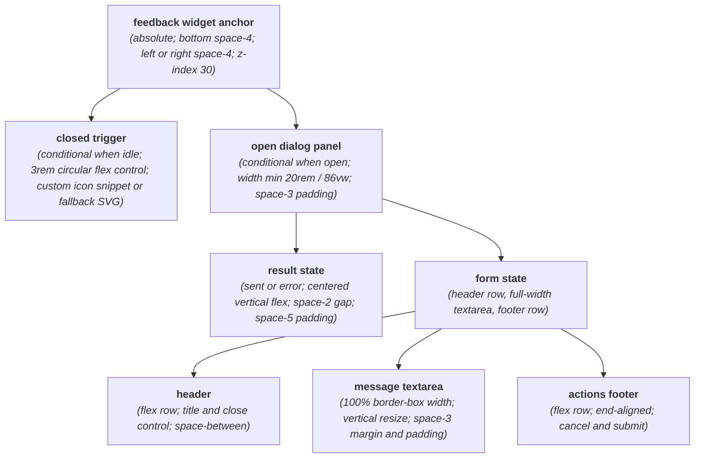
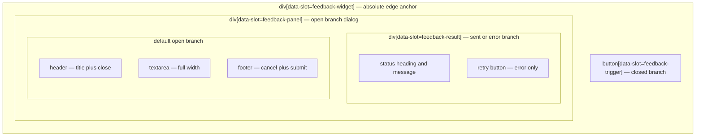

# FeedbackWidget Layout Capture

**Source component:** `feedback-widget.svelte`  
**Sibling styles:** `feedback-widget.sass`

## Diagram 1 — UI architecture and layout flow

## Diagram 2 — DOM and CSS containment

## Layout breakdown

- `FW_ROOT` / `FW_WIDGET_BOX` is an absolutely positioned bottom-corner anchor; `data-position` selects the physical left or right inset.
- The root conditionally contains either `FW_CLOSED` or `FW_PANEL`, never both. The trigger is a fixed `3rem` square; the panel is viewport-constrained to `86vw` with a `20rem` cap.
- Inside the panel, status selects `FW_RESULT` or the vertical `FW_FORM` sequence. Header and footer are flex rows, while the textarea fills the panel width and may resize vertically.
- The component has no breakpoint rules, sticky regions, or declared scroll container; its responsive sizing comes from `86vw`.
