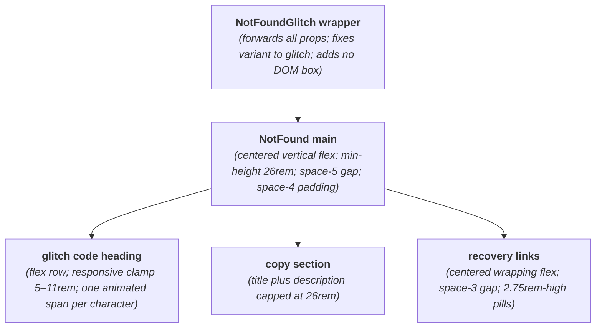
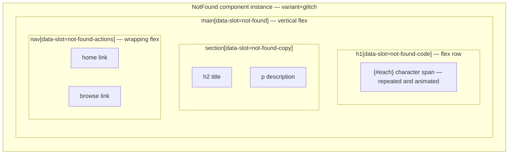

# NotFoundGlitch Layout Capture

**Source component:** `not-found-glitch.svelte`  
**Delegated layout and styles:** `not-found.svelte`, `not-found.sass`

## Diagram 1 — UI architecture and layout flow

## Diagram 2 — DOM and CSS containment

## Layout breakdown

- `NFG_WRAP` is component composition only: the wrapper renders no element and delegates its full layout to `NotFound` with `variant="glitch"`.
- `NFG_CODE` maps to the selected default branch, where an `{#each}` block creates a horizontal span for every code character; responsive type uses `clamp(5rem, 18vw, 11rem)`.
- `NFG_COPY` and `NFG_ACTIONS` are the shared regions after the variant. Actions wrap on constrained widths; there are no sidebars, sticky/fixed elements, or scroll regions.
