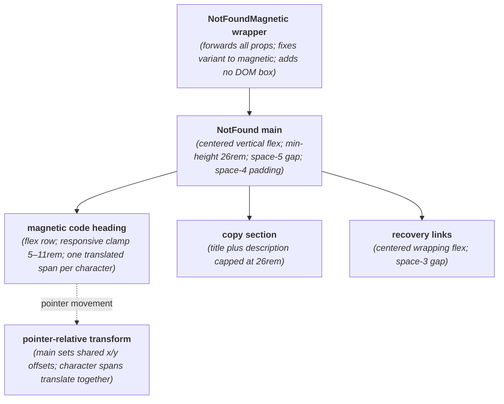
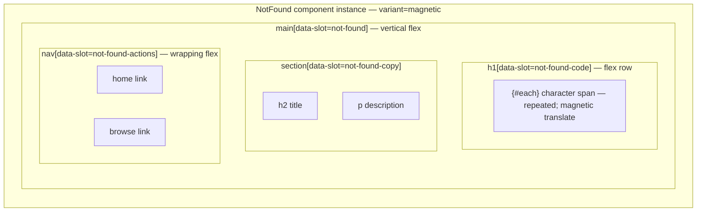

# NotFoundMagnetic Layout Capture

**Source component:** `not-found-magnetic.svelte`  
**Delegated layout and styles:** `not-found.svelte`, `not-found.sass`

## Diagram 1 — UI architecture and layout flow

## Diagram 2 — DOM and CSS containment

## Layout breakdown

- `NFM_WRAP` contributes no DOM boundary; it delegates to `NotFound` and locks the magnetic branch.
- `NFM_CODE` is a flex heading generated with `{#each}`. Its character spans retain document flow while pointer-derived CSS variables translate them visually.
- `NFM_COPY` follows with capped description width, then `NFM_ACTIONS` wraps two links in a centered row. Responsive type uses viewport-relative `clamp`; there are no sidebars, fixed/sticky elements, or scroll regions.
