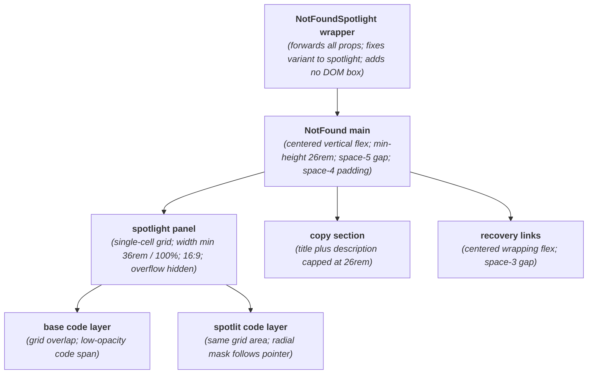
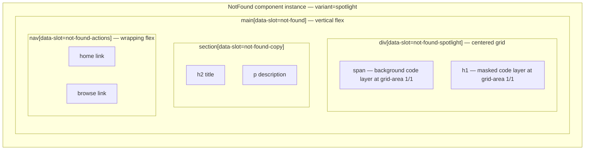

# NotFoundSpotlight Layout Capture

**Source component:** `not-found-spotlight.svelte`  
**Delegated layout and styles:** `not-found.svelte`, `not-found.sass`

## Diagram 1 — UI architecture and layout flow

## Diagram 2 — DOM and CSS containment

## Layout breakdown

- `NFS_WRAP` adds no element; it delegates the rendered hierarchy to `NotFound` with the spotlight branch selected.
- `NFS_PANEL` / `NFS_PANEL_BOX` is a responsive `16:9` grid capped at `36rem`. `NFS_BASE` and `NFS_MASK` occupy the same grid cell to create the spotlight overlay.
- The shared `NFS_COPY` and wrapping `NFS_ACTIONS` regions follow below in the main vertical flow. There are no sidebars, fixed/sticky elements, or scroll regions.
