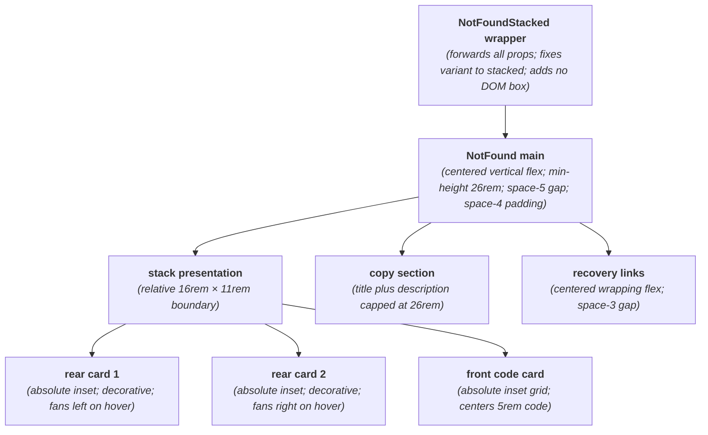
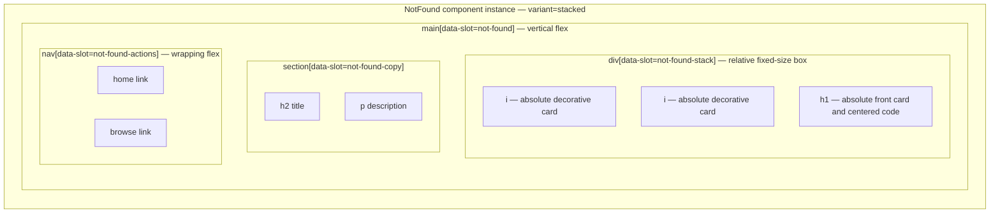

# NotFoundStacked Layout Capture

**Source component:** `not-found-stacked.svelte`  
**Delegated layout and styles:** `not-found.svelte`, `not-found.sass`

## Diagram 1 — UI architecture and layout flow

## Diagram 2 — DOM and CSS containment

## Layout breakdown

- `NFST_WRAP` is a DOM-transparent wrapper around `NotFound` with the stacked branch selected.
- `NFST_STACK` / `NFST_STACK_BOX` is a `16rem × 11rem` relative boundary. Both decorative cards and the code card are absolutely inset to overlap; hover transforms fan the layers without changing flow.
- `NFST_COPY` and `NFST_ACTIONS` remain in normal vertical flow below the stack, with a capped description and wrapping action row. No sticky/fixed or scroll regions are declared.
