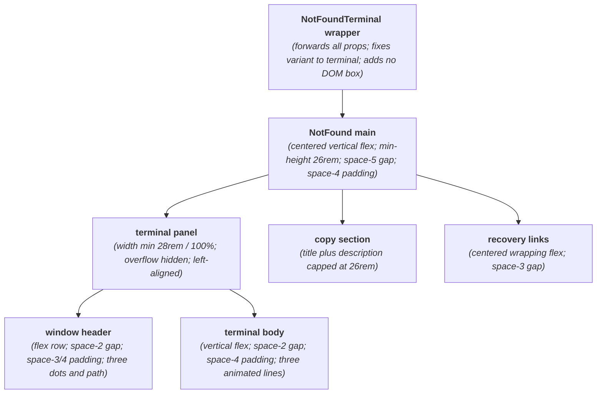
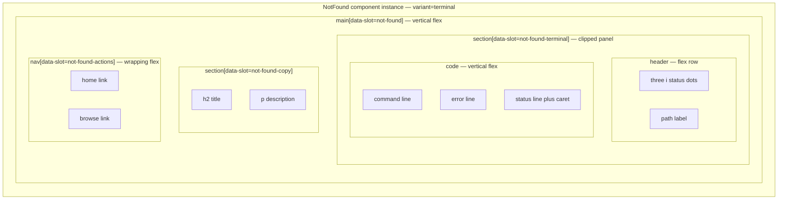

# NotFoundTerminal Layout Capture

**Source component:** `not-found-terminal.svelte`  
**Delegated layout and styles:** `not-found.svelte`, `not-found.sass`

## Diagram 1 — UI architecture and layout flow

## Diagram 2 — DOM and CSS containment

## Layout breakdown

- `NFT_WRAP` adds no DOM node; it delegates to `NotFound` with the terminal branch fixed.
- `NFT_PANEL` is capped at `28rem` and may shrink to `100%`. Its DOM/CSS boundaries divide into the horizontal `NFT_HEADER` and vertical `NFT_CODE` body.
- The header contains three fixed `0.75rem` dots and a path label; the body contains three lines, with a small inline caret on the final line.
- Shared copy and wrapping recovery actions follow the panel. There are no sticky/fixed regions, sidebars, or scroll containers.
