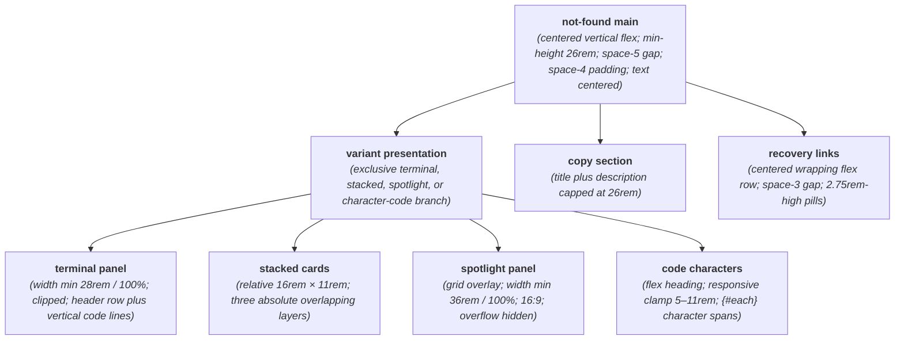
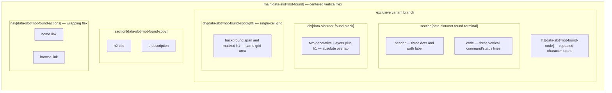

# NotFound Layout Capture

**Source component:** `not-found.svelte`  
**Sibling styles:** `not-found.sass`

## Diagram 1 — UI architecture and layout flow

## Diagram 2 — DOM and CSS containment

## Layout breakdown

- `NF_ROOT` / `NF_MAIN_BOX` defines the shared page-level vertical sequence: one visual variant, copy, then recovery navigation.
- `NF_VARIANT` contains exactly one conditional branch. Terminal uses a vertical panel, stacked uses absolute overlap, spotlight overlays two elements in one grid cell, and the default glitch/magnetic branch lays out code characters in a flex row.
- `NF_COPY` is a centered text block with a `26rem` description cap. `NF_ACTIONS` wraps its two links for narrower containers.
- Responsive sizing is source-driven through `min(..., 100%)`, `clamp(...)`, action wrapping, and the spotlight aspect ratio; no sticky/fixed or scroll region is declared.
