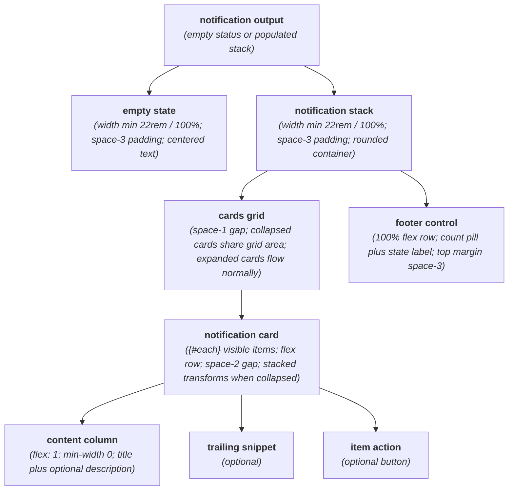
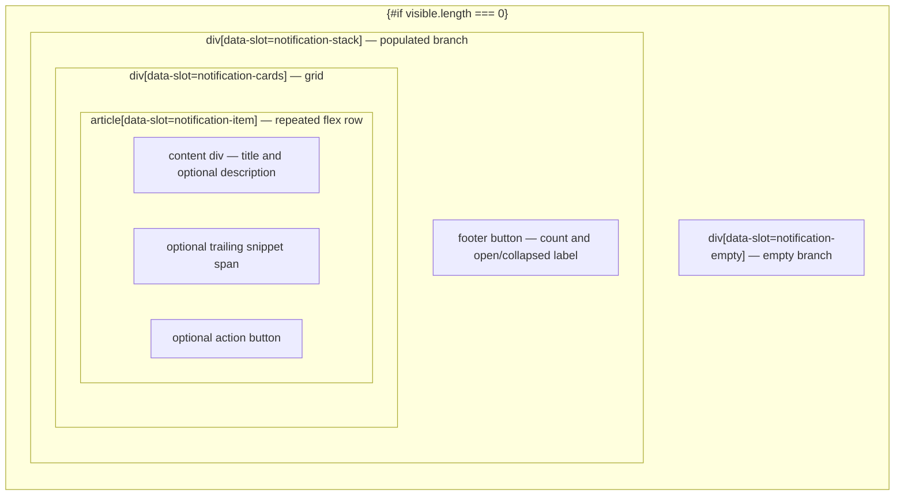

# NotificationStack Layout Capture

**Source component:** `notification-stack.svelte`  
**Sibling styles:** `notification-stack.sass`

## Diagram 1 — UI architecture and layout flow

## Diagram 2 — DOM and CSS containment

## Layout breakdown

- `NS_BRANCH` / `NS_CONDITIONAL` captures the exclusive empty and populated branches.
- `NS_CARDS` is a grid: collapsed articles overlap at `grid-area: 1 / 1` with index-based translate/scale; expanded articles return to normal grid flow.
- Every `NS_ITEM` is a flex row containing a flexible text column and optional trailing/action siblings. Only the first overlapped card receives pointer events while collapsed.
- `NS_FOOTER` sits below the grid and contains a fixed `1.75rem` count pill. Width is capped at `22rem` and may shrink to `100%`; there are no breakpoints, fixed/sticky regions, or scroll containers.
