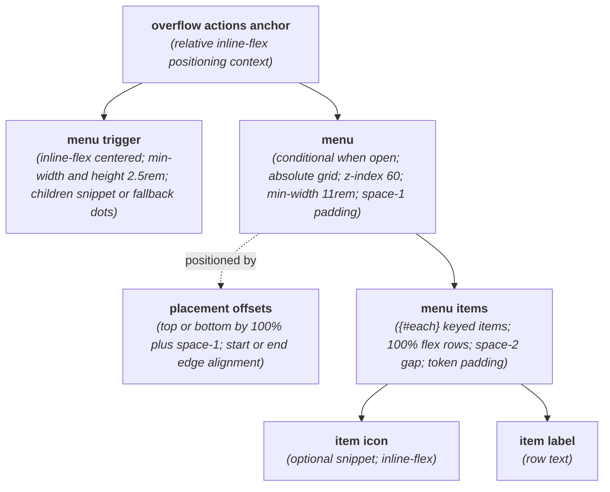
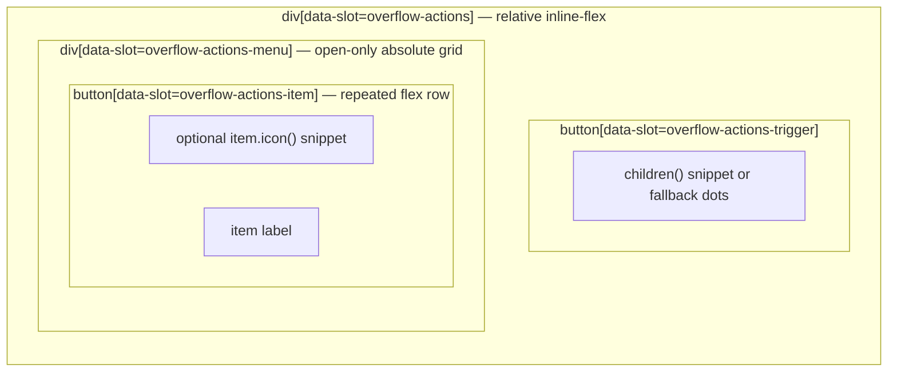

# OverflowActions Layout Capture

**Source component:** `overflow-actions.svelte`  
**Sibling styles:** `overflow-actions.sass`

## Diagram 1 — UI architecture and layout flow

## Diagram 2 — DOM and CSS containment

## Layout breakdown

- `OA_ROOT` / `OA_ROOT_BOX` creates the positioning context and contains the persistent trigger plus the conditional menu.
- `OA_TRIGGER` centers either the caller's `children()` snippet or the fallback dots within a minimum `2.5rem` control.
- `OA_MENU` is an absolutely positioned vertical grid. The placement prop selects top/bottom offset and start/end physical edge anchoring relative to the root.
- `OA_ITEM` repeats as a full-width flex row with an optional icon and label. No breakpoint, sticky/fixed region, or declared scrolling boundary is present.
