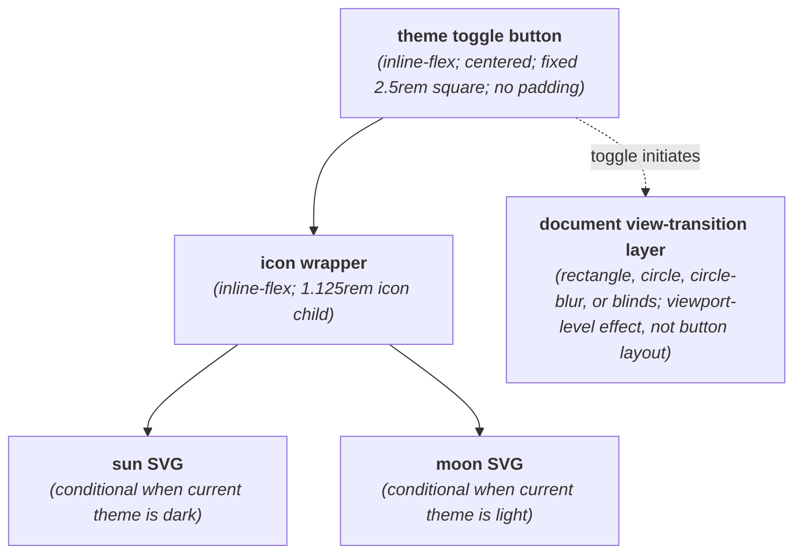
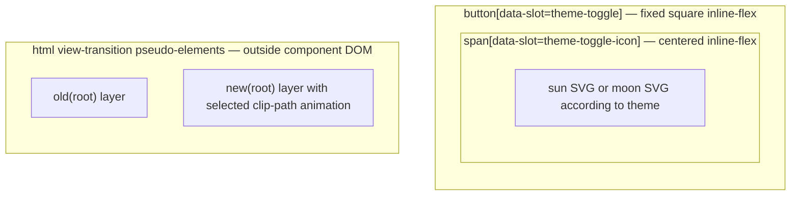

# ThemeToggle Layout Capture

**Source component:** `theme-toggle.svelte`  
**Sibling styles:** `theme-toggle.sass`

## Diagram 1 — UI architecture and layout flow

## Diagram 2 — DOM and CSS containment

## Layout breakdown

- `TT_ROOT` / `TT_BUTTON_BOX` is a fixed `2.5rem × 2.5rem` centered control with no internal spacing beyond the icon's own dimensions.
- `TT_ICON` contains exactly one conditional SVG: sun for dark theme or moon for light theme.
- `TT_VIEW` / `TT_DOCUMENT_BOX` distinguishes the document-level view-transition pseudo-elements from the button DOM; they animate the viewport but do not add component layout regions.
- Reduced-motion disables icon animation and the script skips view transitions. There are no responsive breakpoints, slots/snippets, loops, sidebars, sticky/fixed elements, or scroll regions.
