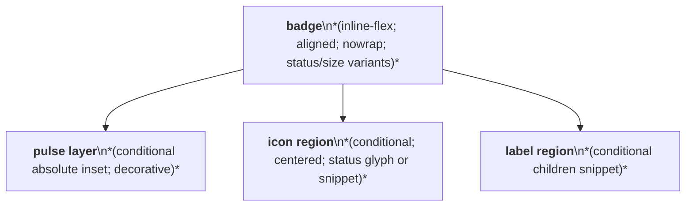
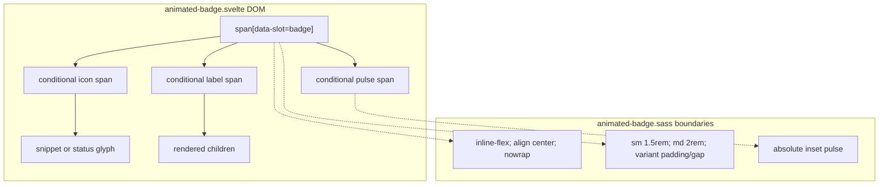

# Animated Badge Layout Capture

Source component: `animated-badge.svelte`

## Diagram 1 — UI architecture and layout flow

## Diagram 2 — DOM and CSS containment

The badge is an inline-flex pill with a fixed height per size variant: 1.5rem small or 2rem medium. Icon and label regions sit in normal row flow with size-dependent gaps and padding, while the optional pulse fills the badge via an absolute inset layer behind them. No responsive, sticky, fixed, grid, or scroll region is defined.
