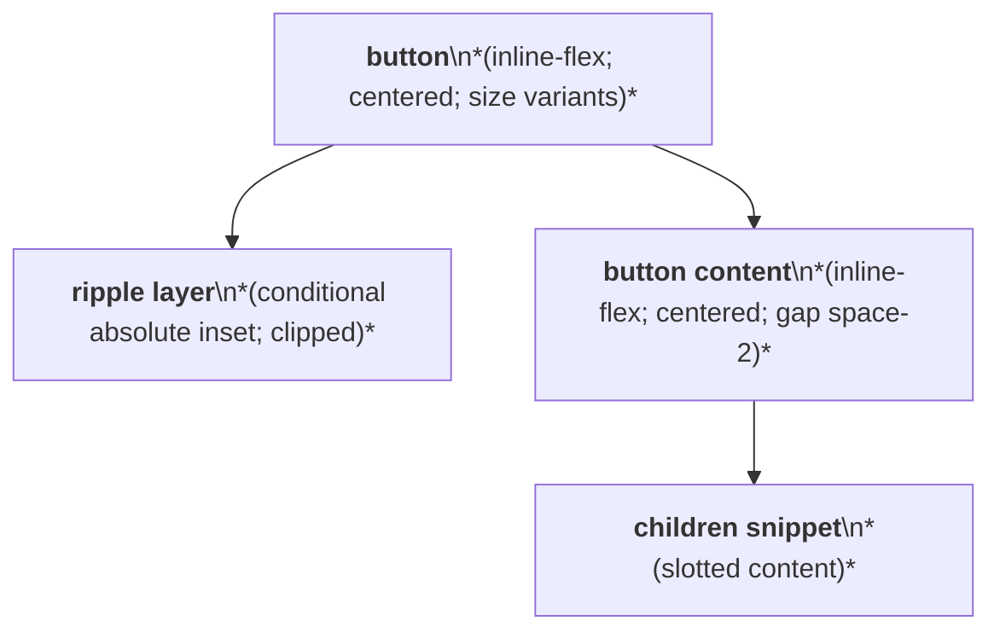
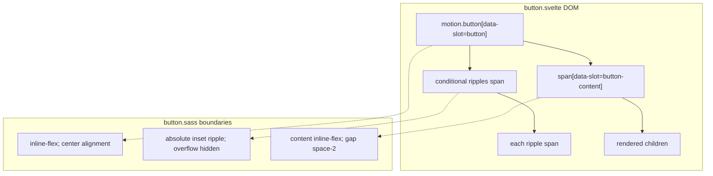

# Button Layout Capture

Source component: `button.svelte`

## Diagram 1 — UI architecture and layout flow

## Diagram 2 — DOM and CSS containment

The button is an inline-flex control with centered content. Size variants define 2rem, 2.5rem, or 3rem heights with inline padding; icon size is a 2rem square. The optional ripple layer is an absolute, inset, overflow-hidden decorative region behind the content. No responsive, sticky, fixed, or scroll layout is defined.
