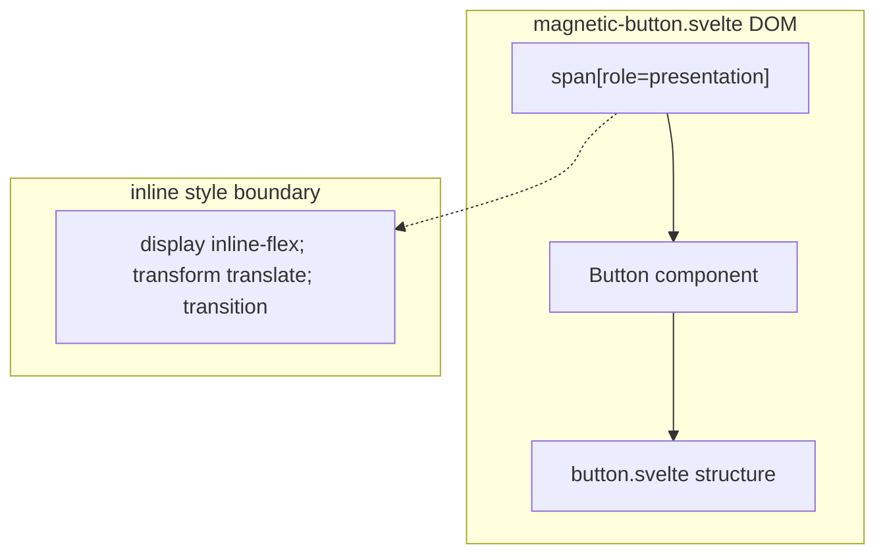

# Magnetic Button Layout Capture

Source component: `magnetic-button.svelte`

## Diagram 1 — UI architecture and layout flow
```mermaid
graph TD
  magnetic_root["`**magnetic wrapper**\n*(inline-flex; pointer-translated)*`"] --> magnetic_button["`**Button component**\n*(nested button layout)*"]
  magnetic_button --> magnetic_content["`**children snippet**\n*(forwarded into button content)*`"]
```

## Diagram 2 — DOM and CSS containment


The wrapper is an inline-flex positioning region and translates as a whole from pointer offsets. Its only child is the reusable Button component, which supplies the button, optional ripple layer, content flex row, dimensions, and spacing. No grid, sticky, fixed, or scroll region is introduced.
