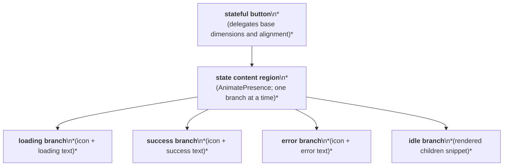
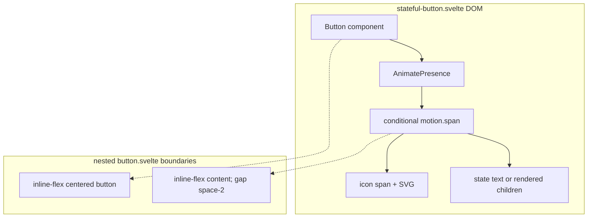

# Stateful Button Layout Capture

Source component: `stateful-button.svelte`

## Diagram 1 — UI architecture and layout flow

## Diagram 2 — DOM and CSS containment

The component has no extra wrapper; it delegates its outer control layout to `button.svelte`. Conditional loading, success, error, and idle branches occupy the same content region, each pairing an optional icon with text or the children snippet. No grid, sticky, fixed, or scroll region is defined.
