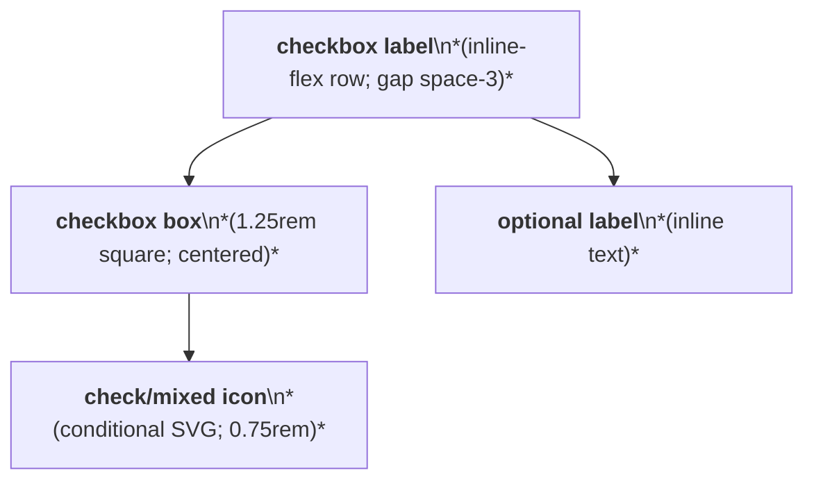
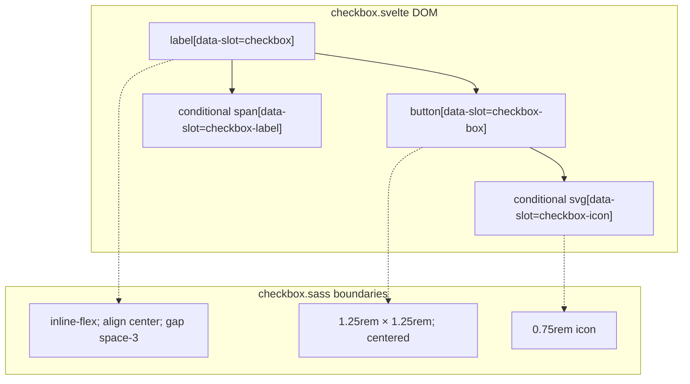

# Checkbox Layout Capture

Source component: `checkbox.svelte`

## Diagram 1 — UI architecture and layout flow

## Diagram 2 — DOM and CSS containment

The label is the sole layout wrapper and forms an inline-flex row. Its button is a centered 1.25rem square; the check or mixed SVG appears only for checked or indeterminate state and is sized to 0.75rem. No responsive, sticky, fixed, grid, or scroll region is defined.
