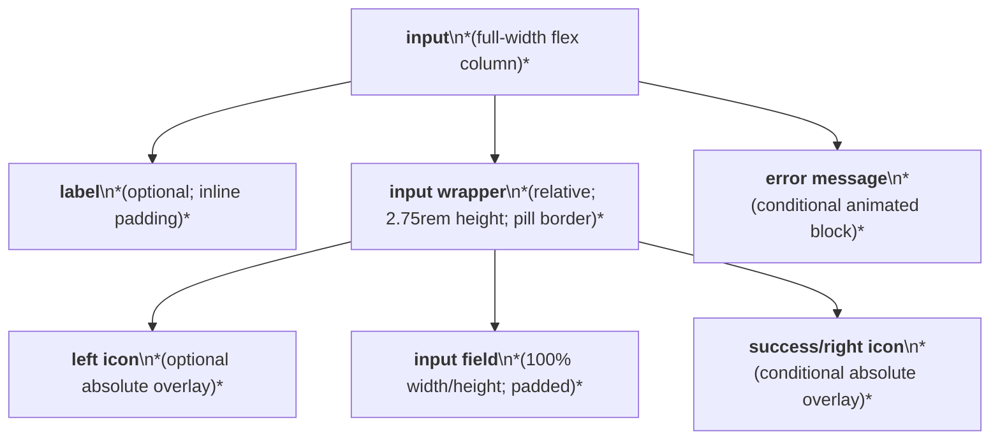
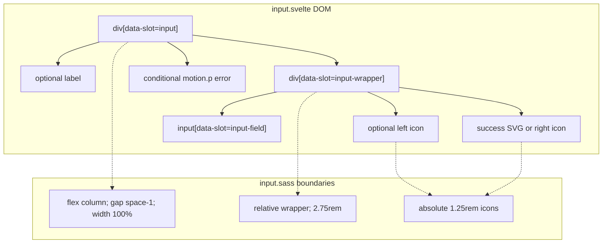

# Input Layout Capture

Source component: `input.svelte`

## Diagram 1 — UI architecture and layout flow

## Diagram 2 — DOM and CSS containment

The root stacks label, control wrapper, and optional error vertically with `space-1`. The wrapper is a relative positioning context for optional left and right adornments; the field fills its 2.75rem height and adjusts inline padding when adornments exist. The error is a conditional below-wrapper region. No grid, sticky, fixed, or scroll region is present.
