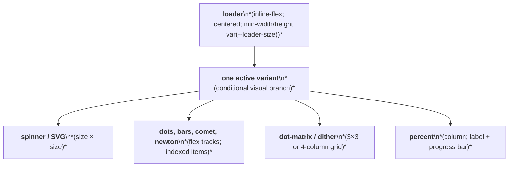
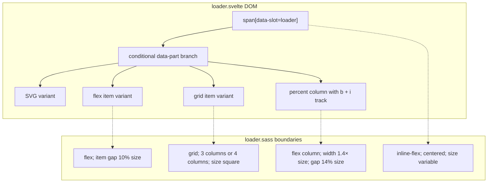

# Loader Layout Capture

Source component: `loader.svelte`

## Diagram 1 — UI architecture and layout flow

## Diagram 2 — DOM and CSS containment

The root centers one conditionally selected loader branch and exposes a size variable as minimum width and fixed height. Variants use inline SVG, flex rows, square grids, absolute-positioned motion, monospace text, or a vertical percent layout with a full-width progress track. The component has no external responsive, sticky, fixed, or scroll region.
