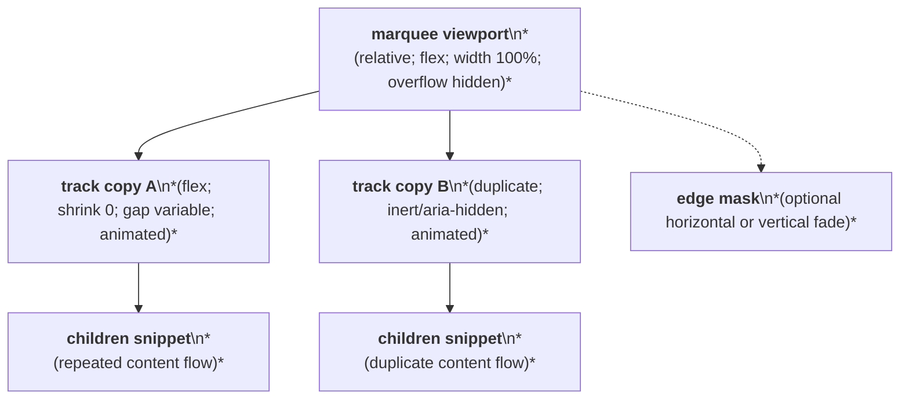
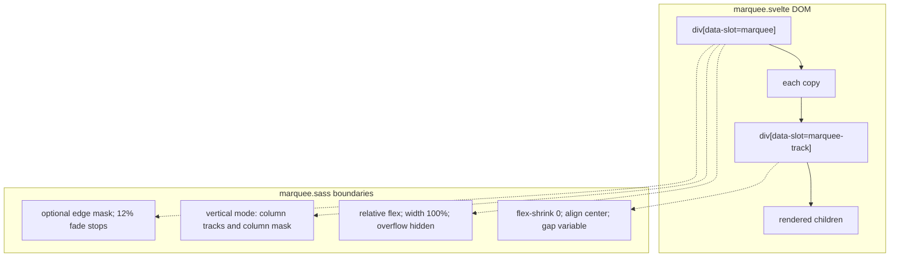

# Marquee Layout Capture

Source component: `marquee.svelte`

## Diagram 1 — UI architecture and layout flow

## Diagram 2 — DOM and CSS containment

The root is a full-width, overflow-hidden flex viewport with a configurable gap and optional 12% edge fade. Two non-shrinking track copies run side by side for horizontal motion or in a column for vertical motion; each track maintains the children snippet in a flex flow and can pause on hover. The root is the scroll/clipping region, but no sticky or fixed positioning is used.
