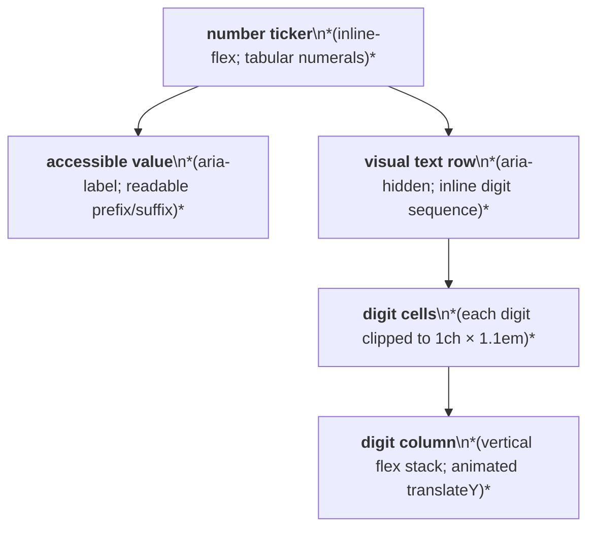
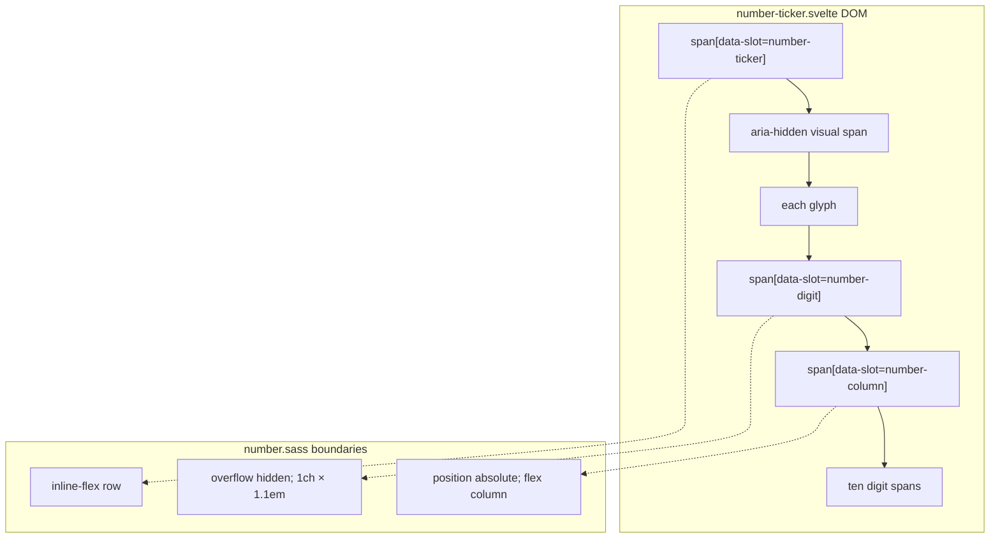

# Number Ticker Layout Capture

Source component: `number-ticker.svelte`

## Diagram 1 — UI architecture and layout flow

## Diagram 2 — DOM and CSS containment

The outer ticker is an inline-flex row. Each numeric glyph becomes a fixed-width, overflow-hidden cell containing an absolutely positioned vertical flex column of ten values; non-digits remain inline spans. No responsive, sticky, fixed, or scroll container is defined.
