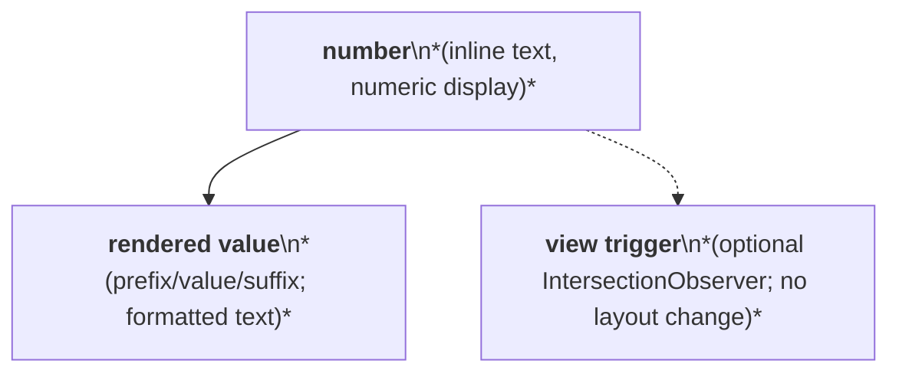
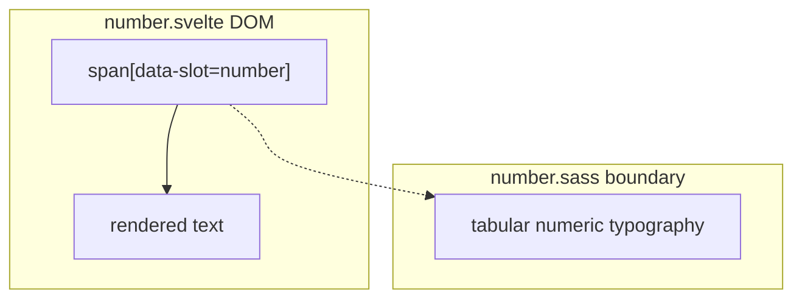

# Number Layout Capture

Source component: `number.svelte`

## Diagram 1 — UI architecture and layout flow

## Diagram 2 — DOM and CSS containment

The root inline `span` is the only layout region. It contains one rendered text node; animation and visibility state affect the value but do not add structural layout. SASS applies tabular numeric glyph metrics, with no explicit dimensions, gap, padding, flex, grid, sticky, fixed, or scroll region.
