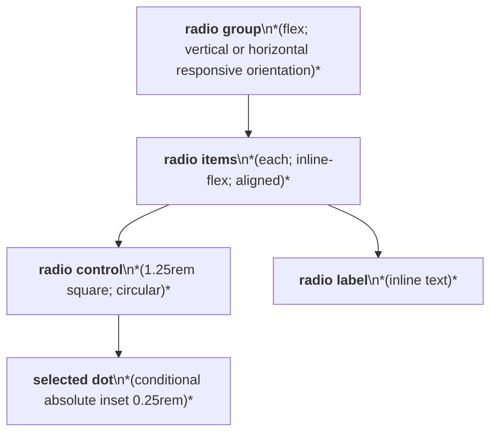
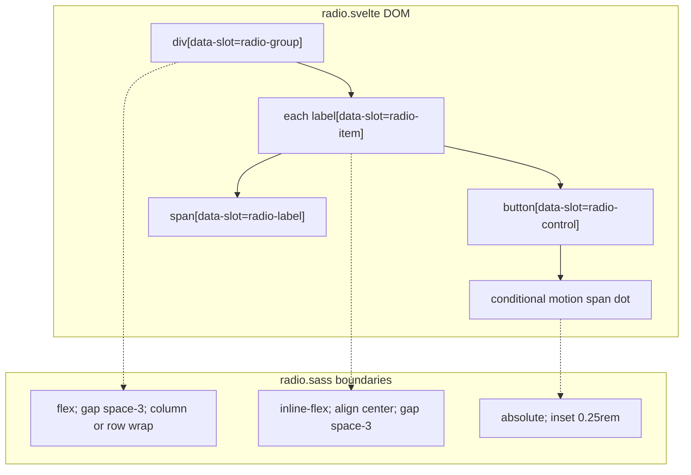

# Radio Layout Capture

Source component: `radio.svelte`

## Diagram 1 — UI architecture and layout flow

## Diagram 2 — DOM and CSS containment

The group switches between a vertical column and a horizontally wrapping row based on `data-orientation`, with `space-3` gaps. Each label is an inline-flex row containing a 1.25rem circular control and text label; the selected dot is positioned inside the control. No sticky, fixed, or scroll region exists.
