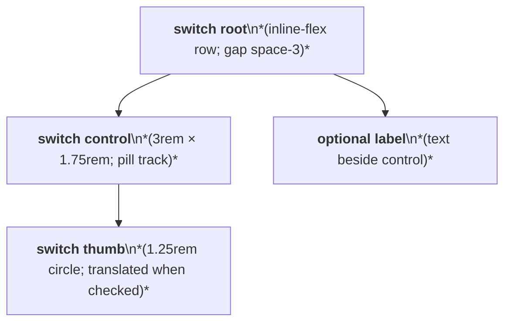
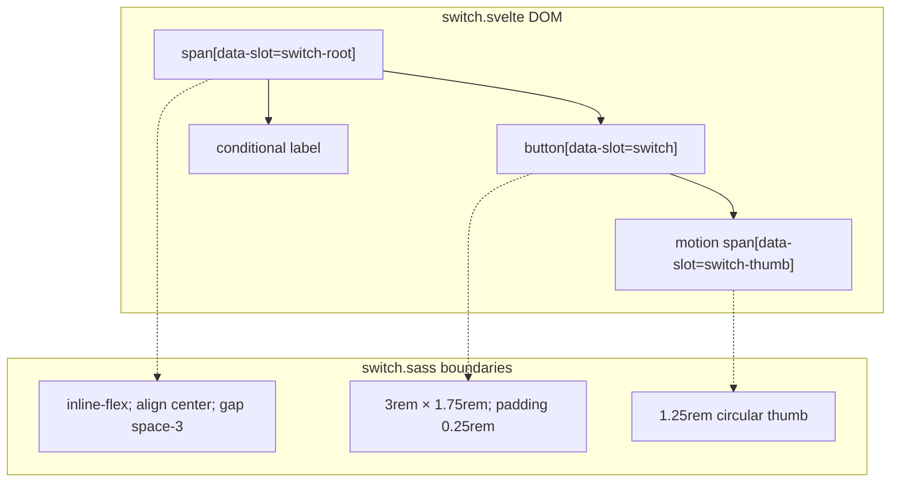

# Switch Layout Capture

Source component: `switch.svelte`

## Diagram 1 — UI architecture and layout flow

## Diagram 2 — DOM and CSS containment

The root is an inline-flex horizontal control group. The switch track has fixed 3rem by 1.75rem dimensions and contains a 1.25rem circular thumb that translates horizontally; an optional label follows with `space-3`. No responsive, grid, sticky, fixed, or scroll region is present.
