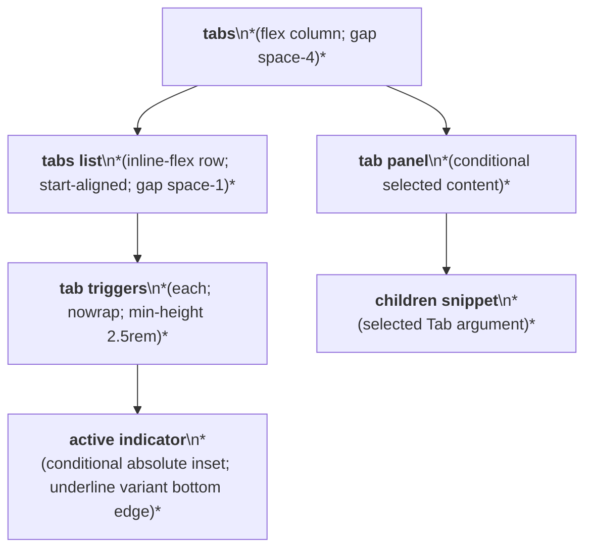
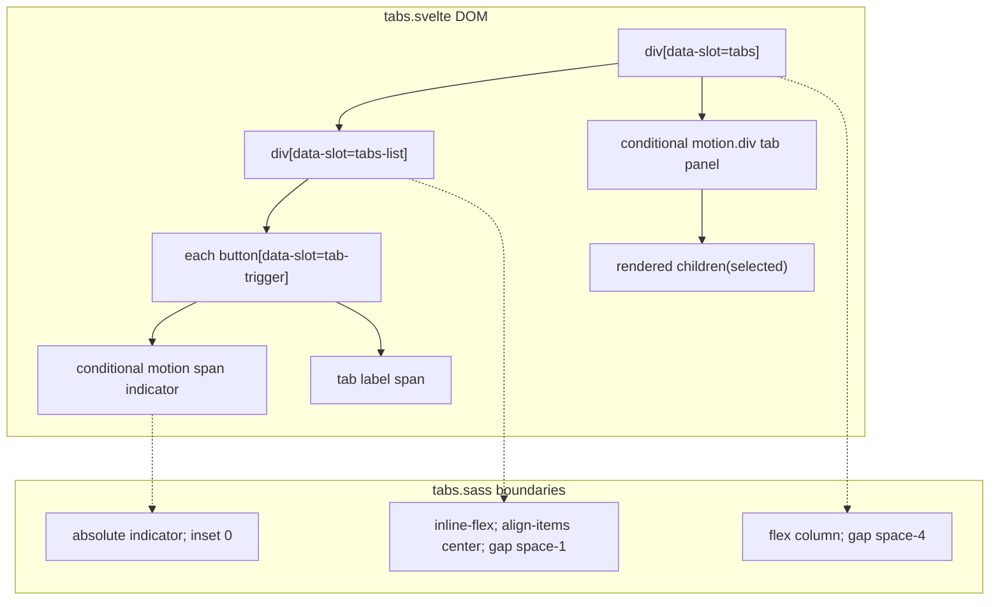

# Tabs Layout Capture

Source component: `tabs.svelte`

## Diagram 1 — UI architecture and layout flow

## Diagram 2 — DOM and CSS containment

The root is a vertical flex layout separating the trigger list and selected panel by `space-4`. Triggers form a non-wrapping inline-flex row with a padded pill, segmented, or underline presentation; the active indicator is an absolute child. Only the selected panel is rendered. No sticky, fixed, or scroll region is specified.
