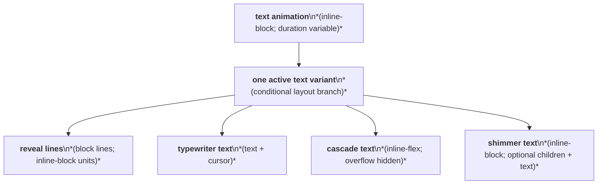
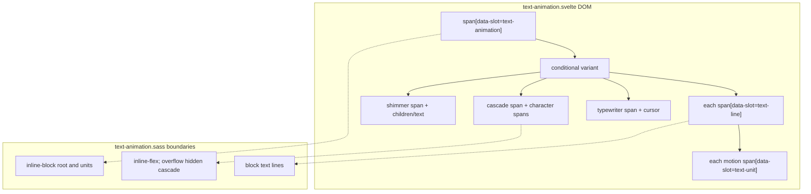

# Text Animation Layout Capture

Source component: `text-animation.svelte`

## Diagram 1 — UI architecture and layout flow

## Diagram 2 — DOM and CSS containment

The root is an inline-block. Reveal mode creates block lines containing inline-block animated units; typewriter mode remains inline text with a cursor; cascade mode uses an inline-flex clipped row; shimmer mode keeps optional children and text in an inline-block. No grid, sticky, fixed, or scroll container is present beyond cascade clipping.
