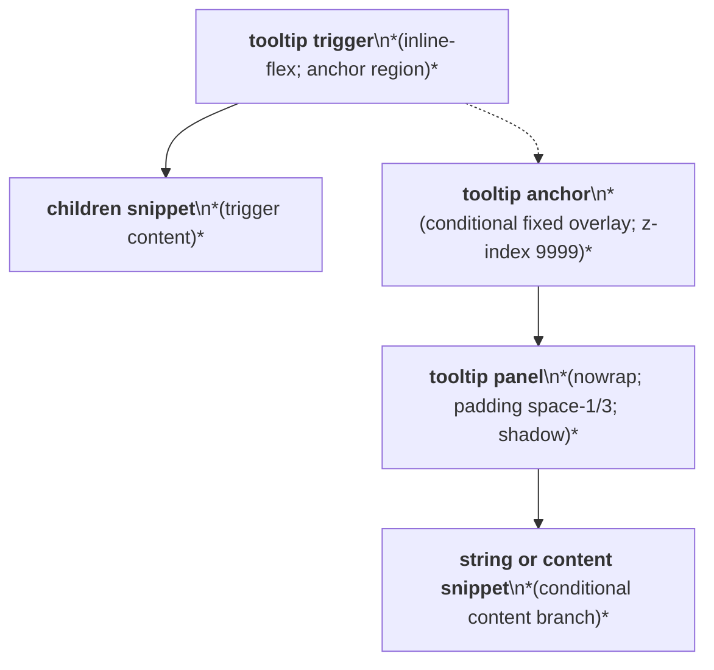
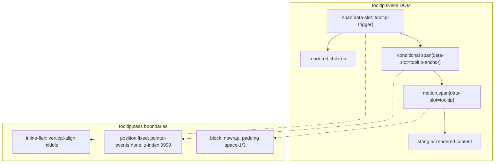

# Tooltip Layout Capture

Source component: `tooltip.svelte`

## Diagram 1 — UI architecture and layout flow

## Diagram 2 — DOM and CSS containment

The trigger remains an inline-flex anchor and renders its children in normal flow. When open, the tooltip is placed in a fixed, pointer-events-none overlay positioned from the trigger with an 8px gap; side-specific transforms align it above, below, left, or right. The panel is a nowrap block with padding and shadow. It is the only fixed overlay; no scroll region is defined.
