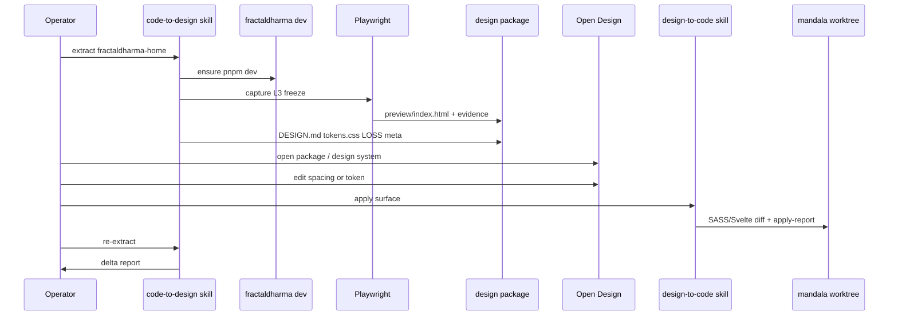
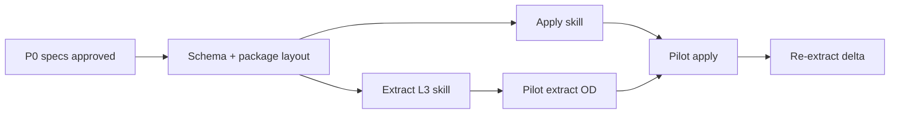

# TECH.md — Code ↔ Design Loop (Open Design hybrid)

**Status:** P0–**P4** pilots done (2026-08-10)  
**Updated:** 2026-08-10  
**Repo pin:** mandala `@ 87d293dc11994edfc5a1469583e9e1e651f9303f`  
**Remote:** https://github.com/fractalmandala/mandala  

---

## Context

### What we are building

Integration architecture for bidirectional **code ↔ design**:

- **Design host:** [Open Design](https://github.com/nexu-io/open-design) (Apache-2.0) — local daemon, sandboxed preview, `DESIGN.md` design systems, skills, MCP (`od mcp install …`).  
- **Code host:** mandala monorepo — SvelteKit apps/sites, external indented SASS, Fractal Agentic skills and Design boss.  
- **Middle:** versioned **design contract** + **design package** layout, produced by extract and consumed by apply.

### Why not only svelte-style-canvas

[`packages/fractal-agentic/skills/svelte-style-canvas/`](../../packages/fractal-agentic/skills/svelte-style-canvas/) is L1 agent reconstruction (`visualHtml` + `cssSubset`). It is useful as **evidence scaffolding**, not as OD-grade design truth (PRODUCT invariants 4, 8–9, 33).

### Relevant mandala surfaces (pilot)

| Role | Path |
| --- | --- |
| Pilot page | [`sites/fractaldharma/src/routes/+page.svelte`](../../sites/fractaldharma/src/routes/+page.svelte) |
| Pilot layout | [`sites/fractaldharma/src/routes/+layout.svelte`](../../sites/fractaldharma/src/routes/+layout.svelte) |
| Styles | [`sites/fractaldharma/src/lib/styles/`](../../sites/fractaldharma/src/lib/styles/) (`_tokens.sass`, `_layouts.sass`, `_components.sass`, …) |
| Design boss | [`packages/fractal-agentic/docs/bosses/design/INDEX.md`](../../packages/fractal-agentic/docs/bosses/design/INDEX.md) |
| Evidence precursor | [`packages/fractal-agentic/skills/svelte-style-canvas/`](../../packages/fractal-agentic/skills/svelte-style-canvas/) |
| Style inventory skill | `styling-docs-builder`, `layout-capture` under `packages/fractal-agentic/skills/` |
| Apply-adjacent | `port-component`, `svelte-styling-patterns`, Design boss polish skills |
| Impeccable DESIGN.md | `packages/fractal-agentic/skills/impeccable/` (Stitch-compatible DESIGN.md patterns) |

### Open Design integration points (external)

| OD concept | Use in this product |
| --- | --- |
| `design-systems/<name>/DESIGN.md` (+ optional `tokens.css`, `manifest.json`) | Brand contract from extract or shared Fractal system |
| Project files + sandboxed iframe preview | Design package preview entry |
| Skills (`SKILL.md`) | Optional OD-side skills for mandala apply/extract prompts |
| MCP (`od project list`, `od files read/list`, …) | Agents read/write live OD project files without zip churn |
| Local CLI / BYOK agent | Design iteration engine inside OD |

OD is **not** vendored into mandala in P1. Operators install OD desktop or `od` CLI separately; monorepo ships skills + package schema + scripts only.

---

## Proposed changes

### Architecture

```text
┌──────────────────────────────── mandala ────────────────────────────────┐
│  apps/* · sites/* · packages/*                                          │
│       │ extract (skills + Playwright L3)                                │
│       ▼                                                                 │
│  design package (contract + DESIGN.md + preview + evidence + LOSS)      │
│       │ import / open                                                   │
└───────┼─────────────────────────────────────────────────────────────────┘
        ▼
┌──────────────── Open Design ────────────────┐
│  design system picker · sandbox preview     │
│  agent edit · file workspace · MCP          │
└───────┬─────────────────────────────────────┘
        │ export / MCP read approved package
        ▼
┌──────────────────────────────── mandala ────────────────────────────────┐
│  apply skill → branch diff (SASS / Svelte) → check → re-extract delta   │
└─────────────────────────────────────────────────────────────────────────┘
```

### Design system layering (locked)

| Layer | What | Storage |
| --- | --- | --- |
| **Shared base** | Monorepo brand: core tokens, type, color, spacing language, shared component conventions | Versioned source of truth remains monorepo SASS/tokens; OD-facing export may live as a **shared** design-system package (see below). Surfaces **import/extend** base; they do not re-own global brand. |
| **Per-surface overlay** | Page/component inventory, states, preview freeze, loss, source map | **Gitignored** `vendors/design-packages/<surface-id>/` only |

**Shared base OD export (optional commit, not required for P1):**  
If we export a reusable OD design system for catalog use, prefer a single package id such as `fractal-mandala` (or per-app base like `fractaldharma` only when brand diverges). Full page freezes are never the shared base.

**Per-surface packages are always gitignored** — local extract/apply artifacts. Do not commit `vendors/design-packages/**`.

### Design package layout (normative — per surface)

Default root (gitignored, monorepo):

```text
vendors/design-packages/<surface-id>/
  DESIGN.md                 # surface overlay (extends shared base; page role + exceptions)
  tokens.css                # surface-used CSS variables (subset or full theme for preview)
  base-ref.json             # { "sharedDesignSystem": "fractal-mandala", "version": "…" }
  preview/
    index.html              # primary OD preview entry (L2/L3 freeze or compiled)
  evidence/
    contract.json           # machine contract (evolved style-pack)
    report.md               # human extract report
  LOSS.md                   # loss budget instance for this extract
  meta.json                 # surface id, paths, fidelity, timestamps, git sha, baseRef
```

Ensure root `.gitignore` includes `vendors/design-packages/` (and keep `vendors/style-previews/` pattern consistent).

### Machine contract (`evidence/contract.json`)

Evolve from svelte-style-canvas style-pack; **version 2** fields:

| Field | Required | Notes |
| --- | --- | --- |
| `version` | yes | `2` |
| `meta` | yes | `surfaceId`, `targetPath`, `layoutChain[]`, `fidelity` (`L1`\|`L2`\|`L3`\|`L4`), `generatedAt`, `gitSha`, `previewEntry` |
| `tokens[]` | yes | name, value, source, line, confidence |
| `classes[]` | yes | as v1 + `usedByRegionIds` |
| `regions[]` | yes | evidence; **not** stage render |
| `states[]` | yes | theme/class toggles |
| `sourceMap` | yes | map preview selectors/nodes → repo file:line |
| `orphans[]` / `unresolved[]` | yes | |
| `loss[]` | yes | structured loss codes |
| `cssSubset` | optional | L1 only; L2+ prefer `tokens.css` + captured CSS |
| `visualHtml` | optional | L1 only; L3 prefers `preview/index.html` from capture |

**Gate:** package invalid if no previewable `preview/index.html` (or OD project entry) and fidelity ≥ L2 claimed.

### Skills / commands (Fractal Agentic)

| Skill / command (proposed ids) | Direction | Responsibility |
| --- | --- | --- |
| `code-to-design` | extract | Orchestrate inventory → styles → capture → package write → OD open instructions |
| `design-to-code` | apply | Read package + contract → plan file diffs → write SASS/Svelte → apply report |
| `design-loop-delta` | round-trip | Re-extract and diff contracts |
| `svelte-style-canvas` | substep | Optional L1 evidence only; demoted in docs |

Boss ownership: **Design boss** for visual apply quality; **Code boss** for Svelte/SASS correctness gates; orchestration via **boss-orchestration**.

### Extract pipeline (code → design)

1. **Resolve target** — path + layout chain (reuse layout-capture semantics).  
2. **Inventory** — regions, classes, `class:` states (reuse styling-docs-builder / SSC phase 1).  
3. **Token resolve** — read `_tokens.sass` / theme blocks; emit `tokens.css` (SASS → CSS conversion script or agent with schema validation).  
4. **Fidelity path:**  
   - **L3 (default when possible):** start workspace `pnpm dev` (or existing server), Playwright navigate, snapshot DOM + critical CSS (or full stylesheet capture), write `preview/index.html` self-contained freeze; attach screenshot to `evidence/`.  
   - **L2:** compile/import used SASS via project Vite/SASS if available; build static HTML shell with real class names + compiled CSS.  
   - **L1:** fallback SSC visualHtml path; force `meta.fidelity: L1` and LOSS entries.  
5. **DESIGN.md** — generate **per-surface overlay** (Stitch/OD-compatible) that states it extends the shared base; do not dump full brand into every surface. Shared base export is a separate step (`fractal-mandala` or app base).  
6. **Write package** under **gitignored** `vendors/design-packages/<surface-id>/` with `base-ref.json` pointing at the shared system id.  
7. **OD handoff** — print steps: load **shared base** design system + open **per-surface** package/preview; MCP optional.

### Apply pipeline (design → code)

1. Load `meta.json` + `contract.json` + current DESIGN.md / tokens.css.  
2. Diff design package vs last extract baseline (if present) to list intended changes.  
3. Map changes:  
   - **shared-base token** changes → require explicit operator “promote to shared base” (PRODUCT: no silent multi-app clobber); default apply scopes to target app/site sheets  
   - **surface-only** token/class rules → target app `_*tokens*.sass` / component sheets  
   - structure → `.svelte` markup only when operator brief includes structure  
4. **Safety:** path allowlist per surface (pilot: `sites/fractaldharma/src/**` styles + page/layout only). Never write apply output into `vendors/design-packages` as product source.  
5. Write patch in worktree; emit `apply-report.md`.  
6. Suggest `pnpm check` / lint for workspace; optional Playwright screenshot compare.

### Open Design coupling (P1 minimal)

| Mechanism | P1 | Later |
| --- | --- | --- |
| Operator opens package folder / imports DESIGN.md | yes | |
| Fractal skill outputs OD-ready paths | yes | |
| `od mcp install grok` / claude / cursor | yes (doc) | |
| Custom OD skill in OD `skills/` for “apply to mandala” | optional | yes |
| Submodule / vendored OD in monorepo | no | maybe CI only |
| Daemon automation from mandala scripts | no | optional `scripts/design-loop/*` |

### Monorepo conventions on apply

- Svelte 5 runes; no legacy stores in new code.  
- Indented SASS only; no braces/semicolons; **no new in-component `<style>`** where workspace AGENTS forbid it.  
- Do not mix shradhapp openreel WIP; use worktree `scripts/wt.sh add feat/code-design-loop-…` for implementation.  
- Artifacts under `vendors/` stay gitignored (align with existing `vendors/style-previews` pattern).

### Migration of svelte-style-canvas

1. Keep skill for L1 forensics.  
2. USERDOCS: point “design workspace” goals to this product.  
3. Reuse schema fields in contract v2; avoid dual maintenance long-term by importing shared `contract` types/docs under `preprojects/code-design-loop/schema/` then promoting to `packages/fractal-agentic/skills/code-to-design/`.

### Implementation phases

| Phase | Deliverable | Exit criteria (maps PRODUCT) |
| --- | --- | --- |
| **P0** | This PRODUCT + TECH | Approved by operator |
| **P1** | `code-to-design` L3 package for fractaldharma-home + OD open path | Invariants 6–14, 15–16, 34–35 (extract half) |
| **P2** | `design-to-code` one token/spacing apply + report | Invariants 20–26, 35 full |
| **P3** | `design-loop-delta` + OD MCP workflow doc + optional OD skill | Invariants 27–30 |
| **P4** | Second surface (fractalengine or shradhapp) + **shared base** OD design-system export (`fractal-mandala`) | Multi-app + base/overlay split live in OD |

---

## End-to-end flow (pilot)



---

## Testing and validation

Map to PRODUCT behavior numbers:

| Invariants | Validation |
| --- | --- |
| 1–5, 10 | Package schema validator script (JSON Schema); reject empty preview at L2+ |
| 6–9, 14 | P1 manual: extract fractaldharma-home; open `preview/index.html` and OD; screenshot vs live app |
| 11–13 | `evidence/report.md` lists orphans; regions cite file:line |
| 15–19 | Manual OD open checklist in USERDOCS |
| 20–26 | P2: change one token in package; apply; `git diff` limited to allowlist; `pnpm check` in `sites/fractaldharma` |
| 27–30 | P3: re-extract delta JSON; loss codes stable |
| 31–33 | Skill frontmatter + USERDOCS; CI optional later |
| 34–35 | Pilot checklist below |

### Pilot acceptance checklist (P1+P2)

1. [ ] `vendors/design-packages/fractaldharma-home/` exists with required files.  
2. [ ] `meta.json` fidelity is L3 (or L2 with documented reason).  
3. [ ] Preview shows Dharmalib header + pathway cards + Also See (recognizable).  
4. [ ] Open Design loads DESIGN.md / preview without crash.  
5. [ ] One design-side token or gap change applies to `sites/fractaldharma` SASS.  
6. [ ] Apply report lists paths; no writes outside allowlist.  
7. [ ] Re-extract delta mentions the changed token/rule.

### Automated tests (as implementation lands)

- Unit: contract schema validate/reject.  
- Unit: path allowlist for apply.  
- Optional e2e: Playwright capture smoke when dev server fixture available (not required on pure skill P1 if manual gate passes).

---

## Parallelization

Implementation after P0 approval:

| Stream | Owns | Mode | Branch / worktree |
| --- | --- | --- | --- |
| **A — contract + schema** | `schema/contract.v2.json`, package layout docs | local worktree | `feat/code-design-loop-contract` |
| **B — extract L3** | Playwright capture script + `code-to-design` skill | local worktree | `feat/code-design-loop-extract` |
| **C — apply** | `design-to-code` skill + allowlist | local worktree | `feat/code-design-loop-apply` |

**Sequential gates:** A merges first (schema); B and C can fan out after A; pilot checklist is sequential on one machine (extract → OD → apply → re-extract).

Do not run extract/apply agents in the same worktree as dirty `feat/shradhapp-openreel-fork` WIP.



---

## Risks and mitigations

| Risk | Mitigation |
| --- | --- |
| OD API/layout churn | Depend on stable surfaces: DESIGN.md, project files, MCP file read; pin OD version in docs |
| L3 flaky without data/auth | Pilot public site home; freeze DOM; LOSS for dynamic panes |
| SASS indent corruption on apply | Prefer surgical token edits; run existing format/check; svelte-reviewer / design boss |
| Scope creep to full studio rewrite | PRODUCT non-goals; OD remains host |
| Dual schemas (SSC v1 vs contract v2) | Single schema dir; SSC becomes L1 producer of v2 subset |
| Dirty monorepo branch collision | Mandatory worktrees for implementation |

---

## Follow-ups

- Shared committed `design-systems/fractal-mandala` for OD catalog.  
- Storybook-per-app as L3 alternative.  
- Visual regression CI (Playwright screenshots).  
- OD custom skill published for mandala apply.  
- Retire marketing language that equates SSC with this product.

---

## Locked product decisions (from operator)

1. **Shared base + per-surface overlays** — brand/tokens base shared; surfaces overlay inventory + preview + loss.  
2. **Gitignored packages** — `vendors/design-packages/**` never committed as extract output.

## Open technical decisions (resolve before P1 code freeze)

1. Capture strategy: full `document.documentElement` outerHTML + inlined CSS vs critical-CSS only. **Default proposal:** outerHTML of `.app-shell` (or body) + inlined computed styles for subtree (hybrid).  
2. `tokens.css` generation: hand-maintained mapping from `_tokens.sass` vs run `sass` compile of a tokens-only entry. **Default proposal:** small tokens entry + sass compile when available.  
3. Whether apply may create new SASS partials or only edit existing. **Default proposal:** edit existing only in P2; create new only with operator flag.  
4. Where the **shared base** OD export lives when we first materialize it (P1 can ship surface-only + inline tokens; shared package id `fractal-mandala` in P3–P4). **Default proposal:** defer committed shared OD package until after pilot; P1 surface `tokens.css` + DESIGN.md overlay is enough if `base-ref` marks base as `inline-from-monorepo`.

---

## File ownership (when implementing)

| Path | Owner stream |
| --- | --- |
| `preprojects/code-design-loop/**` | product (this spec; keep updated) |
| `packages/fractal-agentic/skills/code-to-design/**` | B |
| `packages/fractal-agentic/skills/design-to-code/**` | C |
| `packages/fractal-agentic/skills/svelte-style-canvas/**` | docs demote only unless schema shared |
| `scripts/design-loop/**` (optional) | B/C capture helpers |
| `vendors/design-packages/**` | gitignored runtime output |
