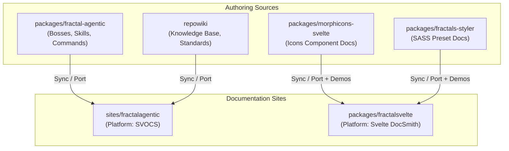

# Cross-Subrepo Documentation Sync & Routing Framework

This guide establishes the rules, configuration formats, automation script, and routing customization practices for dynamically porting and rendering documentation across subrepos in the Mandala monorepo.

---

## 1. Monorepo Architecture Overview

In this monorepo, documentation is authored across multiple packages and knowledge repositories, but presented through specialized documentation sites built on two distinct SvelteKit platforms:



### Platform Comparison

| Platform Feature | SVOCS (`sites/fractalagentic`) | Svelte DocSmith (`packages/fractalsvelte`) |
| :--- | :--- | :--- |
| **Doc Root** | `content/` | `src/routes/docs/` |
| **Page Format** | `content/topic.md` or `.svx` | `src/routes/docs/topic/+page.md` |
| **Navigation Model** | External `_meta.json` & `.meta.json` sidecars | Frontmatter fields (`section`, `order`, `title`) |
| **Category Headings**| `type: "separator"` in `_meta.json` | `section: ["Group", "Subgroup"]` in frontmatter |
| **Highlighting** | Built-in custom code highlighter | Shiki HAST plugin via `docsmith()` preprocessor |
| **Search Engine** | Pagefind static indexing | In-memory FlexSearch / `svelte-docsmith/search` |

---

## 2. JSON/YAML Sync Rule Configuration Schema

Each documentation app defines a `docs-sync.config.json` (or `.yaml`) at its project root. This manifest defines how source folders in external subrepos are mapped, transformed, and synced.

### Schema Definition (`docs-sync.schema.json`)

```json
{
  "$schema": "http://json-schema.org/draft-07/schema#",
  "title": "DocsSyncConfig",
  "type": "object",
  "properties": {
    "version": { "type": "string", "enum": ["1.0"] },
    "platform": { "type": "string", "enum": ["svocs", "docsmith"] },
    "rules": {
      "type": "array",
      "items": {
        "type": "object",
        "required": ["name", "sourceDir", "targetDir"],
        "properties": {
          "name": { "type": "string" },
          "enabled": { "type": "boolean", "default": true },
          "syncMode": { "type": "string", "enum": ["pull", "push", "bidirectional"], "default": "pull" },
          "sourceDir": { "type": "string" },
          "targetDir": { "type": "string" },
          "include": { "type": "array", "items": { "type": "string" }, "default": ["**/*.md", "**/*.svx"] },
          "exclude": { "type": "array", "items": { "type": "string" } },
          "slugPrefix": { "type": "string" },
          "transformations": {
            "type": "object",
            "properties": {
              "headingOffset": { "type": "integer", "default": 0 },
              "rewriteLinks": { "type": "boolean", "default": true },
              "svocsMeta": {
                "type": "object",
                "properties": {
                  "categoryTitle": { "type": "string" },
                  "categoryOrder": { "type": "integer" },
                  "icon": { "type": "string" }
                }
              },
              "docsmithFrontmatter": {
                "type": "object",
                "properties": {
                  "section": { "oneOf": [{ "type": "string" }, { "type": "array", "items": { "type": "string" } }] },
                  "baseOrder": { "type": "integer" }
                }
              }
            }
          }
        }
      }
    }
  }
}
```

### Example 1: `sites/fractalagentic/docs-sync.config.json` (SVOCS)

```json
{
  "version": "1.0",
  "platform": "svocs",
  "rules": [
    {
      "name": "sync-fractal-agentic-docs",
      "sourceDir": "../../packages/fractal-agentic/docs",
      "targetDir": "content/agentic",
      "slugPrefix": "agentic",
      "syncMode": "bidirectional",
      "transformations": {
        "rewriteLinks": true,
        "svocsMeta": {
          "categoryTitle": "Fractal Agentic Framework",
          "categoryOrder": 10,
          "icon": "cpu"
        }
      }
    },
    {
      "name": "sync-repowiki-knowledge",
      "sourceDir": "../../repowiki/knowledge",
      "targetDir": "content/wiki",
      "slugPrefix": "wiki",
      "syncMode": "pull",
      "transformations": {
        "rewriteLinks": true,
        "svocsMeta": {
          "categoryTitle": "Monorepo Knowledge & Architecture",
          "categoryOrder": 20,
          "icon": "book-open"
        }
      }
    }
  ]
}
```

### Example 2: `packages/fractalsvelte/docs-sync.config.json` (DocSmith)

```json
{
  "version": "1.0",
  "platform": "docsmith",
  "rules": [
    {
      "name": "sync-morphicons-docs",
      "sourceDir": "../../packages/morphicons-svelte",
      "targetDir": "src/routes/docs/packages/morphicons-svelte",
      "include": ["README.md", "docs/**/*.md"],
      "syncMode": "pull",
      "transformations": {
        "rewriteLinks": true,
        "docsmithFrontmatter": {
          "section": ["Packages", "Morphicons Svelte"],
          "baseOrder": 100
        }
      }
    },
    {
      "name": "sync-fractals-styler-docs",
      "sourceDir": "../../packages/fractals-styler",
      "targetDir": "src/routes/docs/packages/fractals-styler",
      "include": ["README.md", "docs/**/*.md"],
      "syncMode": "pull",
      "transformations": {
        "rewriteLinks": true,
        "docsmithFrontmatter": {
          "section": ["Packages", "Fractals Styler"],
          "baseOrder": 200
        }
      }
    }
  ]
}
```

---

## 3. Automation Sync Script (`scripts/sync-docs.mjs`)

Below is a production-ready, zero-dependency Node.js/Bun script that executes bi-directional sync operations based on the config schema.

Save this script as `scripts/sync-docs.mjs` in project subrepos (or run directly with `node scripts/sync-docs.mjs`).

```javascript
#!/usr/bin/env node

/**
 * Cross-Subrepo Documentation Sync Script
 * Supports SVOCS and Svelte DocSmith platforms with 2-way sync capability.
 */

import fs from 'node:fs';
import path from 'node:path';
import crypto from 'node:crypto';
import { fileURLToPath } from 'node:url';

const __filename = fileURLToPath(import.meta.url);
const __dirname = path.dirname(__filename);
const CWD = process.cwd();

// Parse CLI flags
const args = process.argv.slice(2);
const DRY_RUN = args.includes('--dry-run');
const MODE_OVERRIDE = args.find((a) => a.startsWith('--mode='))?.split('=')[1];
const CONFIG_PATH = path.resolve(CWD, args.find((a) => a.startsWith('--config='))?.split('=')[1] || 'docs-sync.config.json');

if (!fs.existsSync(CONFIG_PATH)) {
  console.error(`[sync-docs] Error: Config file not found at ${CONFIG_PATH}`);
  process.exit(1);
}

const config = JSON.parse(fs.readFileSync(CONFIG_PATH, 'utf8'));
console.log(`[sync-docs] Starting doc sync for platform: ${config.platform.toUpperCase()} (${DRY_RUN ? 'DRY RUN' : 'LIVE'})`);

function getMd5(content) {
  return crypto.createHash('md5').update(content).digest('hex');
}

function ensureDir(dirPath) {
  if (!DRY_RUN && !fs.existsSync(dirPath)) {
    fs.mkdirSync(dirPath, { recursive: true });
  }
}

/**
 * Rewrites relative markdown links pointing between subrepos to web app routes.
 */
function transformMarkdownContent(content, rule, platform) {
  let transformed = content;

  // Rewrite relative links like ../../repowiki/foo.md to /docs/wiki/foo
  if (rule.transformations?.rewriteLinks) {
    transformed = transformed.replace(/\]\(\s*(\.\.\/[^)]+)\)/g, (match, linkPath) => {
      const cleanPath = linkPath.replace(/\.md$/, '').replace(/\/README$/i, '');
      const parts = cleanPath.split('/');
      const filename = parts[parts.length - 1];
      
      if (platform === 'svocs') {
        const prefix = rule.slugPrefix ? `/docs/${rule.slugPrefix}` : '/docs';
        return `](${prefix}/${filename})`;
      } else {
        const targetSlug = rule.targetDir.replace(/^src\/routes\//, '/').replace(/\/+$/, '');
        return `](${targetSlug}/${filename})`;
      }
    });
  }

  return transformed;
}

/**
 * Sync logic for SVOCS Platform
 */
function syncSvocs(rule) {
  const sourceRoot = path.resolve(CWD, rule.sourceDir);
  const targetRoot = path.resolve(CWD, rule.targetDir);
  ensureDir(targetRoot);

  if (!fs.existsSync(sourceRoot)) {
    console.warn(`[sync-docs] Warning: Source path ${sourceRoot} does not exist. Skipping.`);
    return;
  }

  const itemsMap = {};
  let sortOrder = 1;

  function walk(currentSource, currentTarget) {
    const entries = fs.readdirSync(currentSource, { withFileTypes: true });

    for (const entry of entries) {
      const srcPath = path.join(currentSource, entry.name);
      
      if (entry.isDirectory()) {
        if (rule.exclude?.some(ex => entry.name.includes(ex))) continue;
        const subTarget = path.join(currentTarget, entry.name);
        ensureDir(subTarget);
        walk(srcPath, subTarget);
      } else if (entry.isFile() && (entry.name.endsWith('.md') || entry.name.endsWith('.svx'))) {
        const fileBaseName = entry.name.replace(/\.(md|svx)$/, '');
        const targetFilePath = path.join(currentTarget, entry.name);

        const srcRaw = fs.readFileSync(srcPath, 'utf8');
        const transformedContent = transformMarkdownContent(srcRaw, rule, 'svocs');

        // 2-Way Sync logic: Check if target exists and has newer changes
        let shouldWriteToTarget = true;
        if (rule.syncMode === 'bidirectional' || MODE_OVERRIDE === 'push') {
          if (fs.existsSync(targetFilePath)) {
            const tgtRaw = fs.readFileSync(targetFilePath, 'utf8');
            if (getMd5(tgtRaw) !== getMd5(transformedContent)) {
              const srcStat = fs.statSync(srcPath);
              const tgtStat = fs.statSync(targetFilePath);
              if (tgtStat.mtime > srcStat.mtime) {
                console.log(`[2-WAY PUSH] Target is newer. Syncing ${targetFilePath} -> ${srcPath}`);
                if (!DRY_RUN) fs.writeFileSync(srcPath, tgtRaw, 'utf8');
                shouldWriteToTarget = false;
              }
            }
          }
        }

        if (shouldWriteToTarget) {
          console.log(`[PULL] Syncing ${srcPath} -> ${targetFilePath}`);
          if (!DRY_RUN) fs.writeFileSync(targetFilePath, transformedContent, 'utf8');
        }

        // Collect item metadata for root _meta.json
        if (currentTarget === targetRoot && fileBaseName !== 'index') {
          itemsMap[fileBaseName] = {
            order: sortOrder++
          };
        }
      }
    }
  }

  walk(sourceRoot, targetRoot);

  // Generate / Update SVOCS _meta.json
  const metaPath = path.join(targetRoot, '_meta.json');
  let metaData = { items: {} };

  if (fs.existsSync(metaPath)) {
    try { metaData = JSON.parse(fs.readFileSync(metaPath, 'utf8')); } catch {}
  }

  // Prepend category separator if configured
  if (rule.transformations?.svocsMeta?.categoryTitle) {
    const sepKey = `${rule.name}-heading`;
    metaData.items[sepKey] = {
      type: 'separator',
      title: rule.transformations.svocsMeta.categoryTitle,
      order: rule.transformations.svocsMeta.categoryOrder || 1,
      icon: rule.transformations.svocsMeta.icon
    };
  }

  // Merge items
  for (const [key, item] of Object.entries(itemsMap)) {
    metaData.items[key] = {
      ...(metaData.items[key] || {}),
      order: item.order + (rule.transformations?.svocsMeta?.categoryOrder || 0) + 1
    };
  }

  if (!DRY_RUN) {
    fs.writeFileSync(metaPath, JSON.stringify(metaData, null, 2), 'utf8');
    console.log(`[sync-docs] Updated SVOCS meta file: ${metaPath}`);
  }
}

/**
 * Sync logic for Svelte DocSmith Platform
 */
function syncDocsmith(rule) {
  const sourceRoot = path.resolve(CWD, rule.sourceDir);
  const targetRoot = path.resolve(CWD, rule.targetDir);
  ensureDir(targetRoot);

  if (!fs.existsSync(sourceRoot)) {
    console.warn(`[sync-docs] Warning: Source path ${sourceRoot} does not exist. Skipping.`);
    return;
  }

  let orderCounter = rule.transformations?.docsmithFrontmatter?.baseOrder || 1;

  function syncFile(srcPath, relSlug) {
    // In DocSmith, each page is a folder with +page.md
    const targetFolder = path.join(targetRoot, relSlug.replace(/\.md$/, ''));
    const targetFilePath = path.join(targetFolder, '+page.md');
    ensureDir(targetFolder);

    let srcRaw = fs.readFileSync(srcPath, 'utf8');
    let content = transformMarkdownContent(srcRaw, rule, 'docsmith');

    // Ensure frontmatter exists for DocSmith sidebar engine
    const frontmatterMatch = content.match(/^---\r?\n([\s\S]*?)\r?\n---/);
    const section = rule.transformations?.docsmithFrontmatter?.section || 'Packages';
    const sectionFormatted = Array.isArray(section) ? `[${section.map(s => `"${s}"`).join(', ')}]` : `"${section}"`;

    if (!frontmatterMatch) {
      const derivedTitle = path.basename(relSlug, '.md').replace(/-/g, ' ').replace(/\b\w/g, l => l.toUpperCase());
      const header = `---\ntitle: "${derivedTitle}"\nsection: ${sectionFormatted}\norder: ${orderCounter++}\n---\n\n`;
      content = header + content;
    }

    console.log(`[DocSmith Sync] ${srcPath} -> ${targetFilePath}`);
    if (!DRY_RUN) {
      fs.writeFileSync(targetFilePath, content, 'utf8');
    }
  }

  function walk(dir, relPath = '') {
    const entries = fs.readdirSync(dir, { withFileTypes: true });

    for (const entry of entries) {
      const fullPath = path.join(dir, entry.name);
      const rel = path.join(relPath, entry.name);

      if (entry.isDirectory()) {
        if (rule.exclude?.some(ex => entry.name.includes(ex))) continue;
        walk(fullPath, rel);
      } else if (entry.isFile() && (entry.name === 'README.md' || entry.name.endsWith('.md'))) {
        const slug = entry.name === 'README.md' ? (relPath ? relPath : 'index') : rel.replace(/\.md$/, '');
        syncFile(fullPath, slug);
      }
    }
  }

  walk(sourceRoot);
}

// Execute Sync Rules
for (const rule of config.rules) {
  if (rule.enabled === false) continue;
  console.log(`\n[sync-docs] Processing rule: ${rule.name}`);
  if (config.platform === 'svocs') {
    syncSvocs(rule);
  } else if (config.platform === 'docsmith') {
    syncDocsmith(rule);
  }
}

console.log('\n[sync-docs] Sync complete!');

---

## 4. SVOCS Navigation, Sidebar & Routing Customization (`sites/fractalagentic`)

`sites/fractalagentic` uses **SVOCS**, which derives navigation from `content/` and `_meta.json` files.

### 4.1. Navigation & Sidebar Control via `_meta.json`

Place `_meta.json` files in `content/` or any subfolder to customize sidebar groupings, labels, icons, and item ordering:

```json
{
  "items": {
    "agentic-heading": {
      "type": "separator",
      "title": "Fractal Agentic Framework",
      "order": 1,
      "icon": "cpu"
    },
    "agentic": {
      "title": "Agentic Architecture",
      "order": 2
    },
    "wiki-heading": {
      "type": "separator",
      "title": "Monorepo Knowledge Base",
      "order": 10,
      "icon": "book-open"
    },
    "wiki": {
      "title": "Knowledge Wiki",
      "order": 11
    }
  }
}
```

#### Precedence Hierarchy (Highest to Lowest):
1. Folder `_meta.json` in the page's directory
2. File sidecar `page.meta.json` next to `page.md`
3. YAML Frontmatter inside `page.md`
4. Title-cased filename default (`order: 999`)

### 4.2. Sidecar Overrides (`.meta.json`)

To override sidebar ordering or title without mutating the source `.md` file synced from `repowiki` or `packages/fractal-agentic`:

```json
/* content/wiki/architecture.meta.json */
{
  "title": "Core Monorepo Architecture",
  "order": 1,
  "icon": "layers"
}
```

### 4.3. Dynamic Slug & SvelteKit Route Architecture

SVOCS maps markdown files in `content/` to `/docs/*` routes.
- `content/agentic/bosses/design.md` $\rightarrow$ `/docs/agentic/bosses/design`
- `content/wiki/docs-scaffolding/svdocs.md` $\rightarrow$ `/docs/wiki/docs-scaffolding/svdocs`

To expose dynamic virtual paths from monorepo packages without creating physical file copies in `content/`, update `vite.config.ts` using Vite alias or virtual plugins:

```typescript
// sites/fractalagentic/vite.config.ts snippet
import path from 'node:path';

export default defineConfig({
  resolve: {
    alias: {
      '$repowiki': path.resolve(__dirname, '../../repowiki'),
      '$agentic': path.resolve(__dirname, '../../packages/fractal-agentic')
    }
  }
});
```

---

## 5. Svelte DocSmith Navigation & Routing Customization (`packages/fractalsvelte`)

`packages/fractalsvelte` (transitioning to a full docs site under `sites/`) uses **Svelte DocSmith**.

### 5.1. Frontmatter Navigation Rules

DocSmith automatically derives its sidebar from YAML frontmatter across `src/routes/docs/**/*.md` files.

#### Single-Level Section:
```markdown
---
title: Morphicons Svelte
description: Svelte 5 morphing icons component library.
section: Packages
order: 10
---
```

#### Nested Collapsible Subsections:
```markdown
---
title: Animated Icon Engine
description: Icon animation loop runtime.
section: ["Packages", "Svelte Animated Icon"]
order: 1
---
```

### 5.2. Live Interactive Component Demos

DocSmith enables embedding interactive live components directly alongside markdown prose.

```svx
---
title: Morphicons Svelte Demo
section: ["Packages", "Morphicons Svelte"]
order: 1
---

<script>
  import { Morphicon } from 'morphicons-svelte';
  let activeState = $state('play');
</script>

## Interactive Example

<div class="demo-box">
  <Morphicon name={activeState} size={48} />
  <button onclick={() => activeState = activeState === 'play' ? 'pause' : 'play'}>
    Toggle State ({activeState})
  </button>
</div>
```

### 5.3. Shell Configuration (`+layout.svelte`)

Configure site chrome, github links, and global search engine in `src/routes/docs/+layout.svelte`:

```svelte
<script lang="ts">
  import { DocsShell, defineConfig } from 'svelte-docsmith';
  import { docs } from 'svelte-docsmith/content';
  import { page } from '$app/state';
  import '../app.css';

  let { children } = $props();

  const config = defineConfig({
    title: 'Fractal Svelte UI & Monorepo Packages',
    description: 'Component documentation, live demos, and design system guidelines.',
    github: 'https://github.com/mandala/monorepo',
    version: '1.0.0'
  });
</script>

<DocsShell {config} content={docs}>
  {@render children()}
</DocsShell>
```

---

## 6. Recommended Workflow & Automation Trigger

1. **Local Dev Sync**: Add `npm run sync-docs` to your root or package `package.json`:
   ```json
   "scripts": {
     "sync-docs": "node scripts/sync-docs.mjs",
     "dev": "npm run sync-docs && vite"
   }
   ```
2. **Git Hook Integration**: Run `sync-docs --mode=push` prior to commit to ensure any edits made within the docs web interface propagate back to the authoring source subrepos.
