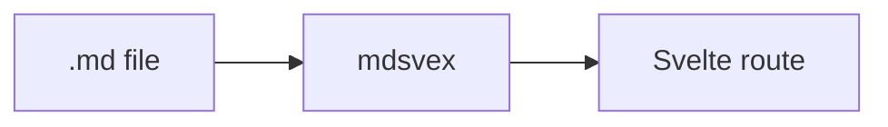

# docsmith scaffolding

# Introduction

## What is Svelte DocSmith?

Svelte DocSmith is the documentation framework for Svelte 5 library
authors. Your interactive examples live inside one real, stateful SvelteKit
app — not sandboxed as isolated islands, and not screenshots of a component
that used to work.

You write markdown under `src/routes/docs/`. DocSmith turns it into styled,
navigable, syntax-highlighted pages, and lets you drop the same components
your users import straight into the prose.

## Why another docs tool?

A library's docs are only as good as their examples. Screenshots go stale.
Sandboxed islands drift from the package your users install. When the
example is the real component, running in the same app as the docs, that
rot is gone by construction.

That is why a DocSmith page is a real SvelteKit route: so the button, form,
or chart in your docs is the same component your users import — running,
stateful, and impossible to let rot. Live examples are the reason to adopt
DocSmith.

The scaffolding holds its own. Drop a page under `src/routes/docs/` and the
sidebar builds itself from frontmatter — never a hand-maintained nav tree.
The shell brings the header, mobile nav, in-page TOC, and prev/next links;
the pipeline handles highlighting and anchors. You write content; the
chrome and navigation keep up.

## Highlights

- **Live examples.** Drop a component into a page; it runs, and its source is
  shown from the same file, so the two can never drift.
- **Markdown as routes.** `.md` files compile to real Svelte components via
  mdsvex. No loader, no catch-all route.
- **Syntax highlighting.** Shiki runs at build time on the HAST tree, with a
  generous language set and dual light/dark themes.
- **Nav derives itself.** The sidebar is built from each page's frontmatter,
  never hand-written.
- **The whole chrome.** Header, collapsible sidebar, mobile nav, in-page table
  of contents, breadcrumbs, and prev/next links, all included.
- **Yours to theme.** One CSS import ships the Tailwind and shadcn token system;
  override any token to make it your own.

## Where to next

<CardGrid>
	<Card title="Installation" href="/docs/installation">
		{#snippet icon()}<Rocket class="size-5" />{/snippet}
		Add DocSmith to a SvelteKit project and wire up the one-line CSS contract.
	</Card>
	<Card title="Quick Start" href="/docs/quick-start">
		{#snippet icon()}<BookOpen class="size-5" />{/snippet}
		Register the pipeline and render your first page in four steps.
	</Card>
</CardGrid>


# Installation

## Start a new project

The fastest way to begin is the scaffolder. It creates a ready-to-run SvelteKit
project already wired with DocSmith: the markdown pipeline, the Vite plugin, the
style contract, a `DocsShell` layout, a 404 page, and a couple of sample pages.

<Tabs syncKey="pkg">
<TabItem label="pnpm">

```bash
pnpm create svelte-docsmith my-docs
```

</TabItem>
<TabItem label="npm">

```bash
npm create svelte-docsmith@latest my-docs
```

</TabItem>
<TabItem label="yarn">

```bash
yarn create svelte-docsmith my-docs
```

</TabItem>
<TabItem label="bun">

```bash
bun create svelte-docsmith my-docs
```

</TabItem>
</Tabs>

Then install dependencies and start the dev server:

```bash
cd my-docs
npm install
npm run dev
```

That is the whole setup. Skip ahead to [Writing pages](/docs/writing-pages) to
start authoring. The rest of this page covers adding DocSmith to a project you
already have.

## Add to an existing project

Svelte DocSmith is a SvelteKit library. Install it with your package manager of
choice:

<Tabs syncKey="pkg">
<TabItem label="pnpm">

```bash
pnpm add -D svelte-docsmith
```

</TabItem>
<TabItem label="npm">

```bash
npm install -D svelte-docsmith
```

</TabItem>
<TabItem label="yarn">

```bash
yarn add -D svelte-docsmith
```

</TabItem>
<TabItem label="bun">

```bash
bun add -D svelte-docsmith
```

</TabItem>
</Tabs>

<Callout variant="note" title="Prerequisites">

DocSmith expects **Svelte 5**, **SvelteKit 2**, and **Tailwind CSS v4** as peer
dependencies, the same stack this documentation site runs on. A fresh
`npx sv create` app with Tailwind selected already has them.

</Callout>

## The CSS contract

Components are styled with Tailwind and shadcn design tokens. The whole contract
is one import in your app's stylesheet:

```css title="src/app.css"
@import 'tailwindcss';
@import 'svelte-docsmith/theme.css';
```

`theme.css` makes Tailwind scan the package (so the utility classes its
components use are generated), defines the shadcn theme tokens (`--background`,
`--primary`, `--radius`, and the rest) for `:root` and `.dark`, and pulls in the
typography and animation plugins.

That single import is also the whole customization surface: redefine any token
after it to rebrand the entire system. See [Theming](/docs/theming) for the full
token list and how dark mode is wired.

## Next

With the package installed, continue to the [Quick Start](/docs/quick-start) to
wire up the pipeline and render your first page.


# Quick Start

Four steps take you from an installed package to a live docs page in the
sidebar. Each one edits a single file.

<Callout variant="tip" title="Scaffolding a new project?">

`npm create svelte-docsmith` does every step on this page for you. This walk
through is for adding DocSmith to an existing app, or for understanding the
pieces. See [Installation](/docs/installation) for the scaffolder.

</Callout>

<Steps>
<Step title="Register the markdown pipeline">

In `svelte.config.js`, add `.md` to your extensions and call `docsmith()`. It
bundles mdsvex, Shiki highlighting with a generous language set, heading
anchors, and the DocSmith page layout:

```js title="svelte.config.js"
import adapter from '@sveltejs/adapter-auto';
import { vitePreprocess } from '@sveltejs/vite-plugin-svelte';
import { docsmith } from 'svelte-docsmith/preprocess'; // [!code ++]

export default {
	extensions: ['.svelte', '.md'], // [!code ++]
	preprocess: [vitePreprocess(), docsmith()], // [!code ++]
	kit: { adapter: adapter() }
};
```

</Step>
<Step title="Add the Vite plugin">

In `vite.config.ts`, add `docsmith()`. It scans your pages' frontmatter into the
`svelte-docsmith/content` module and powers live examples:

```ts title="vite.config.ts"
import { sveltekit } from '@sveltejs/kit/vite';
import tailwindcss from '@tailwindcss/vite';
import { docsmith } from 'svelte-docsmith/vite'; // [!code ++]
import { defineConfig } from 'vite';

export default defineConfig({
	plugins: [docsmith(), tailwindcss(), sveltekit()] // [!code ++]
});
```

</Step>
<Step title="Add the shell">

In `src/routes/docs/+layout.svelte`, render `DocsShell`. It builds the sidebar
from the generated content index, so there is no nav array to maintain:

```svelte title="src/routes/docs/+layout.svelte"


<DocsShell {config} content={docs}>
	{@render children()}
</DocsShell>
```

</Step>
<Step title="Write a page">

Create `src/routes/docs/getting-started/+page.md`. The frontmatter drives the
sidebar; everything below it is your content:

````md title="src/routes/docs/getting-started/+page.md"
---
title: Getting Started
description: Your first steps.
section: Guides
order: 1
---

## Hello

This is a real SvelteKit route. Code blocks are highlighted by Shiki, and you
can emphasise a line with the notation transformer:

```ts
const docs = loadDocs(); // [!code highlight]
```
````

</Step>
</Steps>

## What you end up with

Those four files sit exactly here:

<FileTree>
	<FileTreeItem name="svelte.config.js" />
	<FileTreeItem name="vite.config.ts" />
	<FileTreeItem name="src" folder>
		<FileTreeItem name="app.css" />
		<FileTreeItem name="routes" folder>
			<FileTreeItem name="docs" folder>
				<FileTreeItem name="+layout.svelte" />
				<FileTreeItem name="getting-started/+page.md" highlight />
			</FileTreeItem>
		</FileTreeItem>
	</FileTreeItem>
</FileTree>

<Callout variant="tip" title="That's the whole loop">

Drop a markdown file under `src/routes/docs/` and it appears in the sidebar,
styled, highlighted, with breadcrumbs and a table of contents. To embed a
running component, see [Writing pages](/docs/writing-pages), which covers
frontmatter, live examples, and code highlighting in full.

</Callout>

# Configuration

Everything you wire up once: what the package exports, the config object you pass
to the shell, and the two page-level components that own the site chrome. Props
for the authoring components (`Callout`, `Tabs`, `Badge`, and the rest) live on
their own pages in the [Components](/docs/components/callout) section.

## Package exports

- **`svelte-docsmith`**: every component, plus `defineConfig`, `createSearchEngine`, `generateSitemap`, `generateFeed`, `generateLlmsTxt`, `generateLlmsFullTxt`, and the types. Components are documented in [Components](/docs/components/callout); the rest is below.
- **`svelte-docsmith/preprocess`**: the mdsvex + Shiki preprocessor for `svelte.config.js`.
- **`svelte-docsmith/vite`**: the Vite plugin (content, search, llms and changelog indexes, plus the `?source` transform).
- **`svelte-docsmith/content`**: the generated sidebar index, exported as `docs`.
- **`svelte-docsmith/search`**: the generated full-text search index, exported as `docs` (lazy-load it; see [Search](/docs/search)).
- **`svelte-docsmith/llms`**: the generated per-page markdown index, exported as `docs` (see [SEO](/docs/seo)).
- **`svelte-docsmith/changelog`**: the generated release index, exported as `releases` (see [Changelog](/docs/changelog)).
- **`svelte-docsmith/mermaid`**: the diagram component, imported for you by a ` ```mermaid ` fence. You never import it directly.
- **`svelte-docsmith/theme.css`**: the base style contract.
- **`svelte-docsmith/themes/*.css`**: the pre-installed theme presets (see [Theming](/docs/theming)).

## defineConfig

Validates a `DocsmithConfig` and returns it unchanged, throwing a clear error on
an invalid or dynamically-built config instead of rendering a blank header.

```ts
const config = defineConfig({
	title: 'My Library',
	description: 'A short tagline, used as the default meta description.',
	url: 'https://my-library.dev',
	github: 'https://github.com/you/my-library',
	version: '1.0.0'
});
```

<PropsTable>
	<Prop name="title" type="string" required>
		Site title, shown in the header/sidebar and as the <code>&lt;title&gt;</code> suffix.
	</Prop>
	<Prop name="description" type="string">
		Default meta description, used for pages without their own. See <a href="/docs/seo">SEO</a>.
	</Prop>
	<Prop name="url" type="string">
		Canonical site origin. Enables <code>&lt;link rel="canonical"&gt;</code> and absolute Open Graph URLs.
	</Prop>
	<Prop name="ogImage" type="string">
		Default social-share image (absolute, or a path resolved against <code>url</code>).
	</Prop>
	<Prop name="editUrl" type="string">
		Base URL for the per-page “Edit this page” link, e.g.
		<code>https://github.com/you/repo/edit/main/apps/docs</code>. Each page's source
		path is appended. (“Last updated” is added from git automatically.)
	</Prop>
	<Prop name="github" type="string">
		GitHub URL; renders a link in the header when set.
	</Prop>
	<Prop name="version" type="string">
		Version string shown in the header.
	</Prop>
	<Prop name="logo" type="string">
		Logo image src; falls back to the built-in book mark.
	</Prop>
	<Prop name="nav" type="DocsmithLink[]">
		Top-level header navigation links.
	</Prop>
	<Prop name="announcement" type={'{ text, tag?, href?, external?, id?, dismissible? }'}>
		A thin bar above the header. <code>text</code> is required; add a
		<code>tag</code> for a leading pill (e.g. <code>"New"</code>) and an
		<code>href</code> to link it. It's dismissible by default and stays dismissed
		until you change <code>id</code> (or the text), so bump <code>id</code> to
		re-show a new announcement.
	</Prop>
	<Prop name="footer" type={'{ copyright?, columns?, poweredBy? }'}>
		Footer copyright line, titled link columns, and the “Powered by” toggle.
	</Prop>
</PropsTable>

This site runs one: the thin bar above the header is `config.announcement`. Its
`id` tracks the library version, so it returns after each release and stays out
of the way in between. Dismiss it and it holds until the next version.

## docsmith() preprocessor

From `svelte-docsmith/preprocess`, registered in `svelte.config.js`. It bundles
mdsvex, Shiki, heading anchors and the page layout, so markdown compiles to real
routes. Every option has a working default; pass none and it does the right
thing.

<PropsTable title="docsmith() — preprocess">
	<Prop name="extensions" type="string[]" default="['.md']">
		File extensions compiled as markdown.
	</Prop>
	<Prop name="themes" type={'{ light: string; dark: string }'} default="github-light / github-dark">
		Shiki themes for the dual light/dark render of markdown code fences. The
		Vite plugin has its own <code>themes</code> for live example source; set
		both to the same pair or the two will not match.
	</Prop>
	<Prop name="langs" type="string[]">
		Extra Shiki languages on top of the built-in set. An unknown fence language
		falls back to plain text rather than failing the build.
	</Prop>
	<Prop name="layout" type="string | false">
		Absolute path to a custom mdsvex layout, or <code>false</code> for none. A
		custom layout must export a <code>pre</code> component from its module
		script, since code fences render through it.
	</Prop>
	<Prop name="lineNumbers" type="boolean" default="false">
		Number every code block. A fence overrides it either way with
		<code>showLineNumbers</code> or <code>noLineNumbers</code>.
	</Prop>
	<Prop name="twoslash" type="boolean" default="false">
		Enable Twoslash on fences marked <code>twoslash</code>. Needs the optional
		peer dependencies; see <a href="/docs/code-blocks">Code blocks</a>.
	</Prop>
	<Prop name="remarkPlugins" type="PluggableList">
		Extra remark plugins, appended after DocSmith's own.
	</Prop>
	<Prop name="rehypePlugins" type="PluggableList">
		Extra rehype plugins, appended after DocSmith's own (slug, sectionize).
	</Prop>
</PropsTable>

## docsmith() Vite plugin

From `svelte-docsmith/vite`, added to `plugins` in `vite.config.ts`. It scans
your pages into the generated indexes and serves the `?source` imports that
[Live Examples](/docs/live-examples) use.

<PropsTable title="docsmith() — vite">
	<Prop name="content" type="string" default="'src/routes/docs'">
		Directory scanned for doc pages.
	</Prop>
	<Prop name="routes" type="string" default="'src/routes'">
		Routes root, used to derive each page's URL from its location.
	</Prop>
	<Prop name="themes" type={'{ light: string; dark: string }'} default="github-light / github-dark">
		Shiki themes for the <code>?source</code> render behind
		<a href="/docs/live-examples">Live Examples</a>. Separate from the
		preprocessor's <code>themes</code>, because the two run from different
		config files; set them to the same pair or your example source will not
		match your code blocks.
	</Prop>
	<Prop name="changelog" type="string | false" default="'CHANGELOG.md'">
		Path to the changelog that feeds the release index. Point it at the package
		you publish, or <code>false</code> to skip it.
	</Prop>
	<Prop name="changelogPath" type="string" default="'/changelog'">
		Route the changelog is served at. Used to build feed links and to find
		hand-written per-release pages.
	</Prop>
</PropsTable>

## DocsShell

The full documentation shell: header, sidebar, content area, and table of
contents.

```svelte
<DocsShell {config} content={docs}>
	{@render children()}
</DocsShell>
```

<PropsTable>
	<Prop name="config" type="DocsmithConfig" required>
		The site config (see <code>defineConfig</code> above).
	</Prop>
	<Prop name="content" type="DocsContentItem[]" required>
		The content index; the sidebar nav is derived from it.
	</Prop>
	<Prop name="children" type="Snippet" required>
		The rendered page.
	</Prop>
	<Prop name="versions" type="ResolvedVersion[]" default="[]">
		The generated version manifest. Pass it to scope the sidebar, search,
		prev/next, and breadcrumbs to the version being read. See
		<a href="/docs/versioning">Versioning</a>.
	</Prop>
	<Prop name="search" type="(versionId?: string) => Promise<SearchDoc[]>">
		Enable the ⌘K search palette by lazily providing the generated index, e.g.
		<code>{'() => import(\'svelte-docsmith/search\').then((m) => m.docs)'}</code>.
		Receives the active version id on a versioned site.
		See <a href="/docs/search">Search</a>.
	</Prop>
	<Prop name="seo" type={'{ title?: string; description?: string }'}>
		Override the head tags for this page (title, meta description). Doc pages get
		these from frontmatter automatically. See <a href="/docs/seo">SEO</a>.
	</Prop>
	<Prop name="logo" type="Snippet">
		Custom logo mark for the header and mobile menu.
	</Prop>
	<Prop name="actions" type="Snippet">
		Extra header controls, before the theme toggle.
	</Prop>
	<Prop name="footer" type="Snippet">
		Content rendered below the page column.
	</Prop>
	<Prop name="pattern" type="boolean" default="false">
		Render the decorative grid-and-glow page background.
	</Prop>
	<Prop name="copyPage" type="boolean" default="false">
		Show the "Copy page" split button on doc pages (copy as Markdown, view the
		raw <code>.md</code>, or open in ChatGPT / Claude). Needs the <code>.md</code>
		endpoint. See <a href="/docs/seo">SEO</a>.
	</Prop>
	<Prop name="readingTime" type="boolean" default="true">
		Show the estimated reading time on doc pages (computed at build time from
		the page's word count). Set <code>false</code> to hide it.
	</Prop>
	<Prop name="feedback" type={"boolean | ((vote: 'up' | 'down', path: string) => void)"}>
		Show the "Was this page helpful?" widget at the foot of doc pages. Pass
		<code>true</code> for the UI alone, or a callback to record votes (wire it to
		your analytics). Omit to hide it.
	</Prop>
	<Prop name="layout" type="'docs' | 'page'" default="'docs'">
		<code>docs</code> is the three-column shell; <code>page</code> is full-bleed
		content with the same header and footer but no sidebar or TOC.
	</Prop>
</PropsTable>

<Callout variant="note" title="Theming needs no setup">

`ThemeProvider` and `ThemeToggle` handle light and dark with no consumer wiring.
`DocsShell` mounts the provider internally, so you never touch `mode-watcher`
yourself. Use `ThemeProvider` directly to wrap a page you build outside
`DocsShell`.

</Callout>

## ErrorPage

A styled 404 / error screen that keeps the site chrome (header, search, footer,
theme). Drop it into a SvelteKit `+error.svelte`:

```svelte title="src/routes/+error.svelte"


<ErrorPage config={siteConfig} content={docs} home="/docs" homeLabel="Back to the docs" />
```

<PropsTable>
	<Prop name="config" type="DocsmithConfig" required>
		Same config as <code>DocsShell</code>, so the chrome matches.
	</Prop>
	<Prop name="content" type="DocsContentItem[]" default="[]">
		Content index, so the header/footer nav still work.
	</Prop>
	<Prop name="status" type="number" default="page.status">
		HTTP status. Defaults to the current page's status.
	</Prop>
	<Prop name="title" type="string" default="from status">
		Heading. Defaults to “Page not found” for 404, else “Something went wrong”.
	</Prop>
	<Prop name="message" type="string" default="page.error.message">
		Body line. Defaults to the error message, then a status-appropriate default.
	</Prop>
	<Prop name="home" type="string" default="'/'">
		Where the primary action links.
	</Prop>
	<Prop name="homeLabel" type="string" default="'Back to home'">
		Label of the primary action.
	</Prop>
	<Prop name="versions" type="ResolvedVersion[]" default="[]">
		The version manifest, same as <code>DocsShell</code>. Pass it so an error
		under an archived prefix keeps that version's search scope and
		<code>noindex</code>.
	</Prop>
	<Prop name="search" type="(versionId?: string) => Promise<SearchDoc[]>">
		Enable the ⌘K palette on the error page (same loader as <code>DocsShell</code>).
	</Prop>
</PropsTable>

## Types

- **`DocsmithConfig`**: the config object above.
- **`DocsContentItem`**: a content-index entry with `title`, `path`, and optional
  `section`, `order`, `description`, `toc`.
- **`SearchDoc`** / **`SearchResult`** / **`SearchEngine`**: the search index
  entry and the shape returned by [`createSearchEngine`](/docs/search).
- **`ResolvedVersion`**: one entry of the generated version manifest. See
  [Versioning](/docs/versioning).
- **`CalloutVariant`** / **`BadgeVariant`**: the intent unions for `Callout` and `Badge`.

The vendored shadcn primitives and internal helpers (the TOC engine, the
clipboard utility, the markdown renderer map) are **not** part of the public API
and may change between releases.

# How it works

## Markdown as routes

DocSmith leans on mdsvex, which compiles markdown into real Svelte components. A
file becomes a page by its position on disk, with no loader and no catch-all
route:

<FileTree>
	<FileTreeItem name="src" folder>
		<FileTreeItem name="routes" folder>
			<FileTreeItem name="docs" folder>
				<FileTreeItem name="guides" folder>
					<FileTreeItem name="routing" folder>
						<FileTreeItem name="+page.md" highlight />
					</FileTreeItem>
				</FileTreeItem>
			</FileTreeItem>
		</FileTreeItem>
	</FileTreeItem>
</FileTree>

The file above serves `/docs/guides/routing`. Because it is a normal SvelteKit
route, you can drop interactive Svelte components straight into the markdown and
they run as part of the same app.

## One name, two plugins

DocSmith ships two things both called `docsmith()`, imported from two entry
points. They do different jobs:

- `svelte-docsmith/preprocess` is a **Svelte preprocessor**, added in
  `svelte.config.js`. It runs at compile time and turns each `.md` file into a
  styled, highlighted page (mdsvex, Shiki, heading anchors, the page layout).
- `svelte-docsmith/vite` is a **Vite plugin**, added in `vite.config.ts`. It
  runs at build time and generates the content index (below) plus the `?source`
  transform that powers live examples.

<Callout variant="warning" title="You need both">

The preprocessor and the Vite plugin are not interchangeable. The preprocessor
renders your pages; the Vite plugin builds the sidebar and live-example source.
Register one without the other and either your pages or your navigation goes
missing.

</Callout>

## Nav is derived, never written

There is no navigation array to maintain. The `docsmith()` Vite plugin reads
each page's frontmatter into the `svelte-docsmith/content` module, and
`DocsShell` groups the entries into the sidebar:

```ts
{
	title: 'How it works',
	description: 'The content model...',
	section: 'Core Concepts', // sidebar group
	order: 4                   // sort key
}
```

`section` names the group; `order` sorts entries within it; groups are ordered
by the smallest `order` they contain. Add a page, and it slots into the sidebar
in the right place automatically.

## Two tables of contents, two jobs

DocSmith keeps two structures, and they never overlap:

- The **content index** owns build-time structure. The `docsmith()` Vite plugin
  scans frontmatter into the sidebar navigation.
- The runtime **TOC engine** owns in-page scroll tracking. It scans the rendered
  headings and highlights the section you are reading.

## The highlighting pipeline

Code blocks are highlighted by [Shiki](https://shiki.style) inside the
`docsmith()` preprocessor, with a generous default language set. Unknown
languages fall back to plain text instead of failing the build:

```python
def greet(name: str) -> str:
    return f"Hello, {name}"
```

Highlighting is dual-theme: the same markup carries light and dark colors and
flips with the page theme, so your code reads correctly either way.

# Writing pages

## A page is a file

Every page is a `+page.md` file under `src/routes/docs/`. The directory name is
the URL, so this file serves `/docs/guides/routing`:

<FileTree>
	<FileTreeItem name="src" folder>
		<FileTreeItem name="routes" folder>
			<FileTreeItem name="docs" folder>
				<FileTreeItem name="guides" folder>
					<FileTreeItem name="routing" folder>
						<FileTreeItem name="+page.md" highlight />
					</FileTreeItem>
				</FileTreeItem>
			</FileTreeItem>
		</FileTreeItem>
	</FileTreeItem>
</FileTree>

Create the file, and the page exists.

## Frontmatter

The frontmatter block at the top of each page drives the sidebar. Four fields:

| Field         | Required | Purpose                                                                    |
| ------------- | -------- | -------------------------------------------------------------------------- |
| `title`       | yes      | The sidebar label and page heading.                                        |
| `description` | no       | One-line summary, shown under the title.                                   |
| `section`     | no       | Sidebar group, a string or a nested path. Omitted pages fall under "Docs". |
| `order`       | no       | Sort key within the group.                                                 |

```md
---
title: Routing
description: How pages map to URLs.
section: Guides
order: 1
---
```

`section` names the group and `order` sorts within it; groups themselves are
ordered by the smallest `order` they contain.

### Nested sections

Give `section` an array to nest a page inside a collapsible subsection. Each
entry is one level of the group path:

```md
---
title: Middleware
section: [Guides, Advanced]
order: 2
---
```

This puts "Middleware" under a collapsible **Advanced** group inside **Guides**.
Nesting can go as deep as you like, `order` still sorts each level, and a
subsection inherits the smallest `order` of its pages. The branch holding the
current page is expanded on load; the rest start collapsed.

<Callout variant="warning" title="A missing page is almost always frontmatter">

A page with no `title` is skipped by the sidebar. If a page isn't showing up,
check its frontmatter before anything else: a stray indent or a typo'd key is
the usual culprit.

</Callout>

## Headings

Don't write an `#` (h1) in the body. The `title` from frontmatter is the page
heading, so start your content at `##`. Every heading gets an anchor id
automatically, and the in-page table of contents is built from `##` and `###`
headings as the page renders.

## Code blocks

Fenced code blocks are highlighted by Shiki at build time; tag the fence with a
language. To emphasise a line, append the comment `// [!code highlight]` to it
(a real comment in that language). Shiki strips the comment and highlights the
line, like the second line below:

```ts
const docs = loadDocs();
const current = docs.find((d) => d.active); // [!code highlight]
```

Unknown language tags fall back to plain text rather than failing the build, so
an unfamiliar fence won't break your site.

Line highlighting is just the start. See [Code blocks](/docs/code-blocks) for
diffs, focus, error and warning lines, and word highlighting.

## Diagrams

Tag a fence `mermaid` and it renders as a diagram instead of code, via
[Mermaid](https://mermaid.js.org), following the site's light and dark themes:

````md

````

renders as:


Mermaid runs in the browser, so add it to your project. It's an optional peer
dependency, pulled in only on pages that use it:

```bash
npm i -D mermaid
```

A diagram is only as readable as its labels for anyone using a screen reader.
Give one an accessible name and description with Mermaid's `accTitle` and
`accDescr` directives, and both land in the rendered SVG:

````md

````

If a diagram fails to parse, or `mermaid` isn't installed, the source is shown
as a plain code block instead so the page never loses the content.

## Live examples

To show a real, running component next to its source, put the component in
`src/lib/examples/`. Import `LiveExample`, then import your component twice: once
as the component, and once with the `?source` query for its build-time
highlighted source. Pass both to `LiveExample`:

```md


<LiveExample source={counterSource}>
  <Counter />
</LiveExample>
```

Both come from the same file, so the demo you render and the code you show can
never drift. See [Live Examples](/docs/live-examples) for a running one.

## Tabbed content

For alternatives such as package managers or framework variants, group blocks
with `Tabs` and `TabItem`. Pass the tab labels as `items`; each `TabItem`'s
`value` matches one label:

````md


<Tabs>
<TabItem label="npm">

```bash
npm i -D svelte-docsmith
```

  </TabItem>
  <TabItem label="pnpm">

```bash
pnpm add -D svelte-docsmith
```

  </TabItem>
</Tabs>
````

See the [Components](/docs/components/callout) section for the full set you can
drop into a page: callouts, steps, cards, accordions, file trees, badges, and
more.

# Code blocks

Every fenced code block is highlighted by Shiki at build time. On top of that,
you annotate lines and words with comment markers written right in the code. The
marker comment is stripped from the rendered output, so what readers see stays
clean.

Each section below shows the markdown you write, then how it renders.

## Highlight a line

Append `// [!code highlight]` to a line (a real comment in the fence's language)
to give it a highlighted background.

You write:

<!-- prettier-ignore -->
```text
const config = defineConfig({
	title: 'My Library' // [!code highlight]
});
```

Which renders as:

```ts
const config = defineConfig({
	title: 'My Library' // [!code highlight]
});
```

## Additions and deletions

Mark a line with `// [!code ++]` for an addition or `// [!code --]` for a
deletion. They render with a colored background and a `+` / `-` gutter marker.

You write:

<!-- prettier-ignore -->
```text
export default {
	preprocess: [vitePreprocess()],             // [!code --]
	preprocess: [vitePreprocess(), docsmith()], // [!code ++]
};
```

Which renders as:

```ts
export default {
	preprocess: [vitePreprocess()], // [!code --]
	preprocess: [vitePreprocess(), docsmith()] // [!code ++]
};
```

## Focus

`// [!code focus]` dims the other lines so the eye lands on what matters. Hover
the rendered block to bring the rest back.

You write:

<!-- prettier-ignore -->
```text
function setup() {
	const app = createApp();
	app.use(docsmith()); // [!code focus]
	return app;
}
```

Which renders as:

```ts
function setup() {
	const app = createApp();
	app.use(docsmith()); // [!code focus]
	return app;
}
```

## Errors and warnings

`// [!code error]` and `// [!code warning]` tint a line red or amber, for
call-outs like a deprecated call or a footgun.

You write:

<!-- prettier-ignore -->
```text
const ok = readFile('./page.md');
const bad = readFile();                  // [!code error]
const risky = readFileSync('./page.md'); // [!code warning]
```

Which renders as:

```ts
const ok = readFile('./page.md');
const bad = readFile(); // [!code error]
const risky = readFileSync('./page.md'); // [!code warning]
```

## Highlight a word

`// [!code word:name]` highlights every occurrence of `name` on the next line.
Add a count like `word:name:2` to limit how many.

You write:

<!-- prettier-ignore -->
```text
const name = frontmatter.title; // [!code word:name]
```

Which renders as:

```ts
const name = frontmatter.title; // [!code word:name]
```

<Callout variant="tip" title="Markers use the fence's language">

Write the marker inside a comment your language understands: `//` for
JS/TS/Svelte, `#` for bash or YAML, `<!-- -->` for HTML. Shiki strips the comment
along with the marker, so it never ships to the reader. (To show a marker
literally instead of applying it, as the "You write" blocks above do, put it in a
plain `text` block.)

</Callout>

## Highlight lines by number

Comment markers can't reach every line. Inside a Svelte template region an HTML
comment is stripped without highlighting anything, so mark those lines from the
fence itself instead. A single line, a list, or a range all work.

````md
```svelte {4}
<DocsShell
	config={siteConfig}
	content={docs}
	search={() => import('svelte-docsmith/search').then((m) => m.docs)}
>
	{@render children()}
</DocsShell>
```
````

renders as:

```svelte {4}
<DocsShell
	config={siteConfig}
	content={docs}
	search={() => import('svelte-docsmith/search').then((m) => m.docs)}
>
	{@render children()}
</DocsShell>
```

Ranges and lists use the same syntax: `{2-4}`, `{1,5}`, or both together.

## Filenames and line numbers

Add `title=` to label a block with the file it belongs to, and `showLineNumbers`
to number it. Pair `startLine=` with numbering when the snippet is lifted out of
a longer file, so the numbers match the real source.

````md
```ts title="vite.config.ts" showLineNumbers
import { docsmith } from 'svelte-docsmith/vite';
export default { plugins: [docsmith()] };
```
````

renders as:

```ts title="vite.config.ts" showLineNumbers
import { docsmith } from 'svelte-docsmith/vite';
export default { plugins: [docsmith()] };
```

Numbering every block by default is a preprocessor option, and a single fence
can still opt out with `noLineNumbers`:

```js title="svelte.config.js"
docsmith({ lineNumbers: true });
```

## Real types on hover

Add `twoslash` to a TypeScript or Svelte fence and the block is run through the
TypeScript compiler, so hovering a token shows its actual inferred type rather
than a hand-written guess.

````md
```ts twoslash
const version = '0.9.0';
const parts = version.split('.').map(Number);
```
````

renders as (hover `parts` or `version`):

```ts twoslash
const version = '0.9.0';
const parts = version.split('.').map(Number);
```

Twoslash is opt-in twice over: enable it in the preprocessor, then mark the
individual fences that want it.

```js title="svelte.config.js"
docsmith({ twoslash: true });
```

It needs three optional peer dependencies, pulled in only if you use it:

```bash
npm i -D @shikijs/twoslash twoslash-svelte typescript
```

Because the snippet really is compiled, it has to typecheck: an unresolved
import or a type error means there is no type to show. Rather than fail your
build over one block, DocSmith falls back to an ordinary highlight and warns
which block it was. Use `// @errors: 2322` to show an error deliberately,
`// @noErrors` to silence one, and `// ---cut---` to hide setup lines from the
rendered output while still compiling them.

# Live Examples

## A real, running component

The button below is a real Svelte component running as part of this app. It is
not a screenshot, and not a sandboxed iframe. Click it, then open the source:

<LiveExample source={counterSource}>
	<Counter />
</LiveExample>

## Single source of truth

The rendered component and the source panel above both come from **one file**,
`counter.svelte`. It is imported twice: once as a component (rendered) and once
as `?source` (highlighted at build time by the `docsmith()` plugin from
`svelte-docsmith/vite`), so the demo and its code can never drift.

<Callout variant="tip" title="Examples that can't rot">

The example in your docs is the same component your users import. When the
component changes, the rendered demo and its shown source both change with it,
so it can never decay into a screenshot of something that used to work.

</Callout>

See [Writing pages](/docs/writing-pages) for the import pattern to copy.

## API reference

<PropsTable title="LiveExample">
	<Prop name="children" type="Snippet" required>
		The live, rendered component.
	</Prop>
	<Prop name="source" type="string" required>
		Pre-highlighted source HTML. Pass a <code>?source</code> import of the same file.
	</Prop>
</PropsTable>

# Theming

DocSmith ships its entire look as shadcn-style design tokens behind a single
stylesheet. You restyle the whole system by redefining tokens, not by touching
components, so a rebrand is a handful of CSS variables instead of a fork.

## One import, one contract

The style contract is one import on top of Tailwind:

```css title="src/app.css"
@import 'tailwindcss';
@import 'svelte-docsmith/theme.css';
```

`theme.css` does three things: it makes Tailwind scan the package so the
components' utility classes are generated, it registers the shadcn token set for
`:root` and `.dark`, and it pulls in the typography and animation plugins. Every
component reads those tokens, so the tokens are the only surface you style.

On its own, `theme.css` gives you the default theme, **Darkmatter**: a
near-monochrome shell with a warm orange primary. You import nothing else to get
it.

## The presets

Eleven presets ship in the box. Pick one below to preview it, and toggle the
site's dark mode to see both sides:

<ThemeGallery />

A preset is a stylesheet that redefines the color tokens, and for some the corner
radius, and nothing else. Import it after `theme.css` and it wins:

```css title="src/app.css"
@import 'tailwindcss';
@import 'svelte-docsmith/theme.css';
@import 'svelte-docsmith/themes/amethyst.css';
```

Darkmatter is already baked into `theme.css`, so you only import
`themes/darkmatter.css` to return to it after trying another preset.

Available: `darkmatter` (default), `tangerine`, `amethyst`, `graphite`,
`evergreen`, `rose`, `ocean`, `nord`, `claude`, `bubblegum`, and `mono`. Each
covers light and dark. Want your own brand color instead? Skip the preset and
override the tokens directly.

## Overriding tokens

Redefine any token after the import and it wins. Tokens are OKLCH, so change the
primary and every button, link, and accent follows:

```css title="src/app.css"
@import 'tailwindcss';
@import 'svelte-docsmith/theme.css';

:root {
	--primary: oklch(0.55 0.2 265); /* your brand color */
	--radius: 0.5rem; /* tighter corners */
}
```

<Callout variant="warning" title="Order decides the winner">

If an override is not taking effect, import order is almost always the cause.
Your redefinition has to come after the `theme.css` import, or the package's own
value wins. The same rule applies to preset stylesheets.

</Callout>

## The token set

The tokens are standard shadcn. The ones you reach for most:

| Token                                | Controls                              |
| ------------------------------------ | ------------------------------------- |
| `--background` / `--foreground`      | Page surface and body text            |
| `--primary` / `--primary-foreground` | Brand color and text on it            |
| `--muted` / `--muted-foreground`     | Quiet fills and secondary text        |
| `--accent` / `--accent-foreground`   | Hover and highlight surfaces          |
| `--border` / `--input` / `--ring`    | Hairlines, field borders, focus rings |
| `--card` / `--popover`               | Raised surfaces                       |
| `--sidebar*`                         | The docs sidebar, tokened separately  |
| `--radius`                           | Corner rounding across the system     |

## Dark mode

Dark mode is class-based: every token has a `.dark` variant, and DocSmith styles
respond to a `dark` class on the `<html>` element. The docs site toggles it with
[`mode-watcher`](https://github.com/svecosystem/mode-watcher). Drop its
`<ModeWatcher />` in your root layout and the theme toggle and system preference
work out of the box.

An override only covers the theme whose selector you write it under, so set a
token for both modes to change both:

```css
:root {
	--primary: oklch(0.55 0.2 265);
}
.dark {
	--primary: oklch(0.7 0.16 265); /* lighter, for the dark surface */
}
```

## Fonts

Three families are set as tokens: `--font-sans`, `--font-serif`, and
`--font-mono`. Point them at your own faces and load the fonts however you
normally would (a `<link>` in `app.html`, `@fontsource`, or your host):

```css
:root {
	--font-sans: 'Geist', sans-serif;
	--font-mono: 'Geist Mono', monospace;
}
```

# Search

DocSmith builds a full-text search index from your pages at build time and ships
a ⌘K / Ctrl-K command palette that searches it. There is nothing to host and no
service to configure.

## Enable it

Pass a `search` loader to `DocsShell`. It hands back the generated index, which
DocSmith lazily fetches the first time the palette opens, so it never weighs down
your initial load:

```svelte title="src/routes/docs/+layout.svelte" {12}


<DocsShell
	config={siteConfig}
	content={docs}
	search={() => import('svelte-docsmith/search').then((m) => m.docs)}
>
	{@render children()}
</DocsShell>
```

That is the whole setup. A search button appears in the header, ⌘K (Ctrl-K on
Windows and Linux) opens the palette from anywhere, and results link straight to
the matching page. Omit the prop to leave search off.

<Callout variant="note" title="Why a loader, not the data">

Passing a function that dynamically imports `svelte-docsmith/search` lets your
bundler split the index into its own chunk. The index is fetched only when a
reader first opens search, not on every page view.

</Callout>

## What gets indexed

Each page contributes its `title`, its `h2`/`h3` headings, its frontmatter
`description`, and its body text, reduced to plain prose, with code blocks,
component markup, and markdown punctuation stripped out. Title and heading
matches rank above body matches.

## A custom search UI

The palette is the default, but the engine is exported if you want to build your
own input. `createSearchEngine` takes the generated index and returns a
`search(query, limit?)` that yields ranked results with a context snippet:

```ts
import { createSearchEngine } from 'svelte-docsmith';
import { docs } from 'svelte-docsmith/search';

const engine = createSearchEngine(docs);

for (const hit of engine.search('theming')) {
	console.log(hit.title, hit.path, hit.snippet);
}
```

# SEO

`DocsShell` writes the head tags for every page (`<title>`, meta description,
canonical URL, and Open Graph / Twitter Card tags) with no per-page wiring. Doc
pages get theirs straight from frontmatter.

## Per-page, from frontmatter

A page's `title` becomes `Page · Site Title`, and its `description` becomes the
meta and social description. You already write both to drive the sidebar, so
there is nothing extra to add:

```md
---
title: Installation
description: Add Svelte DocSmith to a SvelteKit project.
section: Getting Started
order: 2
---
```

## Site-wide defaults

Set the defaults once in your `DocsmithConfig`. `url` is the piece that unlocks
absolute links (a canonical `<link>` and absolute `og:url`/image), so search
engines and social scrapers resolve them correctly:

```ts
export const siteConfig = defineConfig({
	title: 'My Library',
	description: 'A short tagline, used when a page has no description.',
	url: 'https://my-library.dev',
	ogImage: '/og.png' // absolute, or resolved against `url`
});
```

| Field         | Used for                                                             |
| ------------- | -------------------------------------------------------------------- |
| `description` | Default meta description for pages without their own                 |
| `url`         | Canonical origin; enables `<link rel="canonical">` and absolute URLs |
| `ogImage`     | Default social-share image                                           |

<Callout variant="note" title="A canonical URL needs an origin">

Without `url`, DocSmith can't build an absolute address, so it omits the
canonical and `og:url` tags rather than emit a wrong one. Set `url` to your
deployed origin to turn them on.

</Callout>

## Non-doc pages

Pages that aren't markdown (a landing page, a custom route) have no
frontmatter, so pass the `seo` prop to set or override the head:

```svelte
<DocsShell
	{config}
	layout="page"
	seo={{ title: 'Themes', description: 'Preview the built-in themes.' }}
>
	{@render children()}
</DocsShell>
```

## Sitemap

`generateSitemap` builds a `sitemap.xml` from your content index. Add a
`src/routes/sitemap.xml/+server.ts`:

```ts title="src/routes/sitemap.xml/+server.ts"
import { docs } from 'svelte-docsmith/content';
import { generateSitemap } from 'svelte-docsmith';
import { siteConfig } from '$lib/site-config';

export const prerender = true;

export function GET() {
	const body = generateSitemap(siteConfig.url ?? '', [
		{ path: '/' },
		...docs.map((d) => ({ path: d.path, lastmod: d.lastUpdated }))
	]);
	return new Response(body, { headers: { 'content-type': 'application/xml' } });
}
```

Each entry gets a `<lastmod>` from the page's last git commit — or none, when
the page has no date (no frontmatter `lastUpdated`, and git could not supply
one). On a **shallow clone** (the default for `actions/checkout` and many
hosts), DocSmith omits every git-derived date rather than stamp every page with
the same build day, which would teach crawlers to ignore the field. Build from a
full history (`fetch-depth: 0` in GitHub Actions) when you want real
`<lastmod>` values, or set `lastUpdated` in frontmatter on pages that need one.

Then point crawlers at the sitemap from `static/robots.txt`:

```txt
User-agent: *
Allow: /

Sitemap: https://your-docs.dev/sitemap.xml
```

## llms.txt

The [llms.txt](https://llmstxt.org) standard gives AI tools a clean, plain-text
view of your docs. Svelte DocSmith generates the data at build time in the
`svelte-docsmith/llms` module, and two helpers turn it into the two files the
standard defines: `llms.txt` (a curated index of links) and `llms-full.txt`
(the full text of every page).

Add `src/routes/llms.txt/+server.ts`:

```ts title="src/routes/llms.txt/+server.ts"
import { docs } from 'svelte-docsmith/llms';
import { generateLlmsTxt } from 'svelte-docsmith';
import { siteConfig } from '$lib/site-config';

export const prerender = true;

export function GET() {
	const body = generateLlmsTxt(
		{ title: siteConfig.title, description: siteConfig.description, origin: siteConfig.url },
		docs
	);
	return new Response(body, { headers: { 'content-type': 'text/plain; charset=utf-8' } });
}
```

And `src/routes/llms-full.txt/+server.ts`, identical but for `generateLlmsFullTxt`:

```ts title="src/routes/llms-full.txt/+server.ts"
import { docs } from 'svelte-docsmith/llms';
import { generateLlmsFullTxt } from 'svelte-docsmith';
import { siteConfig } from '$lib/site-config';

export const prerender = true;

export function GET() {
	const body = generateLlmsFullTxt(
		{ title: siteConfig.title, description: siteConfig.description, origin: siteConfig.url },
		docs
	);
	return new Response(body, { headers: { 'content-type': 'text/plain; charset=utf-8' } });
}
```

Both follow your sidebar reading order, grouping pages by `section` and sorting
by `order`. Each page's title becomes an `h1`, and its `description` frontmatter
annotates the link in the index.

<Callout variant="tip">

You are reading these docs through this exact pipeline. Open
[/llms.txt](/llms.txt) and [/llms-full.txt](/llms-full.txt) to see the output.

</Callout>

## Copy page

The same per-page markdown powers a "Copy page" button on every doc page. Turn
it on with the `copyPage` prop on `DocsShell`:

```svelte
<DocsShell {config} content={docs} copyPage>
	{@render children()}
</DocsShell>
```

The split button copies the page as Markdown, and its dropdown links to the raw
`.md`, or opens the page in ChatGPT or Claude. It expects each page to be
available at `<path>.md`, so add one catch-all endpoint,
`src/routes/[...slug].md/+server.ts`:

```ts title="src/routes/[...slug].md/+server.ts"
import { docs } from 'svelte-docsmith/llms';
import { error } from '@sveltejs/kit';
import type { EntryGenerator, RequestHandler } from './$types';

export const prerender = true;

export const entries: EntryGenerator = () =>
	docs.map((doc) => ({ slug: doc.path.replace(/^\//, '') }));

export const GET: RequestHandler = ({ params }) => {
	const doc = docs.find((d) => d.path === `/${params.slug}`);
	if (!doc) error(404, 'Not found');
	return new Response(doc.content, {
		headers: { 'content-type': 'text/markdown; charset=utf-8' }
	});
};
```

<Callout variant="tip">

Try it: the "Copy page" button at the top of this page, or open
[this page as Markdown](/docs/seo.md).

</Callout>

# Callout

Highlight something the reader shouldn't miss. Four intents, each with its own
icon and color. The body stays on the page's normal text color so it's always
legible.

<Callout variant="note">

This is a **note**, neutral informational context.

</Callout>

<Callout variant="tip">

This is a **tip**, a helpful shortcut or best practice.

</Callout>

<Callout variant="warning">

This is a **warning**, so proceed carefully.

</Callout>

<Callout variant="danger">

This is a **danger** callout: something here can break or lose data.

</Callout>

## Usage

Import it and pick a `variant`. The default is `note`; pass `title` to override
the heading. Leave **blank lines** around the content so mdsvex parses the
markdown inside (bold, links, code). Without them it renders as literal text.

<!-- prettier-ignore -->
```svelte


<Callout variant="tip" title="One more thing">

You can override the heading with the `title` prop, and use **markdown**
inside, including `code` and [links](/docs/theming).

</Callout>
```

## API reference

<PropsTable>
	<Prop name="variant" type="'note' | 'tip' | 'warning' | 'danger'" default="'note'">
		Visual intent.
	</Prop>
	<Prop name="title" type="string" default="the variant">
		Heading above the body.
	</Prop>
</PropsTable>

# Steps

A numbered walkthrough (a connecting line with numbered badges) for setup flows
where the order matters. Each step is a `<Step>`; the numbers are automatic.

<Steps>
	<Step title="Install the package">

Add `svelte-docsmith` to your SvelteKit project.

    </Step>
    <Step title="Register the pipeline">

Add `docsmith()` in `svelte.config.js` and `vite.config.ts`.

    </Step>
    <Step title="Write a page">

Drop a `+page.md` under `src/routes/docs/` and it appears in the sidebar.

    </Step>

</Steps>

## Usage

`Steps` and `Step` are plain components. They work in a markdown page **and** in
any `.svelte` file, with no preprocessor required. Give each `Step` an optional
`title`; leave blank lines around markdown content so it's parsed.

<!-- prettier-ignore -->
```svelte


<Steps>
	<Step title="First">Do this.</Step>
	<Step title="Then">Do that.</Step>
</Steps>
```

### Markdown shortcut

Inside a markdown page only, you can skip the `<Step>` tags and use a plain
ordered list, and mdsvex turns it into steps:

<!-- prettier-ignore -->
```md
<Steps>

1. Do this.
2. Do that.

</Steps>
```

## API reference

### Steps

Wraps its `<Step>` children; no other props.

### Step

<PropsTable>
	<Prop name="title" type="string">
		Optional heading for the step.
	</Prop>
</PropsTable>

# Card & CardGrid

A `Card` groups a title and description, optionally as a link. Give it an `href`
and it becomes clickable, with a hover state and a trailing arrow. `CardGrid`
lays cards out in a responsive grid that reflows without breakpoints: as many
columns as fit, down to one on narrow screens.

<CardGrid>
	<Card title="Introduction" href="/docs/introduction">
		What Svelte DocSmith is and who it's for.
	</Card>
	<Card title="Quick Start" href="/docs/quick-start">
		Wire up the pipeline and render your first page.
	</Card>
	<Card title="Theming" href="/docs/theming">
		Override tokens or pick a pre-installed theme.
	</Card>
</CardGrid>

## Usage

```svelte


<CardGrid>
	<Card title="Quick Start" href="/docs/quick-start">
		Wire up the pipeline and render your first page.
	</Card>
	<Card title="External link" href="https://svelte.dev" external>Opens in a new tab.</Card>
</CardGrid>
```

## API reference

### Card

<PropsTable>
	<Prop name="title" type="string" required>
		Card heading.
	</Prop>
	<Prop name="href" type="string">
		Makes the card a link.
	</Prop>
	<Prop name="external" type="boolean" default="false">
		Open the link in a new tab.
	</Prop>
	<Prop name="icon" type="Snippet">
		Optional leading icon.
	</Prop>
</PropsTable>

### CardGrid

<PropsTable>
	<Prop name="children" type="Snippet">
		The Cards to lay out.
	</Prop>
</PropsTable>

# Tabs

Group alternatives such as package managers, framework variants, or OS-specific
commands so the reader sees one at a time. Give each `TabItem` a `label`; `Tabs`
builds the tab row from them, so there is nothing to keep in sync.

<Tabs>
<TabItem label="npm">

```bash
npm i -D svelte-docsmith
```

    </TabItem>
    <TabItem label="pnpm">

```bash
pnpm add -D svelte-docsmith
```

    </TabItem>
    <TabItem label="yarn">

```bash
yarn add -D svelte-docsmith
```

    </TabItem>

</Tabs>

## Usage

Leave blank lines around the content inside each `TabItem` so the markdown (code
fences, prose) is parsed. The first tab is selected by default; pass `value` on
`Tabs` to start on a different one.

<!-- prettier-ignore -->
````svelte


<Tabs>
	<TabItem label="npm">

```bash
npm i -D svelte-docsmith
```

	</TabItem>
	<TabItem label="pnpm">

```bash
pnpm add -D svelte-docsmith
```

	</TabItem>
</Tabs>
````

## Synced tabs

Give related `Tabs` the same `syncKey` and they share one selection: pick `pnpm`
in any block and every block with that key switches to `pnpm`, across the page
and the rest of the site. The choice is remembered across reloads. Use it for
package managers, runtimes, or any choice a reader makes once and keeps.

Try it. These two blocks share `syncKey="demo-pm"`; changing one moves the other:

<Tabs syncKey="demo-pm">
<TabItem label="npm">

```bash
npm i -D svelte-docsmith
```

</TabItem>
<TabItem label="pnpm">

```bash
pnpm add -D svelte-docsmith
```

</TabItem>
<TabItem label="yarn">

```bash
yarn add -D svelte-docsmith
```

</TabItem>
</Tabs>

<Tabs syncKey="demo-pm">
<TabItem label="npm">

```bash
npx sv add svelte-docsmith
```

</TabItem>
<TabItem label="pnpm">

```bash
pnpm dlx sv add svelte-docsmith
```

</TabItem>
<TabItem label="yarn">

```bash
yarn dlx sv add svelte-docsmith
```

</TabItem>
</Tabs>

## API reference

### Tabs

<PropsTable>
	<Prop name="value" type="string" default="first tab">
		Label of the tab selected by default.
	</Prop>
	<Prop name="syncKey" type="string">
		Sync group. Blocks with the same key share their selection and remember it
		across reloads.
	</Prop>
</PropsTable>

### TabItem

<PropsTable>
	<Prop name="label" type="string" required>
		The tab's trigger text.
	</Prop>
	<Prop name="value" type="string" default="label">
		Underlying value, only needed to disambiguate duplicate labels.
	</Prop>
</PropsTable>

