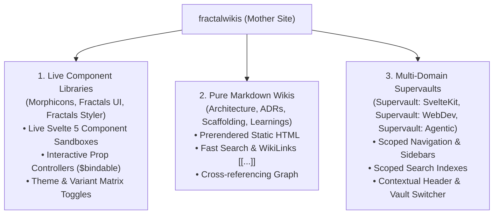

# fractalwikis — The Monorepo Mother Site Architecture

This document defines the architectural blueprint for **fractalwikis**, a super monowiki as the central mother site of sites.It unifies live interactive component sandboxes, pure markdown wikis, and multi-domain supervaults under a single SvelteKit 2 + Svelte 5 engine.

---

## 1. Why fractalwikis Requires a Hybrid SvelteKit Architecture

Unlike simple static documentation sites (which are 95% prose), fractalwikis is a **multi-domain platform** with three distinct content modalities:



## Please look at `/Users/amrit/mandala/repowiki/monorepo/@xyflow_svelte — Svelte Flow rendering engine.md`


### Framework Decision Matrix for fractalwikis

| Requirement | Server-First Islands (Mochi / Blume) | SvelteKit 2 + Svelte 5 (fractalwikis) |
| :--- | :--- | :--- |
| **Multi-Vault State Persistence** | ❌ Full page reloads reset client state | **✅ Svelte 5 Runes ($state) across layouts** |
| **Live Component Sandboxes** | ⚠️ Isolated islands; hard to pass complex props | **✅ Native Svelte 5 component execution & playgrounds** |
| **Nested Vault Layouts** | ❌ No layout nesting engine | **✅ Nested SvelteKit +layout.svelte inheritance** |
| **Static Wiki Speed** | ✅ Zero-JS static HTML | **✅ Statically prerendered HTML (`export const prerender = true`)** |
| **Global Search Scope** | ⚠️ Reloads search engine per route | **✅ Persistent in-memory FlexSearch / Pagefind** |

---

## 2. Directory & Route Architecture (`sites/monowiki`)

```text
sites/monowiki/
├── package.json
├── svelte.config.js
├── vite.config.ts
└── src/
    ├── lib/
    │   ├── state/
    │   │   ├── vault.svelte.ts       # Global reactive Vault State ($state)
    │   │   └── search.svelte.ts      # Global Search Engine State
    │   ├── components/
    │   │   ├── ShellHeader.svelte    # Global Header & Supervault Switcher
    │   │   ├── VaultSidebar.svelte   # Vault-scoped Navigation Sidebar
    │   │   ├── LiveSandbox.svelte    # Component Preview & Prop Inspector
    │   │   └── SearchModal.svelte    # Global & Vault-scoped Search Palette
    │   └── vaults/                   # Vault Content Definitions & Schemas
    └── routes/
        ├── +layout.svelte            # Root Shell (Header, Global State, Theme)
        ├── +page.svelte              # fractalwikis Portal / Home
        │
        ├── (vaults)/
        │   ├── components/           # Component Library Supervault
        │   │   ├── +layout.svelte    # Component Vault Layout (Preview Controls)
        │   │   ├── morphicons/
        │   │   │   └── +page.svelte  # Live Interactive Morphicon Showcase
        │   │   └── fractals-ui/
        │   │       └── +page.svelte  # Live Fractals UI Sandbox
        │   │
        │   ├── sveltekit/            # SvelteKit Supervault
        │   │   ├── +layout.svelte    # SvelteKit Vault Layout & Navigation Tree
        │   │   └── [...slug]/
        │   │       └── +page.md      # Wiki Docs & Architecture Guides
        │   │
        │   ├── webdev/               # WebDev Supervault
        │   │   ├── +layout.svelte    # WebDev Vault Layout
        │   │   └── [...slug]/
        │   │       └── +page.md
        │   │
        │   └── agentic/              # Fractal Agentic Supervault
        │       ├── +layout.svelte    # Agentic Framework & Playbooks
        │       └── [...slug]/
        │           └── +page.md
        │
        └── api/
            └── search.json/
                └── +server.ts        # Unified Search Index Endpoint
```

---

## 3. Core Engine Systems

### 3.1. Supervault Reactive State (`lib/state/vault.svelte.ts`)

Svelte 5 runes allow fractalwikis to track the active Supervault, active theme, and search scope across all navigations:

```typescript
// src/lib/state/vault.svelte.ts
export type VaultId = 'components' | 'sveltekit' | 'webdev' | 'agentic' | 'dharma';

export interface VaultConfig {
  id: VaultId;
  name: string;
  description: string;
  icon: string;
  color: string;
}

export const VAULTS: Record<VaultId, VaultConfig> = {
  components: { id: 'components', name: 'UI & Component Demos', description: 'Live Svelte 5 component sandboxes', icon: 'layout', color: '#ff3e00' },
  sveltekit: { id: 'sveltekit', name: 'SvelteKit Vault', description: 'Architecture, runes, remote functions', icon: 'zap', color: '#ff5000' },
  webdev: { id: 'webdev', name: 'WebDev & CSS Wiki', description: 'Web standards, SASS, performance', icon: 'code', color: '#2563eb' },
  agentic: { id: 'agentic', name: 'Fractal Agentic', description: 'Agent playbooks, boss systems, harness', icon: 'cpu', color: '#10b981' },
  dharma: { id: 'dharma', name: 'Sanskrit & Dharma', description: 'Text corpus & translation wiki', icon: 'book-open', color: '#8b5cf6' }
};

class VaultState {
  currentVaultId = $state<VaultId>('components');
  activeTheme = $state<'dark' | 'light'>('dark');

  get activeVault() {
    return VAULTS[this.currentVaultId];
  }

  setVault(id: VaultId) {
    this.currentVaultId = id;
  }
}

export const vaultState = new VaultState();
```

---

### 3.2. Live Interactive Component Sandbox (`LiveSandbox.svelte`)

For the `components` Supervault, fractalwikis renders live interactive Svelte 5 components alongside real-time prop controls and source code view:

```svelte
<script lang="ts">
  import type { Snippet } from 'svelte';
  
  let { title, componentName, propsSchema, children }: {
    title: string;
    componentName: string;
    propsSchema: Record<string, any>;
    children: Snippet;
  } = $props();

  let activeTab = $state<'preview' | 'code' | 'props'>('preview');
</script>

<div class="monowiki-sandbox border border-border rounded-xl">
  <!-- Header & Controls Bar -->
  <div class="sandbox-header flex items-center justify-between p-4 border-b border-border bg-muted/30">
    <div class="flex items-center gap-2">
      <span class="font-semibold">{title}</span>
      <span class="text-xs bg-accent/20 px-2 py-0.5 rounded font-mono">{componentName}</span>
    </div>
    <div class="flex gap-1">
      <button class:active={activeTab === 'preview'} onclick={() => activeTab = 'preview'}>Preview</button>
      <button class:active={activeTab === 'code'} onclick={() => activeTab = 'code'}>Code</button>
      <button class:active={activeTab === 'props'} onclick={() => activeTab = 'props'}>Props</button>
    </div>
  </div>

  <!-- Sandbox Preview Stage -->
  <div class="sandbox-stage p-8 flex items-center justify-center min-h-[240px]">
    {@render children()}
  </div>
</div>
```

---

## 4. Summary & Implementation Strategy for fractalwikis

1. **Mother Site Foundation**: Build fractalwikis in `sites/monowiki` on **SvelteKit 2 + Svelte 5 Runes**.
2. **Hybrid Content Handling**:
   - **Prerender Static Wiki Pages**: Set `export const prerender = true` on static markdown routes for instant static HTML delivery.
   - **Keep Client State for Supervault Navigation**: Use Svelte 5 `$state` for persistent vault switching, theme state, and in-memory search across route transitions.
3. **Live Component Demonstrations**: Mount live Svelte 5 package components directly inside `src/routes/(vaults)/components/` with interactive prop inspectors.
