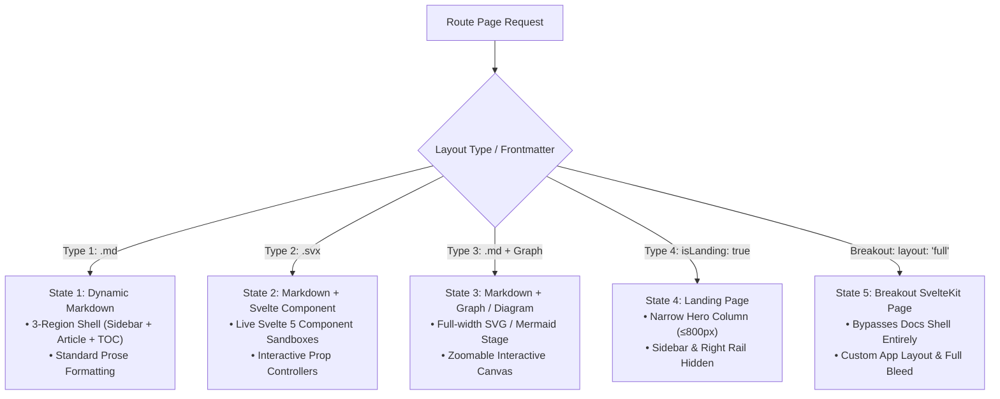

# MonoWiki State Engine & SASS Class Mapping Architecture

This specification defines the multi-state layout engine, edge case handling, and SASS preprocessor class mapping system for **MonoWiki**.

---

## 1. Multi-State Layout Engine & 4 Page Types

MonoWiki dynamically adapts its shell layout based on frontmatter flags and page states:



---

## 2. Granular Edge Case Handling

### Edge Case 1: Mixed Group Pages (Some pages in Group B have components, others do not)
Instead of forcing every page in a group to share the same layout features, MonoWiki inspects granular frontmatter flags:

```markdown
---
title: Morphicon Animation Engine
description: Icon animation loop documentation.
group: Group B
hasComponent: true    # Mounts Svelte 5 component sandbox
hasGraph: false        # Hides diagram stage
layout: docs          # Standard 3-region docs layout
---
```

```markdown
---
title: Morphicon Specifications
description: Plain spec text for Group B.
group: Group B
hasComponent: false   # Pure markdown prose (Zero Component JS)
hasGraph: true        # Renders Mermaid diagram stage
layout: docs
---
```

### Edge Case 2: Breaking Out of "Docs" View Entirely
When a page needs a full-bleed interactive application layout (bypassing sidebars, headers, and docs padding), set `layout: 'full'` or `layout: 'page'` in frontmatter:

```markdown
---
title: Interactive Monorepo Explorer
layout: full          # Bypasses DocsShell completely
---
```

SvelteKit evaluates this in `+layout.svelte`:

```svelte
<script lang="ts">
  import { page } from '$app/state';
  let layoutType = $derived(page.data.frontmatter?.layout ?? 'docs');
</script>

{#if layoutType === 'full'}
  <!-- Full Bleed Breakout Page (No Docs Shell) -->
  <main class="full-bleed-breakout">
    {@render children()}
  </main>
{:else if layoutType === 'page'}
  <!-- Single-Column Page (Header + Footer, No Sidebar/TOC) -->
  <div class="page-shell">
    {@render children()}
  </div>
{:else}
  <!-- Standard 3-Column Docs Shell -->
  <div class="docs-shell">
    <Sidebar />
    <article class="prose">{@render children()}</article>
    <TOC />
  </div>
{/if}
```

---

## 3. Blume / SVOCS CSS to Indented SASS Mapping System

To style MonoWiki using pure single-tab indented SASS (`fractals-styler` token system) without modifying fronted Blume/SVOCS class names, MonoWiki implements a **2-Layer Class Mapping Preprocessor**.

### A. Fronted Class to SASS Mapping Matrix

| Blume / SVOCS Front Class | Indented SASS Utility Mapping | Visual Result |
| :--- | :--- | :--- |
| `.appshell` | `.box.padtop128.gap32` | Top-padded flex box shell |
| `.app-header` | `.row.gap8.padbot64` | Flex row header with spacing |
| `.content` | `.docs-shell.grid-3col` | 3-column grid container |
| `.app-sidebar` | `.sidebar-box.pad16.bg-panel` | Styled left sidebar panel |
| `.doc-article` | `.markdown-body.prose` | Prose typography column |
| `.app-right` | `.toc-box.pad16` | Right-rail TOC container |

---

### B. Indented SASS Preprocessor Definition (`styles/blume-mapping.sass`)

Using single-tab indented SASS without braces or semicolons:

```sass
// MonoWiki Indented SASS Mapping Layer

.appshell
	@extend .box
	@extend .padtop128
	@extend .gap32
	background-color: var(--blume-background)
	color: var(--blume-foreground)

.app-header
	@extend .row
	@extend .gap8
	border-bottom: 1px solid var(--blume-border)

.app-sidebar
	@extend .sidebar-box
	@extend .pad16
	border-right: 1px solid var(--blume-border)
	background: var(--blume-muted)

.doc-article
	@extend .markdown-body
	@extend .prose
	max-width: var(--blume-content-width)

.app-right
	@extend .toc-box
	@extend .pad16
	border-left: 1px solid var(--blume-border)
```

---

## 4. Prototyping Tool & Visual Inspector

The interactive prototyping tool is stored at:
[`vendors/flow-maps/monowiki/monowiki-prototyper.html`](file:///Users/amrit/mandala/vendors/flow-maps/monowiki/monowiki-prototyper.html)

Open this file in a browser to:
1. Drag and nest items inside containers.
2. Toggle between the 4 page types and breakout states.
3. Annotate Blume CSS classes and inspect live indented SASS transformations.
