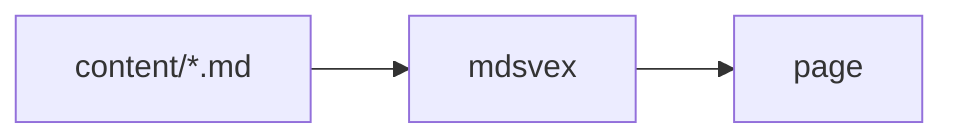

# svdocs scaffolding

SVOCS is a markdown-first documentation site generator built on SvelteKit and Svelte 5. Write plain Markdown, drop in live Svelte components exactly where you need them, and ship a fully static site with almost no client-side JavaScript.

## Why SVOCS

- `.md` files are plain prose; switch one to `.svx` and it can import and render real Svelte components inline.
- `content/` maps directly to `/docs/*` — no route config to maintain.
- Every build indexes your docs with Pagefind. Search runs in the browser, no server or API keys involved.
- Every page prerenders via `adapter-static`, and the Svelte compiler moves work to build time, so readers download very little JavaScript.
- Sidebar state, theme, and search all run on Svelte 5 runes, not legacy stores.

## How the pieces fit together

```txt
content/            Your markdown source
  _meta.json        Sidebar ordering, titles, and category labels
  getting-started.md
src/lib/core/       Content pipeline: parsing, page-map, metadata
src/lib/themes/docs/ The docs theme: sidebar, search, TOC
```

`_meta.json` is the file worth understanding first: it controls how your sidebar looks, independent of your file names. The [Navigation](/docs/navigation) guide covers it in full, including how to group pages under non-clickable category labels like the ones in this sidebar.

## Scaffold a project

The fastest way to start is the `create-svocs-docs` starter, which sets up a working SVOCS site with the same page structure as this one:

```sh filename="bun"
bunx create-svocs-docs@latest my-docs
```

```sh filename="npm"
npm create svocs-docs@latest my-docs
```

```sh filename="pnpm"
pnpm create svocs-docs my-docs
```

```sh filename="deno"
deno run -A npm:create-svocs-docs my-docs
```

```sh filename="nub"
nub x create-svocs-docs@latest my-docs
```

Answer the prompts, then start the dev server:

```sh
cd my-docs
bun install
bun run dev
```

Your new site is live at `http://localhost:5173`.

The prompts also let you set your production URL (which turns on [social preview cards](/docs/og-images), the sitemap, and absolute `llms.txt` links), add a GitHub button to the header, pick an accent color and a search backend, and, optionally, generate baseline content from an existing GitHub repo instead of the generic starter pages. See [Theming](/docs/theming) and [Repo Analysis](/docs/repo-analysis).

## Keep your site current

Scaffolds record a `.svocs.json` manifest, and the `svocs` companion CLI uses it to maintain your site after day one:

```sh
npx svocs-cli doctor   # checks SITE_URL, fonts, search config, template version
npx svocs-cli update   # applies template fixes to files you haven't modified
```

`update` never touches a file you've edited — it lists those for manual review instead. Both commands are covered on the [CLI](/docs/cli) page.

## Add a page

Every file under `content/` becomes a route. Drop a markdown file at `content/hello.md`:

```md filename="content/hello.md"
---
title: Hello
description: My first SVOCS page.
---

Hello from SVOCS.
```

Save it, and `/docs/hello` appears without any route file or registration step. The sidebar picks it up automatically, sorted alongside your other pages.

## Control the sidebar

Ordering and labels come from a `_meta.json` file next to the pages it applies to:

```json filename="content/_meta.json"
{
	"items": {
		"hello": { "title": "Hello, World", "order": 1 }
	}
}
```

`_meta.json` is also how you group pages under category headings, like "Getting Started" and "Guides" in this sidebar. See [Navigation](/docs/navigation) for the full schema.

## Build for production

```sh
bun run build
```

This prerenders every page with `adapter-static` and indexes the site with Pagefind, so `bun run preview` serves the exact static output you'll deploy. See [Deployment](/docs/deployment) for Cloudflare Pages and GitHub Pages walkthroughs.

## Next steps

- [Writing Content](/docs/writing-content) — frontmatter, sidecar metadata, GFM, code blocks
- [Components](/docs/components) — the built-in `.svx` component library
- [Theming](/docs/theming) — change the accent color, or the rest of the palette
- [Navigation](/docs/navigation) — the full `_meta.json` schema
- [Repo Analysis](/docs/repo-analysis) — generate starter content from an existing repo, heuristically or with an AI


## Scaffold a project

The fastest way to start is the `create-svocs-docs` starter, which sets up a working SVOCS site with the same page structure as this one:

```sh filename="bun"
bunx create-svocs-docs@latest my-docs
```

```sh filename="npm"
npm create svocs-docs@latest my-docs
```

```sh filename="pnpm"
pnpm create svocs-docs my-docs
```

```sh filename="deno"
deno run -A npm:create-svocs-docs my-docs
```

```sh filename="nub"
nub x create-svocs-docs@latest my-docs
```

Answer the prompts, then start the dev server:

```sh
cd my-docs
bun install
bun run dev
```

Your new site is live at `http://localhost:5173`.

The prompts also let you set your production URL (which turns on [social preview cards](/docs/og-images), the sitemap, and absolute `llms.txt` links), add a GitHub button to the header, pick an accent color and a search backend, and, optionally, generate baseline content from an existing GitHub repo instead of the generic starter pages. See [Theming](/docs/theming) and [Repo Analysis](/docs/repo-analysis).

## Keep your site current

Scaffolds record a `.svocs.json` manifest, and the `svocs` companion CLI uses it to maintain your site after day one:

```sh
npx svocs-cli doctor   # checks SITE_URL, fonts, search config, template version
npx svocs-cli update   # applies template fixes to files you haven't modified
```

`update` never touches a file you've edited — it lists those for manual review instead. Both commands are covered on the [CLI](/docs/cli) page.

## Add a page

Every file under `content/` becomes a route. Drop a markdown file at `content/hello.md`:

```md filename="content/hello.md"
---
title: Hello
description: My first SVOCS page.
---

Hello from SVOCS.
```

Save it, and `/docs/hello` appears without any route file or registration step. The sidebar picks it up automatically, sorted alongside your other pages.

## Control the sidebar

Ordering and labels come from a `_meta.json` file next to the pages it applies to:

```json filename="content/_meta.json"
{
	"items": {
		"hello": { "title": "Hello, World", "order": 1 }
	}
}
```

`_meta.json` is also how you group pages under category headings, like "Getting Started" and "Guides" in this sidebar. See [Navigation](/docs/navigation) for the full schema.

## Build for production

```sh
bun run build
```

This prerenders every page with `adapter-static` and indexes the site with Pagefind, so `bun run preview` serves the exact static output you'll deploy. See [Deployment](/docs/deployment) for Cloudflare Pages and GitHub Pages walkthroughs.

## Next steps

- [Writing Content](/docs/writing-content) — frontmatter, sidecar metadata, GFM, code blocks
- [Components](/docs/components) — the built-in `.svx` component library
- [Theming](/docs/theming) — change the accent color, or the rest of the palette
- [Navigation](/docs/navigation) — the full `_meta.json` schema
- [Repo Analysis](/docs/repo-analysis) — generate starter content from an existing repo, heuristically or with an AI


## The problem

Scaffolding a new SVOCS site gets you generic starter pages (a "Quick Start," a "Writing Content" guide) that you're expected to replace by hand. If you already have a real project with a README, `create-svocs-docs` can generate a baseline `content/` tree from that repo instead, so you're editing real pages from the start rather than deleting placeholders.

## Two modes

**Heuristic** (the default; needs no API key) fetches the repo's README and splits it along its own `##` headings. Each section becomes a page, and whatever comes before the first heading becomes the introduction. It costs nothing and stays faithful to however the repo's README is already organized.

**LLM-powered** (bring your own key for Anthropic, OpenAI, or OpenRouter) sends real repo material to a model and asks for a proper set of docs pages back: an overview plus whichever topics that material actually supports (installation, usage, configuration...), synthesized rather than mechanically split. The material is the README plus, depending on scan depth, the repo's other markdown docs, root config files, or actual source files. The output is better, at the cost of real API calls. OpenRouter routes to whichever backend the model you pick actually runs on (Anthropic, Google, open-weight models, and more), so it's the option if you want a model neither Anthropic nor OpenAI serves directly.

## Using it

The CLI asks during scaffolding:

```txt
Analyze an existing GitHub repo for a baseline docs setup? (y/N) y
GitHub repo (owner/repo or URL): owner/repo

Analysis mode:
  1) Heuristic — splits the README into pages, no API key needed (default)
  2) LLM-powered — an AI writes the docs pages (bring your own key)
```

Picking LLM-powered adds a provider prompt, then a masked key prompt. The key is typed once, used for validation plus that single analysis request, and never written to disk.

For scripted use, skip the prompts entirely:

```sh
bunx create-svocs-docs my-docs --repo=owner/repo --repo-mode=heuristic
bunx create-svocs-docs my-docs --repo=owner/repo --repo-mode=llm --llm-provider=anthropic
bunx create-svocs-docs my-docs --repo=owner/repo --repo-mode=llm --llm-provider=openrouter --llm-model=anthropic/claude-sonnet-5 --scan-depth=deep
```

The LLM key comes from `ANTHROPIC_API_KEY`/`OPENAI_API_KEY`/`OPENROUTER_API_KEY` in this non-interactive path. It's never prompted for and never read from an env var when you're answering prompts interactively, to keep the "typed once, nothing ambient" behavior simple.

## Key validation

Before spending a real analysis call, the key gets checked against the provider. The check is free, since it costs no tokens (a models-list request for Anthropic/OpenAI; OpenRouter's models list is public regardless of key validity, so it uses its key-info endpoint instead). Success shows `API key validated ✓`; a bad key shows `API key invalid ✗` and falls back to heuristic immediately, rather than failing only after the "asking the AI" step. `--llm-model=`/`--scan-depth=` skip their prompts the way flags skip every other prompt, and non-interactive runs still validate the key itself, just without asking anything.

## Model and scan depth

Once the key validates, you pick a **model**. The list is fetched live from the provider you picked rather than hardcoded, because providers ship new models faster than a static list can track (this CLI's previous curated list was already missing models by the time it shipped). Anthropic and OpenAI need the key to list models; OpenAI's raw list mixes in non-chat models (embeddings, Whisper, DALL-E, etc.), so it's filtered down to chat-capable ones. OpenRouter's catalog is public and large (300+ models across every backend it routes to), so its picker is a type-to-search list rather than a short menu. If fetching the list fails for any reason, a small offline fallback set is used instead. Either way there's also a "Custom model ID…" option for anything the list doesn't surface. `--llm-model=<id>` sets it non-interactively. For OpenRouter, model IDs are `provider/model` slugs (e.g. `anthropic/claude-sonnet-5`, `openai/gpt-5.4`), not the same string you'd pass to that provider's own native API.

Then a **scan depth**, which changes both the page budget and what repo material the model gets to write from:

| Depth                   | Pages   | Material beyond the README                                                            | How pages are generated                         |
| ----------------------- | ------- | ------------------------------------------------------------------------------------- | ----------------------------------------------- |
| Quick Scan              | 1 to 3  | the repo's other `.md` docs (root + `docs/`, e.g. `CONTRIBUTING.md`, guides)          | one call returns every page                     |
| Standard Scan (default) | 1 to 8  | quick's material + root config/manifest files (`Dockerfile`, `pyproject.toml`, CI, …) | a plan call, then one call per page             |
| Deep Scan               | 1 to 12 | the entire repo, downloaded once as a tarball                                         | a plan call, then one call per page from source |

Quick and standard fetch their extra files through the same unauthenticated GitHub endpoints as the README/`package.json` fetch, so no GitHub token is needed and no LLM-side web search or tool use is involved. Deep Scan doesn't fetch file-by-file (the unauthenticated API allows only 60 requests/hour); it downloads the repo as a single archive, indexes every text file in it, and shows the model the real file tree. The plan call then names which source files each page should be written from, so a CLI reference page gets written from the actual source in `cli/` rather than guessed at from the directory name. If the archive download fails, Deep Scan degrades to standard-depth material and says so. `--scan-depth=<quick|standard|deep>` sets it non-interactively (defaults to `standard`).

Because standard and deep generate pages one at a time, a single malformed or truncated page response only skips that page (with a warning naming it) instead of discarding the whole analysis, and the spinner reports progress per page. There's no request timeout on the generation calls themselves, since they pair with whatever model you picked, including the slowest one on any given provider. Rather than guess a cutoff that's wrong for some combination of scan depth and model, each request runs until it finishes or errors on its own; Ctrl+C cancels at any point, same as any other prompt in this CLI.

## What gets replaced

Generated pages replace **all** of the starter content (introduction, quick start, writing content, components, AI & LLMs, theming, navigation, search, deployment, about) with whatever the analysis produced, so a repo-analysis scaffold ends up entirely about the repo you pointed it at rather than a mix of your content and generic SVOCS reference pages.

## It never blocks the scaffold

Every failure mode (repo not found, GitHub rate limit, no README, a rejected key, a failed archive download, a malformed AI response) degrades one tier instead of stopping the CLI: Deep Scan falls back to standard-depth material, LLM-powered falls back to heuristic, and heuristic falls back to leaving the normal starter content in place untouched. Warnings say _why_ an AI response was rejected (truncated at the token limit, unparseable JSON, a missing field) instead of a generic "not valid". Relative links and images in the source README (`[LICENSE](LICENSE)`) are rewritten to absolute GitHub URLs rather than left pointing at paths that don't exist on the new site.

## Reference

- `packages/create-svocs-docs/lib/repo-analysis.mjs` — fetch, generation, and validation logic
- `--repo=`, `--repo-mode=`, `--llm-provider=`, `--llm-model=`, `--scan-depth=` CLI flags


## Authoring model

Use plain markdown (`.md`) for most pages, and switch to `.svx` only when a page needs a live Svelte component inline. Everything else about the two file types is identical: frontmatter, sidecars, GFM, code blocks.

## Frontmatter

Set page metadata directly in the file with YAML frontmatter; no sidecar file is required:

```md filename="content/example.md"
---
title: Example Page
description: Shown in listings and the meta description tag.
order: 5
tags: [guide]
icon: rocket
---

Your content starts here.
```

## Metadata fields

- `title`: Display title
- `description`: Optional summary for listings
- `order`: Sorting number for nav
- `tags`: Optional list for future filtering
- `icon`: Name from the curated icon set, shown in the sidebar and next to the page's `<h1>`. See [Components](/docs/components#page-icons) for the full list of names.

Pages also show a "Last updated on" date, taken from the file's most recent git commit at build time — not from filesystem timestamps, which reset on every fresh clone. There's nothing to set: commit the file and the date follows. If your CI does a shallow clone (GitHub Actions and Cloudflare default to one), most files have no reachable history and the date is simply omitted; fetch full history to get it back (`fetch-depth: 0` in the [GitHub Pages workflow](/docs/deployment/github-pages)).

## Sidecar overrides

A `name.meta.json` file next to `name.md` takes priority over frontmatter for any field it sets. That's useful when you want to tweak nav ordering without touching the prose file, or for content synced in from elsewhere:

```json filename="content/example.meta.json"
{
	"order": 1
}
```

Frontmatter still supplies everything the sidecar doesn't override. `_meta.json`, a separate folder-level file, sits above both; see [Navigation](/docs/navigation) for how that precedence works.

## Headings

Use consistent heading levels so TOC generation and anchor links are predictable.

## GFM formatting

Tables, task lists, strikethrough, and bare-URL autolinks all work out of the box:

| Feature       | Syntax         |
| ------------- | -------------- |
| Table         | pipe-delimited |
| Task list     | `- [ ] todo`   |
| Strikethrough | `~~done~~`     |

- [x] Ship GFM support
- [ ] Ship more of the roadmap

## Code blocks with a filename

Add `filename="..."` to a fence's info string to show a filename header above the code, alongside the built-in copy button every code block gets:

````md
```sh filename="deploy.sh"
echo hello
```
````

## Diagrams and math

Mermaid diagrams use a ` ```mermaid ` fence and render to inline SVG:

````md

````

Mermaid's layout engine needs a real browser, so instead of driving a headless Chromium at build time, the diagram renders in the reader's browser. The mermaid library loads lazily and only on pages that actually contain a diagram; every other page ships none of it, and builds need no browser anywhere — locally, in Docker, or in CI. Diagrams pick the dark or light theme active when the page loads.

LaTeX math uses `$inline$` and `$$block$$` syntax, rendered via KaTeX to static HTML at build time — no client-side JS ships for it:

```md
Inline: $E = mc^2$.

Block:

$$
t = \max\left(1, \left\lceil \frac{w}{200} \right\rceil\right)
$$
```

## Components

`.svx` files (not `.md`) can import and use Svelte components inline. See the [Components](/docs/components) page for the full built-in set (Callout, Tabs, Steps, Cards, Collapse, Bleed, Banner, FileTree, ImageZoom) and how to import them.

> **Watch out:** don't put inline code containing `<` or `{` in a heading — plain inline code and inline code anywhere else on the page are both fine. See [Troubleshooting](/docs/troubleshooting#a-heading-with-code-containing-a-tag-or-brace-fails-the-build) for why.


<script>
	import { resolve } from '$app/paths';
	import Callout from '$lib/components/Callout.svelte';
	import Tabs from '$lib/components/Tabs.svelte';
	import Tab from '$lib/components/Tab.svelte';
	import Steps from '$lib/components/Steps.svelte';
	import Cards from '$lib/components/Cards.svelte';
	import Card from '$lib/components/Card.svelte';
	import Collapse from '$lib/components/Collapse.svelte';
	import Bleed from '$lib/components/Bleed.svelte';
	import Banner from '$lib/components/Banner.svelte';
	import FileTree from '$lib/components/FileTree.svelte';
	import FileTreeFolder from '$lib/components/FileTreeFolder.svelte';
	import FileTreeFile from '$lib/components/FileTreeFile.svelte';
	import ImageZoom from '$lib/components/ImageZoom.svelte';
	import IconShowcase from '$lib/icons/IconShowcase.svelte';
</script>

<Banner id="components-intro">

These components ship with SVOCS. Import them from `$lib/components` in any `.svx` file.

</Banner>

## Callout

<Callout type="info">

Use `.svx` instead of `.md` for any page that needs live components.

</Callout>

<Callout type="tip">

Frontmatter and sidecar `.meta.json` both work on `.svx` files too.

</Callout>

<Callout type="warning">

Component imports only work in `.svx` — plain `.md` files can't have a script block.

</Callout>

<Callout type="danger">

Don't nest a `Callout` inside another `Callout` — styling assumes one level.

</Callout>

Import path: `$lib/components/Callout.svelte`, added at the top of the `.svx` file's script block alongside your other imports.

## Tabs

<Tabs items={['bun', 'pnpm', 'deno']}>
<Tab>

```sh
bun install
bun run dev
```

</Tab>
<Tab>

```sh
pnpm install
pnpm dev
```

</Tab>
<Tab>

```sh
deno task dev
```

</Tab>
</Tabs>

## Steps

<Steps>

### Add a markdown file

Create `content/example.md` with frontmatter or a sidecar `.meta.json`.

### Register it in the sidebar

Folders pick up ordering automatically from each page's `order` field, so a flat page needs no extra step.

### Preview it

Run `bun run dev` and visit `/docs/example`.

</Steps>

## Cards

<Cards>
	<Card title="Getting Started" href={resolve('/docs/getting-started')} icon="rocket">Bootstrap your first SVOCS site.</Card>
	<Card title="Deployment" href={resolve('/docs/deployment')} icon="globe">Ship to Cloudflare Pages or GitHub Pages.</Card>
	<Card title="GitHub" href="https://github.com" external icon="star">Source and issue tracker.</Card>
</Cards>

`Card` takes an optional `icon` prop — any name from the [page icon set](#page-icons) below.

### Auto-populated

Pass `auto` instead of children and `Cards` lists the current page's siblings — same parent, in sidebar order — pulling each one's title, description, icon, and link from the page tree. Useful on a section's landing page so its children never need to be listed twice.

<Cards auto />

_(the grid above is live — it's this page's own siblings in the sidebar)_

## Page icons

<Callout type="info">

Set `icon: <name>` in a page's frontmatter, or `icon` on a `_meta.json` item, to show one of these next to that page in the sidebar and its `<h1>`. See [Writing Content](/docs/writing-content#metadata-fields) and [Navigation](/docs/navigation#fields).

</Callout>

<IconShowcase />

Import `PageIcon` from `$lib/icons/PageIcon.svelte` directly if you want one inline in prose; everywhere else (frontmatter, `_meta.json`, the `Card` `icon` prop) just takes the name as a string.

## Collapse

<Collapse title="Why mdsvex instead of raw Markdown?">

It compiles Markdown straight to Svelte components, so `.svx` files can mix prose with live components without a separate MDX runtime.

</Collapse>

## FileTree

<FileTree>
	<FileTreeFolder name="content" open>
		<FileTreeFile name="_meta.json" />
		<FileTreeFile name="introduction.md" />
		<FileTreeFolder name="deployment" open>
			<FileTreeFile name="index.md" />
			<FileTreeFile name="_meta.json" />
		</FileTreeFolder>
	</FileTreeFolder>
	<FileTreeFile name="svelte.config.js" />
</FileTree>

## ImageZoom

Click any screenshot to open it full-size in an overlay; click again (or press Escape) to close it:

<ImageZoom src="/og-card-example.png" alt="The social preview card SVOCS generates for a page" width={1200} height={630} />

Import path: `$lib/components/ImageZoom.svelte`. Takes `src`, `alt`, and optional `width`/`height` — set those two to the source image's real dimensions so the layout doesn't shift once it loads.

## Bleed

Break wide content (a table, a diagram, a screenshot) out of the prose column's side padding:

<Bleed>

```sh filename="all-runtimes.sh"
bun install     && bun run dev
pnpm install    && pnpm dev
deno task install && deno task dev
```

_(runs across all three package managers)_

</Bleed>

That's the full component set.

## What `_meta.json` controls

Drop a `_meta.json` file in any `content/` folder (including the root) to control that folder's slice of the sidebar: order, display titles, and category grouping, independent of file names or frontmatter.

```json filename="content/_meta.json"
{
	"items": {
		"introduction": { "order": 1 },
		"getting-started": { "title": "Quick Start", "order": 2 }
	}
}
```

Each key under `items` is a file or folder name (no extension) relative to that `_meta.json`.

## Fields

- `title` — overrides the display title, in both the sidebar and on the page itself.
- `order` — a sort key. Lower sorts first. Items without an explicit order default to `999` and sort after everything that has one.
- `icon` — a name from the curated icon set (see [Components](/docs/components#page-icons)). Set here, it wins over the same page's frontmatter `icon`, so a section can standardize icons without editing every file. On a folder entry, this is also the only way to give a folder an icon when it has no index page of its own.
- `type: "separator"` — turns this entry into a non-clickable heading (see below) instead of pointing at a real file. Separators can carry an `icon` too.

## Precedence

A page's title and order can come from four places. From highest priority to lowest:

1. `_meta.json` in the page's directory
2. The page's own sidecar `name.meta.json`
3. The page's own frontmatter
4. Auto-derived from the filename (title-cased) and `order: 999`

Each field resolves independently. A page can take its `order` from `_meta.json` while its `title` still comes from frontmatter, if `_meta.json` doesn't set a title for that key. `icon` follows the same chain, except there's no auto-derived fallback — a page with no `icon` set anywhere just shows none.

This means `_meta.json` is the right place to reorganize navigation without touching content files: renaming a sidebar label, reordering pages, or moving a page into a different category is a one-line change in `_meta.json`, no matter what the page's own frontmatter says.

## Category separators

Set `type: "separator"` to inject a non-clickable heading into the sidebar at a given position. This groups pages under labels like **Getting Started** or **Guides** without those labels being real pages:

```json filename="content/_meta.json"
{
	"items": {
		"getting-started-heading": { "type": "separator", "title": "Getting Started", "order": 1 },
		"introduction": { "order": 2 },
		"getting-started": { "title": "Quick Start", "order": 3 },
		"guides-heading": { "type": "separator", "title": "Guides", "order": 4 },
		"writing-content": { "order": 5 }
	}
}
```

The separator's key (`getting-started-heading` above) doesn't need to match a real file; it only needs to be unique within that `items` map. Separators sort into the list by `order` exactly like real items, so they interleave naturally with the pages around them. This site's own sidebar is built this way — see `content/_meta.json` in the repository.

## Folders

A folder's own title and order can be set from its _parent_ directory's `_meta.json`, keyed by the folder name:

```json filename="content/_meta.json"
{
	"items": {
		"deployment": { "title": "Deploy", "order": 6 }
	}
}
```

This only applies to folders that don't resolve to a real document (no `index.md`/`index.svx` inside them). If the folder has an index page, that page's own title wins, since it's a real page with its own metadata.


## During setup

`create-svocs-docs` asks for an accent color when scaffolding a new site:

```txt
Accent color (hex): (#ff3c00) #2563eb
```

Leave it blank to keep the default ember orange, or type any hex color (non-interactively, pass `--accent=#2563eb`). Buttons, links, badges, the search dialog's focus ring, and the header glow all update to match.

## After setup

The whole palette lives in `src/routes/+layout.svelte`, in one `<style>` block with two sections: `:root[data-theme='dark']` and `:root[data-theme='light']`. Change `--accent` there any time:

```css filename="src/routes/+layout.svelte"
:root[data-theme='dark'] {
	--accent: #2563eb;
	/* ... */
}
```

`--accent-soft`, `--accent-strong`, and `--glow-a` (the ambient background glow) aren't independent colors. They're `color-mix()` expressions derived from `--accent`:

```css
--accent-soft: color-mix(in srgb, var(--accent) 78%, white);
--accent-strong: color-mix(in srgb, var(--accent) 60%, white);
--glow-a: color-mix(in srgb, var(--accent) 10%, black);
```

Changing that one line re-themes all of them together, so a custom accent never leaves the ambient glow stuck on the default orange.

## The rest of the palette

`--bg`, `--text`, `--line`, and friends are neutral tones (near-black/near-white grays) and stay independent of `--accent` on purpose: they're what make dark mode read as dark mode regardless of brand color. Adjust them directly if you want a cooler or warmer neutral base. There's no derivation to keep in sync there; each is its own literal value, dark and light set separately.

## Reading a `color-mix()` custom property from JS

If you're building something that needs the _resolved_ color (a canvas/WebGL effect, for instance), `getComputedStyle(document.documentElement).getPropertyValue('--accent-soft')` returns the literal `color-mix(...)` text, not a computed color. Resolve it by assigning the var to a real CSS property on a probe element and reading that back:

```js
const probe = document.createElement('div');
document.body.appendChild(probe);
probe.style.color = 'var(--accent-soft)';
getComputedStyle(probe).color; // "color(srgb 1 0.42 0.22)" or "rgb(255, 106, 56)"
```

Note the two possible output formats: a `color-mix()` result serializes as `color(srgb r g b)` (already 0–1 normalized) in Chromium, while a plain literal serializes as legacy `rgb(r, g, b)` (0–255). Code that consumes this needs to branch on which one it got.


