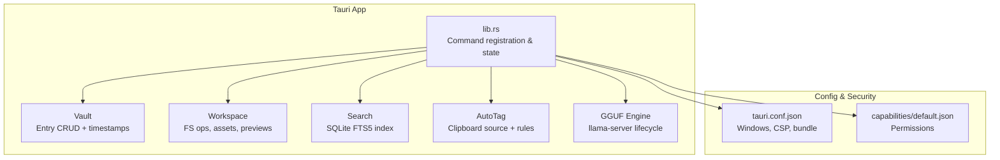
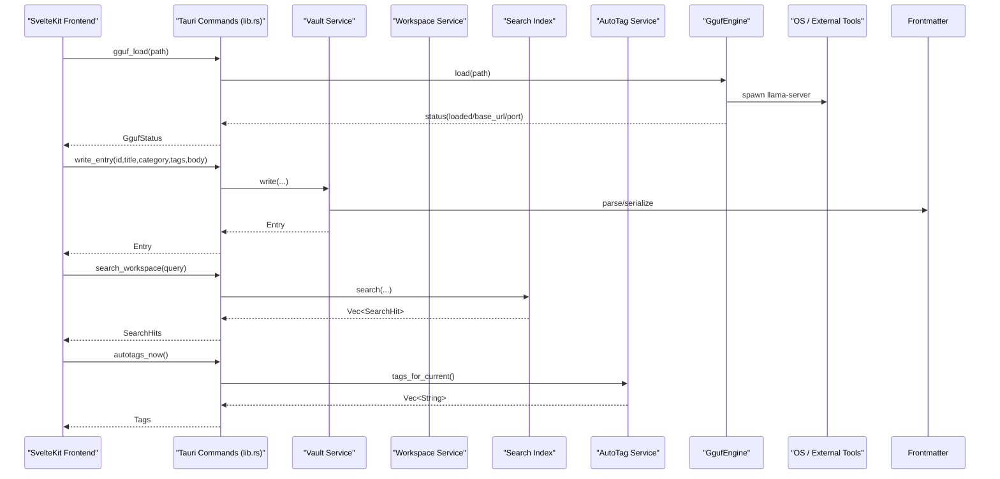
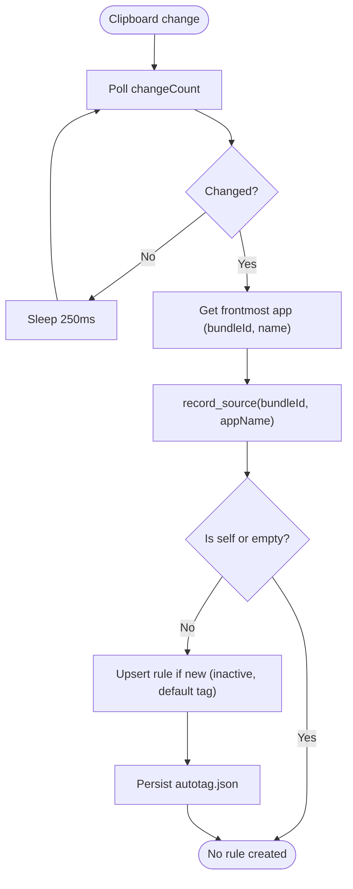
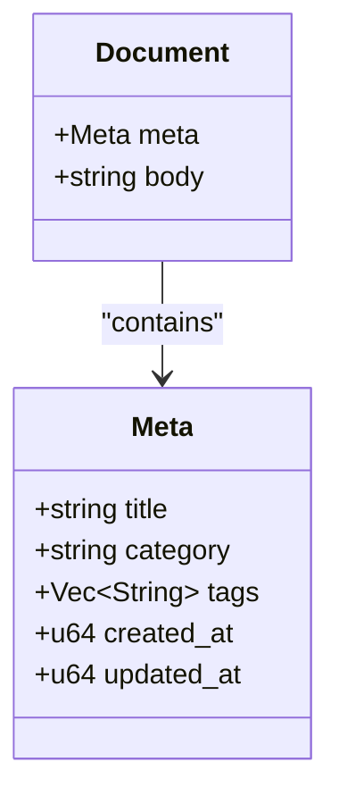
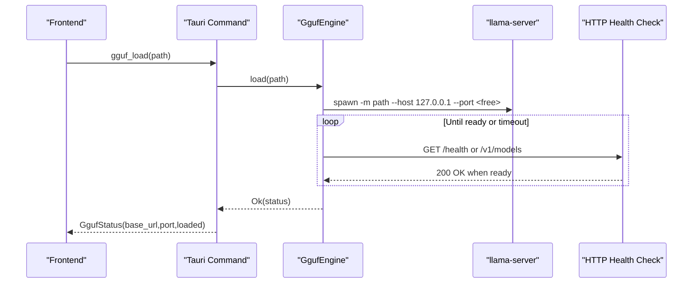
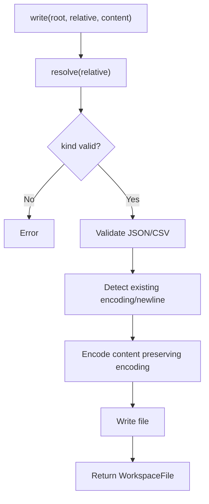
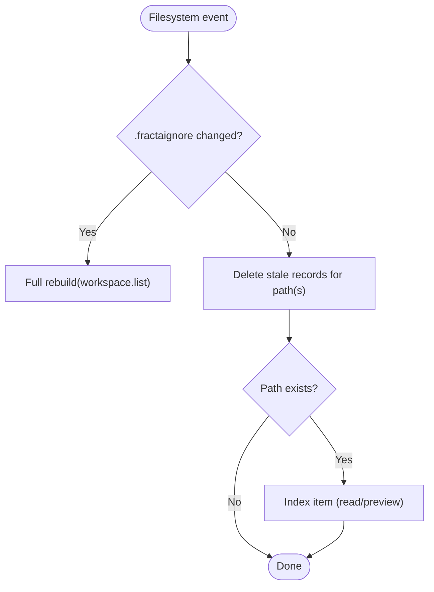
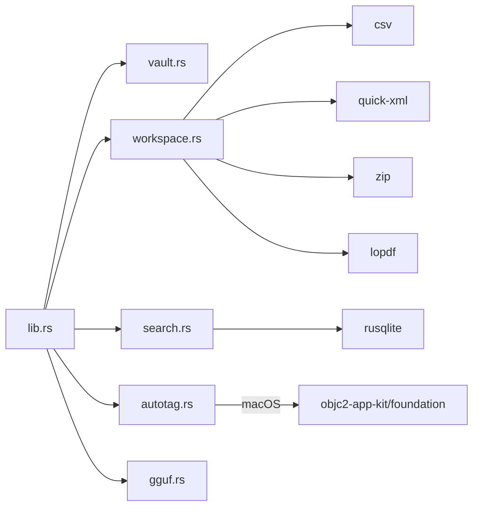

# Advanced Topics

<cite>
**Referenced Files in This Document**
- [lib.rs](file://apps/fracta/src-tauri/src/lib.rs)
- [autotag.rs](file://apps/fracta/src-tauri/src/autotag.rs)
- [frontmatter.rs](file://apps/fracta/src-tauri/src/frontmatter.rs)
- [gguf.rs](file://apps/fracta/src-tauri/src/gguf.rs)
- [vault.rs](file://apps/fracta/src-tauri/src/vault.rs)
- [workspace.rs](file://apps/fracta/src-tauri/src/workspace.rs)
- [search.rs](file://apps/fracta/src-tauri/src/search.rs)
- [Cargo.toml](file://apps/fracta/src-tauri/Cargo.toml)
- [tauri.conf.json](file://apps/fracta/src-tauri/tauri.conf.json)
- [capabilities/default.json](file://apps/fracta/src-tauri/capabilities/default.json)
</cite>

## Table of Contents
1. Introduction
2. Project Structure
3. Core Components
4. Architecture Overview
5. Detailed Component Analysis
6. Dependency Analysis
7. Performance Considerations
8. Troubleshooting Guide
9. Conclusion

## Introduction
This document covers advanced topics for the Fracta Tauri application, focusing on performance optimization, security best practices, plugin development and extension mechanisms, and sophisticated features such as auto-tagging rules, GGUF-based local AI model integration, frontmatter processing, and custom Tauri plugins. It provides conceptual overviews for beginners and technical details for experienced developers implementing complex functionality across desktop and mobile platforms.

## Project Structure
The Fracta backend is implemented in Rust under apps/fracta/src-tauri. The main entrypoint registers Tauri commands, manages stateful services (Vault, AutoTag, GgufEngine), and wires up platform-specific behaviors. Key modules:
- Vault: file-backed Markdown entries with frontmatter parsing and safe path handling
- Workspace: recursive project operations, asset handling, CSV/JSON conversion, PDF/DOCX preview
- Search: SQLite FTS5 index scoped to config directory
- AutoTag: clipboard source attribution and rule-based tag injection
- GGUF Engine: local llama-server lifecycle management for .gguf models
- Tauri configuration and capabilities define app windows, CSP, and permissions

**Diagram sources**
- [lib.rs](file://apps/fracta/src-tauri/src/lib.rs)
- [vault.rs](file://apps/fracta/src-tauri/src/vault.rs)
- [workspace.rs](file://apps/fracta/src-tauri/src/workspace.rs)
- [search.rs](file://apps/fracta/src-tauri/src/search.rs)
- [autotag.rs](file://apps/fracta/src-tauri/src/autotag.rs)
- [gguf.rs](file://apps/fracta/src-tauri/src/gguf.rs)
- [tauri.conf.json](file://apps/fracta/src-tauri/tauri.conf.json)
- [capabilities/default.json](file://apps/fracta/src-tauri/capabilities/default.json)

**Section sources**
- [lib.rs](file://apps/fracta/src-tauri/src/lib.rs)
- [Cargo.toml](file://apps/fracta/src-tauri/Cargo.toml)
- [tauri.conf.json](file://apps/fracta/src-tauri/tauri.conf.json)
- [capabilities/default.json](file://apps/fracta/src-tauri/capabilities/default.json)

## Core Components
- Vault: Manages a user-selected folder of Markdown entries. Provides create/read/update/delete operations with safe id-to-path resolution and timestamp derivation from filesystem metadata and frontmatter.
- Workspace: Exposes safe, recursive project operations including listing, reading/writing text files with encoding preservation, asset accessors for images/media, DOCX/PDF preview, CSV/JSON conversions, and link/graph analysis.
- Search: Maintains an in-config SQLite FTS5 index for fast full-text search across workspace content, with incremental updates based on filesystem events.
- AutoTag: Observes clipboard changes (macOS) to attribute source applications and applies active rules to inject tags when pasting into entries.
- GGUF Engine: Spawns and manages a local llama-server process bound to localhost, exposing an OpenAI-compatible base URL for streaming chat using locally hosted .gguf models.

**Section sources**
- [vault.rs](file://apps/fracta/src-tauri/src/vault.rs)
- [workspace.rs](file://apps/fracta/src-tauri/src/workspace.rs)
- [search.rs](file://apps/fracta/src-tauri/src/search.rs)
- [autotag.rs](file://apps/fracta/src-tauri/src/autotag.rs)
- [gguf.rs](file://apps/fracta/src-tauri/src/gguf.rs)

## Architecture Overview
The Tauri app exposes commands to the SvelteKit frontend. Commands are backed by stateful services managed via Tauri’s State API. Platform-specific watchers (clipboard source detection) run in background threads. Local model inference uses a subprocess with health checks and resource guards.

**Diagram sources**
- [lib.rs](file://apps/fracta/src-tauri/src/lib.rs)
- [gguf.rs](file://apps/fracta/src-tauri/src/gguf.rs)
- [vault.rs](file://apps/fracta/src-tauri/src/vault.rs)
- [frontmatter.rs](file://apps/fracta/src-tauri/src/frontmatter.rs)
- [search.rs](file://apps/fracta/src-tauri/src/search.rs)
- [autotag.rs](file://apps/fracta/src-tauri/src/autotag.rs)

## Detailed Component Analysis

### Auto-Tagging Rules
Auto-tagging attributes clipboard content to the originating application and merges tags from active rules when creating or editing entries. On macOS, a background watcher polls NSPasteboard.changeCount and reads the frontmost app via NSWorkspace. Newly seen apps are registered as inactive rules with a default tag derived from the app name or bundle id. Users can rename tags and toggle activation; rules persist in autotag.json within the app config directory.

**Diagram sources**
- [autotag.rs](file://apps/fracta/src-tauri/src/autotag.rs)

**Section sources**
- [autotag.rs](file://apps/fracta/src-tauri/src/autotag.rs)
- [lib.rs](file://apps/fracta/src-tauri/src/lib.rs)

### Frontmatter Processing
Frontmatter parsing is intentionally hand-rolled to be permissive on read and strict on write. It supports flow sequences, block sequences, and scalar quoting semantics. Titles are derived from the first meaningful line when unspecified, with legacy auto-title compatibility. Serialization omits empty optional fields to keep files clean.

**Diagram sources**
- [frontmatter.rs](file://apps/fracta/src-tauri/src/frontmatter.rs)

**Section sources**
- [frontmatter.rs](file://apps/fracta/src-tauri/src/frontmatter.rs)
- [vault.rs](file://apps/fracta/src-tauri/src/vault.rs)

### GGUF Model Integration
The GGUF engine locates llama-server, spawns it with a selected .gguf model, binds to localhost, and waits until health endpoints respond. It exposes status, load, and unload commands. Errors include missing binaries, invalid models, memory constraints, and timeouts.

**Diagram sources**
- [gguf.rs](file://apps/fracta/src-tauri/src/gguf.rs)
- [lib.rs](file://apps/fracta/src-tauri/src/lib.rs)

**Section sources**
- [gguf.rs](file://apps/fracta/src-tauri/src/gguf.rs)
- [lib.rs](file://apps/fracta/src-tauri/src/lib.rs)

### Workspace Operations and Asset Handling
Workspace operations enforce path safety, ignore patterns, symlink containment, and size limits for inline media. Text encodings (UTF-8, UTF-8 BOM, UTF-16LE/BE) are preserved round-trip. CSV/JSON validation ensures data integrity. PDF and DOCX previews extract text locally without exposing host paths.

**Diagram sources**
- [workspace.rs](file://apps/fracta/src-tauri/src/workspace.rs)

**Section sources**
- [workspace.rs](file://apps/fracta/src-tauri/src/workspace.rs)

### Search Indexing and Incremental Updates
A SQLite FTS5 virtual table indexes path, title, metadata, and body. Rebuild scans the workspace; update_paths handles deletions and re-indexes affected directories or files. Queries use BM25 scoring and snippet extraction.

**Diagram sources**
- [search.rs](file://apps/fracta/src-tauri/src/search.rs)

**Section sources**
- [search.rs](file://apps/fracta/src-tauri/src/search.rs)

## Dependency Analysis
The Rust backend depends on Tauri for IPC, rusqlite for indexing, notify for filesystem watching, rfd for native dialogs, and platform-specific objc bindings on macOS for clipboard/source detection. Cargo feature flags isolate macOS-only code.

**Diagram sources**
- [lib.rs](file://apps/fracta/src-tauri/src/lib.rs)
- [Cargo.toml](file://apps/fracta/src-tauri/Cargo.toml)

**Section sources**
- [Cargo.toml](file://apps/fracta/src-tauri/Cargo.toml)
- [lib.rs](file://apps/fracta/src-tauri/src/lib.rs)

## Performance Considerations
- Indexing and search: Use incremental updates to avoid full rebuilds; leverage FTS5 BM25 scoring and limit results.
- File I/O: Preserve encodings and newline conventions to prevent unnecessary re-encoding; batch writes where possible.
- Media assets: Enforce size limits for inline media to avoid large allocations; stream or externalize very large files.
- Model loading: Time out long loads; reuse ports and kill stale processes; prefer smaller quantized models for faster startup.
- Watchers: Debounce frequent filesystem events; only re-index affected paths.
- Memory: Avoid holding large buffers in memory; use streaming readers for stderr/stdout and bounded output sizes.

[No sources needed since this section provides general guidance]

## Troubleshooting Guide
- GGUF not found: Ensure llama-server is installed and discoverable via PATH or environment variable; restart the app after installation.
- Load timeout: Large or corrupted models may fail to initialize; verify model integrity and available memory.
- Search returns stale results: Trigger rebuild or ensure .fractaignore changes propagate; check that update_paths receives correct paths.
- CSV/JSON errors: Validate headers and quotes; ensure consistent delimiters for CSV and well-formed JSON.
- Encoding issues: Confirm files use supported encodings (UTF-8, UTF-8 BOM, UTF-16LE/BE); unsupported encodings will be read-only.
- Auto-tag rules not applied: Verify the rule is active and the current clipboard source matches the rule’s bundle id.

**Section sources**
- [gguf.rs](file://apps/fracta/src-tauri/src/gguf.rs)
- [search.rs](file://apps/fracta/src-tauri/src/search.rs)
- [workspace.rs](file://apps/fracta/src-tauri/src/workspace.rs)
- [autotag.rs](file://apps/fracta/src-tauri/src/autotag.rs)

## Conclusion
Fracta’s advanced features combine robust Rust backends with Tauri IPC to deliver secure, performant, and extensible functionality. Auto-tagging enhances productivity, frontmatter processing ensures reliable metadata handling, workspace operations provide safe and rich file interactions, and GGUF integration enables powerful local AI workflows. By following the performance and security recommendations outlined here, developers can build sophisticated extensions and plugins while maintaining stability across platforms.