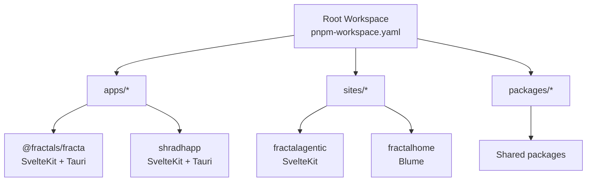
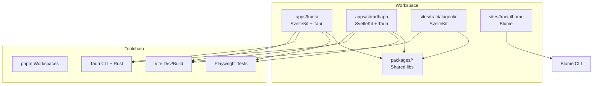
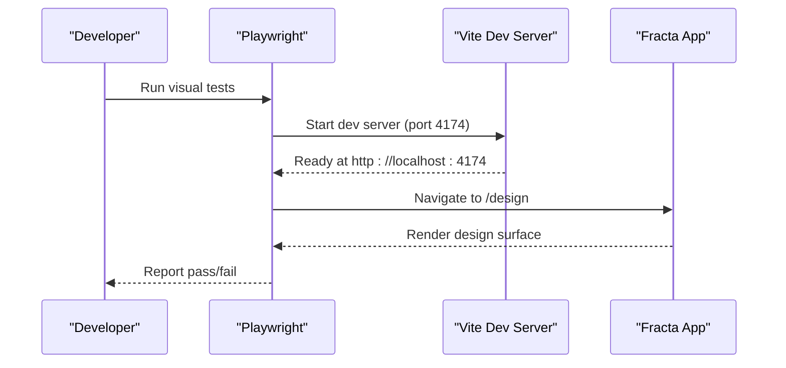
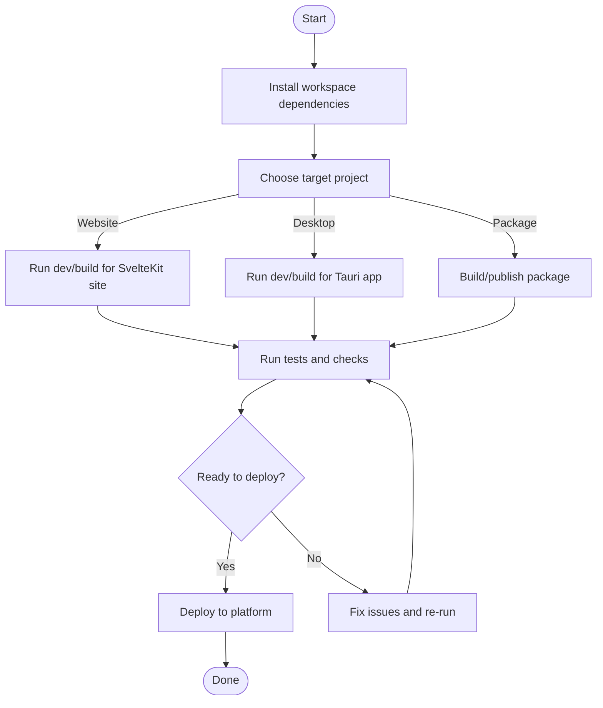
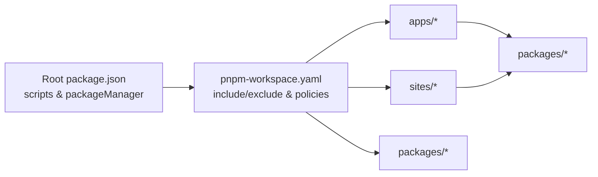

# Development Workflow

<cite>
**Referenced Files in This Document**
- [package.json](file://package.json)
- [pnpm-workspace.yaml](file://pnpm-workspace.yaml)
- [README.md](file://README.md)
- [apps/fracta/package.json](file://apps/fracta/package.json)
- [apps/shradhapp/package.json](file://apps/shradhapp/package.json)
- [sites/fractalagentic/package.json](file://sites/fractalagentic/package.json)
- [apps/fracta/playwright.config.ts](file://apps/fracta/playwright.config.ts)
- [apps/fracta/src-tauri/Cargo.toml](file://apps/fracta/src-tauri/Cargo.toml)
- [apps/fracta/src-tauri/tauri.conf.json](file://apps/fracta/src-tauri/tauri.conf.json)
</cite>

## Table of Contents
1. [Introduction](#introduction)
2. [Project Structure](#project-structure)
3. [Core Components](#core-components)
4. [Architecture Overview](#architecture-overview)
5. [Detailed Component Analysis](#detailed-component-analysis)
6. [Dependency Analysis](#dependency-analysis)
7. [Performance Considerations](#performance-considerations)
8. [Troubleshooting Guide](#troubleshooting-guide)
9. [Conclusion](#conclusion)

## Introduction
This document explains the development workflow for a pnpm monorepo that hosts multiple SvelteKit sites, Tauri desktop apps, and shared packages. It covers how to work with pnpm workspaces, manage dependencies consistently, run builds and tests, and deploy different project types (desktop apps, websites, packages). The content blends conceptual guidance for newcomers with practical commands and configuration details for experienced developers optimizing their workflow.

Key principles:
- Use the root pnpm-lock.yaml as the canonical lockfile across the workspace.
- Keep tooling consistent via workspace-level overrides and allowlists.
- Treat each app/site/package as an independent unit with its own scripts while leveraging shared tooling from the workspace.

**Section sources**
- [README.md:1-50](file://README.md#L1-L50)
- [pnpm-workspace.yaml:1-30](file://pnpm-workspace.yaml#L1-L30)

## Project Structure
The repository is organized into three primary areas:
- apps/: Desktop applications built with SvelteKit + Tauri (Rust backend).
- sites/: Static or SSR websites built with SvelteKit (and one Blume-based site).
- packages/: Shared libraries and components consumed by apps and sites.

Workspace membership is declared at the root, enabling unified dependency management and cross-package references.

**Diagram sources**
- [pnpm-workspace.yaml:1-30](file://pnpm-workspace.yaml#L1-L30)

**Section sources**
- [pnpm-workspace.yaml:1-30](file://pnpm-workspace.yaml#L1-L30)
- [README.md:1-50](file://README.md#L1-L50)

## Core Components
- Workspace definition and policies:
  - Workspace includes apps/*, sites/*, packages/*; excludes specific Bun workspaces intentionally.
  - Allowlist for native build dependencies and security overrides pinned at the root.
- App-level scripts:
  - Each app defines dev/build/preview/test commands tailored to its stack (Vite, Playwright, Tauri).
- Site-level scripts:
  - SvelteKit sites use Vite-based workflows; one site uses Blume for wiki-style generation.
- Package-level scripts:
  - Packages expose standard publishable artifacts consumed by apps/sites.

Practical implications:
- Run workspace-wide commands using pnpm --filter to target specific projects.
- Enforce consistent tool versions via workspace overrides and packageManager field.
- Centralize security posture through strictDepBuilds and overrides.

**Section sources**
- [pnpm-workspace.yaml:1-30](file://pnpm-workspace.yaml#L1-L30)
- [package.json:1-36](file://package.json#L1-L36)

## Architecture Overview
The development architecture spans three layers:
- Frontend layer: SvelteKit apps/sites powered by Vite for fast dev and optimized builds.
- Native layer: Tauri Rust crates provide OS-level capabilities for desktop apps.
- Shared layer: packages/ provide reusable UI components and utilities.

**Diagram sources**
- [apps/fracta/package.json:1-60](file://apps/fracta/package.json#L1-L60)
- [apps/shradhapp/package.json:1-48](file://apps/shradhapp/package.json#L1-L48)
- [sites/fractalagentic/package.json:1-59](file://sites/fractalagentic/package.json#L1-L59)
- [apps/fracta/playwright.config.ts:1-22](file://apps/fracta/playwright.config.ts#L1-L22)
- [apps/fracta/src-tauri/Cargo.toml:1-44](file://apps/fracta/src-tauri/Cargo.toml#L1-L44)
- [apps/fracta/src-tauri/tauri.conf.json:1-48](file://apps/fracta/src-tauri/tauri.conf.json#L1-L48)

## Detailed Component Analysis

### Monorepo Management with pnpm Workspaces
- Workspace membership:
  - apps/*, sites/*, packages/* are included; certain Bun workspaces are excluded.
- Build policy:
  - allowBuilds enables specific native modules; sharp is blocked by policy.
- Security:
  - strictDepBuilds=false keeps untrusted scripts blocked; CI will still fail on errors.
  - Overrides pin vulnerable transitive dependencies at the root.

How to work with it:
- Install dependencies once at the root; pnpm hoists and links packages across the workspace.
- Use pnpm --filter to run commands in a specific package.
- Reference internal packages by name (as defined in their package.json) from other packages/apps/sites.

**Section sources**
- [pnpm-workspace.yaml:1-30](file://pnpm-workspace.yaml#L1-L30)
- [package.json:1-36](file://package.json#L1-L36)

### Building Websites (SvelteKit)
- Typical scripts:
  - dev: starts Vite dev server with HMR.
  - build: produces static or SSR output depending on adapter configuration.
  - preview: serves the built output locally.
- Post-build tasks:
  - Some sites run search indexing and OG image generation after build.

Recommended flow:
- Run dev for local iteration.
- Run check to sync and type-check before committing.
- Run build to produce deployment-ready assets.

**Section sources**
- [sites/fractalagentic/package.json:1-59](file://sites/fractalagentic/package.json#L1-L59)

### Building Desktop Apps (SvelteKit + Tauri)
- Frontend:
  - Vite dev/build commands mirror website flows.
- Backend:
  - Tauri CLI orchestrates Rust compilation and bundling.
  - Cargo manifest defines dependencies and targets.
- Configuration:
  - tauri.conf.json sets window properties, CSP, frontendDist, and build hooks.

Development flow:
- Start Tauri dev mode to run both Vite and Rust in watch mode.
- Build desktop binaries targeting all platforms or specific ones.

**Section sources**
- [apps/fracta/package.json:1-60](file://apps/fracta/package.json#L1-L60)
- [apps/fracta/src-tauri/Cargo.toml:1-44](file://apps/fracta/src-tauri/Cargo.toml#L1-L44)
- [apps/fracta/src-tauri/tauri.conf.json:1-48](file://apps/fracta/src-tauri/tauri.conf.json#L1-L48)

### Testing Strategies
- Visual regression testing:
  - Playwright configured to launch a dev server and test against a stable URL.
  - Targets a single browser project for deterministic results.
- Markdown and utility tests:
  - TypeScript-based tests validate markdown parsing, JSON trees, and motion behavior.
- Rust tests:
  - cargo test runs within the Tauri crate.

Recommended flow:
- Run visual tests against a running dev server.
- Execute unit tests for markdown, JSON, and hygiene checks.
- Run cargo clippy and tests for Rust code quality.

**Diagram sources**
- [apps/fracta/playwright.config.ts:1-22](file://apps/fracta/playwright.config.ts#L1-L22)

**Section sources**
- [apps/fracta/package.json:1-60](file://apps/fracta/package.json#L1-L60)
- [apps/fracta/playwright.config.ts:1-22](file://apps/fracta/playwright.config.ts#L1-L22)

### Deployment Procedures
- Websites (SvelteKit):
  - Build outputs can be deployed to static hosting or serverless platforms using adapters.
  - Post-build steps may include search indexing and metadata generation.
- Desktop apps (Tauri):
  - Build bundles for all targets or specific platforms; icons and metadata are packaged per config.
- Packages:
  - Publish artifacts produced by package-specific build scripts.

Best practices:
- Pin tool versions via packageManager at the workspace root.
- Ensure environment variables are provided securely in CI/CD.
- Validate builds locally before pushing to CI.

**Section sources**
- [sites/fractalagentic/package.json:1-59](file://sites/fractalagentic/package.json#L1-L59)
- [apps/fracta/src-tauri/tauri.conf.json:1-48](file://apps/fracta/src-tauri/tauri.conf.json#L1-L48)

### Conceptual Overview
Monorepos centralize related codebases to improve collaboration and consistency. In this repo:
- Shared packages reduce duplication and enforce common patterns.
- Unified tooling ensures consistent developer experience across apps and sites.
- Workspace policies protect against risky dependencies and enforce security.

[No sources needed since this diagram shows conceptual workflow, not actual code structure]

## Dependency Analysis
Workspace-level dependency management ensures:
- Consistent versions across projects via hoisting and linking.
- Security hardening through overrides and allowlists.
- Controlled native builds for performance-critical modules.

**Diagram sources**
- [package.json:1-36](file://package.json#L1-L36)
- [pnpm-workspace.yaml:1-30](file://pnpm-workspace.yaml#L1-L30)

**Section sources**
- [package.json:1-36](file://package.json#L1-L36)
- [pnpm-workspace.yaml:1-30](file://pnpm-workspace.yaml#L1-L30)

## Performance Considerations
- Use pnpm’s efficient installation and linking to speed up installs and rebuilds.
- Leverage Vite’s HMR during development for rapid feedback.
- Limit native builds to necessary modules; keep allowlists minimal.
- Prefer static builds where possible to reduce runtime overhead.
- Cache dependencies and build artifacts in CI to accelerate pipelines.

[No sources needed since this section provides general guidance]

## Troubleshooting Guide
Common issues and resolutions:
- Dependency install failures:
  - Check allowBuilds and strictDepBuilds settings; ensure required native modules are permitted.
  - Verify workspace overrides for known vulnerabilities.
- Dev server not starting:
  - Confirm port availability and correct baseURL in test configs.
  - Ensure vite dev command matches expected host/port.
- Tauri build errors:
  - Validate Cargo.toml dependencies and features.
  - Review tauri.conf.json paths and hooks.
- Type checking failures:
  - Run svelte-kit sync and svelte-check with tsconfig path.

**Section sources**
- [pnpm-workspace.yaml:1-30](file://pnpm-workspace.yaml#L1-L30)
- [apps/fracta/playwright.config.ts:1-22](file://apps/fracta/playwright.config.ts#L1-L22)
- [apps/fracta/src-tauri/Cargo.toml:1-44](file://apps/fracta/src-tauri/Cargo.toml#L1-L44)
- [apps/fracta/src-tauri/tauri.conf.json:1-48](file://apps/fracta/src-tauri/tauri.conf.json#L1-L48)

## Conclusion
This monorepo leverages pnpm workspaces to unify development across SvelteKit websites, Tauri desktop apps, and shared packages. By centralizing configuration, enforcing security policies, and standardizing scripts, teams can iterate quickly and ship reliably. Follow the recommended flows for dev, test, and build, and use workspace tools to maintain consistency and performance across the entire codebase.

[No sources needed since this section summarizes without analyzing specific files]