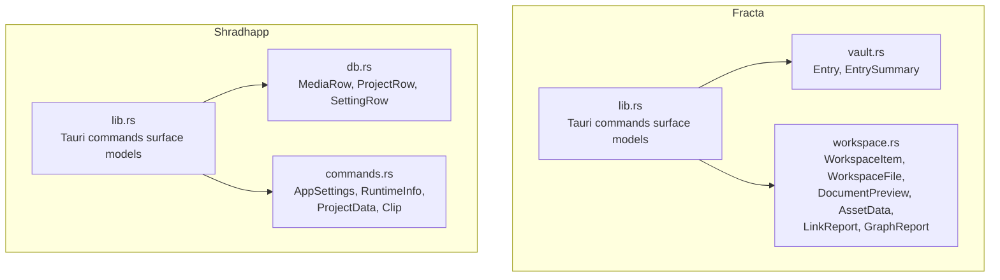
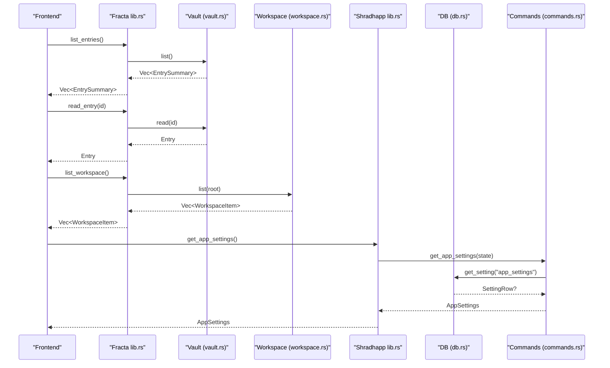
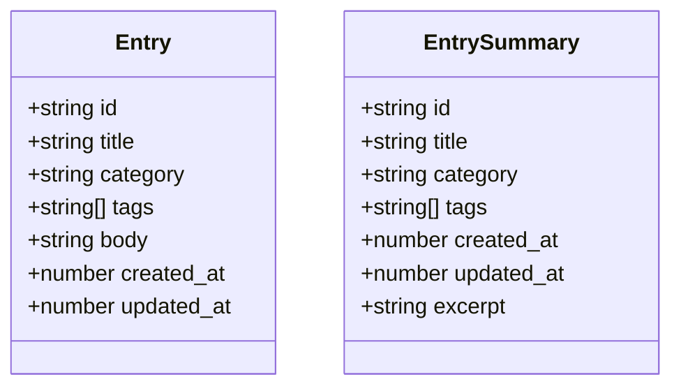
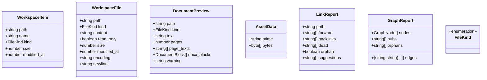
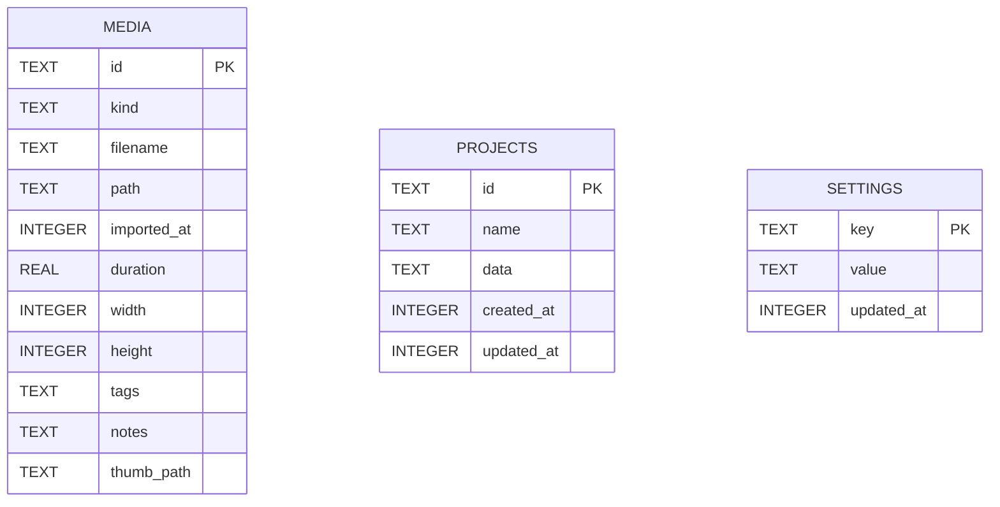
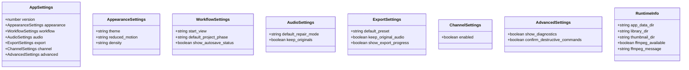
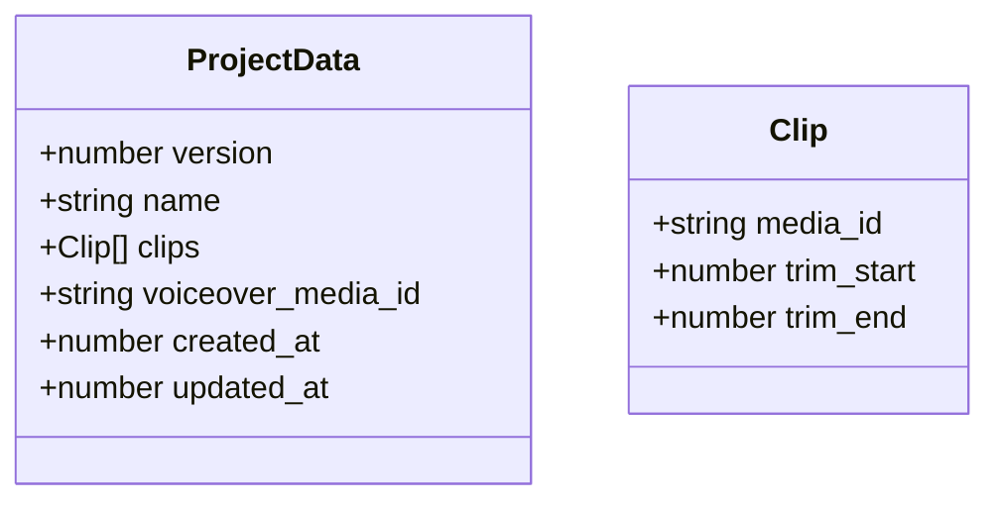
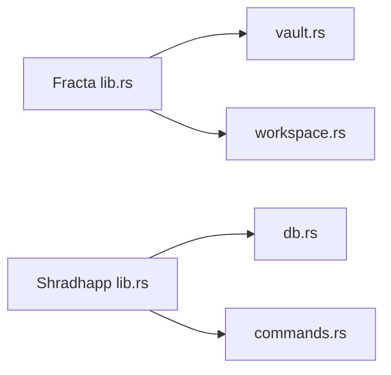

# Data Models & Schemas

<cite>
**Referenced Files in This Document**
- [lib.rs](file://apps/fracta/src-tauri/src/lib.rs)
- [vault.rs](file://apps/fracta/src-tauri/src/vault.rs)
- [workspace.rs](file://apps/fracta/src-tauri/src/workspace.rs)
- [db.rs](file://apps/shradhapp/src-tauri/src/db.rs)
- [commands.rs](file://apps/shradhapp/src-tauri/src/commands.rs)
- [lib.rs (shradhapp)](file://apps/shradhapp/src-tauri/src/lib.rs)
</cite>

## Table of Contents
1. Introduction
2. Project Structure
3. Core Components
4. Architecture Overview
5. Detailed Component Analysis
6. Dependency Analysis
7. Performance Considerations
8. Troubleshooting Guide
9. Conclusion

## Introduction
This document provides a comprehensive data model and schema reference for the structured types used across the applications in this repository. It focuses on:
- Entry and EntrySummary (Fracta vault entries)
- WorkspaceItem and related workspace models (Fracta project workspace)
- MediaRow, ProjectRow, SettingRow (Shradhapp media bank and projects)
- AppSettings and related settings structures (Shradhapp configuration)
- Serialization formats, validation rules, and migration strategies
- Database schema diagrams and entity relationships

The goal is to make these data contracts clear for developers integrating with or extending the Tauri backends and their frontends.

## Project Structure
The data models are defined in Rust modules exposed via Tauri commands:
- Fracta: Vault and Workspace modules define entry and workspace models.
- Shradhapp: SQLite-backed database module defines media, project, and settings models; commands expose typed DTOs for settings and runtime info.

**Diagram sources**
- [lib.rs](file://apps/fracta/src-tauri/src/lib.rs)
- [vault.rs](file://apps/fracta/src-tauri/src/vault.rs)
- [workspace.rs](file://apps/fracta/src-tauri/src/workspace.rs)
- [db.rs](file://apps/shradhapp/src-tauri/src/db.rs)
- [commands.rs](file://apps/shradhapp/src-tauri/src/commands.rs)
- [lib.rs (shradhapp)](file://apps/shradhapp/src-tauri/src/lib.rs)

**Section sources**
- [lib.rs](file://apps/fracta/src-tauri/src/lib.rs)
- [vault.rs](file://apps/fracta/src-tauri/src/vault.rs)
- [workspace.rs](file://apps/fracta/src-tauri/src/workspace.rs)
- [db.rs](file://apps/shradhapp/src-tauri/src/db.rs)
- [commands.rs](file://apps/shradhapp/src-tauri/src/commands.rs)
- [lib.rs (shradhapp)](file://apps/shradhapp/src-tauri/src/lib.rs)

## Core Components
This section summarizes the primary data structures and their roles.

- Entry and EntrySummary (Fracta vault)
  - Entry: Full representation of a markdown-based note including metadata and body.
  - EntrySummary: Lightweight listing view without body content.

- Workspace models (Fracta project workspace)
  - WorkspaceItem: File/folder entry in the workspace tree.
  - WorkspaceFile: Readable file content with encoding/newline hints.
  - DocumentPreview: Extracted text for PDF/DOCX previews.
  - AssetData: Binary asset payload with MIME type.
  - LinkReport, GraphReport: Link analysis and graph summary.

- Shradhapp persistence models
  - MediaRow: Media asset record with tags and thumbnails.
  - ProjectRow: Versioned project definition stored as JSON.
  - SettingRow: Key-value application settings.

- Shradhapp settings DTOs
  - AppSettings and nested settings structures for appearance, workflow, audio, export, channel, advanced options.
  - RuntimeInfo: Environment and FFmpeg availability.

**Section sources**
- [vault.rs](file://apps/fracta/src-tauri/src/vault.rs)
- [workspace.rs](file://apps/fracta/src-tauri/src/workspace.rs)
- [db.rs](file://apps/shradhapp/src-tauri/src/db.rs)
- [commands.rs](file://apps/shradhapp/src-tauri/src/commands.rs)

## Architecture Overview
The Tauri backend exposes typed commands that serialize/deserialize the above models over IPC. Frontend components call these commands and render the returned structures.

**Diagram sources**
- [lib.rs](file://apps/fracta/src-tauri/src/lib.rs)
- [vault.rs](file://apps/fracta/src-tauri/src/vault.rs)
- [workspace.rs](file://apps/fracta/src-tauri/src/workspace.rs)
- [lib.rs (shradhapp)](file://apps/shradhapp/src-tauri/src/lib.rs)
- [db.rs](file://apps/shradhapp/src-tauri/src/db.rs)
- [commands.rs](file://apps/shradhapp/src-tauri/src/commands.rs)

## Detailed Component Analysis

### Fracta Vault Models: Entry and EntrySummary
- Entry fields:
  - id: String — stable file stem identifier
  - title: String — derived or explicit
  - category: String
  - tags: Vec<String>
  - body: String
  - created_at: u64 — milliseconds since epoch
  - updated_at: u64 — milliseconds since epoch
- EntrySummary fields:
  - id, title, category, tags, created_at, updated_at
  - excerpt: String — first non-empty line trimmed

Validation and behavior:
- Id validation rejects path traversal characters and empty names.
- Timestamps prefer frontmatter values when present; otherwise fall back to filesystem timestamps.
- Title derivation from body if auto-title marker detected.

Serialization:
- JSON via serde; timestamps are numeric.

Migration strategy:
- Backward-compatible reading of existing .md files with optional frontmatter keys.
- If created_at missing, inferred from filesystem creation time.

**Diagram sources**
- [vault.rs](file://apps/fracta/src-tauri/src/vault.rs)

**Section sources**
- [vault.rs](file://apps/fracta/src-tauri/src/vault.rs)

### Fracta Workspace Models
- WorkspaceItem:
  - path: String — relative to workspace root
  - name: String — display name
  - kind: FileKind enum
  - size: u64
  - modified_at: u64
- WorkspaceFile:
  - path, kind, content (optional), read_only, size, modified_at
  - encoding (optional): utf-8, utf-8-bom, utf-16le, utf-16be
  - newline (optional): lf, crlf, cr
- DocumentPreview:
  - path, kind, text, pages (optional), page_texts (optional), docx_blocks (optional), warning (optional)
- AssetData:
  - mime: String
  - bytes: Vec<u8>
- LinkReport:
  - path, forward/backlinks/dead/suggestions arrays, orphan flag
- GraphReport:
  - nodes, edges, hubs, orphans

Validation and behavior:
- Path resolution enforces containment within workspace root; symlinks outside are rejected.
- Text encodings preserved round-trip for supported sets; unsupported encodings are read-only.
- CSV validation includes delimiter detection and quote balancing.
- JSON write validates syntax before saving.
- PDF/DOCX preview extracts text locally; warnings indicate limitations.

Serialization:
- JSON via serde; enums use snake_case for FileKind.

Migration strategy:
- Workspace operations are additive and safe; ignore patterns (.fractaignore) control visibility.

**Diagram sources**
- [workspace.rs](file://apps/fracta/src-tauri/src/workspace.rs)

**Section sources**
- [workspace.rs](file://apps/fracta/src-tauri/src/workspace.rs)

### Shradhapp Database Models and Schema
- MediaRow:
  - id: String (PK)
  - kind: String ("video" | "image" | "audio")
  - filename: String
  - path: String
  - imported_at: i64 (epoch millis)
  - duration: Option<f64>
  - width: Option<i64>
  - height: Option<i64>
  - tags: Vec<String> (stored as JSON array)
  - notes: String
  - thumb_path: Option<String>
- ProjectRow:
  - id: String (PK)
  - name: String
  - data: String (versioned ProjectData JSON)
  - created_at: i64
  - updated_at: i64
- SettingRow:
  - key: String (PK)
  - value: String
  - updated_at: i64

Database schema:
- Tables: media, projects, settings
- WAL journal mode enabled for concurrency.

**Diagram sources**
- [db.rs](file://apps/shradhapp/src-tauri/src/db.rs)

**Section sources**
- [db.rs](file://apps/shradhapp/src-tauri/src/db.rs)

### Shradhapp Settings DTOs
- AppSettings:
  - version: u32
  - appearance: AppearanceSettings
  - workflow: WorkflowSettings
  - audio: AudioSettings
  - export: ExportSettings
  - channel: ChannelSettings
  - advanced: AdvancedSettings
- Nested settings include theme, density, start_view, default_project_phase, repair modes, presets, toggles.
- RuntimeInfo:
  - app_data_dir, library_dir, thumbnail_dir, ffmpeg_available, ffmpeg_message

Validation and normalization:
- Settings normalized against defaults; invalid values reset to allowed sets.
- Stored as JSON under a fixed key.

Migration strategy:
- Version field indicates schema version; normalization ensures compatibility.

**Diagram sources**
- [commands.rs](file://apps/shradhapp/src-tauri/src/commands.rs)

**Section sources**
- [commands.rs](file://apps/shradhapp/src-tauri/src/commands.rs)

### Shradhapp Projects Data Model
- ProjectData:
  - version: u32
  - name: String
  - clips: Vec<Clip>
  - voiceover_media_id: Option<String>
  - created_at: i64
  - updated_at: i64
- Clip:
  - media_id: String
  - trim_start: f64
  - trim_end: f64

Serialization:
- Stored as JSON string in projects.data column.

Migration strategy:
- Version field enables future schema evolution; upsert preserves created_at.

**Diagram sources**
- [commands.rs](file://apps/shradhapp/src-tauri/src/commands.rs)

**Section sources**
- [commands.rs](file://apps/shradhapp/src-tauri/src/commands.rs)

## Dependency Analysis
- Fracta lib.rs wires Tauri commands to Vault and Workspace modules, exposing Entry, EntrySummary, WorkspaceItem, etc.
- Shradhapp lib.rs initializes AppState with Db and directories, wiring commands to db.rs and commands.rs DTOs.
- Validation and serialization are centralized in each module using serde and custom validators.

**Diagram sources**
- [lib.rs](file://apps/fracta/src-tauri/src/lib.rs)
- [vault.rs](file://apps/fracta/src-tauri/src/vault.rs)
- [workspace.rs](file://apps/fracta/src-tauri/src/workspace.rs)
- [lib.rs (shradhapp)](file://apps/shradhapp/src-tauri/src/lib.rs)
- [db.rs](file://apps/shradhapp/src-tauri/src/db.rs)
- [commands.rs](file://apps/shradhapp/src-tauri/src/commands.rs)

**Section sources**
- [lib.rs](file://apps/fracta/src-tauri/src/lib.rs)
- [lib.rs (shradhapp)](file://apps/shradhapp/src-tauri/src/lib.rs)

## Performance Considerations
- Fracta EntrySummary avoids loading full bodies for listings to keep large vaults fast.
- Workspace reads detect encoding and newlines once per open; writes preserve original encoding to avoid unnecessary conversions.
- Shradhapp uses WAL mode for SQLite to improve concurrent read/write performance.
- Media thumbnails generated lazily and cached under thumbnail directory.

[No sources needed since this section provides general guidance]

## Troubleshooting Guide
Common issues and resolutions:
- Invalid entry id errors: Ensure ids are simple file stems without path separators or parent references.
- Unsupported text encoding: Files must be UTF-8, UTF-8 BOM, or UTF-16 LE/BE to be editable; others are read-only.
- CSV validation failures: Check quote balancing and delimiter consistency; TSV extension implies tab delimiter.
- YouTube channel scraping: Network errors or changed page structure can cause parsing failures; verify connectivity and page format.
- FFmpeg not found: RuntimeInfo will report unavailability; install FFmpeg or adjust environment.

**Section sources**
- [vault.rs](file://apps/fracta/src-tauri/src/vault.rs)
- [workspace.rs](file://apps/fracta/src-tauri/src/workspace.rs)
- [commands.rs](file://apps/shradhapp/src-tauri/src/commands.rs)

## Conclusion
This document outlined the core data models and schemas across Fracta and Shradhapp, detailing fields, validation rules, serialization formats, and migration strategies. The provided diagrams and references enable precise integration and safe evolution of the data contracts.

[No sources needed since this section summarizes without analyzing specific files]