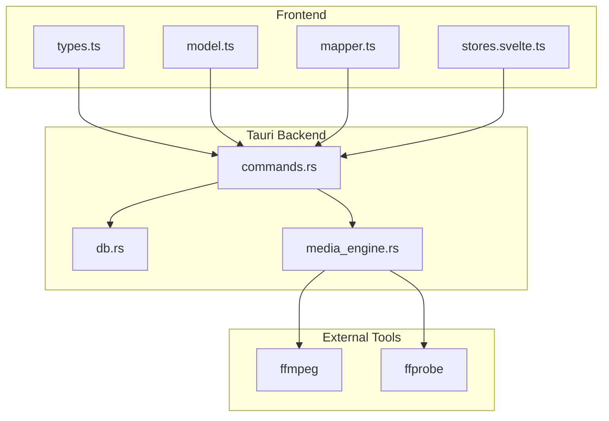
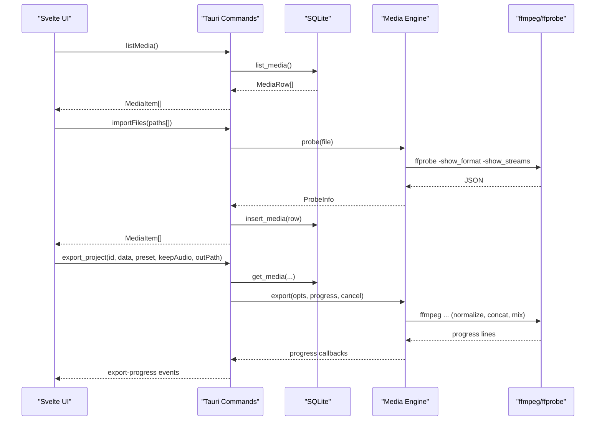
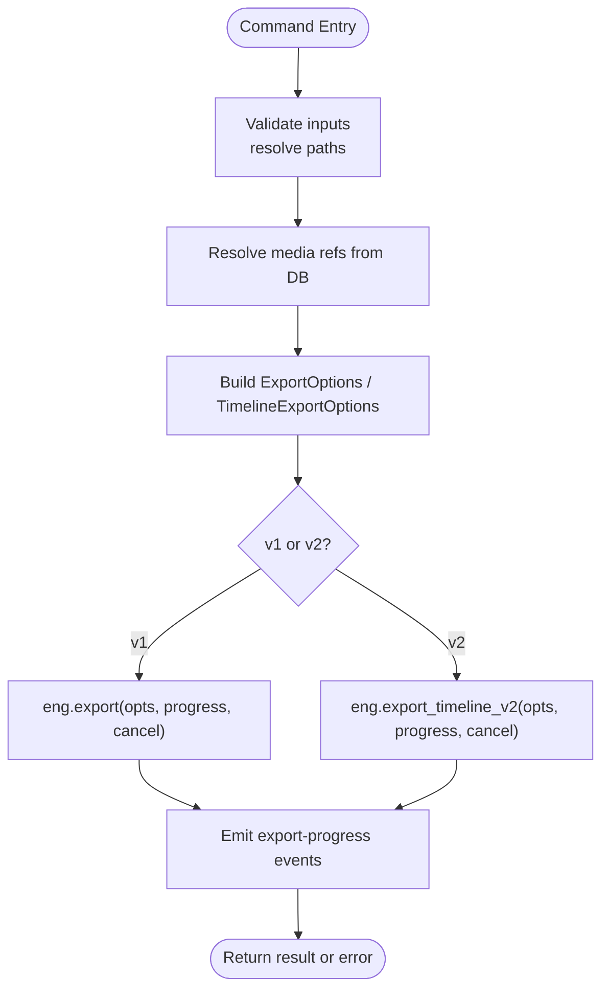
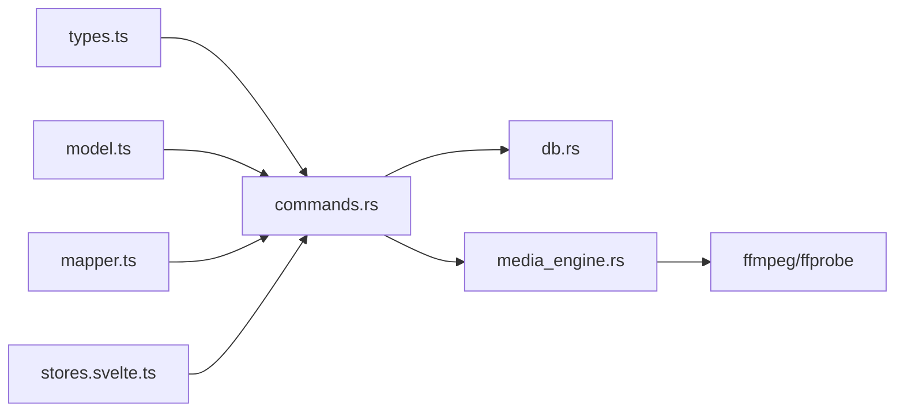
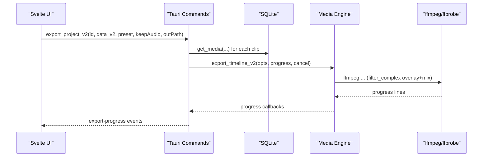

# Media Engine API

<cite>
**Referenced Files in This Document**
- [media_engine.rs](file://apps/shradhapp/src-tauri/src/media_engine.rs)
- [commands.rs](file://apps/shradhapp/src-tauri/src/commands.rs)
- [db.rs](file://apps/shradhapp/src-tauri/src/db.rs)
- [types.ts](file://apps/shradhapp/src/lib/backend/types.ts)
- [model.ts](file://apps/shradhapp/src/lib/timeline/model.ts)
- [mapper.ts](file://apps/shradhapp/src/lib/timeline/mapper.ts)
- [stores.svelte.ts](file://apps/shradhapp/src/lib/stores.svelte.ts)
- [media_engine.rs (tests)](file://apps/shradhapp/src-tauri/tests/media_engine.rs)
</cite>

## Table of Contents
1. [Introduction](#introduction)
2. [Project Structure](#project-structure)
3. [Core Components](#core-components)
4. [Architecture Overview](#architecture-overview)
5. [Detailed Component Analysis](#detailed-component-analysis)
6. [Dependency Analysis](#dependency-analysis)
7. [Performance Considerations](#performance-considerations)
8. [Troubleshooting Guide](#troubleshooting-guide)
9. [Conclusion](#conclusion)
10. [Appendices](#appendices)

## Introduction
This document provides a comprehensive API reference for the media processing engine used by ShradhApp. It covers video/audio processing operations, format conversions, timeline manipulation, and export pipelines. It also documents media file handling, codec support, batch processing capabilities, error recovery mechanisms, and integration with the Svelte-based video editor interface.

The engine is implemented as a Rust Tauri backend that orchestrates ffmpeg/ffprobe through typed commands. The frontend communicates via Tauri commands and events, using TypeScript types to ensure type safety across the boundary.

## Project Structure
ShradhApp’s media engine spans three layers:
- Backend (Rust/Tauri): media_engine.rs implements ffmpeg orchestration; commands.rs exposes typed Tauri commands; db.rs persists media bank and projects.
- Frontend (SvelteKit + TypeScript): types.ts defines the backend contract; model.ts defines v2 timeline schema; mapper.ts converts between project versions; stores.svelte.ts manages media state.
- Tests: integration tests validate end-to-end media pipeline behavior against real ffmpeg.



**Diagram sources**
- [types.ts](file://apps/shradhapp/src/lib/backend/types.ts)
- [model.ts](file://apps/shradhapp/src/lib/timeline/model.ts)
- [mapper.ts](file://apps/shradhapp/src/lib/timeline/mapper.ts)
- [stores.svelte.ts](file://apps/shradhapp/src/lib/stores.svelte.ts)
- [commands.rs](file://apps/shradhapp/src-tauri/src/commands.rs)
- [db.rs](file://apps/shradhapp/src-tauri/src/db.rs)
- [media_engine.rs](file://apps/shradhapp/src-tauri/src/media_engine.rs)

**Section sources**
- [media_engine.rs](file://apps/shradhapp/src-tauri/src/media_engine.rs)
- [commands.rs](file://apps/shradhapp/src-tauri/src/commands.rs)
- [db.rs](file://apps/shradhapp/src-tauri/src/db.rs)
- [types.ts](file://apps/shradhapp/src/lib/backend/types.ts)
- [model.ts](file://apps/shradhapp/src/lib/timeline/model.ts)
- [mapper.ts](file://apps/shradhapp/src/lib/timeline/mapper.ts)
- [stores.svelte.ts](file://apps/shradhapp/src/lib/stores.svelte.ts)

## Core Components
- Media Engine (Rust): Encapsulates ffmpeg/ffprobe discovery, probing, thumbnails, waveform generation, audio cleanup, and export pipelines. Provides both sequential export (v1) and multi-track timeline export (v2).
- Tauri Commands (Rust): Typed entry points for the frontend. Handles imports, voiceover recording, cleanup/repair, project CRUD, and export jobs with progress and cancellation.
- Persistence (SQLite): Stores media metadata, project definitions (v1 and v2), and app settings.
- Frontend Types and Mappers: Define the contract and data models for v1/v2 projects and timeline tracks/clips, including mapping utilities.

Key responsibilities:
- File handling: safe copying into library, thumbnail/waveform generation, unique naming.
- Probing: duration, resolution, audio presence.
- Audio processing: highpass, denoise, silence trim, loudnorm, click repair.
- Export: normalization, concat, optional voiceover mixing, final muxing.
- Timeline: overlay composition, delayed audio mixing, per-clip volume/mute.

**Section sources**
- [media_engine.rs](file://apps/shradhapp/src-tauri/src/media_engine.rs)
- [commands.rs](file://apps/shradhapp/src-tauri/src/commands.rs)
- [db.rs](file://apps/shradhapp/src-tauri/src/db.rs)
- [types.ts](file://apps/shradhapp/src/lib/backend/types.ts)
- [model.ts](file://apps/shradhapp/src/lib/timeline/model.ts)
- [mapper.ts](file://apps/shradhapp/src/lib/timeline/mapper.ts)

## Architecture Overview
The system follows a clear separation of concerns:
- Frontend calls Tauri commands defined in commands.rs.
- Commands resolve media references from db.rs and construct media_engine parameters.
- media_engine.rs builds and runs ffmpeg/ffprobe processes, reporting progress and errors back to the frontend via Tauri events.



**Diagram sources**
- [commands.rs](file://apps/shradhapp/src-tauri/src/commands.rs)
- [db.rs](file://apps/shradhapp/src-tauri/src/db.rs)
- [media_engine.rs](file://apps/shradhapp/src-tauri/src/media_engine.rs)

## Detailed Component Analysis

### Media Engine (ffmpeg orchestration)
Responsibilities:
- Locate ffmpeg/ffprobe on PATH or platform-specific directories.
- Probe media metadata (duration, width/height, has_audio).
- Generate thumbnails and waveforms.
- Clean up audio (rumble filter, denoise, silence trim, loudnorm).
- Repair impulsive clicks/ticks.
- Sequential export (v1) with normalization, concat, optional voiceover mixing.
- Multi-track timeline export (v2) with overlay and delayed audio mixing.
- Progress streaming and cancellation.

Key APIs:
- locate(): find binaries.
- probe(path): return ProbeInfo.
- video_thumbnail(input, out_jpg), image_thumbnail(input, out_jpg).
- waveform(input, out_png).
- cleanup_audio(input, out_m4a), repair_audio_ticks(input, out_m4a).
- export(opts, progress, cancel): v1 pipeline.
- export_timeline_v2(opts, progress, cancel): v2 pipeline.

Data structures:
- ProbeInfo: duration, width, height, has_audio.
- ExportSegment: Video, Still, AudioOnly variants with trimming/duration.
- ExportOptions: segments, voiceover, keep_original_audio, width, height, crf, output.
- TimelineExportClip: input, track_kind, media_kind, start, trim_start, duration, has_audio, volume, muted.
- TimelineExportOptions: clips, keep_original_audio, width, height, crf, output.
- TimelineExportPlan: duration, filter_complex, labels, has_audio.

Error handling:
- run_quiet returns stderr tail on failure.
- run_with_progress aggregates last few stderr lines on non-zero exit.
- Cancellation via AtomicBool stops ffmpeg and returns an error.

Codec and format notes:
- Video: libx264 (H.264), yuv420p, fps=30, faststart.
- Audio: AAC at 44.1kHz stereo, 160k bitrate where applicable.
- Containers: MP4/MOV based on output extension.

Batch processing:
- Sequential export normalizes each segment independently, then concatenates.
- Timeline export compiles a single complex filter graph for overlays and mixed audio.

```mermaid
classDiagram
class Ffmpeg {
+locate() Result<Ffmpeg, String>
+probe(path) Result<ProbeInfo, String>
+video_thumbnail(input, out) Result<(), String>
+image_thumbnail(input, out) Result<(), String>
+waveform(input, out) Result<(), String>
+cleanup_audio(input, out) Result<(), String>
+repair_audio_ticks(input, out) Result<(), String>
+export(opts, progress, cancel) Result<(), String>
+export_timeline_v2(opts, progress, cancel) Result<(), String>
}
class ProbeInfo {
+duration : Option<f64>
+width : Option<u32>
+height : Option<u32>
+has_audio : bool
}
class ExportSegment {
<<enum>>
+Video{input, trim_start, trim_end, has_audio}
+Still{input, duration}
+AudioOnly{input, trim_start, trim_end}
+duration() f64
}
class ExportOptions {
+segments : Vec<ExportSegment>
+voiceover : Option<PathBuf>
+keep_original_audio : bool
+width : u32
+height : u32
+crf : u32
+output : PathBuf
}
class TimelineExportClip {
+input : PathBuf
+track_kind : TimelineTrackKind
+media_kind : TimelineMediaKind
+start : f64
+trim_start : f64
+duration : f64
+has_audio : bool
+volume : f64
+muted : bool
}
class TimelineExportOptions {
+clips : Vec<TimelineExportClip>
+keep_original_audio : bool
+width : u32
+height : u32
+crf : u32
+output : PathBuf
}
class TimelineExportPlan {
+duration : f64
+filter_complex : String
+video_label : String
+audio_label : String
+has_audio : bool
}
Ffmpeg --> ProbeInfo : "returns"
Ffmpeg --> ExportOptions : "uses"
Ffmpeg --> TimelineExportOptions : "uses"
Ffmpeg --> TimelineExportPlan : "compiles"
```

**Diagram sources**
- [media_engine.rs](file://apps/shradhapp/src-tauri/src/media_engine.rs)

**Section sources**
- [media_engine.rs](file://apps/shradhapp/src-tauri/src/media_engine.rs)

### Tauri Commands (API surface)
Responsibilities:
- Settings management (get/update/reset).
- Runtime info (paths, ffmpeg availability).
- Media bank: list, import, rename, tags, notes, delete.
- Voiceover: save recording, cleanup, tick repair.
- Projects: create/list/update/delete/duplicate, v1↔v2 mapping.
- Export: v1 and v2 timelines with progress events and cancellation.

Notable endpoints:
- list_media(), import_files(paths), rename_media(id, name), set_tags(id, tags), set_notes(id, notes), delete_media(id).
- save_recording(data_b64, ext, name), cleanup_audio(id), repair_audio_ticks(id).
- list_projects(), create_project(name), update_project(id, data), delete_project(id), duplicate_project(id).
- map_project_v1_to_v2(data).
- export_project(id, data, preset, keep_audio, out_path).
- export_project_v2(id, data_v2, preset, keep_audio, out_path).
- cancel_export(id).

Progress and cancellation:
- Emits "export-progress" events with id, percent, stage.
- Maintains per-export AtomicBool flags for cancellation.



**Diagram sources**
- [commands.rs](file://apps/shradhapp/src-tauri/src/commands.rs)

**Section sources**
- [commands.rs](file://apps/shradhapp/src-tauri/src/commands.rs)

### Database Schema and Persistence
Tables:
- media: id, kind, filename, path, imported_at, duration, width, height, tags (JSON), notes, thumb_path.
- projects: id, name, data (JSON), created_at, updated_at.
- settings: key, value, updated_at.

Operations:
- Insert/list/get/rename/set-tags/set-notes/delete for media.
- Upsert/list/get/delete for projects.
- Get/upsert for settings.

**Section sources**
- [db.rs](file://apps/shradhapp/src-tauri/src/db.rs)

### Frontend Integration (Types, Models, Mappers)
- types.ts: Defines MediaItem, Clip, ProjectData (v1), ProjectRecord, ExportPreset, AppSettings, ExportProgress, CleanupResult, YouTubeVideo, and the Backend interface consumed by the UI.
- model.ts: Defines v2 timeline schema (tracks, clips, settings) and export DTOs.
- mapper.ts: Converts between v1 and v2 project formats, normalizes timeline clips/tracks, computes durations.
- stores.svelte.ts: Loads media items via backend.listMedia() and exposes reactive state.

Integration patterns:
- UI calls backend methods (e.g., exportTimelineProject) which map to Tauri commands.
- Progress events are subscribed to via onExportProgress callback.
- Media URLs and thumbnails are resolved via backend helpers.

**Section sources**
- [types.ts](file://apps/shradhapp/src/lib/backend/types.ts)
- [model.ts](file://apps/shradhapp/src/lib/timeline/model.ts)
- [mapper.ts](file://apps/shradhapp/src/lib/timeline/mapper.ts)
- [stores.svelte.ts](file://apps/shradhapp/src/lib/stores.svelte.ts)

### Example Workflows

#### Import and Thumbnail/Waveform Generation
- Call import_files(paths) to copy files into library, probe metadata, generate thumbnails/waveforms, and persist rows.
- Use list_media() to retrieve items and display thumbnails/waveforms.

#### Voiceover Recording and Cleanup
- Save recording via save_recording(blob, ext, name).
- Optionally run cleanup_audio(id) or repair_audio_ticks(id) to produce cleaned siblings.

#### Sequential Export (v1)
- Prepare ProjectData (v1) with clips and optional voiceover_media_id.
- Call export_project(id, data, preset, keep_audio, out_path).
- Subscribe to export-progress events; cancel if needed.

#### Multi-Track Timeline Export (v2)
- Build ProjectDataV2 with tracks and clips (video/image/audio), specifying start times, source ranges, volumes, mute flags.
- Call export_project_v2(id, data_v2, preset, keep_audio, out_path).
- Monitor progress and cancel as needed.

**Section sources**
- [commands.rs](file://apps/shradhapp/src-tauri/src/commands.rs)
- [media_engine.rs](file://apps/shradhapp/src-tauri/src/media_engine.rs)
- [types.ts](file://apps/shradhapp/src/lib/backend/types.ts)
- [model.ts](file://apps/shradhapp/src/lib/timeline/model.ts)

## Dependency Analysis
- commands.rs depends on db.rs for persistence and media_engine.rs for processing.
- media_engine.rs depends on external ffmpeg/ffprobe binaries.
- Frontend types.ts and model.ts define contracts consumed by commands.rs and mapper.ts.



**Diagram sources**
- [types.ts](file://apps/shradhapp/src/lib/backend/types.ts)
- [model.ts](file://apps/shradhapp/src/lib/timeline/model.ts)
- [mapper.ts](file://apps/shradhapp/src/lib/timeline/mapper.ts)
- [stores.svelte.ts](file://apps/shradhapp/src/lib/stores.svelte.ts)
- [commands.rs](file://apps/shradhapp/src-tauri/src/commands.rs)
- [db.rs](file://apps/shradhapp/src-tauri/src/db.rs)
- [media_engine.rs](file://apps/shradhapp/src-tauri/src/media_engine.rs)

**Section sources**
- [commands.rs](file://apps/shradhapp/src-tauri/src/commands.rs)
- [db.rs](file://apps/shradhapp/src-tauri/src/db.rs)
- [media_engine.rs](file://apps/shradhapp/src-tauri/src/media_engine.rs)
- [types.ts](file://apps/shradhapp/src/lib/backend/types.ts)
- [model.ts](file://apps/shradhapp/src/lib/timeline/model.ts)
- [mapper.ts](file://apps/shradhapp/src/lib/timeline/mapper.ts)

## Performance Considerations
- Normalization phase: Each segment is re-encoded to H.264 (libx264) with preset veryfast and CRF tuned by preset. Expect CPU-bound work proportional to total duration.
- Concat step: Stream copy when codecs match; fallback re-encode ensures robustness at cost of speed.
- Audio mixing: Loudnorm and filters add overhead; consider pre-cleaning long recordings.
- Progress parsing: Streaming progress via pipe avoids blocking; stderr drained asynchronously to prevent deadlocks.
- Batch exports: For many short clips, overhead per process spawn may dominate; consider batching or reducing segment count where possible.

[No sources needed since this section provides general guidance]

## Troubleshooting Guide
Common issues and resolutions:
- ffmpeg not found: Ensure ffmpeg/ffprobe are installed and discoverable via PATH or platform-specific locations. The engine reports a clear message when missing.
- Export failures: Errors include last few stderr lines from ffmpeg. Check input validity, codec compatibility, and disk space.
- Cancelled exports: If cancel flag is set, the engine kills ffmpeg and returns an error; ensure UI handles cancellation gracefully.
- Missing media references: Export resolves media IDs to paths; if a referenced item was deleted, the command fails early with a descriptive error.
- Duration anomalies: Probe results can be None for unsupported formats; fallbacks use minimum durations to avoid zero-length segments.

Operational tips:
- Use list_youtube_channel_videos() to fetch public channel videos for inspiration or assets.
- Prefer mp4-full preset for highest quality; mp4-small reduces size and encoding time.
- Keep original audio only when necessary; otherwise, omit to reduce complexity.

**Section sources**
- [media_engine.rs](file://apps/shradhapp/src-tauri/src/media_engine.rs)
- [commands.rs](file://apps/shradhapp/src-tauri/src/commands.rs)

## Conclusion
The ShradhApp media engine provides a robust, typed API for media processing and export, bridging Svelte frontend workflows with ffmpeg/ffprobe through Tauri commands. It supports both sequential and multi-track timeline exports, offers audio cleanup and repair, and integrates seamlessly with SQLite-backed persistence. With clear error messages, progress streaming, and cancellation, it delivers a reliable foundation for video editing workflows.

[No sources needed since this section summarizes without analyzing specific files]

## Appendices

### Codec and Format Support Summary
- Video codecs: H.264 (libx264), yuv420p pixel format, 30fps target.
- Audio codecs: AAC at 44.1kHz stereo; loudnorm applied during cleanup/mixing.
- Containers: MP4/MOV depending on output extension; faststart enabled for web-friendly playback.
- Image formats: Supported for stills and thumbnails (PNG/JPG/etc.).

**Section sources**
- [media_engine.rs](file://apps/shradhapp/src-tauri/src/media_engine.rs)

### Integration Examples

#### Sequence: Export v2 Timeline


**Diagram sources**
- [commands.rs](file://apps/shradhapp/src-tauri/src/commands.rs)
- [media_engine.rs](file://apps/shradhapp/src-tauri/src/media_engine.rs)

### Validation and Tests
- Integration tests exercise full pipeline: fixture generation, probing, thumbnails, waveform, cleanup, tick repair, sequential export, silent export, timeline v2 export, and cancellation.
- Assertions verify durations, dimensions, and presence/absence of audio streams.

**Section sources**
- [media_engine.rs (tests)](file://apps/shradhapp/src-tauri/tests/media_engine.rs)