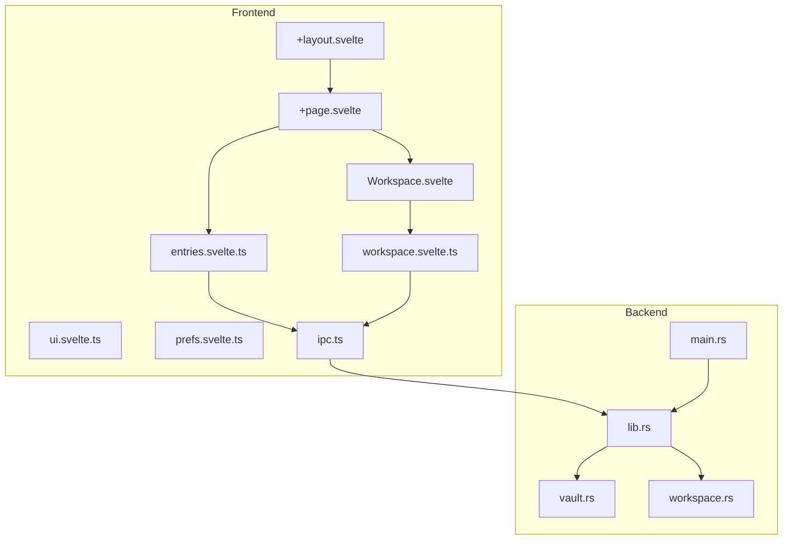
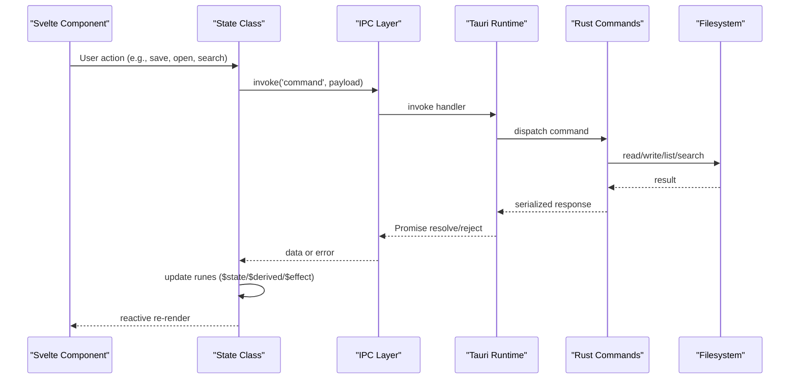
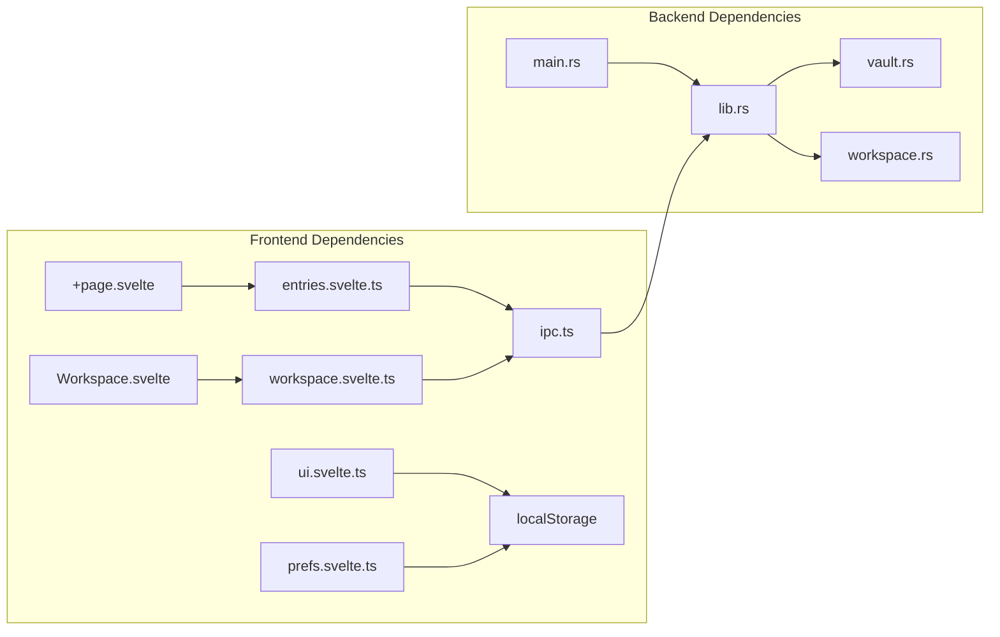

# Data Flow & State Management

<cite>
**Referenced Files in This Document**
- [ipc.ts](file://apps/fracta/src/lib/ipc.ts)
- [lib.rs](file://apps/fracta/src-tauri/src/lib.rs)
- [main.rs](file://apps/fracta/src-tauri/src/main.rs)
- [workspace.rs](file://apps/fracta/src-tauri/src/workspace.rs)
- [vault.rs](file://apps/fracta/src-tauri/src/vault.rs)
- [+page.svelte](file://apps/fracta/src/routes/+page.svelte)
- [+layout.svelte](file://apps/fracta/src/routes/+layout.svelte)
- [entries.svelte.ts](file://apps/fracta/src/lib/state/entries.svelte.ts)
- [workspace.svelte.ts](file://apps/fracta/src/lib/state/workspace.svelte.ts)
- [ui.svelte.ts](file://apps/fracta/src/lib/state/ui.svelte.ts)
- [prefs.svelte.ts](file://apps/fracta/src/lib/state/prefs.svelte.ts)
- [Workspace.svelte](file://apps/fracta/src/lib/components/Workspace.svelte)
</cite>

## Table of Contents
1. Introduction
2. Project Structure
3. Core Components
4. Architecture Overview
5. Detailed Component Analysis
6. Dependency Analysis
7. Performance Considerations
8. Troubleshooting Guide
9. Conclusion

## Introduction
This document explains the end-to-end data flow and state management patterns across the Fracta application, which is built with SvelteKit + Svelte 5 + Tauri + TypeScript. It focuses on:
- Unidirectional data flow from user interactions in Svelte components to Tauri commands and Rust backend operations
- State management using Svelte 5 runes ($state, $derived, $effect), reactive stores, and context-like patterns
- IPC communication patterns between frontend and backend, including message formats, error handling, and async operations
- Data synchronization, caching strategies, and real-time updates via filesystem watchers and polling
- Performance considerations, memory management, and debugging techniques for complex data flows

## Project Structure
The application is organized into a SvelteKit frontend under apps/fracta/src and a Tauri/Rust backend under apps/fracta/src-tauri. The key layers are:
- Frontend routes and layout define UI shells and global preferences
- State modules encapsulate domain logic (entries, workspace, UI, preferences)
- IPC layer abstracts Tauri invoke calls and types
- Backend exposes Tauri commands that operate on vault entries and workspace files

**Diagram sources**
- [+layout.svelte:1-29](file://apps/fracta/src/routes/+layout.svelte#L1-L29)
- [+page.svelte:1-72](file://apps/fracta/src/routes/+page.svelte#L1-L72)
- [Workspace.svelte:1-788](file://apps/fracta/src/lib/components/Workspace.svelte#L1-L788)
- [entries.svelte.ts:1-288](file://apps/fracta/src/lib/state/entries.svelte.ts#L1-L288)
- [workspace.svelte.ts:1-321](file://apps/fracta/src/lib/state/workspace.svelte.ts#L1-L321)
- [ui.svelte.ts:1-130](file://apps/fracta/src/lib/state/ui.svelte.ts#L1-L130)
- [prefs.svelte.ts:1-75](file://apps/fracta/src/lib/state/prefs.svelte.ts#L1-L75)
- [ipc.ts:1-237](file://apps/fracta/src/lib/ipc.ts#L1-L237)
- [lib.rs:1-498](file://apps/fracta/src-tauri/src/lib.rs#L1-L498)
- [vault.rs:1-495](file://apps/fracta/src-tauri/src/vault.rs#L1-L495)
- [workspace.rs:1-800](file://apps/fracta/src-tauri/src/workspace.rs#L1-L800)
- [main.rs:1-7](file://apps/fracta/src-tauri/src/main.rs#L1-L7)

**Section sources**
- [+layout.svelte:1-29](file://apps/fracta/src/routes/+layout.svelte#L1-L29)
- [+page.svelte:1-72](file://apps/fracta/src/routes/+page.svelte#L1-L72)
- [ipc.ts:1-237](file://apps/fracta/src/lib/ipc.ts#L1-L237)
- [lib.rs:1-498](file://apps/fracta/src-tauri/src/lib.rs#L1-L498)

## Core Components
- IPC Layer: Centralized Tauri invoke wrappers and type definitions for all backend operations
- Entries State: Manages vault entries, draft lifecycle, autosave, and persistence
- Workspace State: Manages file tree, active file editing, search, conversion, and link graph
- UI State: Transient app mode and panel toggles, persisted to localStorage
- Preferences: Editor font family, size, and theme, persisted to localStorage
- Backend Commands: Tauri commands exposing vault and workspace operations, file I/O, indexing, and GGUF engine control

Key responsibilities:
- IPC defines typed interfaces and invokes commands like list_entries, read_entry, write_entry, list_workspace, search_workspace, etc.
- Entries handles capture flow, daily notes, autosave with debouncing and serialization, and refreshes summaries after writes
- Workspace orchestrates file operations, previews, conversions, and real-time sync via watcher events and polling fallback
- UI and prefs manage transient and persistent UI settings

**Section sources**
- [ipc.ts:1-237](file://apps/fracta/src/lib/ipc.ts#L1-L237)
- [entries.svelte.ts:1-288](file://apps/fracta/src/lib/state/entries.svelte.ts#L1-L288)
- [workspace.svelte.ts:1-321](file://apps/fracta/src/lib/state/workspace.svelte.ts#L1-L321)
- [ui.svelte.ts:1-130](file://apps/fracta/src/lib/state/ui.svelte.ts#L1-L130)
- [prefs.svelte.ts:1-75](file://apps/fracta/src/lib/state/prefs.svelte.ts#L1-L75)
- [lib.rs:1-498](file://apps/fracta/src-tauri/src/lib.rs#L1-L498)

## Architecture Overview
The system follows unidirectional data flow:
- User interactions trigger component methods or event handlers
- State classes update Svelte 5 runes ($state, $derived, $effect)
- State methods call IPC functions which invoke Tauri commands
- Backend performs filesystem operations, indexing, and returns results
- Real-time updates propagate via Tauri events and polling

**Diagram sources**
- [Workspace.svelte:1-788](file://apps/fracta/src/lib/components/Workspace.svelte#L1-L788)
- [entries.svelte.ts:1-288](file://apps/fracta/src/lib/state/entries.svelte.ts#L1-L288)
- [workspace.svelte.ts:1-321](file://apps/fracta/src/lib/state/workspace.svelte.ts#L1-L321)
- [ipc.ts:1-237](file://apps/fracta/src/lib/ipc.ts#L1-L237)
- [lib.rs:1-498](file://apps/fracta/src-tauri/src/lib.rs#L1-L498)

## Detailed Component Analysis

### IPC Layer
- Provides typed wrappers around Tauri invoke for vault and workspace operations
- Exposes utility isTauri() to conditionally run backend-dependent code
- Defines rich type contracts for Entry, WorkspaceFile, GraphReport, TerminalResult, etc.

Error handling:
- Errors returned by commands are propagated as rejected Promises
- Frontend state classes catch errors and set error notices

Async operations:
- All IPC calls return Promises; state classes await them and update runes accordingly

Real-time updates:
- watch_workspace emits "workspace://changed" events; Workspace component listens and refreshes

**Section sources**
- [ipc.ts:1-237](file://apps/fracta/src/lib/ipc.ts#L1-L237)

### Entries State
Responsibilities:
- Manage vault status, entry summaries, active draft, and autosave
- Handle daily note creation and opening existing entries
- Serialize writes to avoid race conditions and ensure dirty flag semantics

Data flow:
- init() checks Tauri environment, loads vault status, refreshes summaries
- newDraft() resets fields and bumps resetToken for editor reload
- flush() serializes writes, creates entry if needed, writes content, refreshes summaries

Autosave strategy:
- Debounced timer triggers flush after edits
- Write chain ensures sequential writes and retries on failure

Caching:
- Summaries cached in memory; refreshed after writes
- Browser preview path provides empty draft without backend

**Section sources**
- [entries.svelte.ts:1-288](file://apps/fracta/src/lib/state/entries.svelte.ts#L1-L288)

### Workspace State
Responsibilities:
- Manage file tree, active file editing, search, conversion, and link graph
- Handle JSON recovery via localStorage for invalid drafts
- Provide virtualized grid editing for CSV and structured editors for JSON

Data flow:
- init() lists workspace items and builds graph
- open() reads file content, sets links and preview for supported kinds
- save() writes content, clears recovery draft, refreshes tree and links

Real-time sync:
- refreshFromDisk() polls filesystem changes conservatively
- watch_workspace event triggers immediate refresh

Caching:
- Items list cached; active file content cached in memory
- Invalid JSON drafts recovered from localStorage until corrected

**Section sources**
- [workspace.svelte.ts:1-321](file://apps/fracta/src/lib/state/workspace.svelte.ts#L1-L321)

### UI State
Responsibilities:
- Manage app mode (capture, organize, workspace) and panel toggles
- Persist mode and organize tab to localStorage
- Provide focus management for search and ask panels

Patterns:
- Uses $state for reactive properties
- Persists critical UI state to localStorage with error handling

**Section sources**
- [ui.svelte.ts:1-130](file://apps/fracta/src/lib/state/ui.svelte.ts#L1-L130)

### Preferences State
Responsibilities:
- Manage font family, size, and theme preferences
- Persist preferences to localStorage
- Provide computed font stack values

Patterns:
- Uses $state for reactive properties
- Default values loaded from localStorage with fallbacks

**Section sources**
- [prefs.svelte.ts:1-75](file://apps/fracta/src/lib/state/prefs.svelte.ts#L1-L75)

### Workspace Component
Responsibilities:
- Orchestrate file navigation, editing views (source, richtext, grid, tree, preview)
- Handle CSV grid operations, JSON tree/source editing, PDF/DOCX preview
- Integrate Ask panel for AI assistance over workspace content

Data flow:
- onMount initializes workspace and sets up file watcher
- Event handlers update workspace state and trigger IPC calls
- Effects reset view state when active file changes

Real-time updates:
- Listens to "workspace://changed" events and refreshes from disk
- Polling fallback ensures consistency in browser preview

**Section sources**
- [Workspace.svelte:1-788](file://apps/fracta/src/lib/components/Workspace.svelte#L1-L788)

### Backend Commands
Responsibilities:
- Expose Tauri commands for vault and workspace operations
- Manage filesystem access with strict validation and security checks
- Implement search indexing, document preview, and terminal execution

Security:
- Path resolution prevents traversal outside workspace root
- Symlink validation and ignore patterns protect against malicious paths

Performance:
- Bounded output sizes for terminal commands
- Efficient file walking and sorting for workspace listing

Real-time:
- File watcher emits events for changed paths
- Search index updated incrementally on file changes

**Section sources**
- [lib.rs:1-498](file://apps/fracta/src-tauri/src/lib.rs#L1-L498)
- [workspace.rs:1-800](file://apps/fracta/src-tauri/src/workspace.rs#L1-L800)
- [vault.rs:1-495](file://apps/fracta/src-tauri/src/vault.rs#L1-L495)

## Dependency Analysis
The dependency relationships follow a clear separation of concerns:

**Diagram sources**
- [Workspace.svelte:1-788](file://apps/fracta/src/lib/components/Workspace.svelte#L1-L788)
- [+page.svelte:1-72](file://apps/fracta/src/routes/+page.svelte#L1-L72)
- [entries.svelte.ts:1-288](file://apps/fracta/src/lib/state/entries.svelte.ts#L1-L288)
- [workspace.svelte.ts:1-321](file://apps/fracta/src/lib/state/workspace.svelte.ts#L1-L321)
- [ui.svelte.ts:1-130](file://apps/fracta/src/lib/state/ui.svelte.ts#L1-L130)
- [prefs.svelte.ts:1-75](file://apps/fracta/src/lib/state/prefs.svelte.ts#L1-L75)
- [ipc.ts:1-237](file://apps/fracta/src/lib/ipc.ts#L1-L237)
- [lib.rs:1-498](file://apps/fracta/src-tauri/src/lib.rs#L1-L498)
- [vault.rs:1-495](file://apps/fracta/src-tauri/src/vault.rs#L1-L495)
- [workspace.rs:1-800](file://apps/fracta/src-tauri/src/workspace.rs#L1-L800)
- [main.rs:1-7](file://apps/fracta/src-tauri/src/main.rs#L1-L7)

**Section sources**
- [ipc.ts:1-237](file://apps/fracta/src/lib/ipc.ts#L1-L237)
- [lib.rs:1-498](file://apps/fracta/src-tauri/src/lib.rs#L1-L498)

## Performance Considerations
- Autosave debouncing prevents excessive writes during rapid typing
- Write serialization avoids race conditions and ensures data consistency
- Virtualized grid rendering optimizes large CSV editing performance
- Conservative polling intervals balance responsiveness with resource usage
- Bounded terminal output prevents memory issues with large command outputs
- File watcher events provide efficient real-time updates without constant polling
- JSON recovery uses localStorage to prevent data loss during editing errors

Memory management:
- Large binary assets are handled through typed arrays and object URLs
- File contents are cached in memory but refreshed on external changes
- Watcher resources are properly disposed when components unmount

Debugging techniques:
- Error states are exposed through workspace.error and entries.saving flags
- Console logging captures autosave failures and IPC errors
- Notice messages provide user feedback for background operations

**Section sources**
- [entries.svelte.ts:1-288](file://apps/fracta/src/lib/state/entries.svelte.ts#L1-L288)
- [workspace.svelte.ts:1-321](file://apps/fracta/src/lib/state/workspace.svelte.ts#L1-L321)
- [Workspace.svelte:1-788](file://apps/fracta/src/lib/components/Workspace.svelte#L1-L788)
- [lib.rs:1-498](file://apps/fracta/src-tauri/src/lib.rs#L1-L498)

## Troubleshooting Guide
Common issues and solutions:
- IPC errors: Check isTauri() environment and network connectivity
- File permission errors: Verify workspace folder permissions and path resolution
- Watcher not triggering: Ensure file system has sufficient change notifications enabled
- JSON parsing errors: Use source editor to correct syntax before saving
- CSV malformed quotes: Switch to raw CSV view to fix quoting issues
- Terminal timeout: Long-running commands may be killed after 120 seconds

Error handling patterns:
- State classes catch errors and set appropriate error states
- IPC calls return Promises that can be awaited with try/catch blocks
- Backend commands return Result types with descriptive error messages

Recovery strategies:
- JSON drafts are automatically recovered from localStorage
- Autosave retry mechanism resubmits failed writes
- Fallback polling ensures data consistency even when watchers fail

**Section sources**
- [workspace.svelte.ts:1-321](file://apps/fracta/src/lib/state/workspace.svelte.ts#L1-L321)
- [entries.svelte.ts:1-288](file://apps/fracta/src/lib/state/entries.svelte.ts#L1-L288)
- [Workspace.svelte:1-788](file://apps/fracta/src/lib/components/Workspace.svelte#L1-L788)
- [lib.rs:1-498](file://apps/fracta/src-tauri/src/lib.rs#L1-L498)

## Conclusion
The Fracta application demonstrates a robust architecture for desktop applications combining Svelte 5's reactive state management with Tauri's secure backend capabilities. The unidirectional data flow ensures predictable state updates, while the IPC layer provides a clean abstraction for cross-process communication. Key strengths include:

- Comprehensive state management using Svelte 5 runes for reactive UI updates
- Secure filesystem operations with strict path validation and containment
- Efficient real-time synchronization through file watchers and conservative polling
- Resilient error handling with recovery mechanisms for data integrity
- Performance optimizations through debouncing, virtualization, and bounded operations

This architecture provides a solid foundation for building feature-rich desktop applications that require both responsive user interfaces and reliable backend operations.