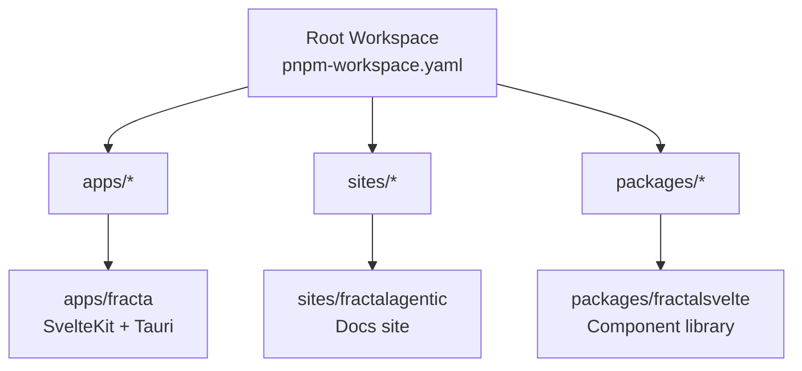
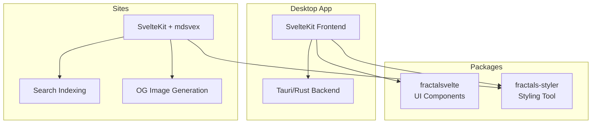
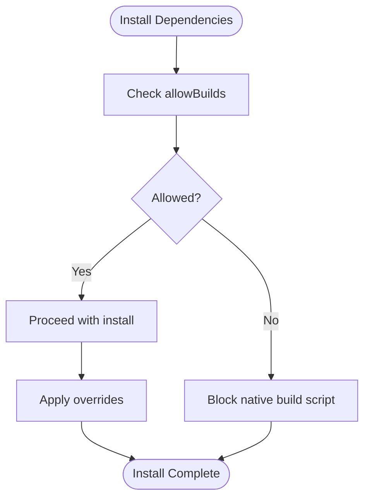

# Monorepo Structure & Organization

<cite>
**Referenced Files in This Document**
- [package.json](file://package.json)
- [pnpm-workspace.yaml](file://pnpm-workspace.yaml)
- [README.md](file://README.md)
- [apps/fracta/package.json](file://apps/fracta/package.json)
- [apps/fracta/svelte.config.js](file://apps/fracta/svelte.config.js)
- [apps/fracta/vite.config.ts](file://apps/fracta/vite.config.ts)
- [packages/fractalsvelte/package.json](file://packages/fractalsvelte/package.json)
- [sites/fractalagentic/package.json](file://sites/fractalagentic/package.json)
- [sites/fractalagentic/vite.config.ts](file://sites/fractalagentic/vite.config.ts)
</cite>

## Table of Contents
1. Introduction
2. Project Structure
3. Core Components
4. Architecture Overview
5. Detailed Component Analysis
6. Dependency Analysis
7. Performance Considerations
8. Troubleshooting Guide
9. Conclusion

## Introduction
This document explains the pnpm monorepo structure and organization across apps, sites, and packages. It covers workspace configuration, dependency management, shared code organization, build system setup, development workflow, deployment strategies for desktop apps (Tauri), documentation sites, and shared packages. It also documents versioning strategy, dependency patterns, code sharing mechanisms, workspace scripts, package linking, cross-project imports, environment setup, debugging across workspaces, and contribution guidelines.

The stack is SvelteKit + Svelte 5 + Tauri + TypeScript with exclusive single-tab indented SASS styling. The root pnpm-lock.yaml is the canonical committed lockfile.

## Project Structure
The repository is organized into three primary top-level groups:
- apps/: Desktop applications built with SvelteKit frontends and Tauri backends (e.g., fracta).
- sites/: Documentation and content sites built with SvelteKit and mdsvex (e.g., fractalagentic).
- packages/: Shared libraries and UI components published to npm or consumed locally via pnpm workspaces (e.g., fractalsvelte).

Workspace membership is declared at the root and includes apps/*, sites/*, and packages/*, with an intentional exclusion for a separate Bun-based project.

**Diagram sources**
- [pnpm-workspace.yaml:1-7](file://pnpm-workspace.yaml#L1-L7)

**Section sources**
- [pnpm-workspace.yaml:1-7](file://pnpm-workspace.yaml#L1-L7)
- [README.md:27-50](file://README.md#L27-L50)

## Core Components
- Workspace root orchestrates scripts and global overrides:
  - Scripts delegate to specific projects using pnpm --filter.
  - Global dependencies include Tauri plugins used by desktop apps.
  - Package manager is pinned to a specific pnpm version.
- Workspace policy:
  - allowBuilds controls native builds allowed during install.
  - strictDepBuilds disables untrusted dependency scripts by default.
  - overrides enforce security-critical versions across all workspaces.

Key responsibilities:
- Centralized script execution for dev/build/test across apps/sites/packages.
- Security posture through dependency overrides and build allowances.
- Consistent toolchain via pinned package manager and workspace-wide policies.

**Section sources**
- [package.json:1-36](file://package.json#L1-L36)
- [pnpm-workspace.yaml:8-30](file://pnpm-workspace.yaml#L8-L30)

## Architecture Overview
High-level architecture spans three layers:
- Applications (desktop): SvelteKit frontend with Rust/Tauri backend.
- Sites (documentation/content): SvelteKit static sites with mdsvex and search/OG generation.
- Packages (shared): Reusable Svelte component libraries and utilities.

[No sources needed since this diagram shows conceptual workflow, not actual code structure]

## Detailed Component Analysis

### Workspace Configuration and Scripts
- Root package.json defines convenience scripts that forward to workspace members via pnpm --filter. Examples include desktop app workflows (dev/check/tauri/build) and site-specific commands.
- Workspace file declares included directories and exclusions, enabling unified installs and commands across apps, sites, and packages.

Practical implications:
- Use root scripts to run tasks consistently across the monorepo.
- Add new apps/sites/packages under the matched globs to participate automatically.

**Section sources**
- [package.json:5-28](file://package.json#L5-L28)
- [pnpm-workspace.yaml:1-7](file://pnpm-workspace.yaml#L1-L7)

### Desktop Application (apps/fracta)
- SvelteKit application configured with static adapter and custom fallback for Tauri parity.
- Vite config excludes Rust build artifacts from watchers to prevent reload storms when running Tauri alongside Vite.
- Package scripts cover dev, build, preview, tests (markdown, agent, JSON, hygiene, motion, visual), tauri CLI integration, type checking, and Rust linting.

Development workflow:
- Run dev server with hot reload; ignore Rust target directories.
- Build static assets for Tauri packaging.
- Verify with comprehensive test suite and Rust checks.

Deployment:
- Static build output is consumed by Tauri; no SSR required.

**Section sources**
- [apps/fracta/package.json:1-60](file://apps/fracta/package.json#L1-L60)
- [apps/fracta/svelte.config.js:1-23](file://apps/fracta/svelte.config.js#L1-L23)
- [apps/fracta/vite.config.ts:1-14](file://apps/fracta/vite.config.ts#L1-L14)

### Documentation Site (sites/fractalagentic)
- SvelteKit static site with mdsvex for markdown processing, rehype/KaTeX for math, and custom plugin to compute “last updated” dates from git history.
- Postbuild steps generate search index and OG images.
- Uses fractals-styler for consistent styling pipeline.

Build process:
- mdsvex transforms .md/.svx into Svelte components.
- Git-based date resolution runs asynchronously and caches results per module load.
- Search indexing and OG image generation are executed after build.

Deployment:
- Static build suitable for hosting on CDNs or static hosts.

**Section sources**
- [sites/fractalagentic/package.json:1-59](file://sites/fractalagentic/package.json#L1-L59)
- [sites/fractalagentic/vite.config.ts:1-157](file://sites/fractalagentic/vite.config.ts#L1-L157)

### Shared Package (packages/fractalsvelte)
- Svelte component library with explicit exports per component and styles.
- Publishable via svelte-package; prepack step ensures types and linting.
- Declares peerDependencies for Svelte to avoid bundling conflicts.
- Includes sideEffects for CSS/SASS assets.

Usage pattern:
- Import components directly by path (e.g., ./button).
- Consume styles via dedicated entry points.
- Versioned independently and consumed by apps/sites within the workspace.

**Section sources**
- [packages/fractalsvelte/package.json:1-486](file://packages/fractalsvelte/package.json#L1-L486)

### Cross-Project Imports and Package Linking
- Workspace members can import each other by package name without publishing to npm.
- Example patterns:
  - Desktop app depends on shared UI components and styling tools.
  - Docs site consumes styling tool for consistent theme pipelines.
- pnpm resolves local workspace packages transparently during dev and build.

Best practices:
- Keep internal APIs stable where possible to reduce churn across consumers.
- Use explicit export maps for clarity and type safety.

**Section sources**
- [apps/fracta/package.json:35-58](file://apps/fracta/package.json#L35-L58)
- [sites/fractalagentic/package.json:50-57](file://sites/fractalagentic/package.json#L50-L57)
- [packages/fractalsvelte/package.json:29-429](file://packages/fractalsvelte/package.json#L29-L429)

### Build System Setup
- Vite is the primary build tool for both apps and sites.
- SvelteKit adapters produce static outputs for Tauri and hosted sites.
- mdsvex integrates markdown content into the Svelte build pipeline.
- Custom Vite plugins handle specialized tasks like git-based metadata and styling tooling.

Performance considerations:
- Exclude non-source directories from watchers to avoid unnecessary rebuilds.
- Cache async operations (e.g., git log parsing) to reduce overhead.

**Section sources**
- [apps/fracta/vite.config.ts:1-14](file://apps/fracta/vite.config.ts#L1-L14)
- [sites/fractalagentic/vite.config.ts:1-157](file://sites/fractalagentic/vite.config.ts#L1-L157)

### Development Workflow
- Use root scripts to start dev servers, run checks, and build outputs.
- For desktop apps, run Tauri CLI alongside Vite; ensure watch ignores are set.
- For docs sites, run postbuild steps to regenerate search and OG assets.

Example commands:
- Start desktop app dev: use root script delegating to the desktop package.
- Check types and lint: use per-package check scripts invoked from root.
- Build static outputs: use per-package build scripts.

**Section sources**
- [package.json:5-28](file://package.json#L5-L28)
- [apps/fracta/package.json:6-20](file://apps/fracta/package.json#L6-L20)
- [sites/fractalagentic/package.json:6-18](file://sites/fractalagentic/package.json#L6-L18)

### Deployment Strategies
- Desktop apps: Build static assets and package with Tauri for distribution.
- Documentation sites: Generate static site and deploy to CDN/static host; ensure search index and OG images are regenerated in CI.
- Packages: Publish via standard npm workflow; ensure prepack steps succeed.

CI recommendations:
- Pin Node/pnpm versions.
- Restore full git history for accurate “last updated” dates.
- Run checks, builds, and tests across workspace members.

**Section sources**
- [apps/fracta/svelte.config.js:11-19](file://apps/fracta/svelte.config.js#L11-L19)
- [sites/fractalagentic/vite.config.ts:134-156](file://sites/fractalagentic/vite.config.ts#L134-L156)

### Versioning Strategy
- Each package maintains its own version in its package.json.
- Consumers reference versions semantically (e.g., ^x.y.z) to allow compatible updates.
- Workspace-local consumption enables rapid iteration before publishing.

Guidelines:
- Bump versions when changing public APIs.
- Update consumer dependencies incrementally to catch breaking changes early.

**Section sources**
- [packages/fractalsvelte/package.json:1-10](file://packages/fractalsvelte/package.json#L1-L10)
- [apps/fracta/package.json:1-10](file://apps/fracta/package.json#L1-L10)
- [sites/fractalagentic/package.json:1-10](file://sites/fractalagentic/package.json#L1-L10)

### Code Sharing Mechanisms
- Shared UI components via fractalsvelte package.
- Styling pipeline via fractals-styler package.
- Explicit export maps define granular imports for better tree-shaking and type inference.

Patterns:
- Prefer small, focused modules with clear contracts.
- Use peerDependencies for framework packages to avoid duplication.

**Section sources**
- [packages/fractalsvelte/package.json:29-429](file://packages/fractalsvelte/package.json#L29-L429)
- [sites/fractalagentic/package.json:50-57](file://sites/fractalagentic/package.json#L50-L57)

### Environment Setup and Debugging Across Workspaces
- Install dependencies once at the root; pnpm hoists and links workspace packages.
- Configure IDE workspaces per project as needed (see ide-workspaces directory).
- Debugging tips:
  - Ensure watch ignores for Rust targets to prevent reload loops.
  - Validate git availability for content date resolution in docs sites.
  - Use per-package check scripts to isolate issues.

**Section sources**
- [apps/fracta/vite.config.ts:6-12](file://apps/fracta/vite.config.ts#L6-L12)
- [sites/fractalagentic/vite.config.ts:31-73](file://sites/fractalagentic/vite.config.ts#L31-L73)

### Contribution Guidelines
- Follow the monorepo conventions:
  - Place new apps/sites under apps/ or sites/.
  - Place shared libraries under packages/.
  - Use pnpm scripts from the root for consistency.
- Adhere to styling rules: single-tab indented SASS only.
- Maintain type safety and linting via per-package check scripts.

**Section sources**
- [README.md:27-31](file://README.md#L27-L31)
- [package.json:26-28](file://package.json#L26-L28)

## Dependency Analysis
Workspace-wide dependency policies:
- allowBuilds permits specific native builds (e.g., esbuild, prisma).
- strictDepBuilds blocks untrusted scripts by default.
- overrides enforce minimum secure versions for critical packages.

Impact:
- Reduces risk from vulnerable transitive dependencies.
- Ensures consistent behavior across all workspace members.

**Diagram sources**
- [pnpm-workspace.yaml:8-21](file://pnpm-workspace.yaml#L8-L21)
- [pnpm-workspace.yaml:23-30](file://pnpm-workspace.yaml#L23-L30)

**Section sources**
- [pnpm-workspace.yaml:8-30](file://pnpm-workspace.yaml#L8-L30)

## Performance Considerations
- Watcher optimization: Exclude Rust build outputs to prevent reload storms.
- Async caching: Memoize expensive operations like git log parsing for content dates.
- Static builds: Prefer static adapters for faster deployments and simpler hosting.
- Tree-shaking: Use explicit export maps to minimize bundle sizes.

[No sources needed since this section provides general guidance]

## Troubleshooting Guide
Common issues and resolutions:
- Reload storms during desktop dev: Ensure Vite watcher ignores Rust target directories.
- Missing “last updated” dates: Verify git history is available and not shallow-cloned.
- Native build failures: Confirm allowBuilds settings and required system dependencies.
- Dependency conflicts: Use workspace overrides to pin versions globally.

Debugging steps:
- Run per-package check scripts to isolate type errors.
- Inspect workspace logs for blocked scripts or override warnings.
- Validate environment variables for site-specific features (e.g., search provider).

**Section sources**
- [apps/fracta/vite.config.ts:6-12](file://apps/fracta/vite.config.ts#L6-L12)
- [sites/fractalagentic/vite.config.ts:31-73](file://sites/fractalagentic/vite.config.ts#L31-L73)
- [pnpm-workspace.yaml:8-21](file://pnpm-workspace.yaml#L8-L21)

## Conclusion
This monorepo leverages pnpm workspaces to unify development across desktop apps, documentation sites, and shared packages. Centralized scripts, workspace policies, and explicit package exports enable consistent builds, secure dependencies, and efficient code sharing. By following the documented workflows and guidelines, contributors can develop, debug, and deploy with confidence across the entire ecosystem.

[No sources needed since this section summarizes without analyzing specific files]