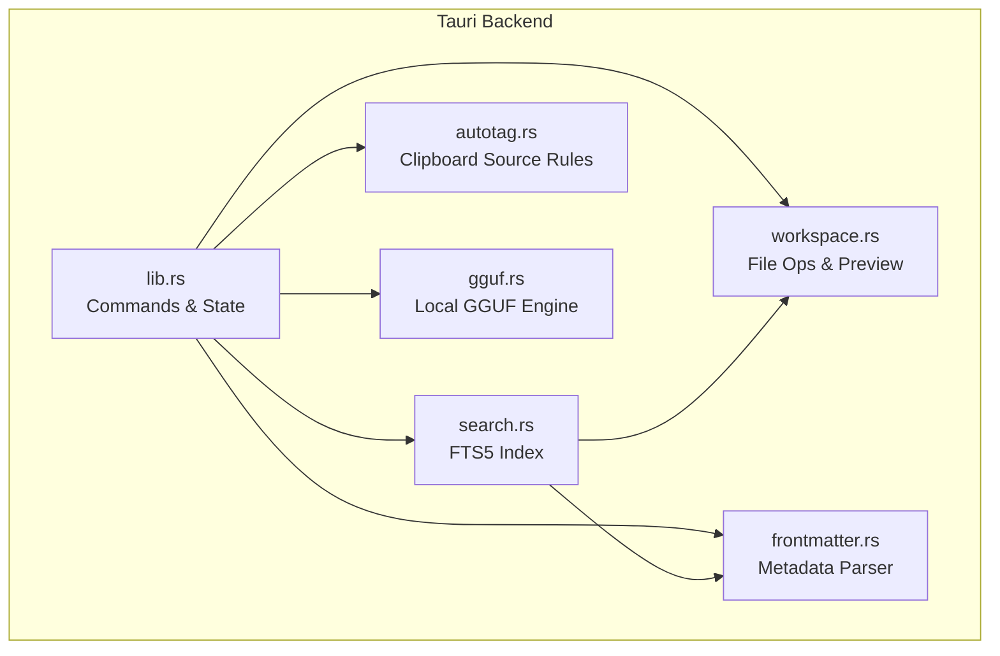
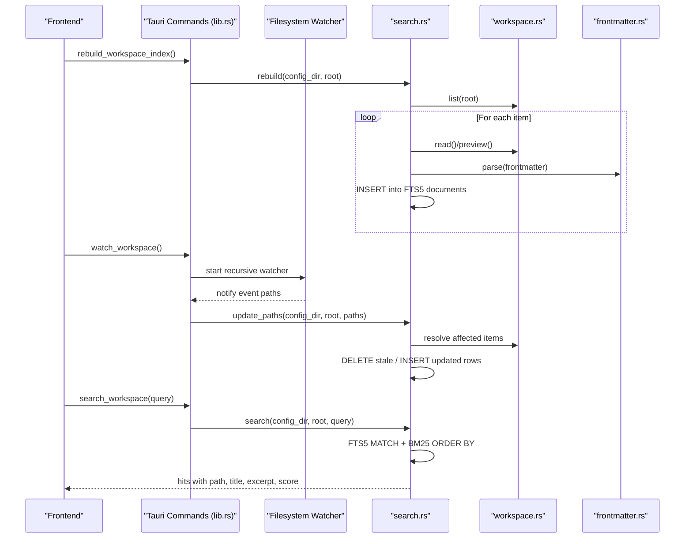
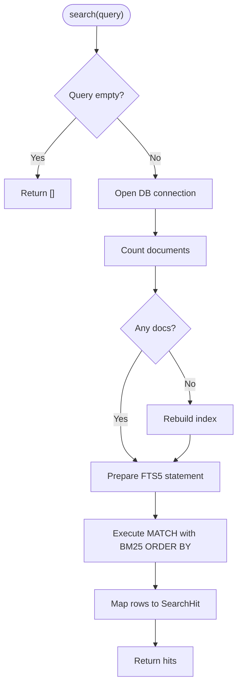
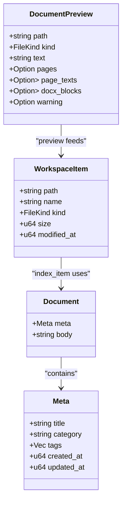
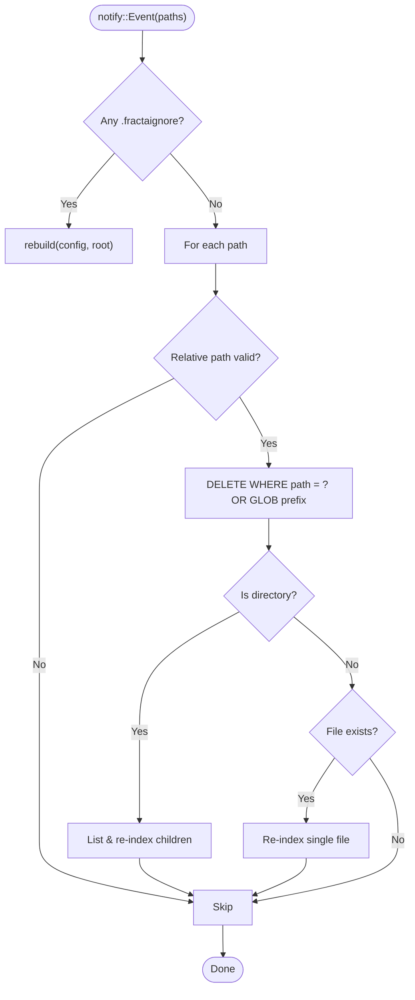
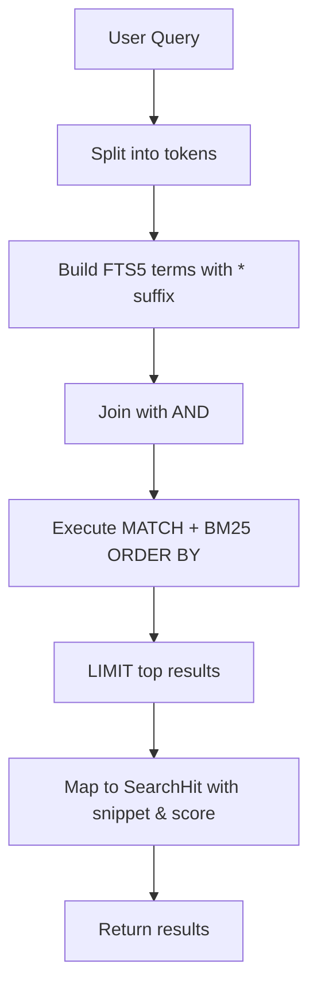
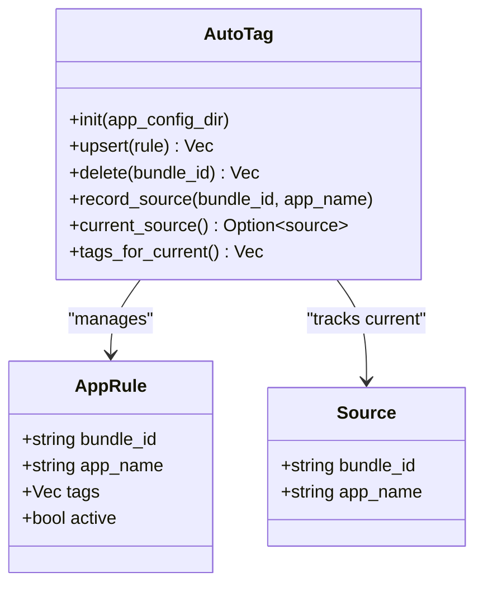
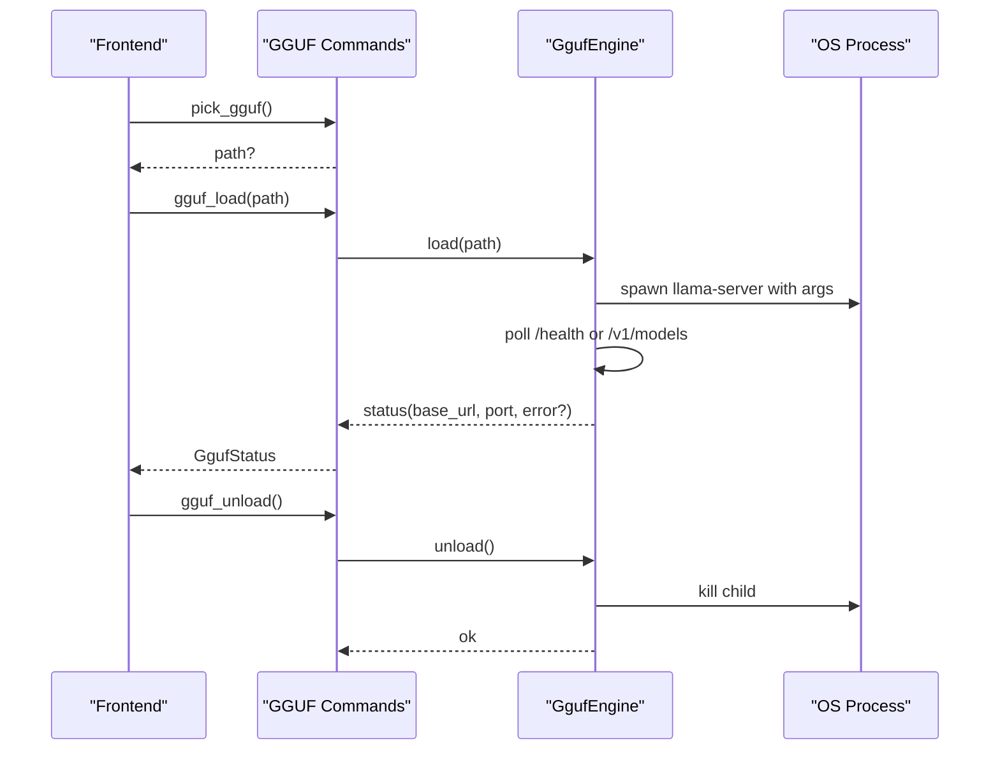
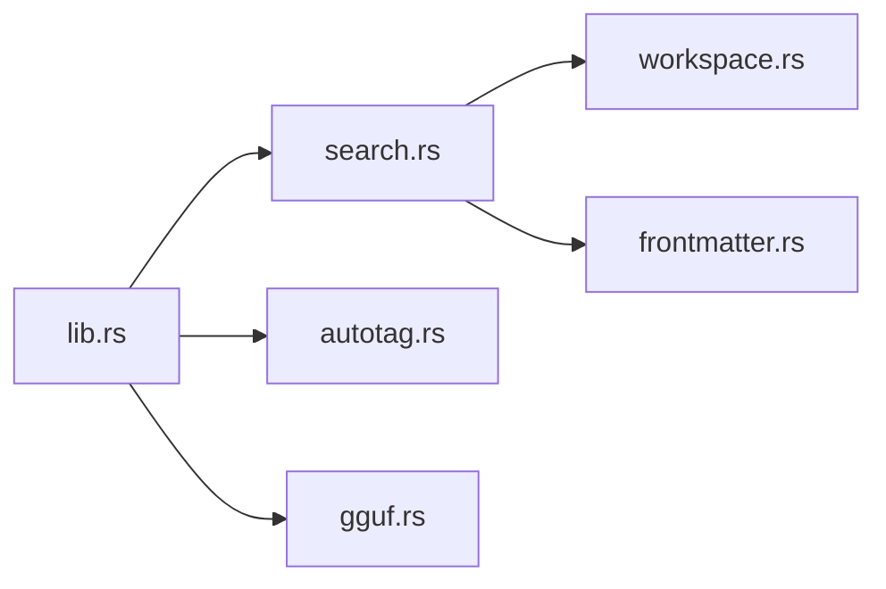

# Search and Indexing System

<cite>
**Referenced Files in This Document**
- [search.rs](file://apps/fracta/src-tauri/src/search.rs)
- [workspace.rs](file://apps/fracta/src-tauri/src/workspace.rs)
- [frontmatter.rs](file://apps/fracta/src-tauri/src/frontmatter.rs)
- [gguf.rs](file://apps/fracta/src-tauri/src/gguf.rs)
- [autotag.rs](file://apps/fracta/src-tauri/src/autotag.rs)
- [lib.rs](file://apps/fracta/src-tauri/src/lib.rs)
</cite>

## Table of Contents
1. [Introduction](#introduction)
2. [Project Structure](#project-structure)
3. [Core Components](#core-components)
4. [Architecture Overview](#architecture-overview)
5. [Detailed Component Analysis](#detailed-component-analysis)
6. [Dependency Analysis](#dependency-analysis)
7. [Performance Considerations](#performance-considerations)
8. [Troubleshooting Guide](#troubleshooting-guide)
9. [Conclusion](#conclusion)
10. [Appendices](#appendices)

## Introduction
This document explains the search and indexing system implemented in the Tauri backend for Fracta. It covers full-text search using SQLite FTS5, content tokenization and metadata extraction, incremental indexing via filesystem events, relevance ranking with BM25, auto-tagging driven by clipboard source detection, and local GGUF model inference through a managed llama-server subprocess. It also provides guidance on query construction, result filtering, performance optimization, cache management, and search result caching strategies.

## Project Structure
The search and indexing features are implemented in Rust within the Tauri application:
- search.rs: Full-text index creation, updates, and queries against an FTS5 virtual table.
- workspace.rs: File discovery, safe path resolution, encoding handling, and preview extraction for PDF/DOCX used during indexing.
- frontmatter.rs: Lightweight YAML frontmatter parsing to extract title, category, and tags for richer search fields.
- autotag.rs: Rule-based tagging based on the originating app of clipboard content.
- gguf.rs: Local GGUF model loading and HTTP server lifecycle management for inference.
- lib.rs: Tauri command registration, state management, and integration points (watcher, search commands, GGUF commands).

**Diagram sources**
- [lib.rs](file://apps/fracta/src-tauri/src/lib.rs)
- [search.rs](file://apps/fracta/src-tauri/src/search.rs)
- [workspace.rs](file://apps/fracta/src-tauri/src/workspace.rs)
- [frontmatter.rs](file://apps/fracta/src-tauri/src/frontmatter.rs)
- [autotag.rs](file://apps/fracta/src-tauri/src/autotag.rs)
- [gguf.rs](file://apps/fracta/src-tauri/src/gguf.rs)

**Section sources**
- [lib.rs](file://apps/fracta/src-tauri/src/lib.rs)
- [search.rs](file://apps/fracta/src-tauri/src/search.rs)
- [workspace.rs](file://apps/fracta/src-tauri/src/workspace.rs)
- [frontmatter.rs](file://apps/fracta/src-tauri/src/frontmatter.rs)
- [autotag.rs](file://apps/fracta/src-tauri/src/autotag.rs)
- [gguf.rs](file://apps/fracta/src-tauri/src/gguf.rs)

## Core Components
- SQLite FTS5 Index: Stores path, title, metadata, body, and kind; supports fast full-text matching and snippet generation.
- Incremental Indexing: Watches filesystem changes and updates only affected entries; rebuilds when necessary.
- Content Tokenization: Uses FTS5 tokenizer; enriches tokens with frontmatter fields (title, category, tags).
- Relevance Ranking: BM25 scoring with tuned parameters; returns top results with excerpts and scores.
- Auto-tagging: Tracks clipboard source app and applies rule-based tags to new entries.
- GGUF Inference: Manages a local llama-server process exposing an OpenAI-compatible endpoint for local model usage.

**Section sources**
- [search.rs](file://apps/fracta/src-tauri/src/search.rs)
- [workspace.rs](file://apps/fracta/src-tauri/src/workspace.rs)
- [frontmatter.rs](file://apps/fracta/src-tauri/src/frontmatter.rs)
- [autotag.rs](file://apps/fracta/src-tauri/src/autotag.rs)
- [gguf.rs](file://apps/fracta/src-tauri/src/gguf.rs)
- [lib.rs](file://apps/fracta/src-tauri/src/lib.rs)

## Architecture Overview
The system integrates file operations, indexing, and optional ML inference under a single Tauri runtime. The frontend invokes commands that trigger workspace scanning, indexing, or search queries. A background watcher ensures the index stays consistent with the vault.

**Diagram sources**
- [lib.rs](file://apps/fracta/src-tauri/src/lib.rs)
- [search.rs](file://apps/fracta/src-tauri/src/search.rs)
- [workspace.rs](file://apps/fracta/src-tauri/src/workspace.rs)
- [frontmatter.rs](file://apps/fracta/src-tauri/src/frontmatter.rs)

## Detailed Component Analysis

### Full-Text Search and Indexing (SQLite FTS5)
- Index schema: Virtual table documents with columns path, title, metadata, body, kind (UNINDEXED).
- Rebuild: Clears existing records and re-indexes all workspace items of supported kinds.
- Incremental updates: Deletes affected rows by exact path or glob prefix; re-indexes changed files/directories; triggers full rebuild if .fractaignore changes or root is modified.
- Query processing: Transforms user input into FTS5 terms with wildcard suffix per token; executes MATCH with snippet generation and BM25 scoring; limits results.
- Storage location: Per-vault SQLite database stored under config_dir/search, hashed from canonical root path.

**Diagram sources**
- [search.rs](file://apps/fracta/src-tauri/src/search.rs)

**Section sources**
- [search.rs](file://apps/fracta/src-tauri/src/search.rs)

### Content Tokenization and Metadata Enrichment
- Supported kinds: Markdown, Text, Csv, Json, Pdf, Docx.
- Text extraction:
  - Markdown/Text/Csv/Json: Read raw text preserving encoding (UTF-8, UTF-16LE/BE with BOM).
  - Pdf/Docx: Use preview to extract readable text locally.
- Frontmatter parsing: Extracts title, category, tags; constructs metadata string for richer search fields.
- Title derivation: If no explicit title, derive from first meaningful line.

**Diagram sources**
- [workspace.rs](file://apps/fracta/src-tauri/src/workspace.rs)
- [frontmatter.rs](file://apps/fracta/src-tauri/src/frontmatter.rs)
- [search.rs](file://apps/fracta/src-tauri/src/search.rs)

**Section sources**
- [workspace.rs](file://apps/fracta/src-tauri/src/workspace.rs)
- [frontmatter.rs](file://apps/fracta/src-tauri/src/frontmatter.rs)
- [search.rs](file://apps/fracta/src-tauri/src/search.rs)

### Incremental Indexing and Cache Management
- Filesystem watcher: Starts a recursive watcher on the vault root; emits workspace change events.
- Update strategy:
  - If any path is .fractaignore, perform full rebuild.
  - Delete affected rows by exact path or directory prefix.
  - Re-index changed files or all children of changed directories.
- Database cache:
  - SQLite FTS5 index persists under config_dir/search.
  - Schema migration handled by checking column existence; drops and recreates if needed.
  - Path hashing ensures per-vault isolation.

**Diagram sources**
- [search.rs](file://apps/fracta/src-tauri/src/search.rs)
- [lib.rs](file://apps/fracta/src-tauri/src/lib.rs)

**Section sources**
- [search.rs](file://apps/fracta/src-tauri/src/search.rs)
- [lib.rs](file://apps/fracta/src-tauri/src/lib.rs)

### Relevance Ranking and Result Filtering
- Ranking: BM25 scoring with parameters tuned in the query; higher scores indicate better relevance.
- Snippets: Generated around matches with custom markers and truncation.
- Filtering: Results limited to top N; kind mapping ensures correct type classification.
- Query construction: Terms split by whitespace and wrapped with wildcard suffix for partial matching.

**Diagram sources**
- [search.rs](file://apps/fracta/src-tauri/src/search.rs)

**Section sources**
- [search.rs](file://apps/fracta/src-tauri/src/search.rs)

### Auto-tagging Functionality and Rule-Based Classification
- Clipboard source tracking: On macOS, polls pasteboard change count and captures frontmost app bundle ID and name.
- Rule registry: Persists rules keyed by bundle ID; newly seen apps added inactive with default tag derived from app name or bundle segment.
- Tag application: When pasting, active rule’s tags are merged into entry metadata.
- Persistence: Rules saved to autotag.json in app config directory.

**Diagram sources**
- [autotag.rs](file://apps/fracta/src-tauri/src/autotag.rs)

**Section sources**
- [autotag.rs](file://apps/fracta/src-tauri/src/autotag.rs)
- [lib.rs](file://apps/fracta/src-tauri/src/lib.rs)

### Machine Learning Integration with GGUF Models
- Model selection: Native file picker filters for .gguf files.
- Server management: Spawns llama-server with model path, host, port, context size, GPU layers; waits until ready via health endpoints.
- Status API: Reports loaded/loading state, base URL, port, and errors.
- Unload: Kills running server and resets state.

**Diagram sources**
- [gguf.rs](file://apps/fracta/src-tauri/src/gguf.rs)
- [lib.rs](file://apps/fracta/src-tauri/src/lib.rs)

**Section sources**
- [gguf.rs](file://apps/fracta/src-tauri/src/gguf.rs)
- [lib.rs](file://apps/fracta/src-tauri/src/lib.rs)

## Dependency Analysis
- lib.rs orchestrates Tauri commands and manages shared state (Vault, AutoTag, GgufEngine).
- search.rs depends on workspace.rs for file listing and preview, and frontmatter.rs for metadata parsing.
- autotag.rs is independent but integrated via Tauri commands and platform-specific watchers.
- gguf.rs is isolated, managing external process lifecycle and exposing status/load/unload commands.

**Diagram sources**
- [lib.rs](file://apps/fracta/src-tauri/src/lib.rs)
- [search.rs](file://apps/fracta/src-tauri/src/search.rs)
- [workspace.rs](file://apps/fracta/src-tauri/src/workspace.rs)
- [frontmatter.rs](file://apps/fracta/src-tauri/src/frontmatter.rs)
- [autotag.rs](file://apps/fracta/src-tauri/src/autotag.rs)
- [gguf.rs](file://apps/fracta/src-tauri/src/gguf.rs)

**Section sources**
- [lib.rs](file://apps/fracta/src-tauri/src/lib.rs)
- [search.rs](file://apps/fracta/src-tauri/src/search.rs)
- [workspace.rs](file://apps/fracta/src-tauri/src/workspace.rs)
- [frontmatter.rs](file://apps/fracta/src-tauri/src/frontmatter.rs)
- [autotag.rs](file://apps/fracta/src-tauri/src/autotag.rs)
- [gguf.rs](file://apps/fracta/src-tauri/src/gguf.rs)

## Performance Considerations
- Index rebuild cost: O(N) over workspace items; consider batching large vaults or limiting watched directories.
- Incremental updates: Minimize I/O by deleting only affected rows and re-indexing changed paths; avoid full rebuild unless .fractaignore changes.
- BM25 tuning: Adjust parameters to balance precision/recall; test with representative queries.
- Snippet generation: Limits memory usage by truncating snippets; tune length for UX vs. performance.
- Encoding handling: Preserve UTF-8/UTF-16 encodings without conversion to avoid costly re-encoding.
- GGUF startup: Pre-warm models where possible; reuse running server across sessions to reduce cold start latency.

[No sources needed since this section provides general guidance]

## Troubleshooting Guide
- Empty search results:
  - Ensure index exists; search will rebuild if empty.
  - Verify workspace contains supported file kinds.
- Stale results after rename/delete:
  - Confirm update_paths handles both original and renamed paths; verify .fractaignore edits trigger rebuild.
- GGUF load failures:
  - Check llama-server availability and PATH; validate model file extension and integrity; monitor timeout and error messages.
- Auto-tagging not applied:
  - Ensure macOS clipboard watcher is running; confirm rule is active and tags are non-empty.

**Section sources**
- [search.rs](file://apps/fracta/src-tauri/src/search.rs)
- [gguf.rs](file://apps/fracta/src-tauri/src/gguf.rs)
- [autotag.rs](file://apps/fracta/src-tauri/src/autotag.rs)

## Conclusion
The search and indexing system combines robust file operations, efficient FTS5-based full-text search, and intelligent incremental updates to deliver fast, relevant results. Auto-tagging enhances discoverability through clipboard source attribution, while GGUF integration enables local AI capabilities. Proper tuning of BM25 parameters, careful cache management, and leveraging incremental indexing ensure scalability and responsiveness.

[No sources needed since this section summarizes without analyzing specific files]

## Appendices

### Example Search Query Construction
- Basic term search: Single word matches tokens with wildcard suffix.
- Multi-term queries: Multiple words joined with AND; each token gets wildcard suffix.
- Metadata-aware search: Include tags/category/title in metadata field for richer matches.

**Section sources**
- [search.rs](file://apps/fracta/src-tauri/src/search.rs)

### Result Filtering Techniques
- Filter by kind: Post-process results to include only desired file types.
- Score thresholding: Discard low-scoring results to improve precision.
- Excerpt highlighting: Use provided snippet markers to emphasize matches.

**Section sources**
- [search.rs](file://apps/fracta/src-tauri/src/search.rs)

### Incremental Indexing Best Practices
- Monitor .fractaignore changes to trigger full rebuilds.
- Batch multiple file changes to minimize repeated updates.
- Prefer directory-level updates when many files change together.

**Section sources**
- [search.rs](file://apps/fracta/src-tauri/src/search.rs)

### Cache Management Strategies
- Persist index under config_dir/search with per-vault hashing.
- Validate schema on open; drop and recreate if outdated.
- Avoid storing user content in index storage; keep vault portable.

**Section sources**
- [search.rs](file://apps/fracta/src-tauri/src/search.rs)

### Search Result Caching Recommendations
- Cache recent queries with TTL to reduce repeated work.
- Invalidate cache on workspace changes or index rebuilds.
- Store minimal metadata (path, score) to limit memory footprint.

[No sources needed since this section provides general guidance]