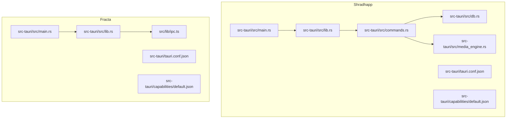
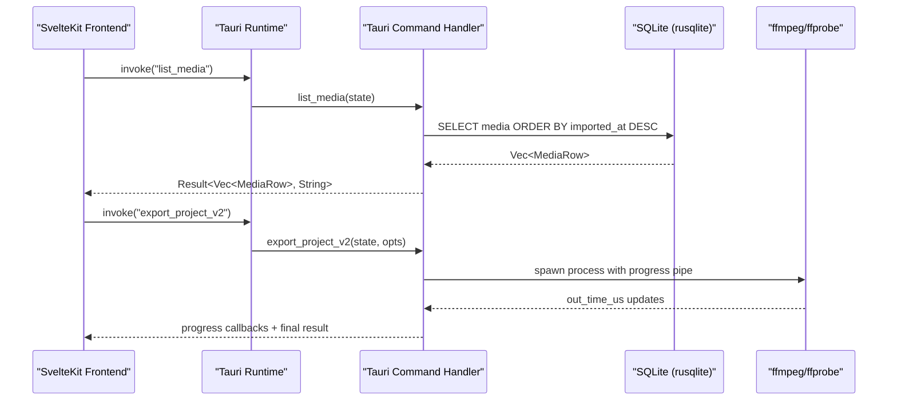
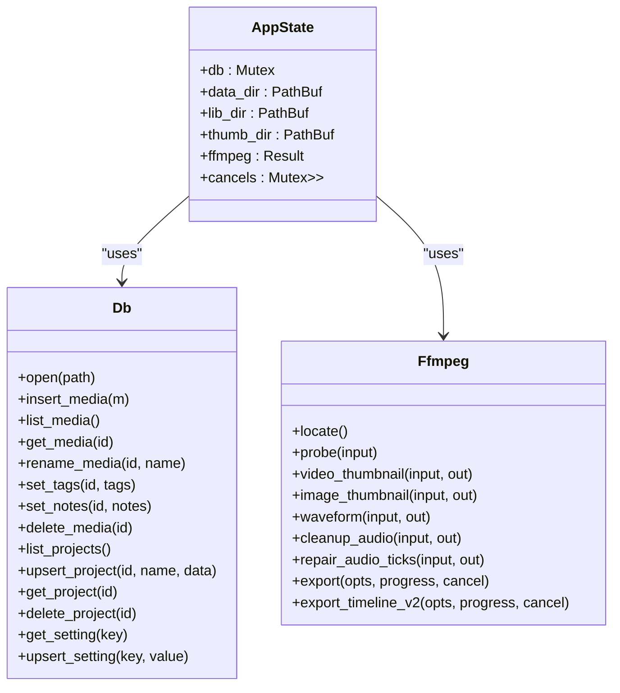
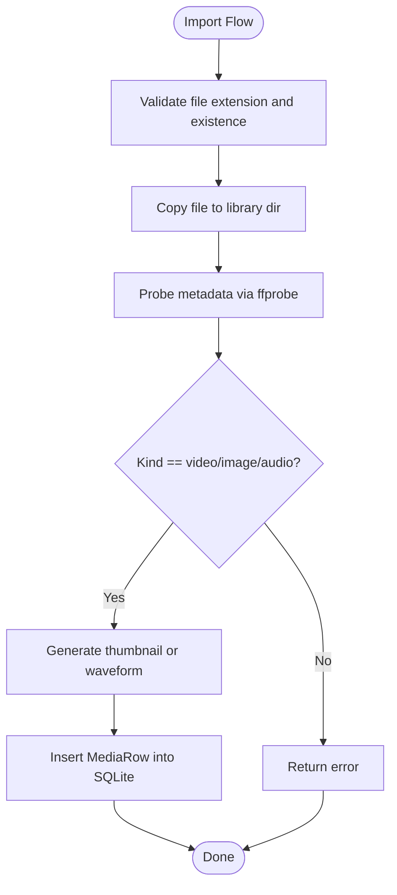
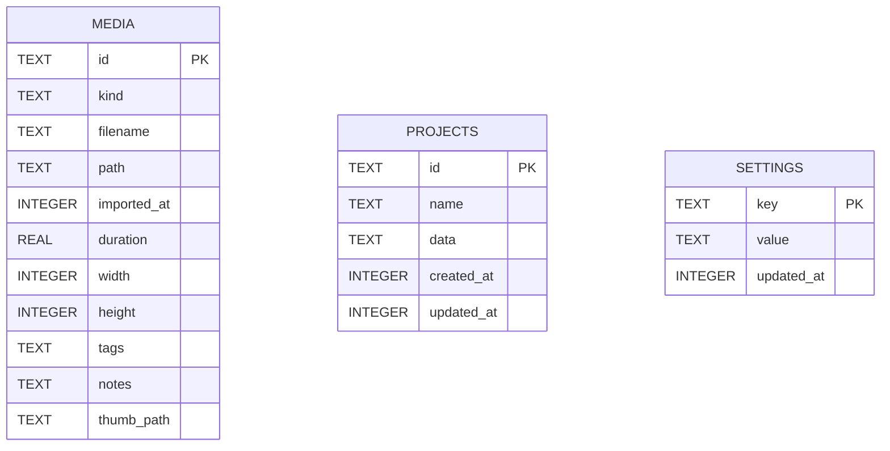
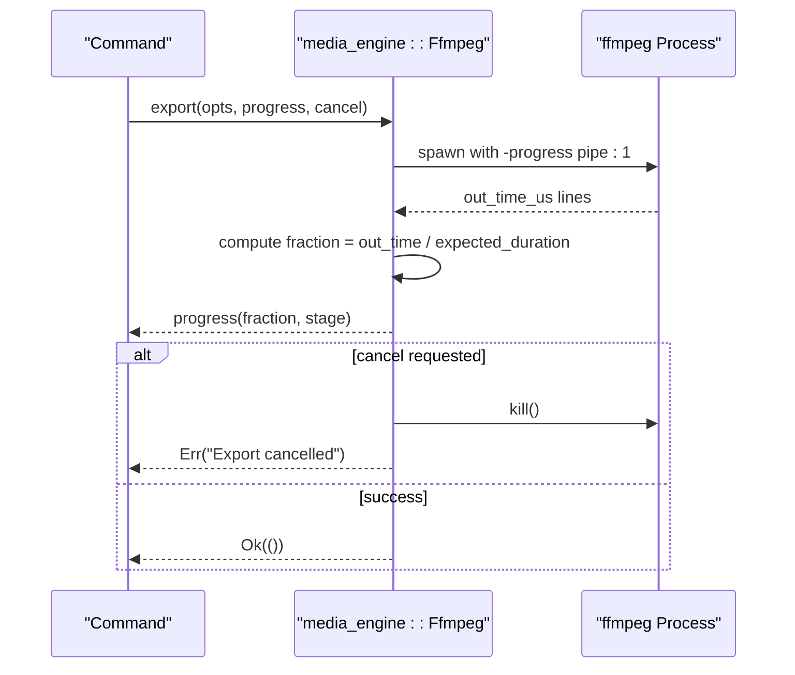
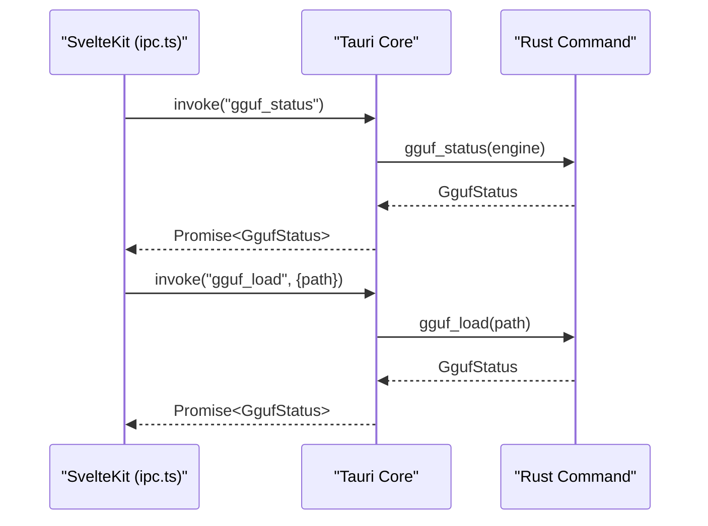
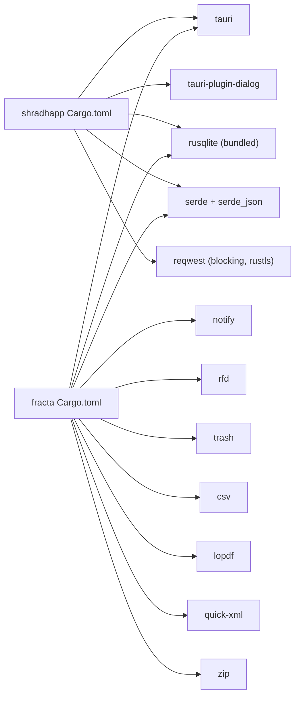

# Backend Development (Rust/Tauri)

<cite>
**Referenced Files in This Document**
- [apps/shradhapp/src-tauri/Cargo.toml](file://apps/shradhapp/src-tauri/Cargo.toml)
- [apps/shradhapp/src-tauri/tauri.conf.json](file://apps/shradhapp/src-tauri/tauri.conf.json)
- [apps/shradhapp/src-tauri/capabilities/default.json](file://apps/shradhapp/src-tauri/capabilities/default.json)
- [apps/shradhapp/src-tauri/src/main.rs](file://apps/shradhapp/src-tauri/src/main.rs)
- [apps/shradhapp/src-tauri/src/lib.rs](file://apps/shradhapp/src-tauri/src/lib.rs)
- [apps/shradhapp/src-tauri/src/commands.rs](file://apps/shradhapp/src-tauri/src/commands.rs)
- [apps/shradhapp/src-tauri/src/db.rs](file://apps/shradhapp/src-tauri/src/db.rs)
- [apps/shradhapp/src-tauri/src/media_engine.rs](file://apps/shradhapp/src-tauri/src/media_engine.rs)
- [apps/fracta/src-tauri/Cargo.toml](file://apps/fracta/src-tauri/Cargo.toml)
- [apps/fracta/src-tauri/src/lib.rs](file://apps/fracta/src-tauri/src/lib.rs)
- [apps/fracta/src-tauri/src/main.rs](file://apps/fracta/src-tauri/src/main.rs)
- [apps/fracta/src-tauri/capabilities/default.json](file://apps/fracta/src-tauri/capabilities/default.json)
- [apps/fracta/src/lib/ipc.ts](file://apps/fracta/src/lib/ipc.ts)
</cite>

## Table of Contents
1. Introduction
2. Project Structure
3. Core Components
4. Architecture Overview
5. Detailed Component Analysis
6. Dependency Analysis
7. Performance Considerations
8. Troubleshooting Guide
9. Conclusion

## Introduction
This document explains how to build robust backend functionality for Tauri applications using Rust, with a focus on command structure, file system operations, SQLite schema design, and security considerations. It also covers integration patterns between the Rust backend and SvelteKit frontend, IPC communication mechanisms, cross-platform compatibility, performance optimization, error handling, and debugging techniques specific to Tauri apps. The content is grounded in two real Tauri projects in this repository:
- Shradhapp: A personal video assembly app with media import, audio processing, project management, and YouTube channel listing.
- Fracta: A knowledge workspace app with vault management, recursive workspace browsing, search indexing, auto-tagging, and local GGUF model orchestration.

## Project Structure
Each Tauri application follows a consistent layout:
- src-tauri: Rust backend crate containing main entrypoint, lib module, commands, database layer, and optional native plugins.
- tauri.conf.json: Application metadata, window configuration, build hooks, and security settings.
- capabilities/default.json: Permission policy for the webview and plugins.
- Frontend (SvelteKit): TypeScript code that invokes Tauri commands via @tauri-apps/api/core invoke.

**Diagram sources**
- [apps/shradhapp/src-tauri/src/main.rs](file://apps/shradhapp/src-tauri/src/main.rs)
- [apps/shradhapp/src-tauri/src/lib.rs](file://apps/shradhapp/src-tauri/src/lib.rs)
- [apps/shradhapp/src-tauri/src/commands.rs](file://apps/shradhapp/src-tauri/src/commands.rs)
- [apps/shradhapp/src-tauri/src/db.rs](file://apps/shradhapp/src-tauri/src/db.rs)
- [apps/shradhapp/src-tauri/src/media_engine.rs](file://apps/shradhapp/src-tauri/src/media_engine.rs)
- [apps/fracta/src-tauri/src/main.rs](file://apps/fracta/src-tauri/src/main.rs)
- [apps/fracta/src-tauri/src/lib.rs](file://apps/fracta/src-tauri/src/lib.rs)
- [apps/fracta/src/lib/ipc.ts](file://apps/fracta/src/lib/ipc.ts)

**Section sources**
- [apps/shradhapp/src-tauri/Cargo.toml](file://apps/shradhapp/src-tauri/Cargo.toml)
- [apps/shradhapp/src-tauri/tauri.conf.json](file://apps/shradhapp/src-tauri/tauri.conf.json)
- [apps/shradhapp/src-tauri/capabilities/default.json](file://apps/shradhapp/src-tauri/capabilities/default.json)
- [apps/fracta/src-tauri/Cargo.toml](file://apps/fracta/src-tauri/Cargo.toml)
- [apps/fracta/src-tauri/capabilities/default.json](file://apps/fracta/src-tauri/capabilities/default.json)

## Core Components
- Tauri App Lifecycle:
  - Entry points initialize platform-specific behavior and delegate to library run functions.
  - Library modules configure plugins, set up state, create directories, open databases, and register commands.
- Commands:
  - Typed functions annotated as Tauri commands expose a strict API surface to the frontend.
  - Commands use shared AppState for DB access, paths, external tool availability, and cancellation tokens.
- Database Layer:
  - SQLite schema created at startup; WAL mode enabled for concurrency and durability.
  - Strongly typed rows for media, projects, and settings with JSON fields where appropriate.
- Media Engine:
  - Centralized ffmpeg/ffprobe interface for probing, thumbnails, waveform generation, audio cleanup, and export pipelines.
  - Progress reporting and cancellation support for long-running tasks.
- Workspace and Vault (Fracta):
  - Filesystem watcher, read/write operations, PDF/image/docx asset extraction, search indexing, and terminal execution with timeouts.

**Section sources**
- [apps/shradhapp/src-tauri/src/main.rs](file://apps/shradhapp/src-tauri/src/main.rs)
- [apps/shradhapp/src-tauri/src/lib.rs](file://apps/shradhapp/src-tauri/src/lib.rs)
- [apps/shradhapp/src-tauri/src/commands.rs](file://apps/shradhapp/src-tauri/src/commands.rs)
- [apps/shradhapp/src-tauri/src/db.rs](file://apps/shradhapp/src-tauri/src/db.rs)
- [apps/shradhapp/src-tauri/src/media_engine.rs](file://apps/shradhapp/src-tauri/src/media_engine.rs)
- [apps/fracta/src-tauri/src/lib.rs](file://apps/fracta/src-tauri/src/lib.rs)

## Architecture Overview
The architecture separates concerns across clear layers:
- Frontend (SvelteKit) calls Tauri commands via invoke.
- Tauri runtime dispatches to typed Rust handlers.
- Handlers coordinate AppState, DB, and external tools.
- External processes (ffmpeg, shell) are orchestrated from Rust with bounded resources and progress feedback.

**Diagram sources**
- [apps/shradhapp/src-tauri/src/lib.rs](file://apps/shradhapp/src-tauri/src/lib.rs)
- [apps/shradhapp/src-tauri/src/commands.rs](file://apps/shradhapp/src-tauri/src/commands.rs)
- [apps/shradhapp/src-tauri/src/db.rs](file://apps/shradhapp/src-tauri/src/db.rs)
- [apps/shradhapp/src-tauri/src/media_engine.rs](file://apps/shradhapp/src-tauri/src/media_engine.rs)

## Detailed Component Analysis

### Tauri Command Structure and State Management
- Commands are declared with #[tauri::command] and receive typed parameters and return Result types.
- AppState holds:
  - Mutex-wrapped Db instance for thread-safe access.
  - Paths for data, library, and thumbnails.
  - Result<Ffmpeg, String> indicating ffmpeg availability.
  - HashMap of cancel tokens keyed by operation IDs.
- Settings are normalized and persisted as JSON under a single key.

**Diagram sources**
- [apps/shradhapp/src-tauri/src/commands.rs](file://apps/shradhapp/src-tauri/src/commands.rs)
- [apps/shradhapp/src-tauri/src/db.rs](file://apps/shradhapp/src-tauri/src/db.rs)
- [apps/shradhapp/src-tauri/src/media_engine.rs](file://apps/shradhapp/src-tauri/src/media_engine.rs)

**Section sources**
- [apps/shradhapp/src-tauri/src/commands.rs](file://apps/shradhapp/src-tauri/src/commands.rs)
- [apps/shradhapp/src-tauri/src/lib.rs](file://apps/shradhapp/src-tauri/src/lib.rs)

### File System Operations
- Directory creation:
  - Data directory resolved via app.path().app_data_dir(); library and thumbnail subdirectories created if missing.
- Import flow:
  - Validate extension, copy into library, probe metadata, generate thumbnails/waveforms, persist row.
- Deletion:
  - Remove library copy and thumbnail files; original source outside library untouched.
- Workspace operations (Fracta):
  - Recursive listing, read binary assets, write files, move/delete/duplicate, reveal/open externally.

**Diagram sources**
- [apps/shradhapp/src-tauri/src/commands.rs](file://apps/shradhapp/src-tauri/src/commands.rs)
- [apps/shradhapp/src-tauri/src/media_engine.rs](file://apps/shradhapp/src-tauri/src/media_engine.rs)

**Section sources**
- [apps/shradhapp/src-tauri/src/commands.rs](file://apps/shradhapp/src-tauri/src/commands.rs)

### Database Schema Design with SQLite
- Tables:
  - media: id, kind, filename, path, imported_at, duration, width, height, tags (JSON), notes, thumb_path.
  - projects: id, name, data (versioned JSON), created_at, updated_at.
  - settings: key (PK), value (JSON), updated_at.
- Concurrency:
  - WAL journal mode enabled for better concurrent reads/writes.
- Types:
  - Tags stored as JSON arrays; deserialized into Vec<String>.
- Upserts:
  - Projects and settings use ON CONFLICT DO UPDATE for idempotent writes.

**Diagram sources**
- [apps/shradhapp/src-tauri/src/db.rs](file://apps/shradhapp/src-tauri/src/db.rs)

**Section sources**
- [apps/shradhapp/src-tauri/src/db.rs](file://apps/shradhapp/src-tauri/src/db.rs)

### Media Engine and FFmpeg Integration
- Probing:
  - ffprobe JSON output parsed for duration, dimensions, and audio presence.
- Thumbnails/Waveforms:
  - Video frames extracted at ~1s fallback to first frame; images scaled down; audio waveforms generated.
- Audio Cleanup:
  - Highpass, denoise, silence removal, loudness normalization; outputs AAC .m4a.
- Tick Repair:
  - Detects impulsive noise and produces repaired sibling file without modifying source.
- Export Pipelines:
  - v1 sequential segments normalized then concatenated; v2 timeline compiles filter graph for multi-track rendering.
- Progress and Cancellation:
  - Parses ffmpeg progress pipe for time-based progress; supports cancellation via AtomicBool.

**Diagram sources**
- [apps/shradhapp/src-tauri/src/media_engine.rs](file://apps/shradhapp/src-tauri/src/media_engine.rs)
- [apps/shradhapp/src-tauri/src/commands.rs](file://apps/shradhapp/src-tauri/src/commands.rs)

**Section sources**
- [apps/shradhapp/src-tauri/src/media_engine.rs](file://apps/shradhapp/src-tauri/src/media_engine.rs)

### Security Considerations
- Asset Protocol:
  - Enabled with scoped access to $APPDATA/** to safely serve user data.
- Capabilities:
  - Minimal permissions granted to core APIs, events, window controls, and dialog operations.
- Input Sanitization:
  - Filenames sanitized to safe characters; empty names defaulted.
- External Tool Safety:
  - All ffmpeg invocations go through a centralized engine; no direct command construction in UI.
- Terminal Execution (Fracta):
  - Bounded runtime (120s), output size limits, and explicit command invocation per user action.

**Section sources**
- [apps/shradhapp/src-tauri/tauri.conf.json](file://apps/shradhapp/src-tauri/tauri.conf.json)
- [apps/shradhapp/src-tauri/capabilities/default.json](file://apps/shradhapp/src-tauri/capabilities/default.json)
- [apps/fracta/src-tauri/capabilities/default.json](file://apps/fracta/src-tauri/capabilities/default.json)
- [apps/shradhapp/src-tauri/src/commands.rs](file://apps/shradhapp/src-tauri/src/commands.rs)
- [apps/fracta/src-tauri/src/lib.rs](file://apps/fracta/src-tauri/src/lib.rs)

### IPC Communication Between Rust and SvelteKit
- Frontend uses @tauri-apps/api/core invoke to call commands.
- Type definitions mirror Rust structs for strong typing on both sides.
- Example patterns:
  - Simple queries: list_entries, list_workspace.
  - Mutations: write_entry, write_workspace_file.
  - Long-running tasks: gguf_load, export flows (via progress callbacks).

**Diagram sources**
- [apps/fracta/src/lib/ipc.ts](file://apps/fracta/src/lib/ipc.ts)
- [apps/fracta/src-tauri/src/lib.rs](file://apps/fracta/src-tauri/src/lib.rs)

**Section sources**
- [apps/fracta/src/lib/ipc.ts](file://apps/fracta/src/lib/ipc.ts)
- [apps/fracta/src-tauri/src/lib.rs](file://apps/fracta/src-tauri/src/lib.rs)

### Cross-Platform Compatibility
- Platform detection:
  - Conditional compilation for macOS-specific clipboard source detection and Windows subsystem flags.
- Executable discovery:
  - ffmpeg located via PATH and platform-specific fallback directories.
- Shell commands:
  - cmd.exe on Windows; sh -lc on POSIX systems.
- Window state plugin:
  - Enabled on non-mobile platforms to preserve window state.

**Section sources**
- [apps/fracta/src-tauri/Cargo.toml](file://apps/fracta/src-tauri/Cargo.toml)
- [apps/shradhapp/src-tauri/src/media_engine.rs](file://apps/shradhapp/src-tauri/src/media_engine.rs)
- [apps/fracta/src-tauri/src/lib.rs](file://apps/fracta/src-tauri/src/lib.rs)

## Dependency Analysis
- Shradhapp dependencies:
  - tauri, tauri-plugin-dialog, serde, serde_json, rusqlite (bundled), uuid, base64, reqwest (blocking, rustls).
- Fracta dependencies:
  - tauri, rfd, trash, notify, serde, serde_json, csv, lopdf, quick-xml, rusqlite, zip, plus macOS-specific objc crates.

**Diagram sources**
- [apps/shradhapp/src-tauri/Cargo.toml](file://apps/shradhapp/src-tauri/Cargo.toml)
- [apps/fracta/src-tauri/Cargo.toml](file://apps/fracta/src-tauri/Cargo.toml)

**Section sources**
- [apps/shradhapp/src-tauri/Cargo.toml](file://apps/shradhapp/src-tauri/Cargo.toml)
- [apps/fracta/src-tauri/Cargo.toml](file://apps/fracta/src-tauri/Cargo.toml)

## Performance Considerations
- Database:
  - WAL mode improves concurrency; prepared statements reduce overhead.
- I/O:
  - Use std::fs for fast copies; avoid unnecessary allocations; sanitize inputs early.
- FFmpeg:
  - Prefer stream copy when possible; normalize segments once and concat; use veryfast preset for speed; leverage progress pipe for responsive UI.
- Async:
  - Offload blocking work to async_runtime::spawn_blocking to keep UI responsive.
- Memory:
  - Limit terminal output sizes; truncate large responses; reuse buffers where feasible.

[No sources needed since this section provides general guidance]

## Troubleshooting Guide
- FFmpeg not found:
  - Ensure PATH includes ffmpeg binaries or install via package manager; app logs warning and exposes RuntimeInfo for diagnostics.
- Export failures:
  - Inspect last few stderr lines returned by ffmpeg; verify input formats and codec compatibility.
- Database errors:
  - Check WAL mode initialization; validate JSON serialization for tags/settings.
- Permissions:
  - Verify capabilities default.json grants required permissions; ensure asset protocol scope matches data directories.
- Workspace watcher:
  - OS watchers are advisory; frontend should re-list on changes and handle transient errors gracefully.

**Section sources**
- [apps/shradhapp/src-tauri/src/media_engine.rs](file://apps/shradhapp/src-tauri/src/media_engine.rs)
- [apps/shradhapp/src-tauri/src/db.rs](file://apps/shradhapp/src-tauri/src/db.rs)
- [apps/shradhapp/src-tauri/capabilities/default.json](file://apps/shradhapp/src-tauri/capabilities/default.json)
- [apps/fracta/src-tauri/src/lib.rs](file://apps/fracta/src-tauri/src/lib.rs)

## Conclusion
This guide outlined the Tauri backend patterns used in the repository: typed commands, robust SQLite schemas, centralized media processing, secure configurations, and clean IPC boundaries. By following these patterns, developers can implement complex backend functionality efficiently while maintaining cross-platform compatibility, performance, and security. For beginners, start with simple commands and gradually introduce async operations and external tool integrations. For experienced developers, leverage the existing AppState and media engine abstractions to scale features like timeline editing, batch exports, and advanced analytics.