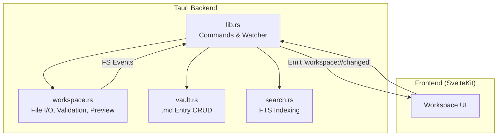
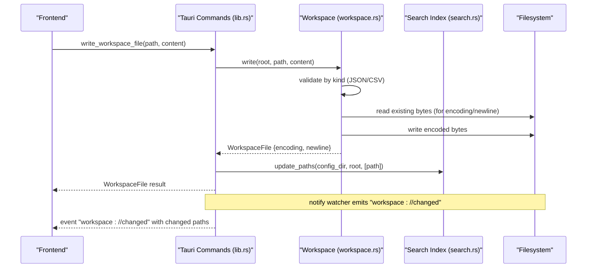
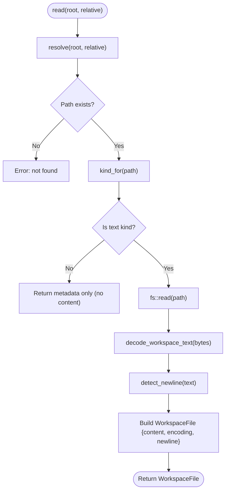
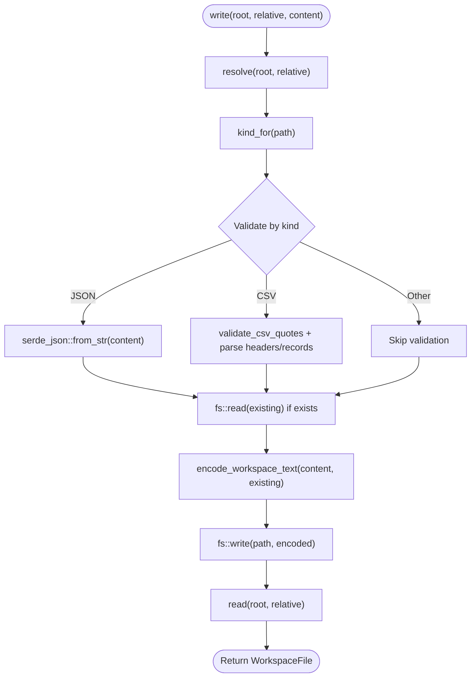
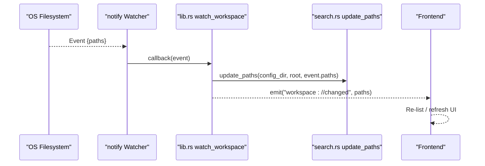
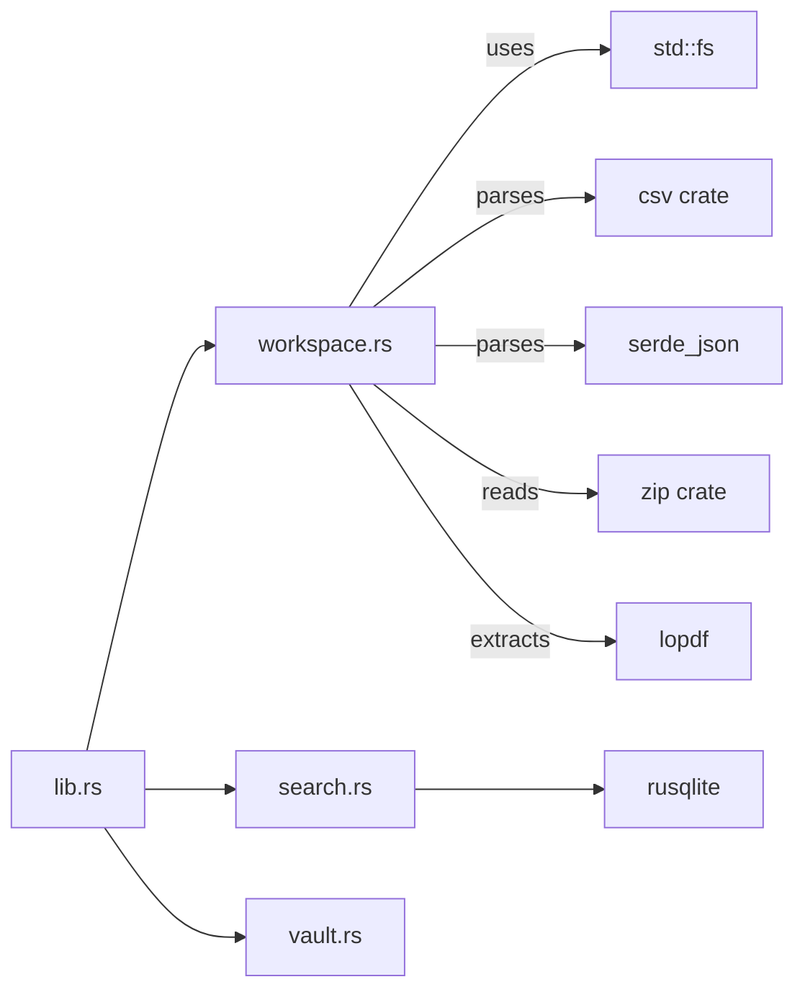

# File Operations

<cite>
**Referenced Files in This Document**
- [workspace.rs](file://apps/fracta/src-tauri/src/workspace.rs)
- [vault.rs](file://apps/fracta/src-tauri/src/vault.rs)
- [lib.rs](file://apps/fracta/src-tauri/src/lib.rs)
- [search.rs](file://apps/fracta/src-tauri/src/search.rs)
</cite>

## Table of Contents
1. [Introduction](#introduction)
2. [Project Structure](#project-structure)
3. [Core Components](#core-components)
4. [Architecture Overview](#architecture-overview)
5. [Detailed Component Analysis](#detailed-component-analysis)
6. [Dependency Analysis](#dependency-analysis)
7. [Performance Considerations](#performance-considerations)
8. [Troubleshooting Guide](#troubleshooting-guide)
9. [Conclusion](#conclusion)

## Introduction
This document explains how Fracta’s workspace system performs file operations for Markdown, Text, CSV, and JSON files. It covers read/write behavior, encoding preservation, newline conventions, validation, error handling, atomic write strategies, cross-platform compatibility, file watching and change detection, real-time updates, and performance considerations for large files and batch operations.

## Project Structure
The workspace file operations are implemented in the Tauri backend:
- Workspace I/O and type-specific logic live in a dedicated module that handles path safety, content reading/writing, previewing, and conversions.
- The Tauri command layer exposes these capabilities to the frontend via typed commands.
- A separate vault module manages .md entries with frontmatter metadata.
- Search indexing uses an SQLite FTS5 index stored under app config, updated incrementally on filesystem events.

**Diagram sources**
- [lib.rs:100-165](file://apps/fracta/src-tauri/src/lib.rs#L100-L165)
- [workspace.rs:257-430](file://apps/fracta/src-tauri/src/workspace.rs#L257-L430)
- [vault.rs:128-278](file://apps/fracta/src-tauri/src/vault.rs#L128-L278)
- [search.rs:24-86](file://apps/fracta/src-tauri/src/search.rs#L24-L86)

**Section sources**
- [lib.rs:100-165](file://apps/fracta/src-tauri/src/lib.rs#L100-L165)
- [workspace.rs:1-120](file://apps/fracta/src-tauri/src/workspace.rs#L1-L120)
- [vault.rs:1-60](file://apps/fracta/src-tauri/src/vault.rs#L1-L60)
- [search.rs:1-40](file://apps/fracta/src-tauri/src/search.rs#L1-L40)

## Core Components
- FileKind classification determines how files are handled (Markdown, Text, Csv, Json, Pdf, Docx, Asset).
- WorkspaceItem and WorkspaceFile carry metadata such as size, modified time, encoding, and newline convention.
- Path resolution enforces project containment and prevents traversal or symlink escapes.
- Read returns text content for supported types with detected encoding and newline style; binary assets are returned as bytes through specialized endpoints.
- Write validates content by type (JSON parse, CSV header/record checks), preserves existing encoding/newlines, and writes back safely.
- Preview extracts readable text from PDFs and DOCX without exposing raw paths to the webview.
- Conversion utilities transform CSV↔JSON with optional type inference and delimiter detection.

**Section sources**
- [workspace.rs:21-32](file://apps/fracta/src-tauri/src/workspace.rs#L21-L32)
- [workspace.rs:34-57](file://apps/fracta/src-tauri/src/workspace.rs#L34-L57)
- [workspace.rs:124-141](file://apps/fracta/src-tauri/src/workspace.rs#L124-L141)
- [workspace.rs:257-285](file://apps/fracta/src-tauri/src/workspace.rs#L257-L285)
- [workspace.rs:384-430](file://apps/fracta/src-tauri/src/workspace.rs#L384-L430)
- [workspace.rs:687-767](file://apps/fracta/src-tauri/src/workspace.rs#L687-L767)
- [workspace.rs:1138-1230](file://apps/fracta/src-tauri/src/workspace.rs#L1138-L1230)

## Architecture Overview
The workspace API is exposed through Tauri commands. The frontend calls commands like list_workspace_file, write_workspace_file, watch_workspace, and others. On write, the backend validates and persists content, then updates the search index and emits a filesystem change event to refresh the UI.

**Diagram sources**
- [lib.rs:278-288](file://apps/fracta/src-tauri/src/lib.rs#L278-L288)
- [workspace.rs:384-430](file://apps/fracta/src-tauri/src/workspace.rs#L384-L430)
- [search.rs:42-86](file://apps/fracta/src-tauri/src/search.rs#L42-L86)
- [lib.rs:138-165](file://apps/fracta/src-tauri/src/lib.rs#L138-L165)

## Detailed Component Analysis

### Read Operations and Encoding Preservation
- Supported text kinds: Markdown, Text, Csv, Json.
- Decoding strategy:
  - UTF-8 BOM files are decoded as UTF-8 with BOM preserved.
  - UTF-16LE/BE BOM files are decoded accordingly.
  - Other legacy encodings are rejected for editing to avoid destructive guesses.
- Newline detection:
  - Detects CRLF, LF, CR, or none; reported back to the UI.
- Binary assets:
  - PDF bytes and media assets are served via dedicated endpoints after extension and size checks.
  - Image assets are limited to common image formats.

**Diagram sources**
- [workspace.rs:257-285](file://apps/fracta/src-tauri/src/workspace.rs#L257-L285)
- [workspace.rs:470-512](file://apps/fracta/src-tauri/src/workspace.rs#L470-L512)
- [workspace.rs:541-551](file://apps/fracta/src-tauri/src/workspace.rs#L541-L551)

**Section sources**
- [workspace.rs:257-285](file://apps/fracta/src-tauri/src/workspace.rs#L257-L285)
- [workspace.rs:470-512](file://apps/fracta/src-tauri/src/workspace.rs#L470-L512)
- [workspace.rs:541-551](file://apps/fracta/src-tauri/src/workspace.rs#L541-L551)

### Write Operations, Validation, and Atomicity Strategy
- Allowed kinds for editing: Markdown, Text, Csv, Json.
- Validation:
  - JSON: parsed to ensure valid structure before writing.
  - CSV: quotes balanced; headers validated; records iterated to detect invalid rows.
- Encoding preservation:
  - Existing file bytes are read first to determine encoding; content is re-encoded to match original (UTF-8, UTF-8 BOM, UTF-16LE/BE).
  - Newline convention is preserved implicitly by writing the same byte sequence as provided by the editor.
- Atomicity approach:
  - Writes use direct fs::write; there is no explicit temp-file + rename pattern in this codebase.
  - Safety is achieved by pre-validation and strict path containment; errors prevent partial writes.

**Diagram sources**
- [workspace.rs:384-430](file://apps/fracta/src-tauri/src/workspace.rs#L384-L430)
- [workspace.rs:496-539](file://apps/fracta/src-tauri/src/workspace.rs#L496-L539)

**Section sources**
- [workspace.rs:384-430](file://apps/fracta/src-tauri/src/workspace.rs#L384-L430)
- [workspace.rs:496-539](file://apps/fracta/src-tauri/src/workspace.rs#L496-L539)

### Cross-Platform Compatibility
- Path resolution rejects absolute paths and traversal components; symlinks outside the workspace are blocked.
- External open/reveal commands are dispatched using platform-appropriate tools (open, explorer, xdg-open).
- Media asset size limits protect against oversized inline loads.

**Section sources**
- [workspace.rs:143-173](file://apps/fracta/src-tauri/src/workspace.rs#L143-L173)
- [workspace.rs:638-682](file://apps/fracta/src-tauri/src/workspace.rs#L638-L682)
- [workspace.rs:328-364](file://apps/fracta/src-tauri/src/workspace.rs#L328-L364)

### File Watching, Change Detection, and Real-Time Updates
- A recommended OS watcher monitors the workspace recursively.
- On changes, the search index is updated incrementally for affected paths; a “workspace://changed” event is emitted with the list of changed paths.
- Frontend should re-list via normal commands and keep a polling fallback for browser environments or transient watcher errors.

**Diagram sources**
- [lib.rs:138-165](file://apps/fracta/src-tauri/src/lib.rs#L138-L165)
- [search.rs:42-86](file://apps/fracta/src-tauri/src/search.rs#L42-L86)

**Section sources**
- [lib.rs:138-165](file://apps/fracta/src-tauri/src/lib.rs#L138-L165)
- [search.rs:42-86](file://apps/fracta/src-tauri/src/search.rs#L42-L86)

### Examples of Safe File Creation and Content Validation
- Creating folders: create_folder ensures the target does not already exist and creates nested directories safely.
- Validating CSV:
  - Balanced quotes check prevents malformed records.
  - Delimiter detection chooses the most frequent unquoted delimiter on the first record, falling back to extension-based defaults (e.g., tab for .tsv).
- Validating JSON:
  - Parsing ensures structural validity before writing.

**Section sources**
- [workspace.rs:573-579](file://apps/fracta/src-tauri/src/workspace.rs#L573-L579)
- [workspace.rs:434-464](file://apps/fracta/src-tauri/src/workspace.rs#L434-L464)
- [workspace.rs:395-419](file://apps/fracta/src-tauri/src/workspace.rs#L395-L419)

### Previewing Non-Editable Formats
- PDF preview extracts page texts locally; unsupported features are noted via warnings.
- DOCX preview parses XML to extract headings, paragraphs, lists, tables, and embedded images; external links and image relationships are resolved within the archive.

**Section sources**
- [workspace.rs:687-767](file://apps/fracta/src-tauri/src/workspace.rs#L687-L767)
- [workspace.rs:769-923](file://apps/fracta/src-tauri/src/workspace.rs#L769-L923)

### Data Conversions
- CSV to JSON:
  - Validates unique, non-empty headers; optionally infers boolean/number types.
- JSON to CSV:
  - Requires top-level array of objects; flattens keys across rows.

**Section sources**
- [workspace.rs:1138-1191](file://apps/fracta/src-tauri/src/workspace.rs#L1138-L1191)
- [workspace.rs:1193-1230](file://apps/fracta/src-tauri/src/workspace.rs#L1193-L1230)

## Dependency Analysis
- lib.rs wires Tauri commands to workspace and search modules.
- workspace.rs depends on standard library filesystem, CSV/JSON parsers, ZIP reader for DOCX, and PDF extractor.
- search.rs depends on rusqlite for FTS5 indexing and uses workspace listing/preview to build indexes.
- vault.rs provides entry-level .md management with frontmatter parsing and timestamps.

**Diagram sources**
- [lib.rs:1-22](file://apps/fracta/src-tauri/src/lib.rs#L1-L22)
- [workspace.rs:7-16](file://apps/fracta/src-tauri/src/workspace.rs#L7-L16)
- [search.rs:1-14](file://apps/fracta/src-tauri/src/search.rs#L1-L14)

**Section sources**
- [lib.rs:1-22](file://apps/fracta/src-tauri/src/lib.rs#L1-L22)
- [workspace.rs:7-16](file://apps/fracta/src-tauri/src/workspace.rs#L7-L16)
- [search.rs:1-14](file://apps/fracta/src-tauri/src/search.rs#L1-L14)

## Performance Considerations
- Large files:
  - Media assets enforce a maximum inline size limit to avoid memory pressure.
  - PDF/DOCX previews operate on local extraction rather than full rendering pipelines.
- Batch operations:
  - Workspace listing walks the directory tree; ignore patterns reduce noise.
  - Search indexing supports incremental updates based on filesystem events; full rebuild is used when necessary (e.g., .fractaignore changes).
- Memory and streaming:
  - CSV/JSON conversions stream through readers/writers where applicable.
  - Avoid loading entire binary assets into memory unless explicitly requested via asset endpoints.

[No sources needed since this section provides general guidance]

## Troubleshooting Guide
- Path traversal or symlink escape attempts return clear errors; ensure relative paths are correct and within the workspace.
- Invalid JSON or malformed CSV will fail validation; inspect headers and quote balancing.
- Unsupported encodings cannot be edited; convert to UTF-8 or preserve BOM variants.
- Watcher events may be unreliable in some environments; rely on the frontend polling fallback and re-list commands.
- External open/reveal failures indicate missing OS handlers; verify platform-specific tool availability.

**Section sources**
- [workspace.rs:143-173](file://apps/fracta/src-tauri/src/workspace.rs#L143-L173)
- [workspace.rs:395-419](file://apps/fracta/src-tauri/src/workspace.rs#L395-L419)
- [workspace.rs:470-512](file://apps/fracta/src-tauri/src/workspace.rs#L470-L512)
- [lib.rs:138-165](file://apps/fracta/src-tauri/src/lib.rs#L138-L165)
- [workspace.rs:638-682](file://apps/fracta/src-tauri/src/workspace.rs#L638-L682)

## Conclusion
Fracta’s workspace system provides robust, safe, and predictable file operations for text-based content with strong validation and encoding preservation. While it avoids explicit atomic temp-file writes, it mitigates risks through strict validation and path containment. File watching enables responsive updates, and search indexing remains efficient via incremental updates. For large files, built-in limits and localized extraction help maintain performance.