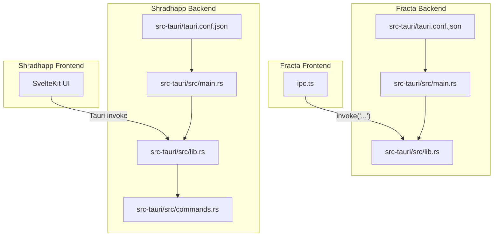
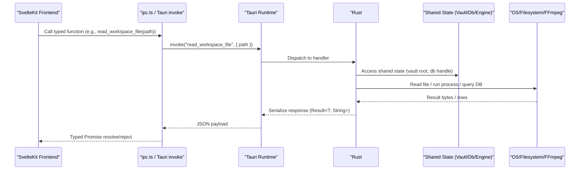
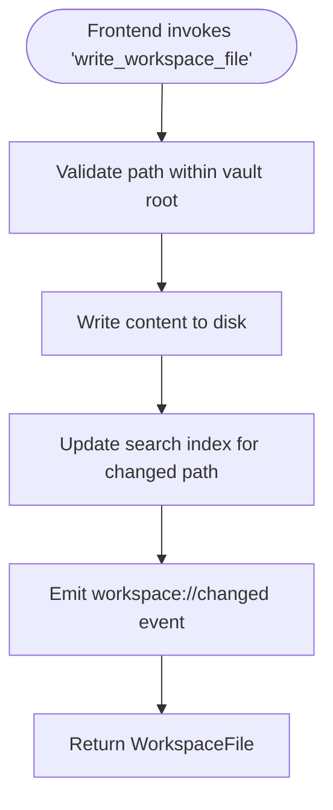
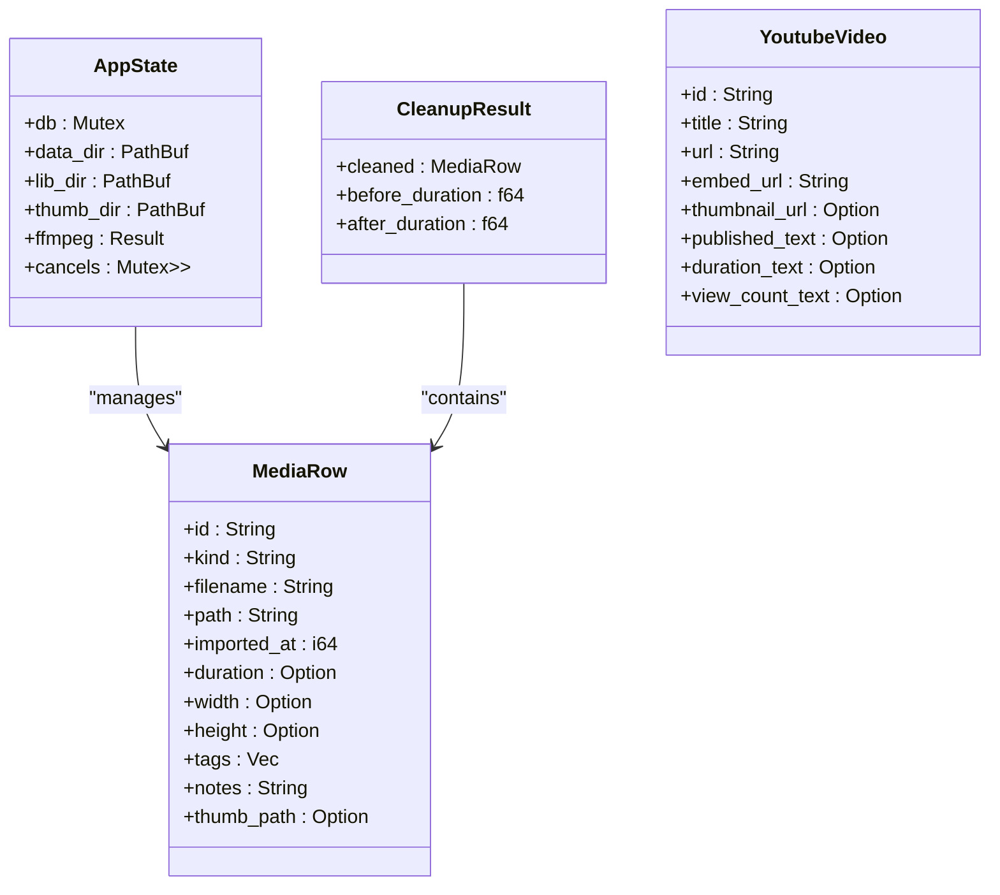
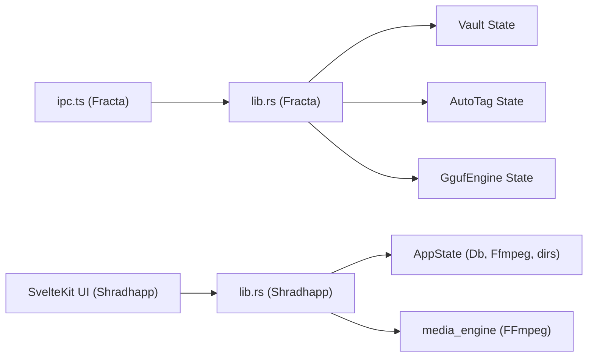

# Tauri Command Structure

<cite>
**Referenced Files in This Document**
- [ipc.ts](file://apps/fracta/src/lib/ipc.ts)
- [main.rs](file://apps/fracta/src-tauri/src/main.rs)
- [lib.rs](file://apps/fracta/src-tauri/src/lib.rs)
- [tauri.conf.json](file://apps/fracta/src-tauri/tauri.conf.json)
- [commands.rs](file://apps/shradhapp/src-tauri/src/commands.rs)
- [lib.rs](file://apps/shradhapp/src-tauri/src/lib.rs)
- [main.rs](file://apps/shradhapp/src-tauri/src/main.rs)
- [tauri.conf.json](file://apps/shradhapp/src-tauri/tauri.conf.json)
</cite>

## Table of Contents
1. [Introduction](#introduction)
2. [Project Structure](#project-structure)
3. [Core Components](#core-components)
4. [Architecture Overview](#architecture-overview)
5. [Detailed Component Analysis](#detailed-component-analysis)
6. [Dependency Analysis](#dependency-analysis)
7. [Performance Considerations](#performance-considerations)
8. [Troubleshooting Guide](#troubleshooting-guide)
9. [Conclusion](#conclusion)

## Introduction
This document explains the Tauri command structure and IPC communication patterns used by the SvelteKit frontends to call Rust commands. It covers how commands are defined, registered, invoked from TypeScript, parameter handling, return value serialization, async operation patterns, error handling strategies, security considerations, validation techniques, and performance optimization specific to Tauri IPC. Practical examples are drawn from two applications: Fracta (workspace and vault operations) and Shradhapp (media processing and database queries).

## Project Structure
The repository contains two Tauri-enabled SvelteKit apps that demonstrate different IPC patterns:
- Fracta: A knowledge workspace app with file system operations, search indexing, and local model loading.
- Shradhapp: A media studio app with database-backed media management, FFmpeg-based processing, and YouTube metadata fetching.

**Diagram sources**
- [ipc.ts](file://apps/fracta/src/lib/ipc.ts)
- [main.rs](file://apps/fracta/src-tauri/src/main.rs)
- [lib.rs](file://apps/fracta/src-tauri/src/lib.rs)
- [tauri.conf.json](file://apps/fracta/src-tauri/tauri.conf.json)
- [commands.rs](file://apps/shradhapp/src-tauri/src/commands.rs)
- [lib.rs](file://apps/shradhapp/src-tauri/src/lib.rs)
- [main.rs](file://apps/shradhapp/src-tauri/src/main.rs)
- [tauri.conf.json](file://apps/shradhapp/src-tauri/tauri.conf.json)

**Section sources**
- [ipc.ts](file://apps/fracta/src/lib/ipc.ts)
- [main.rs](file://apps/fracta/src-tauri/src/main.rs)
- [lib.rs](file://apps/fracta/src-tauri/src/lib.rs)
- [tauri.conf.json](file://apps/fracta/src-tauri/tauri.conf.json)
- [commands.rs](file://apps/shradhapp/src-tauri/src/commands.rs)
- [lib.rs](file://apps/shradhapp/src-tauri/src/lib.rs)
- [main.rs](file://apps/shradhapp/src-tauri/src/main.rs)
- [tauri.conf.json](file://apps/shradhapp/src-tauri/tauri.conf.json)

## Core Components
- Frontend IPC client (TypeScript):
  - Centralized module wrapping @tauri-apps/api/core invoke calls for each backend command.
  - Strongly typed request/response interfaces ensure consistent payloads across the boundary.
- Backend command handlers (Rust):
  - Functions annotated with #[tauri::command] exposed via tauri::generate_handler! macro.
  - State injection using tauri::State<T> for shared resources like databases, watchers, and engines.
  - Async support via async fn or spawn_blocking for CPU-bound work.
- Configuration:
  - tauri.conf.json defines window settings, CSP, asset protocol scoping, and build hooks.

Key responsibilities:
- Fracta: Vault and workspace file operations, search indexing, terminal execution, GGUF engine lifecycle.
- Shradhapp: Media import, thumbnail/waveform generation, project CRUD, export pipelines, YouTube scraping.

**Section sources**
- [ipc.ts](file://apps/fracta/src/lib/ipc.ts)
- [lib.rs](file://apps/fracta/src-tauri/src/lib.rs)
- [commands.rs](file://apps/shradhapp/src-tauri/src/commands.rs)
- [lib.rs](file://apps/shradhapp/src-tauri/src/lib.rs)
- [tauri.conf.json](file://apps/fracta/src-tauri/tauri.conf.json)
- [tauri.conf.json](file://apps/shradhapp/src-tauri/tauri.conf.json)

## Architecture Overview
The Tauri IPC flow connects a SvelteKit frontend to Rust commands through a typed bridge. Commands can be synchronous or asynchronous, use stateful services, and emit events back to the frontend.

**Diagram sources**
- [ipc.ts](file://apps/fracta/src/lib/ipc.ts)
- [lib.rs](file://apps/fracta/src-tauri/src/lib.rs)
- [commands.rs](file://apps/shradhapp/src-tauri/src/commands.rs)
- [lib.rs](file://apps/shradhapp/src-tauri/src/lib.rs)

## Detailed Component Analysis

### Fracta: Workspace and Vault Commands
- Command registration and invocation:
  - All commands are declared with #[tauri::command] and registered in generate_handler!.
  - Frontend exposes functions like list_workspace, read_workspace_file, write_workspace_file, preview_workspace_document, search_workspace, convert_csv_to_json, etc.
- Parameter handling:
  - Parameters are passed as JSON objects; Rust functions accept primitive types, strings, vectors, and optional fields.
  - Example: read_workspace_file(path: String), write_workspace_file(path: String, content: String).
- Return value serialization:
  - Responses are structs derived with serde::{Serialize, Deserialize} and returned via Result<T, String> or custom result wrappers.
  - Examples include WorkspaceFile, DocumentPreview, LinkReport, GraphReport, TerminalResult.
- Async patterns:
  - Long-running tasks are offloaded using tauri::async_runtime::spawn_blocking to avoid blocking the event loop.
  - Example: gguf_load spawns a blocking load task and returns status updates.
- Events:
  - File watcher emits workspace://changed with updated paths; frontend listens and refreshes UI.
- Security and validation:
  - Paths are validated against the configured vault root before any filesystem access.
  - Terminal command execution is bounded by timeout and output size limits.

**Diagram sources**
- [lib.rs](file://apps/fracta/src-tauri/src/lib.rs)

**Section sources**
- [ipc.ts](file://apps/fracta/src/lib/ipc.ts)
- [lib.rs](file://apps/fracta/src-tauri/src/lib.rs)
- [tauri.conf.json](file://apps/fracta/src-tauri/tauri.conf.json)

### Shradhapp: Media Processing and Database Commands
- Command registration and invocation:
  - Commands are defined in commands.rs and registered in lib.rs generate_handler!.
  - Examples: list_media, import_files, save_recording, cleanup_audio, repair_audio_ticks, export_project, list_youtube_channel_videos.
- Parameter handling:
  - Complex DTOs are serialized/deserialized with serde; camelCase naming enforced via #[serde(rename_all = "camelCase")].
  - Example: AppSettings, ExportOptions, ProjectData, Clip.
- Return value serialization:
  - Structured responses like CleanupResult, YoutubeVideo, MediaRow are returned via Result<T, String>.
- Async patterns:
  - Network I/O and heavy processing are offloaded with spawn_blocking.
  - Example: list_youtube_channel_videos fetches HTML and parses JSON asynchronously.
- Database integration:
  - SQLite-backed Db is wrapped in Mutex<Db> inside AppState; commands lock and operate safely.
- Media processing:
  - FFmpeg is located at startup; thumbnails and waveforms generated per media kind.
  - Audio cleanup and tick repair produce new sibling files without modifying originals.

**Diagram sources**
- [commands.rs](file://apps/shradhapp/src-tauri/src/commands.rs)
- [lib.rs](file://apps/shradhapp/src-tauri/src/lib.rs)

**Section sources**
- [commands.rs](file://apps/shradhapp/src-tauri/src/commands.rs)
- [lib.rs](file://apps/shradhapp/src-tauri/src/lib.rs)
- [tauri.conf.json](file://apps/shradhapp/src-tauri/tauri.conf.json)

### Command Lifecycle and Error Handling
- Lifecycle:
  - Frontend calls invoke(name, payload).
  - Tauri runtime dispatches to the matching #[tauri::command] function.
  - Handler validates inputs, accesses shared state, performs I/O or computation, and returns Result<T, E>.
  - Errors are serialized into string messages or typed errors; frontend receives rejected promises.
- Error strategies:
  - Use descriptive error messages for user-facing issues (e.g., invalid paths, missing files).
  - For IO/network failures, wrap errors with context and propagate up.
  - In Shradhapp, ffmpeg availability is checked early; commands fail fast with informative messages.
- Validation:
  - Input sanitization (e.g., sanitize filename, trim tags, enforce allowed enums).
  - Path containment checks relative to vault root or data directories.

**Section sources**
- [lib.rs](file://apps/fracta/src-tauri/src/lib.rs)
- [commands.rs](file://apps/shradhapp/src-tauri/src/commands.rs)

### Security Considerations
- Content Security Policy:
  - Fracta configures CSP to restrict script/style/img/connect sources and allow ipc: scheme.
- Asset Protocol Scoping:
  - Shradhapp enables assetProtocol with scope limited to $APPDATA/** to prevent arbitrary file access.
- Command Exposure:
  - Only necessary commands are registered; minimize surface area.
- Input Sanitization:
  - Validate and normalize all user-supplied parameters (paths, filenames, tags).
- Process Execution:
  - Terminal commands are time-bounded and output-limited; working directory constrained to vault root.

**Section sources**
- [tauri.conf.json](file://apps/fracta/src-tauri/tauri.conf.json)
- [tauri.conf.json](file://apps/shradhapp/src-tauri/tauri.conf.json)
- [lib.rs](file://apps/fracta/src-tauri/src/lib.rs)

### Performance Optimization Techniques
- Offload blocking work:
  - Use tauri::async_runtime::spawn_blocking for CPU-heavy tasks (GGUF load, FFmpeg operations, network requests).
- Limit output sizes:
  - Terminal stdout/stderr truncated to a maximum length to avoid memory spikes.
- Efficient watchers:
  - notify watcher updates search index incrementally on file changes.
- Caching and reuse:
  - Shared AppState holds reusable handles (DB connection, FFmpeg binary path).
- Serialization efficiency:
  - Keep response payloads minimal; stream large assets via separate endpoints or base64 only when necessary.

**Section sources**
- [lib.rs](file://apps/fracta/src-tauri/src/lib.rs)
- [commands.rs](file://apps/shradhapp/src-tauri/src/commands.rs)

## Dependency Analysis
The following diagram shows how frontend modules depend on backend commands and shared state.

**Diagram sources**
- [ipc.ts](file://apps/fracta/src/lib/ipc.ts)
- [lib.rs](file://apps/fracta/src-tauri/src/lib.rs)
- [commands.rs](file://apps/shradhapp/src-tauri/src/commands.rs)
- [lib.rs](file://apps/shradhapp/src-tauri/src/lib.rs)

**Section sources**
- [ipc.ts](file://apps/fracta/src/lib/ipc.ts)
- [lib.rs](file://apps/fracta/src-tauri/src/lib.rs)
- [commands.rs](file://apps/shradhapp/src-tauri/src/commands.rs)
- [lib.rs](file://apps/shradhapp/src-tauri/src/lib.rs)

## Performance Considerations
- Prefer async handlers for long-running operations; avoid blocking the main thread.
- Batch operations where possible (e.g., import multiple files and aggregate results).
- Use incremental updates (watcher events) instead of full rescans.
- Minimize payload sizes; avoid sending large base64 blobs unless necessary.
- Cache frequently accessed data in AppState and reuse handles.

[No sources needed since this section provides general guidance]

## Troubleshooting Guide
Common issues and resolutions:
- Command not found:
  - Ensure the command name matches exactly between frontend invoke and backend registration.
- Serialization errors:
  - Verify field names and types match serde expectations; check rename_all attributes.
- Permission denied:
  - Confirm assetProtocol scopes and CSP allow required resources.
- FFmpeg not available:
  - Check locate() result in AppState; commands should fail fast with clear messages.
- Watcher events not received:
  - Verify notify watcher started and emits correct events; frontend must listen to workspace://changed.

**Section sources**
- [lib.rs](file://apps/fracta/src-tauri/src/lib.rs)
- [commands.rs](file://apps/shradhapp/src-tauri/src/commands.rs)
- [tauri.conf.json](file://apps/fracta/src-tauri/tauri.conf.json)
- [tauri.conf.json](file://apps/shradhapp/src-tauri/tauri.conf.json)

## Conclusion
The Tauri command pattern provides a robust, type-safe bridge between SvelteKit frontends and Rust backends. By defining clear command contracts, validating inputs, handling errors gracefully, and optimizing for async and resource usage, applications like Fracta and Shradhapp achieve secure, performant IPC. Following the practices outlined here ensures maintainable code and reliable cross-process communication.

[No sources needed since this section summarizes without analyzing specific files]