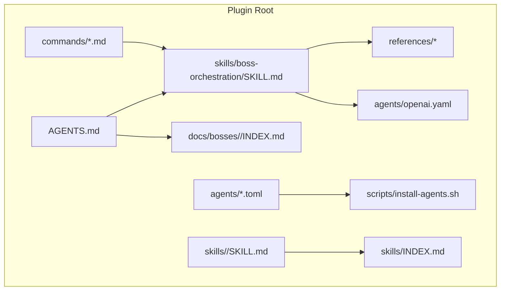
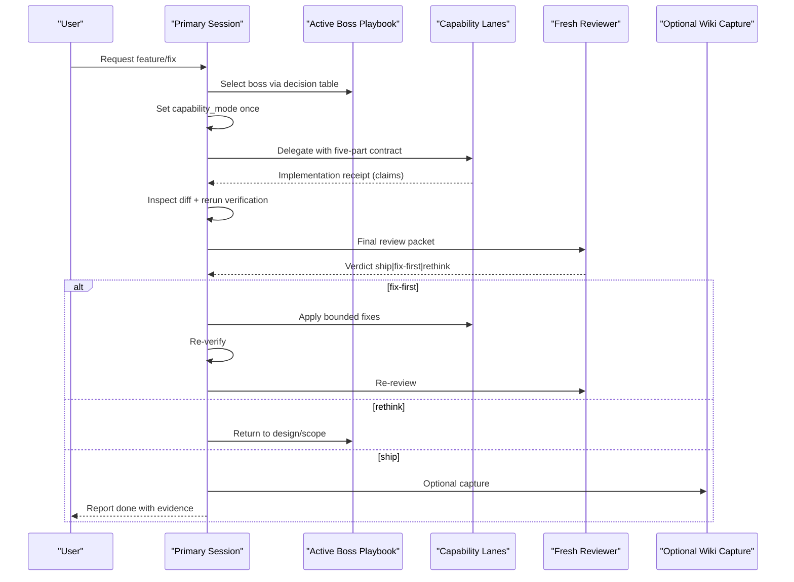
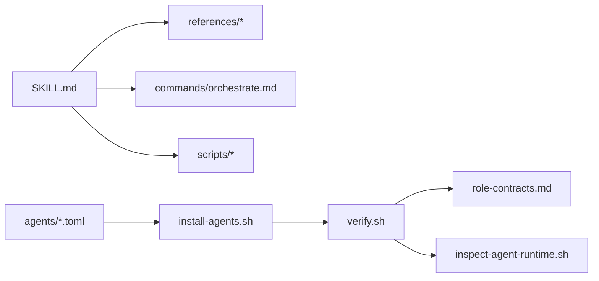

# Advanced Agent Development

<cite>
**Referenced Files in This Document**
- [README.md](file://fractal-agentic/README.md)
- [CUSTOMIZE.md](file://fractal-agentic/CUSTOMIZE.md)
- [capability-lanes.md](file://fractal-agentic/docs/orchestration/capability-lanes.md)
- [runtime.md](file://fractal-agentic/docs/orchestration/runtime.md)
- [SKILL.md](file://fractal-agentic/skills/boss-orchestration/SKILL.md)
- [role-contracts.md](file://fractal-agentic/skills/boss-orchestration/references/role-contracts.md)
- [install-agents.sh](file://fractal-agentic/scripts/install-agents.sh)
- [verify.sh](file://fractal-agentic/scripts/verify.sh)
- [check-armory.sh](file://fractal-agentic/scripts/check-armory.sh)
- [orchestrate.md](file://fractal-agentic/commands/orchestrate.md)
- [agents INDEX.md](file://fractal-agentic/agents/INDEX.md)
- [routine-implementer.toml](file://fractal-agentic/agents/fractal-agentic-routine-implementer.toml)
- [complex-implementer.toml](file://fractal-agentic/agents/fractal-agentic-complex-implementer.toml)
- [fresh-reviewer.toml](file://fractal-agentic/agents/fractal-agentic-fresh-reviewer.toml)
</cite>

## Table of Contents
1. Introduction
2. Project Structure
3. Core Components
4. Architecture Overview
5. Detailed Component Analysis
6. Dependency Analysis
7. Performance Considerations
8. Troubleshooting Guide
9. Conclusion
10. Appendices

## Introduction
This document provides advanced guidance for developing and customizing agents within the Fractal Agentic system. It covers custom agent creation, capability lane implementation, runtime extension points, lifecycle management, memory and state persistence strategies, performance optimization, caching, resource management, complex workflows, multi-agent coordination, error handling, testing, debugging, monitoring, external integrations, API connections, data sources, security, validation, and compliance. The content is grounded in the repository’s orchestration skill, capability lanes, installer scripts, and verification tooling.

## Project Structure
Fractal Agentic organizes capabilities into three layers:
- Domain discovery: startup router and boss playbooks
- Armory: skills, domain agents, and commands
- Runtime kernel: orchestration skill, capability pins (TOML), and scripts

**Diagram sources**
- [README.md:345-361](file://fractal-agentic/README.md#L345-L361)
- [CUSTOMIZE.md:49-74](file://fractal-agentic/CUSTOMIZE.md#L49-L74)

**Section sources**
- [README.md:345-361](file://fractal-agentic/README.md#L345-L361)
- [CUSTOMIZE.md:49-74](file://fractal-agentic/CUSTOMIZE.md#L49-L74)

## Core Components
- Orchestration skill: defines the delivery runtime loop, non-blocking policy, capability mode, routing, verification, and review.
- Capability lanes: optional host-recognized roles for routine implementer, complex implementer, and fresh reviewer.
- Role contracts: standardized five-part specification and receipt format for delegation and review.
- Installer and verification: deterministic installation of TOML pins and comprehensive checks for consistency and safety.

Key responsibilities:
- Select active boss based on intent and decision tree.
- Set capability_mode once per session.
- Delegate with five-part contract; verify evidence in primary.
- Obtain final review with a single verdict.

**Section sources**
- [SKILL.md:1-312](file://fractal-agentic/skills/boss-orchestration/SKILL.md#L1-L312)
- [capability-lanes.md:1-64](file://fractal-agentic/docs/orchestration/capability-lanes.md#L1-L64)
- [role-contracts.md:1-245](file://fractal-agentic/skills/boss-orchestration/references/role-contracts.md#L1-L245)

## Architecture Overview
The runtime orchestrates work through a strict sequence: select boss, set capability_mode, write contract, implement via lanes or primary, verify in primary, review with a verdict, and optionally capture wiki episodes or self-improvement notes.

**Diagram sources**
- [runtime.md:1-53](file://fractal-agentic/docs/orchestration/runtime.md#L1-L53)
- [SKILL.md:108-161](file://fractal-agentic/skills/boss-orchestration/SKILL.md#L108-L161)
- [role-contracts.md:151-213](file://fractal-agentic/skills/boss-orchestration/references/role-contracts.md#L151-L213)

## Detailed Component Analysis

### Custom Agent Creation
- Domain agents are markdown files under agents/ describing role, tools, model preference, rules, and output format.
- Map each agent into an owning boss playbook and index.
- For capability lanes, use TOML templates that pin model, effort, and sandbox mode.

Guidelines:
- Keep agent id stable; link from boss playbooks and indexes.
- Use frontmatter description for catalogs.
- When adding capability lanes, update all references consistently across SKILL.md, role-contracts.md, routing-matrix.md, install script, and verify script.

**Section sources**
- [agents INDEX.md:1-42](file://fractal-agentic/agents/INDEX.md#L1-L42)
- [CUSTOMIZE.md:174-218](file://fractal-agentic/CUSTOMIZE.md#L174-L218)
- [CUSTOMIZE.md:221-278](file://fractal-agentic/CUSTOMIZE.md#L221-L278)

### Capability Lane Implementation
- Three lanes: routine implementer, complex implementer, fresh reviewer.
- Install via install-agents.sh; exposure depends on session spawn catalog.
- If pins are missing, degrade gracefully without blocking product work.

Implementation details:
- TOML fields include name, description, developer_instructions, model, model_reasoning_effort, and optional sandbox_mode.
- Installer never overwrites differing files; uses byte-exact checks and atomic staging.

**Section sources**
- [capability-lanes.md:1-64](file://fractal-agentic/docs/orchestration/capability-lanes.md#L1-L64)
- [routine-implementer.toml:1-19](file://fractal-agentic/agents/fractal-agentic-routine-implementer.toml#L1-L19)
- [complex-implementer.toml:1-19](file://fractal-agentic/agents/fractal-agentic-complex-implementer.toml#L1-L19)
- [fresh-reviewer.toml:1-20](file://fractal-agentic/agents/fractal-agentic-fresh-reviewer.toml#L1-L20)
- [install-agents.sh:1-180](file://fractal-agentic/scripts/install-agents.sh#L1-L180)

### Runtime Extension Points
- Orchestration skill references define extension surfaces: capability-mode, role-contracts, routing-matrix, handoffs, boss-prompts, graph-topologies.
- Commands like /orchestrate load the runtime and references on demand.
- OpenAI YAML exposes marketplace UI strings and default prompts.

Extension patterns:
- Add new lanes by updating TOMLs and cross-referencing docs and scripts.
- Inject boss constraints via boss-prompts.md into every worker contract.
- Maintain non-blocking policy: missing features degrade but never block.

**Section sources**
- [SKILL.md:20-28](file://fractal-agentic/skills/boss-orchestration/SKILL.md#L20-L28)
- [orchestrate.md:1-63](file://fractal-agentic/commands/orchestrate.md#L1-L63)
- [CUSTOMIZE.md:367-397](file://fractal-agentic/CUSTOMIZE.md#L367-L397)

### Agent Lifecycle Management
- Lifecycle phases: selection, contract, implementation, verification, review, completion.
- Non-blocking rule ensures progress even when pins or tools are unavailable.
- Capability_mode tracks plugin presence and pin exposure.

Lifecycle flow:
- Preflight check (optional) → lane selection → delegate → verify → review → verdict-driven next steps.

**Section sources**
- [runtime.md:1-53](file://fractal-agentic/docs/orchestration/runtime.md#L1-L53)
- [SKILL.md:30-68](file://fractal-agentic/skills/boss-orchestration/SKILL.md#L30-L68)

### Memory Management and State Persistence
- No built-in persistent memory; rely on explicit receipts and diffs for continuity.
- Optional continuous wiki capture writes episodes under raw/fractal/ when configured.
- Self-improvement plane can record evaluation lines when enabled.

Best practices:
- Persist critical context in file artifacts and diffs rather than ephemeral state.
- Use wiki capture for audit trails without gating delivery.

**Section sources**
- [SKILL.md:276-311](file://fractal-agentic/skills/boss-orchestration/SKILL.md#L276-L311)
- [role-contracts.md:76-96](file://fractal-agentic/skills/boss-orchestration/references/role-contracts.md#L76-L96)

### Performance Optimization Techniques
- Prefer routine lane for spec-determined tasks; escalate to complex only when judgment is required.
- Parallelize independent, non-overlapping work; serialize shared dependencies.
- Avoid redundant re-delegation; correct specs before retrying failed lanes.

Caching strategies:
- Cache expensive outputs as artifacts referenced by verification commands.
- Use incremental verification (diff inspection) to minimize rework.

Resource management:
- Keep owned file sets minimal; avoid broad changes.
- Respect concurrent edits; adapt instead of reverting.

**Section sources**
- [SKILL.md:169-208](file://fractal-agentic/skills/boss-orchestration/SKILL.md#L169-L208)
- [role-contracts.md:35-43](file://fractal-agentic/skills/boss-orchestration/references/role-contracts.md#L35-L43)

### Complex Agent Workflows and Multi-Agent Coordination
- Five-part contract standardizes delegation across workers.
- Receipt format enforces evidence-based claims.
- Fresh reviewer ensures independent assessment before completion.

Coordination patterns:
- One worker per owned file set or bounded responsibility.
- Independent tasks run in parallel; dependency chains run serially.
- Commitment-boundary consults for high-risk decisions.

**Section sources**
- [role-contracts.md:98-149](file://fractal-agentic/skills/boss-orchestration/references/role-contracts.md#L98-L149)
- [SKILL.md:226-231](file://fractal-agentic/skills/boss-orchestration/SKILL.md#L226-L231)

### Error Handling Strategies
- Treat worker reports as claims; verify with actual diff and commands.
- Partial receipts indicate gaps; primary recovers missing evidence without blocking.
- Reviewers return exactly one verdict; fix-first requires bounded corrections and re-review.

Error flows:
- Missing pins → degrade path with documented capability_mode.
- Failed lane → correct spec; do not repeat unchanged prompt.

**Section sources**
- [SKILL.md:210-224](file://fractal-agentic/skills/boss-orchestration/SKILL.md#L210-L224)
- [role-contracts.md:151-213](file://fractal-agentic/skills/boss-orchestration/references/role-contracts.md#L151-L213)

### Testing Methodologies
- Use verify.sh to validate TOML pins, contracts, command structure, installer behavior, and runtime inspector allowlists.
- Run check-armory.sh to ensure critical skills and assets exist.
- Validate openai.yaml shape and references.

Testing approach:
- Deterministic checks for byte-exact installs and idempotency.
- Fixture-based runtime inspector tests ensure safe extraction.

**Section sources**
- [verify.sh:1-274](file://fractal-agentic/scripts/verify.sh#L1-L274)
- [check-armory.sh:1-143](file://fractal-agentic/scripts/check-armory.sh#L1-L143)

### Debugging Techniques
- inspect-agent-runtime.sh extracts allowed metadata from rollout logs for observed model/effort/sandbox.
- Capability-mode diagnostics clarify whether pins are exposed mid-session.
- Non-blocking policy checks prevent regressions in progression behavior.

Debugging workflow:
- Confirm layer B (disk) vs layer C (session) exposure.
- Use runtime inspector to observe pinned thread metadata safely.

**Section sources**
- [SKILL.md:125-149](file://fractal-agentic/skills/boss-orchestration/SKILL.md#L125-L149)
- [capability-lanes.md:22-44](file://fractal-agentic/docs/orchestration/capability-lanes.md#L22-L44)

### Monitoring Approaches
- Optional wiki capture logs episodes for traceability.
- Self-improvement plane records evaluation lines when enabled.
- Health checks provide ongoing assurance of armory integrity.

Monitoring practices:
- Enable capture when vault exists and configuration allows.
- Periodically run verify.sh and check-armory.sh in CI or pre-commit hooks.

**Section sources**
- [SKILL.md:276-311](file://fractal-agentic/skills/boss-orchestration/SKILL.md#L276-L311)
- [check-armory.sh:84-106](file://fractal-agentic/scripts/check-armory.sh#L84-L106)

### Integration with External Systems, APIs, and Data Sources
- Skills may reference external tools via commands and scripts.
- Verification commands should call real tools to produce concrete evidence.
- OpenAI YAML integrates marketplace UI strings and default prompts.

Integration guidelines:
- Keep external calls idempotent where possible.
- Fail fast with clear errors; log actionable diagnostics.
- Respect environment variables and paths relative to SKILL.md.

**Section sources**
- [role-contracts.md:69-74](file://fractal-agentic/skills/boss-orchestration/references/role-contracts.md#L69-L74)
- [CUSTOMIZE.md:388-396](file://fractal-agentic/CUSTOMIZE.md#L388-L396)

### Security, Validation, and Compliance
- Fresh reviewer enforces read-only policies when supported; report observable sandbox profiles.
- Installer refuses to overwrite differing files; prevents silent drift.
- Runtime inspector allowlists safe fields; avoids leaking secrets or prompts.

Compliance checklist:
- Ensure reviewers remain strictly read-only unless explicitly allowed.
- Validate TOML pins and contracts with verify.sh.
- Audit external integrations for least privilege and secure defaults.

**Section sources**
- [fresh-reviewer.toml:1-20](file://fractal-agentic/agents/fractal-agentic-fresh-reviewer.toml#L1-L20)
- [install-agents.sh:95-113](file://fractal-agentic/scripts/install-agents.sh#L95-L113)
- [verify.sh:234-273](file://fractal-agentic/scripts/verify.sh#L234-L273)

## Dependency Analysis
The orchestration skill depends on references, commands, and scripts to enforce consistent behavior. Capability lanes depend on TOML templates and installer logic. Verification ties together manifests, contracts, and runtime inspector.

**Diagram sources**
- [SKILL.md:20-28](file://fractal-agentic/skills/boss-orchestration/SKILL.md#L20-L28)
- [install-agents.sh:1-180](file://fractal-agentic/scripts/install-agents.sh#L1-L180)
- [verify.sh:1-274](file://fractal-agentic/scripts/verify.sh#L1-L274)

**Section sources**
- [SKILL.md:20-28](file://fractal-agentic/skills/boss-orchestration/SKILL.md#L20-L28)
- [verify.sh:1-274](file://fractal-agentic/scripts/verify.sh#L1-L274)

## Performance Considerations
- Route by task shape: routine for spec-driven work, complex for judgment-heavy tasks.
- Minimize scope per worker; parallelize independent tasks.
- Use verification commands to avoid unnecessary rework and maintain evidence quality.

Optimization tips:
- Cache intermediate artifacts referenced by verification.
- Prefer incremental diffs and targeted commands.
- Avoid redundant re-delegation; correct specs before retries.

[No sources needed since this section provides general guidance]

## Troubleshooting Guide
Common issues and resolutions:
- Spawn types missing: run install-agents.sh and start a new task.
- --check fails due to differences: resolve conflicts deliberately; installer will not overwrite.
- Model/effort unknown: use inspect-agent-runtime.sh if rollout exists; otherwise continue degraded.
- Reviewer mutated files: stop and assess residual risk; do not claim read-only unless observed.
- Missing skill: confirm vendored SKILL.md exists; no external links expected.

**Section sources**
- [CUSTOMIZE.md:561-571](file://fractal-agentic/CUSTOMIZE.md#L561-L571)
- [install-agents.sh:115-121](file://fractal-agentic/scripts/install-agents.sh#L115-L121)

## Conclusion
Fractal Agentic provides a robust, non-blocking orchestration framework for advanced agent development. By adhering to capability lanes, role contracts, and verification-driven workflows, teams can build reliable, scalable, and secure multi-agent systems. The provided scripts and verification tooling ensure consistency, safety, and observability across environments.

[No sources needed since this section summarizes without analyzing specific files]

## Appendices

### Appendix A: Five-Part Contract Summary
- Objective: Observable outcome and importance.
- Active Boss + Stack Defaults: Domain and technology baseline.
- Files and Ownership: Exact owned paths and concurrency rules.
- Interfaces: Compatibility constraints.
- Constraints: Repository rules and boss-specific bullets.
- Verification: Exact commands and success criteria.
- Return: Implementation receipt with status, evidence, gaps, residual risk, and proposed verdict.

**Section sources**
- [role-contracts.md:45-96](file://fractal-agentic/skills/boss-orchestration/references/role-contracts.md#L45-L96)

### Appendix B: Capability Mode Algorithm
- Determine capability_mode once per session based on plugin presence and spawn catalog exposure.
- Modes: plugin_missing, degraded, pinned_partial, pinned.
- Policy: degrade gracefully; never block product work.

**Section sources**
- [capability-lanes.md:32-54](file://fractal-agentic/docs/orchestration/capability-lanes.md#L32-L54)
- [SKILL.md:50-62](file://fractal-agentic/skills/boss-orchestration/SKILL.md#L50-L62)