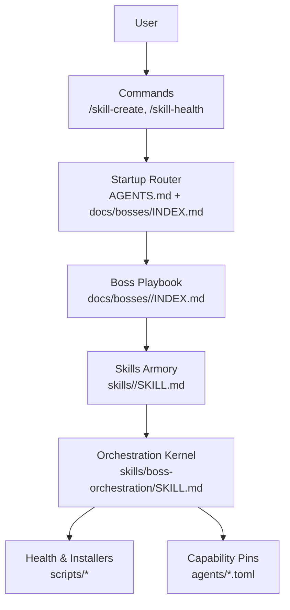
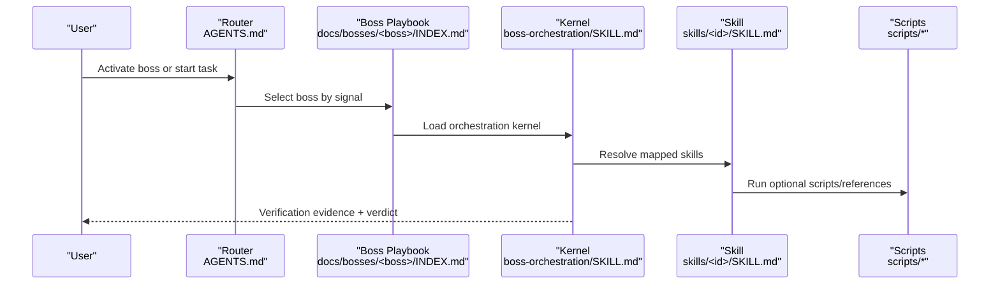
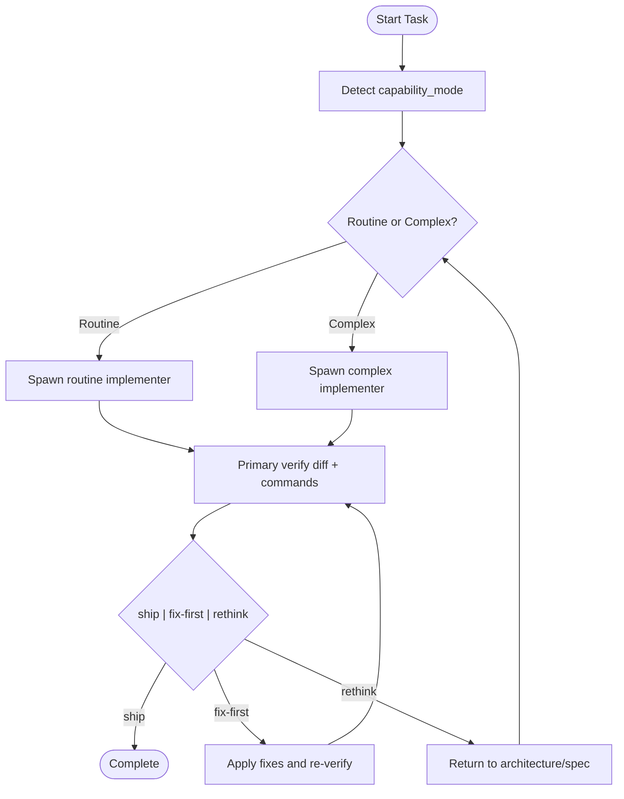
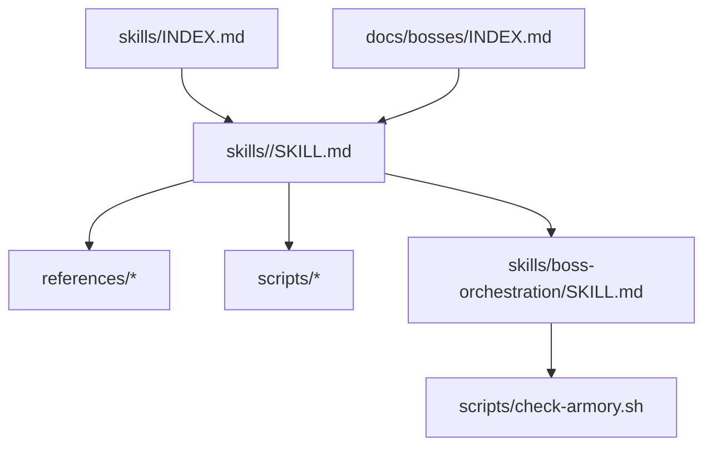

# Skill System

<cite>
**Referenced Files in This Document**
- [skills/INDEX.md](file://fractal-agentic/skills/INDEX.md)
- [docs/armory/skills.md](file://fractal-agentic/docs/armory/skills.md)
- [CUSTOMIZE.md](file://fractal-agentic/CUSTOMIZE.md)
- [skills/boss-orchestration/SKILL.md](file://fractal-agentic/skills/boss-orchestration/SKILL.md)
- [skills/security-scan/SKILL.md](file://fractal-agentic/skills/security-scan/SKILL.md)
- [skills/tdd-workflow/SKILL.md](file://fractal-agentic/skills/tdd-workflow/SKILL.md)
- [commands/skill-create.md](file://fractal-agentic/commands/skill-create.md)
- [commands/skill-health.md](file://fractal-agentic/commands/skill-health.md)
- [scripts/check-armory.sh](file://fractal-agentic/scripts/check-armory.sh)
- [docs/bosses/INDEX.md](file://fractal-agentic/docs/bosses/INDEX.md)
- [skills/configure-ecc/SKILL.md](file://fractal-agentic/skills/configure-ecc/SKILL.md)
</cite>

## Table of Contents
1. [Introduction](#introduction)
2. [Project Structure](#project-structure)
3. [Core Components](#core-components)
4. [Architecture Overview](#architecture-overview)
5. [Detailed Component Analysis](#detailed-component-analysis)
6. [Dependency Analysis](#dependency-analysis)
7. [Performance Considerations](#performance-considerations)
8. [Troubleshooting Guide](#troubleshooting-guide)
9. [Conclusion](#conclusion)
10. [Appendices](#appendices)

## Introduction
This document explains the skill execution engine that powers 167+ vendored skills. It covers how skills are defined, discovered, loaded, executed, and verified; how categories organize capabilities; and how to install, configure, customize, and extend the system. It also provides practical invocation patterns, parameter passing, result handling, dependency management, versioning, conflict resolution, discovery mechanics, loading order, performance considerations, and guidelines for creating custom skills and integrating third-party tools.

## Project Structure
The skill system is organized around a clear separation of concerns:
- Skills armory: each skill is a directory under skills/<id>/ with a SKILL.md and optional references/ and scripts/.
- Orchestration kernel: boss-orchestration defines runtime lanes, pins, contracts, and verification policy.
- Boss playbooks: docs/bosses/<boss>/INDEX.md define domain ownership and mapped skills.
- Commands: commands/*.md expose user-facing entry points (e.g., /skill-create, /skill-health).
- Scripts: health checks and installer utilities ensure consistency and readiness.

**Diagram sources**
- [docs/bosses/INDEX.md:1-92](file://fractal-agentic/docs/bosses/INDEX.md#L1-L92)
- [skills/boss-orchestration/SKILL.md:1-312](file://fractal-agentic/skills/boss-orchestration/SKILL.md#L1-L312)
- [CUSTOMIZE.md:1-200](file://fractal-agentic/CUSTOMIZE.md#L1-L200)

**Section sources**
- [docs/bosses/INDEX.md:1-92](file://fractal-agentic/docs/bosses/INDEX.md#L1-L92)
- [CUSTOMIZE.md:1-200](file://fractal-agentic/CUSTOMIZE.md#L1-L200)

## Core Components
- Skills index: live inventory of all skills with IDs, descriptions, and source provenance.
- Skill definition format: YAML frontmatter (name, description, metadata) plus body instructions; optional references/ and scripts/.
- Orchestration kernel: capability mode, lane selection (routine vs complex), verification, and review gates.
- Discovery and mapping: bosses map skills; activation commands load the selected boss playbook.
- Health and creation: /skill-health dashboard and /skill-create generator streamline portfolio maintenance.

Key files:
- skills/INDEX.md: authoritative catalog of 167 skills.
- docs/armory/skills.md: guidance on finding, naming, families, and adding/changing skills.
- CUSTOMIZE.md: rules for adding/removing skills, mapping into bosses, and maintaining indexes.
- skills/boss-orchestration/SKILL.md: runtime kernel defining non-blocking progression, lanes, verification, and review.

**Section sources**
- [skills/INDEX.md:1-177](file://fractal-agentic/skills/INDEX.md#L1-L177)
- [docs/armory/skills.md:1-58](file://fractal-agentic/docs/armory/skills.md#L1-L58)
- [CUSTOMIZE.md:78-172](file://fractal-agentic/CUSTOMIZE.md#L78-L172)
- [skills/boss-orchestration/SKILL.md:1-312](file://fractal-agentic/skills/boss-orchestration/SKILL.md#L1-L312)

## Architecture Overview
The execution model follows a layered approach:
- Layer A (Content): router + boss playbooks + runtime readable guidance.
- Layer B (Install): TOML templates present on disk.
- Layer C (Session): spawn catalog exposes pin types during the task.

Execution flow:
1. Startup router selects a boss based on signals.
2. Boss playbook loads mapped skills and constraints.
3. Orchestration kernel sets capability_mode and chooses lanes.
4. Worker agents implement; primary verifies diffs and commands.
5. Final review yields ship | fix-first | rethink verdicts.

**Diagram sources**
- [docs/bosses/INDEX.md:1-92](file://fractal-agentic/docs/bosses/INDEX.md#L1-L92)
- [skills/boss-orchestration/SKILL.md:1-312](file://fractal-agentic/skills/boss-orchestration/SKILL.md#L1-L312)

**Section sources**
- [skills/boss-orchestration/SKILL.md:30-161](file://fractal-agentic/skills/boss-orchestration/SKILL.md#L30-L161)

## Detailed Component Analysis

### Skill Definition Format
- Frontmatter fields: name (required), description (recommended), metadata (optional).
- Body: when-to-use section, step-by-step instructions, examples.
- Optional directories:
  - references/: supporting documents.
  - scripts/: executable helpers resolved relative to SKILL.md.

Examples:
- security-scan: scans .claude/ configuration using AgentShield with multiple output formats and auto-fix options.
- tdd-workflow: enforces RED/GREEN cycles, coverage thresholds, checkpoint commits, and evidence reporting.

Best practices:
- Keep name stable; use descriptive description for discoverability.
- Place scripts relative to SKILL.md path; avoid absolute paths.
- Use metadata for origin, tags, category, depends, and difficulty where relevant.

**Section sources**
- [CUSTOMIZE.md:78-114](file://fractal-agentic/CUSTOMIZE.md#L78-L114)
- [skills/security-scan/SKILL.md:1-174](file://fractal-agentic/skills/security-scan/SKILL.md#L1-L174)
- [skills/tdd-workflow/SKILL.md:1-120](file://fractal-agentic/skills/tdd-workflow/SKILL.md#L1-L120)

### Execution Model and Verification
- Non-blocking rule: project work proceeds even if pins or installs are missing; warnings only.
- Capability modes: plugin_missing, degraded, pinned_partial, pinned.
- Lane selection: routine vs complex based on task shape; degrade gracefully if pins unavailable.
- Verification: require implementation receipts, inspect diffs, rerun verification commands, compare against objectives.
- Review: prefer fresh reviewer pin; otherwise domain specialist or self-review; verdict must be ship | fix-first | rethink.

**Diagram sources**
- [skills/boss-orchestration/SKILL.md:30-161](file://fractal-agentic/skills/boss-orchestration/SKILL.md#L30-L161)
- [skills/boss-orchestration/SKILL.md:210-258](file://fractal-agentic/skills/boss-orchestration/SKILL.md#L210-L258)

**Section sources**
- [skills/boss-orchestration/SKILL.md:30-161](file://fractal-agentic/skills/boss-orchestration/SKILL.md#L30-L161)
- [skills/boss-orchestration/SKILL.md:210-258](file://fractal-agentic/skills/boss-orchestration/SKILL.md#L210-L258)

### Skill Categories
Common families include delivery kernel, general utility, Svelte implementation, design craft, quality and security, product agent systems, continuous knowledge, and plugin portfolio. These clusters guide discovery and ownership but do not replace the live index.

Practical examples:
- Development workflows: tdd-workflow, build-feature-end-to-end, git-workflow.
- Testing: e2e-testing, rust-testing, browser-qa.
- Security: security-scan, security-review, safety-guard.
- Deployment: deployment-patterns, svelte-deployment, docker-patterns.
- Productivity: docs-writer, human-writing, file-organizer, visual-design.

**Section sources**
- [docs/armory/skills.md:21-35](file://fractal-agentic/docs/armory/skills.md#L21-L35)
- [skills/INDEX.md:1-177](file://fractal-agentic/skills/INDEX.md#L1-L177)

### Installation, Configuration, and Customization
- Add a skill: place SKILL.md under skills/<id>/, map it into a boss INDEX, update skills/INDEX.md, run check-armory.sh.
- Remove a skill: unmap everywhere, delete directory/link, refresh index, run checks.
- Orchestration edits: keep role-contracts, routing-matrix, boss-prompts, and installer consistent.
- Configure ECC: interactive installer supports selecting categories and individual skills, copying from core or niche sources.

Path rules:
- Scripts resolve relative to SKILL.md directory.
- Symlinks allowed in monorepo; copy recommended for marketplace zips.

**Section sources**
- [CUSTOMIZE.md:78-172](file://fractal-agentic/CUSTOMIZE.md#L78-L172)
- [CUSTOMIZE.md:367-399](file://fractal-agentic/CUSTOMIZE.md#L367-L399)
- [skills/configure-ecc/SKILL.md:88-250](file://fractal-agentic/skills/configure-ecc/SKILL.md#L88-L250)

### Practical Invocation, Parameters, and Results
- /skill-create: analyze git history to generate SKILL.md files and optionally instincts for continuous-learning-v2.
- /skill-health: display dashboard panels (success rate, failures, amendments, version history); JSON output available.
- Parameter passing: skills accept arguments via frontmatter argument-hint and command-line flags; pass through host commands.
- Result handling: skills produce artifacts (reports, diffs, test outputs); orchestration requires receipts and verification evidence.

Example flows:
- Generate skills from repository patterns and import instincts.
- Inspect portfolio health and suggest evolution actions.

**Section sources**
- [commands/skill-create.md:1-126](file://fractal-agentic/commands/skill-create.md#L1-L126)
- [commands/skill-health.md:1-55](file://fractal-agentic/commands/skill-health.md#L1-L55)

### Dependencies, Versioning, and Conflict Resolution
- Dependencies: skills can declare depends in metadata; orchestration ensures prerequisite availability before invoking composite workflows.
- Versioning: metadata.version indicates skill versions; maintain semantic versioning and changelog notes in SKILL.md.
- Conflict resolution: canonical names and aliases clarify related skills; prefer canonical skill and reference packs; index and boss mappings disambiguate usage.
- Evidence ladder: track available → installed → discovered → selected → invoked → task-relevant → accepted outcome → later comparable improvement.

Guidelines:
- Avoid title collisions; update skills/INDEX.md consistently.
- When replacing a skill, preserve evidence and migration steps.

**Section sources**
- [skills/build-feature-end-to-end/SKILL.md:1-34](file://fractal-agentic/skills/build-feature-end-to-end/SKILL.md#L1-L34)
- [docs/armory/skills.md:37-46](file://fractal-agentic/docs/armory/skills.md#L37-L46)
- [skills/better-harness/references/asset-demand-reconciliation.md:38-73](file://fractal-agentic/skills/better-harness/references/asset-demand-reconciliation.md#L38-L73)

### Discovery Mechanism, Loading Order, and Performance
- Discovery: start with active boss’s nested playbook; search skills/INDEX.md; browse skills explorer UI.
- Loading order: router selects boss → load boss playbook → load mapped skills → load orchestration kernel.
- Performance: prefer pinned lanes when available; degrade gracefully; avoid heavy preflight checks mid-session; use parallel independent tasks; cache reusable assets.

Non-blocking policy ensures productivity while quality improves over time.

**Section sources**
- [docs/armory/skills.md:11-19](file://fractal-agentic/docs/armory/skills.md#L11-L19)
- [docs/bosses/INDEX.md:1-92](file://fractal-agentic/docs/bosses/INDEX.md#L1-L92)
- [skills/boss-orchestration/SKILL.md:30-63](file://fractal-agentic/skills/boss-orchestration/SKILL.md#L30-L63)

### Creating Custom Skills and Integrating Third-Party Tools
- Create a skill: follow minimum SKILL.md shape; add references and scripts as needed; map into a boss; update index.
- Integrate tools: embed CLI invocations within SKILL.md; validate prerequisites; handle errors and fallbacks; provide auto-fix where safe.
- Example integrations: security-scan uses AgentShield CLI; tdd-workflow integrates test runners and coverage tools.

Best practices:
- Keep tool invocations idempotent and safe.
- Provide clear error messages and recovery steps.
- Document environment requirements and secrets handling.

**Section sources**
- [CUSTOMIZE.md:78-114](file://fractal-agentic/CUSTOMIZE.md#L78-L114)
- [skills/security-scan/SKILL.md:1-174](file://fractal-agentic/skills/security-scan/SKILL.md#L1-L174)
- [skills/tdd-workflow/SKILL.md:1-120](file://fractal-agentic/skills/tdd-workflow/SKILL.md#L1-L120)

## Dependency Analysis
Skills depend on orchestration kernel, boss mappings, and scripts. The health checker validates critical skills and required files.

**Diagram sources**
- [skills/INDEX.md:1-177](file://fractal-agentic/skills/INDEX.md#L1-L177)
- [skills/boss-orchestration/SKILL.md:1-312](file://fractal-agentic/skills/boss-orchestration/SKILL.md#L1-L312)
- [scripts/check-armory.sh:1-143](file://fractal-agentic/scripts/check-armory.sh#L1-L143)
- [docs/bosses/INDEX.md:1-92](file://fractal-agentic/docs/bosses/INDEX.md#L1-L92)

**Section sources**
- [scripts/check-armory.sh:84-119](file://fractal-agentic/scripts/check-armory.sh#L84-L119)

## Performance Considerations
- Prefer pinned lanes when exposed; degrade without ceremony when absent.
- Avoid blocking preflights; treat missing installs as warnings.
- Parallelize independent tasks; serialize shared dependencies.
- Cache reusable assets and minimize repeated I/O.
- Use lightweight verification commands; defer heavy checks to CI or scheduled runs.

[No sources needed since this section provides general guidance]

## Troubleshooting Guide
- Use /skill-health to inspect success rates, failure clustering, pending amendments, and version history.
- Run scripts/check-armory.sh to validate critical skills and required files; fix broken symlinks and missing SKILL.md.
- For orchestration issues, verify capability_mode and pin exposure; consult role-contracts and routing-matrix.
- If skills fail due to external tools, ensure prerequisites (e.g., AgentShield) are installed and configured.

**Section sources**
- [commands/skill-health.md:1-55](file://fractal-agentic/commands/skill-health.md#L1-L55)
- [scripts/check-armory.sh:1-143](file://fractal-agentic/scripts/check-armory.sh#L1-L143)
- [skills/boss-orchestration/SKILL.md:30-63](file://fractal-agentic/skills/boss-orchestration/SKILL.md#L30-L63)

## Conclusion
The skill system provides a robust, extensible framework for organizing and executing 167+ skills across development workflows, testing, security, deployment, and productivity. With clear definitions, non-blocking execution, strong verification, and comprehensive health tools, teams can confidently discover, install, customize, and evolve their skill portfolios while maintaining high quality and performance.

[No sources needed since this section summarizes without analyzing specific files]

## Appendices

### Quick Reference: Adding a Skill
- Place SKILL.md under skills/<id>/ with name and description.
- Map into owning boss INDEX.md under Mapped Skills.
- Update skills/INDEX.md and run check-armory.sh.
- For orchestration changes, sync role-contracts, routing-matrix, boss-prompts, and installer.

**Section sources**
- [CUSTOMIZE.md:78-172](file://fractal-agentic/CUSTOMIZE.md#L78-L172)
- [scripts/check-armory.sh:84-119](file://fractal-agentic/scripts/check-armory.sh#L84-L119)