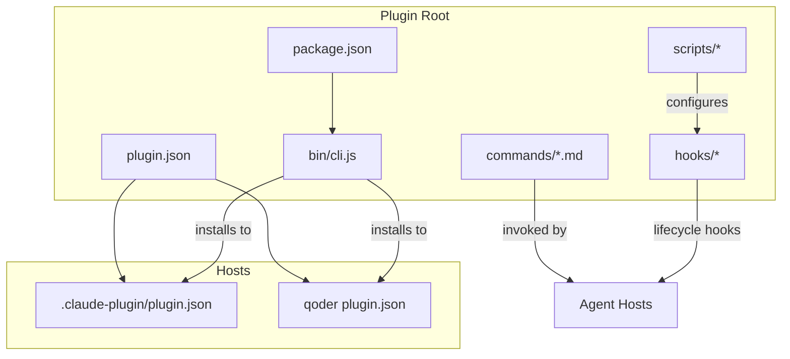
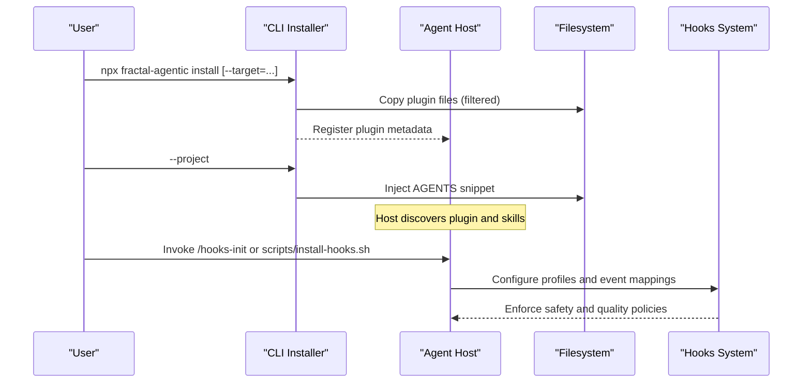
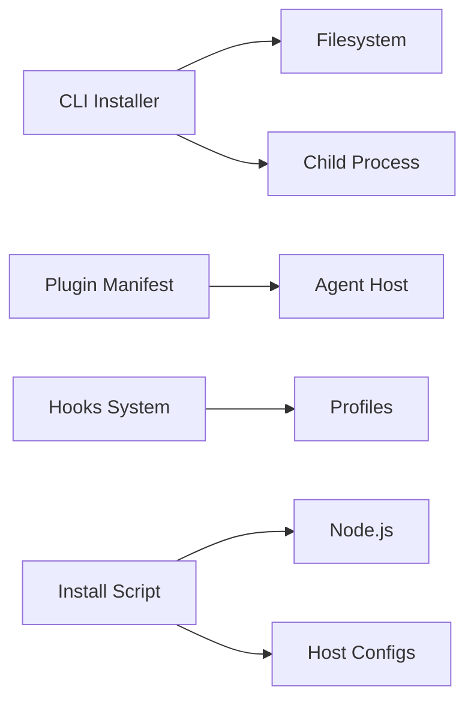

# API Reference

<cite>
**Referenced Files in This Document**
- [package.json](file://fractal-agentic/package.json)
- [cli.js](file://fractal-agentic/bin/cli.js)
- [plugin.json](file://fractal-agentic/plugin.json)
- [claude-plugin.json](file://fractal-agentic/.claude-plugin/plugin.json)
- [commands-index.md](file://fractal-agentic/commands/INDEX.md)
- [orchestrate.md](file://fractal-agentic/commands/orchestrate.md)
- [hooks-init.md](file://fractal-agentic/commands/hooks-init.md)
- [hooks-guide.md](file://fractal-agentic/docs/hooks.md)
- [hooks-readme.md](file://fractal-agentic/hooks/README.md)
- [install-hooks.sh](file://fractal-agentic/scripts/install-hooks.sh)
- [lib.js](file://fractal-agentic/hooks/scripts/lib.js)
- [session-start.js](file://fractal-agentic/hooks/scripts/session-start.js)
- [pre-bash-safety.js](file://fractal-agentic/hooks/scripts/pre-bash-safety.js)
- [pre-no-verify.js](file://fractal-agentic/hooks/scripts/pre-no-verify.js)
- [getting-started.md](file://fractal-agentic/docs/01-getting-started.md)
</cite>

## Table of Contents
1. [Introduction](#introduction)
2. [Project Structure](#project-structure)
3. [Core Components](#core-components)
4. [Architecture Overview](#architecture-overview)
5. [Detailed Component Analysis](#detailed-component-analysis)
6. [Dependency Analysis](#dependency-analysis)
7. [Performance Considerations](#performance-considerations)
8. [Troubleshooting Guide](#troubleshooting-guide)
9. [Conclusion](#conclusion)
10. [Appendices](#appendices)

## Introduction
This API Reference documents the public interfaces exposed by the Fractal Agentic plugin and its CLI, hooks system, and host integration points. It covers:
- CLI API for installation and verification across multiple AI coding agent hosts
- Plugin manifest contracts for host discovery and metadata
- Hook lifecycle events with data structures and extension points
- Command surface for orchestration and optional tooling
- Versioning, deprecation, and migration guidance for stable integrations

The plugin is designed to be host-agnostic, with optional hooks that never block product work. The delivery runtime is invoked via commands (e.g., /orchestrate), while the installer and hooks are user-facing utilities.

## Project Structure
At a high level, the repository exposes:
- A Node CLI entry point for multi-host installation and project snippet injection
- Plugin manifests defining metadata and skills location for hosts
- A command index and per-command documentation
- Optional hooks with profiles and host adapters
- Scripts for hook installation and environment setup

**Diagram sources**
- [package.json:1-59](file://fractal-agentic/package.json#L1-L59)
- [cli.js:1-148](file://fractal-agentic/bin/cli.js#L1-L148)
- [plugin.json:1-31](file://fractal-agentic/plugin.json#L1-L31)
- [claude-plugin.json:1-20](file://fractal-agentic/.claude-plugin/plugin.json#L1-L20)
- [commands-index.md:1-68](file://fractal-agentic/commands/INDEX.md#L1-L68)
- [hooks-readme.md:1-124](file://fractal-agentic/hooks/README.md#L1-L124)
- [install-hooks.sh:1-380](file://fractal-agentic/scripts/install-hooks.sh#L1-L380)

**Section sources**
- [package.json:1-59](file://fractal-agentic/package.json#L1-L59)
- [plugin.json:1-31](file://fractal-agentic/plugin.json#L1-L31)
- [commands-index.md:1-68](file://fractal-agentic/commands/INDEX.md#L1-L68)

## Core Components
- CLI Installer: Multi-host installer with target selection and project snippet injection
- Plugin Manifest: Metadata and skills path for host discovery
- Commands Index: Canonical list of agent-invoked commands
- Hooks System: Event-driven safety and quality automations with profiles
- Installation Script: Non-blocking configuration writer for host-specific settings

Key responsibilities:
- CLI handles install targets (antigravity, claude, codex), verifies, and injects project snippets
- Plugin manifests define display names, descriptions, default prompts, and skills directory
- Commands index enumerates all agent commands and their roles
- Hooks provide pre-bash safety, config protection, session bootstrap, stop-time quality checks
- Install script writes preferences and host configs without blocking product work

**Section sources**
- [cli.js:1-148](file://fractal-agentic/bin/cli.js#L1-L148)
- [plugin.json:1-31](file://fractal-agentic/plugin.json#L1-L31)
- [commands-index.md:1-68](file://fractal-agentic/commands/INDEX.md#L1-L68)
- [hooks-readme.md:1-124](file://fractal-agentic/hooks/README.md#L1-L124)
- [install-hooks.sh:1-380](file://fractal-agentic/scripts/install-hooks.sh#L1-L380)

## Architecture Overview
The system integrates three layers:
- CLI layer: Bootstraps plugin into hosts and injects project-level mandates
- Plugin layer: Declares capabilities, skills, and default prompts for agents
- Hooks layer: Optional lifecycle automation integrated via host-specific configurations

**Diagram sources**
- [cli.js:1-148](file://fractal-agentic/bin/cli.js#L1-L148)
- [install-hooks.sh:1-380](file://fractal-agentic/scripts/install-hooks.sh#L1-L380)
- [hooks-readme.md:1-124](file://fractal-agentic/hooks/README.md#L1-L124)

## Detailed Component Analysis

### CLI API
The CLI provides:
- Default command: install (multi-host)
- verify: runs verification suite
- help: prints usage
- Options:
  - --target=<host>: antigravity | claude | codex | all (default: all)
  - --project: inject AGENTS snippet into current project

Behavior:
- Copies plugin root to host directories with an exclusion filter
- Attempts marketplace registration for Claude when available; falls back to cache directory
- Creates project AGENTS.md with plugin mandate if not present

Exit codes:
- 0 on success
- 1 on verification failure or critical error

Usage examples:
- npx fractal-agentic install
- npx fractal-agentic install --target=claude
- npx fractal-agentic install --project
- npx fractal-agentic verify
- npx fractal-agentic help

Error handling:
- Errors during copy or marketplace calls are logged; fallback paths are attempted where applicable

**Section sources**
- [cli.js:1-148](file://fractal-agentic/bin/cli.js#L1-L148)
- [package.json:1-59](file://fractal-agentic/package.json#L1-L59)

### Plugin Manifest API
The plugin manifest defines:
- name, version, description, author, homepage, repository, license
- interface.displayname, shortDescription, longDescription, defaultPrompt[]
- skills path pointing to vendored skills

Host integration:
- .claude-plugin/plugin.json mirrors metadata for Claude Code
- qoder plugin.json mirrors metadata for Qoder

Versioning:
- Semantic versioning applied at package and plugin levels

Deprecation policy:
- Maintain backward compatibility for interface fields; avoid removing existing keys

Migration:
- Update defaultPrompt and longDescription as capabilities evolve; keep skills path stable

**Section sources**
- [plugin.json:1-31](file://fractal-agentic/plugin.json#L1-L31)
- [claude-plugin.json:1-20](file://fractal-agentic/.claude-plugin/plugin.json#L1-L20)
- [getting-started.md:1-99](file://fractal-agentic/docs/01-getting-started.md#L1-L99)

### Commands API
Commands are invoked within agent sessions using slash-prefixed triggers. The canonical inventory is maintained in the commands index. Notable commands include:
- /activate-boss-*: Activate specific boss playbooks
- /orchestrate: Execute delivery runtime with capability lanes and review verdicts
- /hooks-init: Interactive setup for optional hooks
- /wiki-*: Wiki initialization and operations
- /review-fanout: Multi-dimension review workflow
- /learn*, /improve*, /skill-*: Learning and skill management

Validation:
- Commands rely on the startup router and boss playbooks; non-blocking rules apply when capabilities are missing

Exit behavior:
- Commands return results through agent output; no explicit exit codes from CLI

Usage example:
- /orchestrate after selecting a boss playbook

**Section sources**
- [commands-index.md:1-68](file://fractal-agentic/commands/INDEX.md#L1-L68)
- [orchestrate.md:1-63](file://fractal-agentic/commands/orchestrate.md#L1-L63)
- [hooks-init.md:1-63](file://fractal-agentic/commands/hooks-init.md#L1-L63)

### Hook API
Hook system overview:
- Profiles: minimal (default), standard, strict
- Events: pre:bash:safety, pre:bash:no-verify, pre:edit:config-protection, session:start, periodic:essay-due, stop:quality-batch, stop:console-warn, pre:edit:gateguard
- Blocking behavior: Some hooks can block irreversible harm; others warn or mark due tasks
- Environment variables: FRACTAL_HOOK_PROFILE, FRACTAL_DISABLED_HOOKS, FRACTAL_GATEGUARD

Data structures:
- lib.js exports helpers for reading stdin, parsing input, resolving plugin root, loading profiles, enabling/disabling hooks, and controlling allow/block decisions
- Exit codes: 0 to continue, 2 to block (Claude-compatible)

Lifecycle methods:
- Pre-Bash Safety: Inspects commands against patterns to block destructive actions
- No-Verify Guard: Blocks git operations with --no-verify or HUSKY=0
- Session Start: Provides additional context and system messages
- Stop Quality Batch: Best-effort formatting/typechecking warnings

Extension points:
- New hooks can be added under hooks/scripts/ and mapped in host JSON templates
- Profiles control which hooks run; disabled hooks can be specified via environment

Installation:
- scripts/install-hooks.sh writes preferences and host-specific configurations
- Supports targets: config, claude, cursor, project, all
- Non-blocking: Missing node or host directories print warnings and continue

Error handling:
- Validation errors produce clear messages; check mode returns non-zero only when expected installs are missing

**Section sources**
- [hooks-readme.md:1-124](file://fractal-agentic/hooks/README.md#L1-L124)
- [hooks-guide.md:1-128](file://fractal-agentic/docs/hooks.md#L1-L128)
- [install-hooks.sh:1-380](file://fractal-agentic/scripts/install-hooks.sh#L1-L380)
- [lib.js:61-136](file://fractal-agentic/hooks/scripts/lib.js#L61-L136)
- [session-start.js:47-64](file://fractal-agentic/hooks/scripts/session-start.js#L47-L64)
- [pre-bash-safety.js:26-41](file://fractal-agentic/hooks/scripts/pre-bash-safety.js#L26-L41)
- [pre-no-verify.js:1-29](file://fractal-agentic/hooks/scripts/pre-no-verify.js#L1-L29)

### TypeScript Interfaces and Types
While the plugin itself is primarily JavaScript and shell-based, related packages expose TypeScript definitions:
- Svelte components package defines typed exports for UI primitives and agent components
- Type definitions are published alongside built artifacts for consumers

Recommendations:
- Use exported types from respective packages for component props and events
- For plugin integration, rely on manifest fields and documented command surfaces rather than internal types

[No sources needed since this section provides general guidance]

### Usage Examples
- Install plugin for all hosts: npx fractal-agentic install
- Target Claude specifically: npx fractal-agentic install --target=claude
- Inject project mandate: npx fractal-agentic install --project
- Verify installation: npx fractal-agentic verify
- Initialize hooks interactively: /hooks-init
- Check hooks status: /hooks-status or scripts/install-hooks.sh --check

**Section sources**
- [cli.js:1-148](file://fractal-agentic/bin/cli.js#L1-L148)
- [hooks-init.md:1-63](file://fractal-agentic/commands/hooks-init.md#L1-L63)
- [getting-started.md:1-99](file://fractal-agentic/docs/01-getting-started.md#L1-L99)

### Error Handling Patterns
- CLI: Logs errors and attempts fallbacks; exits with non-zero on verification failures
- Hooks: Block irreversible harm with structured output; allow continuation otherwise
- Installation script: Prints warnings for missing dependencies; continues other targets; check mode fails fast on missing expectations

**Section sources**
- [cli.js:1-148](file://fractal-agentic/bin/cli.js#L1-L148)
- [lib.js:61-136](file://fractal-agentic/hooks/scripts/lib.js#L61-L136)
- [install-hooks.sh:1-380](file://fractal-agentic/scripts/install-hooks.sh#L1-L380)

## Dependency Analysis
Component relationships:
- CLI depends on filesystem and child process execution
- Plugin manifests depend on consistent naming and skills path
- Hooks depend on profile resolution and host JSON mappings
- Installation script depends on Node availability for robust merging; falls back to sed

Potential circular dependencies:
- None detected; CLI and hooks are independent utilities

External dependencies:
- Node.js for hook scripts and installation logic
- Host-specific tools (e.g., Claude CLI) for marketplace operations

Interface contracts:
- CLI options and commands are stable
- Hook events and profiles are documented and non-blocking by design
- Plugin manifest fields are stable for host discovery

**Diagram sources**
- [cli.js:1-148](file://fractal-agentic/bin/cli.js#L1-L148)
- [plugin.json:1-31](file://fractal-agentic/plugin.json#L1-L31)
- [hooks-readme.md:1-124](file://fractal-agentic/hooks/README.md#L1-L124)
- [install-hooks.sh:1-380](file://fractal-agentic/scripts/install-hooks.sh#L1-L380)

**Section sources**
- [cli.js:1-148](file://fractal-agentic/bin/cli.js#L1-L148)
- [install-hooks.sh:1-380](file://fractal-agentic/scripts/install-hooks.sh#L1-L380)
- [hooks-readme.md:1-124](file://fractal-agentic/hooks/README.md#L1-L124)

## Performance Considerations
- CLI installation copies filtered files; performance scales with plugin size
- Hook scripts parse stdin and resolve profiles; keep hook logic minimal to avoid latency
- Installation script uses Node for JSON merging when available; falls back to sed for portability
- Avoid heavy computations in hooks; focus on safety and quick checks

[No sources needed since this section provides general guidance]

## Troubleshooting Guide
Common issues:
- Hooks not installed: Run /hooks-status or scripts/install-hooks.sh --check
- Claude marketplace install fails: Fallback to cache directory is attempted automatically
- Missing Node.js: Installation script warns and writes project materialization only
- Project snippet already present: CLI detects and skips duplication

Resolution steps:
- Ensure FRACTAL_AGENTIC_ROOT resolves correctly
- Source env.sh or set environment variables in GUI hosts
- Restart agent host after hook installation
- Use --force cautiously to overwrite managed blocks

**Section sources**
- [hooks-guide.md:1-128](file://fractal-agentic/docs/hooks.md#L1-L128)
- [install-hooks.sh:1-380](file://fractal-agentic/scripts/install-hooks.sh#L1-L380)
- [cli.js:1-148](file://fractal-agentic/bin/cli.js#L1-L148)

## Conclusion
Fractal Agentic provides a robust, host-agnostic plugin system with a flexible CLI installer, well-defined plugin manifests, and optional hooks for safety and quality. The command surface enables orchestrated delivery with non-blocking principles. Users can extend functionality through hooks and skills while maintaining stability and clarity.

[No sources needed since this section summarizes without analyzing specific files]

## Appendices

### Versioning Strategies
- Semantic versioning for package and plugin manifests
- URL path versioning recommended for external APIs (as per skill guidance)
- Deprecation timeline includes announcements and sunset headers for public APIs

### Migration Paths
- Keep skills path stable; update default prompts and descriptions as capabilities evolve
- Maintain backward compatibility for plugin manifest fields
- Use non-blocking rules to ensure continuity when capabilities are unavailable

**Section sources**
- [plugin.json:1-31](file://fractal-agentic/plugin.json#L1-L31)
- [getting-started.md:1-99](file://fractal-agentic/docs/01-getting-started.md#L1-L99)