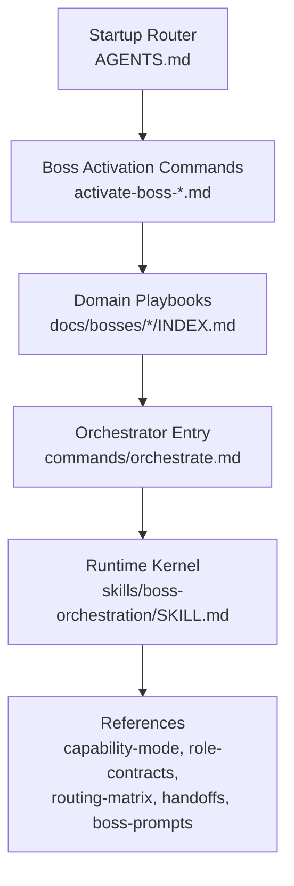
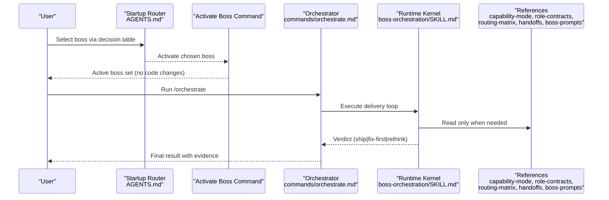
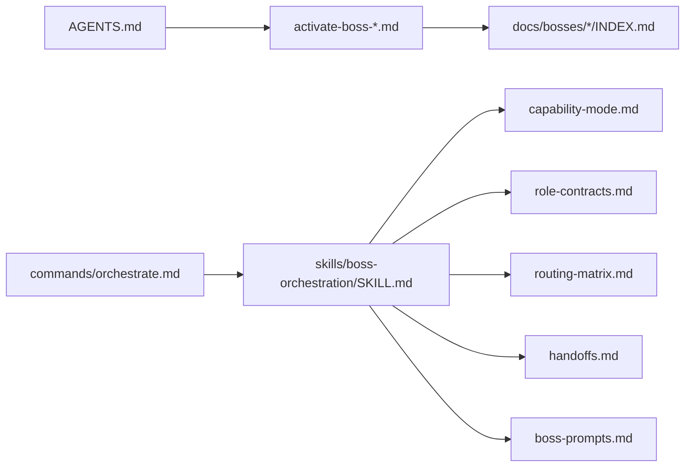

# Core Commands

<cite>
**Referenced Files in This Document**
- [AGENTS.md](file://fractal-agentic/AGENTS.md)
- [commands/orchestrate.md](file://fractal-agentic/commands/orchestrate.md)
- [skills/boss-orchestration/SKILL.md](file://fractal-agentic/skills/boss-orchestration/SKILL.md)
- [docs/orchestration/INDEX.md](file://fractal-agentic/docs/orchestration/INDEX.md)
- [docs/orchestration/runtime.md](file://fractal-agentic/docs/orchestration/runtime.md)
- [commands/activate-boss-agent.md](file://fractal-agentic/commands/activate-boss-agent.md)
- [commands/activate-boss-code.md](file://fractal-agentic/commands/activate-boss-code.md)
- [commands/activate-boss-design.md](file://fractal-agentic/commands/activate-boss-design.md)
- [commands/activate-boss-creator.md](file://fractal-agentic/commands/activate-boss-creator.md)
- [commands/activate-boss-meta.md](file://fractal-agentic/commands/activate-boss-meta.md)
- [commands/activate-boss-svelte.md](file://fractal-agentic/commands/activate-boss-svelte.md)
- [commands/activate-boss-workflow.md](file://fractal-agentic/commands/activate-boss-workflow.md)
- [commands/INDEX.md](file://fractal-agentic/commands/INDEX.md)
</cite>

## Table of Contents
1. [Introduction](#introduction)
2. [Project Structure](#project-structure)
3. [Core Components](#core-components)
4. [Architecture Overview](#architecture-overview)
5. [Detailed Component Analysis](#detailed-component-analysis)
6. [Dependency Analysis](#dependency-analysis)
7. [Performance Considerations](#performance-considerations)
8. [Troubleshooting Guide](#troubleshooting-guide)
9. [Conclusion](#conclusion)
10. [Appendices](#appendices)

## Introduction
This document provides comprehensive documentation for the core CLI commands that drive Fractal Agentic’s delivery runtime: the main orchestrator and boss activation commands. It explains command syntax, parameter validation, configuration options, execution modes, routing logic, handoff protocols, environment variables, exit codes, error handling, logging levels, and debugging options. Practical examples illustrate common orchestration patterns and boss selection strategies.

## Project Structure
The core commands are defined as markdown specifications under commands/ and are orchestrated by a startup router and an executable runtime skill. Boss activation commands load a specific domain playbook; /orchestrate executes the delivery loop with capability lanes and review gates.

**Diagram sources**
- [AGENTS.md:1-106](file://fractal-agentic/AGENTS.md#L1-L106)
- [commands/orchestrate.md:1-63](file://fractal-agentic/commands/orchestrate.md#L1-L63)
- [skills/boss-orchestration/SKILL.md:1-312](file://fractal-agentic/skills/boss-orchestration/SKILL.md#L1-L312)
- [docs/orchestration/INDEX.md:1-71](file://fractal-agentic/docs/orchestration/INDEX.md#L1-L71)

**Section sources**
- [AGENTS.md:1-106](file://fractal-agentic/AGENTS.md#L1-L106)
- [commands/INDEX.md:1-68](file://fractal-agentic/commands/INDEX.md#L1-L68)

## Core Components
- Startup Router (AGENTS.md): Determines which boss owns the work based on task signals, enforces stop-reading rules, and routes to the appropriate boss playbook.
- Boss Activation Commands (/activate-boss-*): Load the startup router and the authoritative nested playbook for a single domain. They do not implement work themselves; they set context and constraints.
- Orchestrator (/orchestrate): Executes the delivery runtime: selects capability lanes, writes contracts, delegates implementation, verifies evidence, and obtains a final review verdict (ship | fix-first | rethink).
- Runtime Kernel (skills/boss-orchestration/SKILL.md): Defines non-blocking policy, session capability mode, lane routing, verification, and review contracts.

Key responsibilities:
- Boss activation sets authority and scope without changing code.
- Orchestration performs end-to-end delivery with best-effort capabilities and mandatory verification/review.

**Section sources**
- [AGENTS.md:23-74](file://fractal-agentic/AGENTS.md#L23-L74)
- [commands/orchestrate.md:1-63](file://fractal-agentic/commands/orchestrate.md#L1-L63)
- [skills/boss-orchestration/SKILL.md:30-107](file://fractal-agentic/skills/boss-orchestration/SKILL.md#L30-L107)

## Architecture Overview
The system separates domain selection from capability routing. Boss activation commands establish the active domain; /orchestrate runs the delivery loop using the runtime kernel and references.

**Diagram sources**
- [AGENTS.md:38-74](file://fractal-agentic/AGENTS.md#L38-L74)
- [commands/orchestrate.md:1-63](file://fractal-agentic/commands/orchestrate.md#L1-L63)
- [skills/boss-orchestration/SKILL.md:1-107](file://fractal-agentic/skills/boss-orchestration/SKILL.md#L1-L107)

## Detailed Component Analysis

### /orchestrate — Main Orchestrator
Purpose:
- Enter the delivery runtime for any change or completion claim.
- Set capability_mode once per session.
- Choose routine/complex lanes when available; otherwise degrade gracefully.
- Require implementation receipts and primary verification before acceptance.
- Obtain a best-available final review with exactly one verdict: ship | fix-first | rethink.

Command syntax:
- Trigger: /orchestrate
- Parameters: None required at the trigger level; parameters are implicit through the selected boss and current session state.

Parameter validation and configuration:
- Capability mode is derived from the session spawn catalog (plugin_missing, degraded, pinned_partial, pinned).
- Pins are optional; missing pins never block delivery.
- Non-blocking rule applies: project work always proceeds even if installers, hooks, or wiki are unavailable.

Execution modes:
- Routine lane: boilerplate, wiring, CRUD, straightforward features, bounded bug fixes.
- Complex lane: concurrency, security-sensitive paths, broad refactors, hard debugging.
- Degradation path: use primary session or general agents when pins are absent.

Routing logic:
- Domain selection follows the startup router decision table.
- Lane selection follows task shape, not prestige.
- One worker per owned file set or bounded responsibility; preserve concurrent edits.

Handoff protocol:
- Workers must return an implementation receipt: owned/changed paths, command results, gaps, residual risk, proposed verdict.
- Primary inspects diff and reruns verification commands.
- Final review uses best available reviewer; verdict is exactly one of ship | fix-first | rethink.

Environment variables:
- FRACTAL_WIKI_ROOT: Optional wiki vault root for capture.
- FRACTAL_IMPROVE_PROFILE: Self-improvement profile (off, observe, full).

Exit codes:
- The orchestrator does not define explicit process exit codes; it returns a verdict and evidence within the session.

Error handling and logging:
- Non-blocking warnings for missing capabilities; never refuse implementation.
- Optional armory health checks and agent runtime inspection are informational.
- Wiki capture failures produce a warning but never fail delivery.

Debugging options:
- Inspect agent runtime with inspect-agent-runtime.sh when pins are used.
- Check armory health with check-armory.sh.
- Use /quality-gate, /security-scan, /code-review, /santa-loop for shared armory diagnostics.

Practical examples:
- Feature delivery: select boss → set capability_mode → write contract → implement (routine/complex) → verify → review → ship.
- Fix flow: receive fix-first → apply bounded fixes → re-verify → re-review → ship.
- Rethink flow: receive rethink → return to scope/architecture → revise contract → re-run loop.

**Section sources**
- [commands/orchestrate.md:1-63](file://fractal-agentic/commands/orchestrate.md#L1-L63)
- [skills/boss-orchestration/SKILL.md:30-107](file://fractal-agentic/skills/boss-orchestration/SKILL.md#L30-L107)
- [skills/boss-orchestration/SKILL.md:169-258](file://fractal-agentic/skills/boss-orchestration/SKILL.md#L169-L258)
- [docs/orchestration/runtime.md:1-53](file://fractal-agentic/docs/orchestration/runtime.md#L1-L53)

### Boss Activation Commands
Each activate-boss command loads the startup router and the authoritative nested playbook for a single domain. They do not perform implementation; they set context, constraints, and handoff rules.

Common behavior across all activate-boss commands:
- Read the startup router (AGENTS.md) for authority, stop-reading rules, stack/surface detection, handoffs, and non-blocking policy.
- Read the boss’s INDEX.md in full.
- Make the boss active and do not load another boss playbook until a documented handoff requires it.
- For non-trivial delivery work, run /orchestrate and load the runtime skill.

Domain-specific parameters and context:
- Agent Boss: product agent systems, memory, MCP; handoff tools/secrets/user-data surfaces to Code.
- Code Boss: audits, security, tests, performance, release gates, docs-from-code; handoff visual craft to Design and product-agent safety to Agent before shipping.
- Design Boss: UI craft, tokens, accessibility, motion, visual QA; handoff to Svelte for implementation, Code for ship checks, Creator for net-new scaffold.
- Creator Boss: scaffold-to-ship executive default; may pull other bosses mid-build; return release work to Code or relevant implementation boss for verification.
- Meta Boss: plugin installation, live inventories, compliance, promotion, pruning; use live indexes and hand back product work to domain boss.
- Svelte Boss: runes, SvelteKit, indented-SASS, port-component contract; handoff polish to Design, ship gates to Code, net-new scaffolds to Creator.
- Workflow Boss: personal habits and automation; handoff product agent work to Agent and portfolio work to Meta.

Command syntax:
- Triggers: /activate-boss-agent, /activate-boss-code, /activate-boss-design, /activate-boss-creator, /activate-boss-meta, /activate-boss-svelte, /activate-boss-workflow
- Parameters: None required; behavior is driven by the selected boss’s playbook.

Environment variables:
- No boss activation command defines explicit environment variables; behavior is governed by AGENTS.md and the boss INDEX.md.

Exit codes:
- Activation commands do not define explicit process exit codes; they set session context.

Error handling and logging:
- Non-blocking policy ensures work proceeds even if host capabilities are missing.
- Handoffs follow documented rules; do not pre-load unrelated playbooks.

Practical examples:
- UI feature: /activate-boss-design → /orchestrate → design phases → handoff to Svelte → Code ship checks.
- Security audit: /activate-boss-code → /orchestrate → audit lanes → review → ship or fix-first.
- New app scaffold: /activate-boss-creator → /orchestrate → Phase 0 brainstorm/spec/scaffold → handoff to Svelte/Agent as needed.

**Section sources**
- [commands/activate-boss-agent.md:1-22](file://fractal-agentic/commands/activate-boss-agent.md#L1-L22)
- [commands/activate-boss-code.md:1-22](file://fractal-agentic/commands/activate-boss-code.md#L1-L22)
- [commands/activate-boss-design.md:1-22](file://fractal-agentic/commands/activate-boss-design.md#L1-L22)
- [commands/activate-boss-creator.md:1-22](file://fractal-agentic/commands/activate-boss-creator.md#L1-L22)
- [commands/activate-boss-meta.md:1-22](file://fractal-agentic/commands/activate-boss-meta.md#L1-L22)
- [commands/activate-boss-svelte.md:1-22](file://fractal-agentic/commands/activate-boss-svelte.md#L1-L22)
- [commands/activate-boss-workflow.md:1-22](file://fractal-agentic/commands/activate-boss-workflow.md#L1-L22)
- [AGENTS.md:38-96](file://fractal-agentic/AGENTS.md#L38-L96)

### Orchestration Runtime Loop
The runtime loop defines the sequence for deliverables that change the repository or claim completion.

Sequence:
1. Select the active boss (via decision table or /orchestrate).
2. Set capability_mode once.
3. Write the five-part contract when delegating.
4. Implement using routine/complex lanes when available; otherwise use primary or general agents.
5. Verify in the primary session using real diff and commands.
6. Review with exactly one verdict: ship | fix-first | rethink.
7. If fix-first, fix bounded issues, re-verify, re-review.
8. For release-critical work, run /santa-loop after normal review when applicable.
9. Optionally capture a wiki episode under raw/fractal/.

Five-part contract summary:
- OBJECTIVE
- ACTIVE BOSS + STACK DEFAULTS
- FILES AND OWNERSHIP
- INTERFACES
- CONSTRAINTS (+ boss-prompts bullets)
- VERIFICATION (exact commands + success criteria)
- RETURN → IMPLEMENTATION REPORT

Verdict meanings:
- ship: goal met; evidence holds.
- fix-first: bounded corrections required.
- rethink: architecture/scope wrong; return to design.

Primary session keeps:
- Requirements and ambiguity resolution.
- Boss selection and architecture.
- Lane selection and acceptance.
- Diff inspection and re-verification.

**Section sources**
- [docs/orchestration/runtime.md:1-53](file://fractal-agentic/docs/orchestration/runtime.md#L1-L53)
- [skills/boss-orchestration/SKILL.md:210-258](file://fractal-agentic/skills/boss-orchestration/SKILL.md#L210-L258)

## Dependency Analysis
The commands depend on the startup router and runtime skill. Boss activation commands depend on their respective INDEX.md playbooks. The orchestrator depends on capability-mode, role-contracts, routing-matrix, handoffs, and boss-prompts references.

**Diagram sources**
- [AGENTS.md:1-106](file://fractal-agentic/AGENTS.md#L1-L106)
- [commands/orchestrate.md:1-63](file://fractal-agentic/commands/orchestrate.md#L1-L63)
- [skills/boss-orchestration/SKILL.md:1-107](file://fractal-agentic/skills/boss-orchestration/SKILL.md#L1-L107)

**Section sources**
- [commands/INDEX.md:1-68](file://fractal-agentic/commands/INDEX.md#L1-L68)
- [docs/orchestration/INDEX.md:1-71](file://fractal-agentic/docs/orchestration/INDEX.md#L1-L71)

## Performance Considerations
- Prefer routine lanes for mechanical work to reduce complexity and time.
- Use complex lanes only when correctness depends on judgment beyond the spec.
- Parallelize independent non-overlapping work; serialize shared files and dependency chains.
- Avoid silent claims about pin usage; report pins: unverified when not observed.
- Keep verification minimal and focused on in-scope changes to reduce overhead.

[No sources needed since this section provides general guidance]

## Troubleshooting Guide
Common issues and resolutions:
- Missing plugin or types: capability_mode will be plugin_missing or degraded; proceed with primary session and note pins: unverified.
- Failed installer or hooks: treat as warnings; continue delivery; optionally run check-armory.sh later.
- Wiki capture failure: one warning; never fail delivery; manual capture via /wiki-capture is available.
- Self-improvement setup missing: skip silently; user can run /improve-init later.

Diagnostic utilities:
- check-armory.sh: optional armory health check.
- inspect-agent-runtime.sh: inspect model/effort/sandbox for pinned agents.
- Shared armory: /quality-gate, /security-scan, /code-review, /santa-loop.

**Section sources**
- [skills/boss-orchestration/SKILL.md:108-168](file://fractal-agentic/skills/boss-orchestration/SKILL.md#L108-L168)
- [skills/boss-orchestration/SKILL.md:276-312](file://fractal-agentic/skills/boss-orchestration/SKILL.md#L276-L312)

## Conclusion
The core commands provide a robust, non-blocking delivery runtime. Boss activation commands establish domain authority and constraints; /orchestrate executes the end-to-end loop with capability lanes, verification, and review. The system prioritizes progressive capability adoption while ensuring quality through mandatory verification and best-available review.

[No sources needed since this section summarizes without analyzing specific files]

## Appendices

### Boss Selection Strategies
- UI craft / tokens / a11y / motion → Design
- Svelte / SvelteKit implementation → Svelte
- shadcn / fractalsvelte port → Svelte (port lane)
- Security / audit / tests / docs-from-code → Code
- Product agent harness / memory / MCP → Agent
- Scaffold → ship new app/site/package → Creator (executive default)
- Personal habits / prune / session → Workflow
- ECC install / skill inventory / comply → Meta
- Unclear → Creator or observe via Workflow first

**Section sources**
- [AGENTS.md:83-98](file://fractal-agentic/AGENTS.md#L83-L98)

### Environment Variables Summary
- FRACTAL_WIKI_ROOT: Optional wiki vault root for capture.
- FRACTAL_IMPROVE_PROFILE: Self-improvement profile (off, observe, full).

**Section sources**
- [skills/boss-orchestration/SKILL.md:276-312](file://fractal-agentic/skills/boss-orchestration/SKILL.md#L276-L312)

### Exit Codes Summary
- Orchestrator and boss activation commands do not define explicit process exit codes; they operate within the session and return verdicts/evidence.

**Section sources**
- [commands/orchestrate.md:1-63](file://fractal-agentic/commands/orchestrate.md#L1-L63)
- [skills/boss-orchestration/SKILL.md:1-107](file://fractal-agentic/skills/boss-orchestration/SKILL.md#L1-L107)