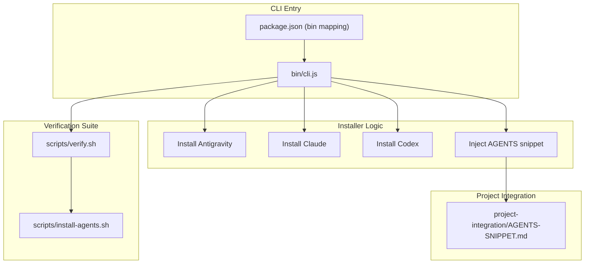
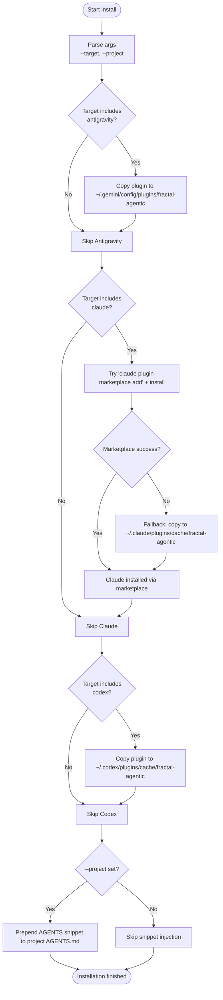
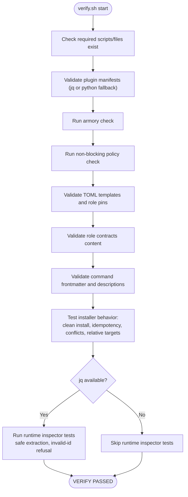
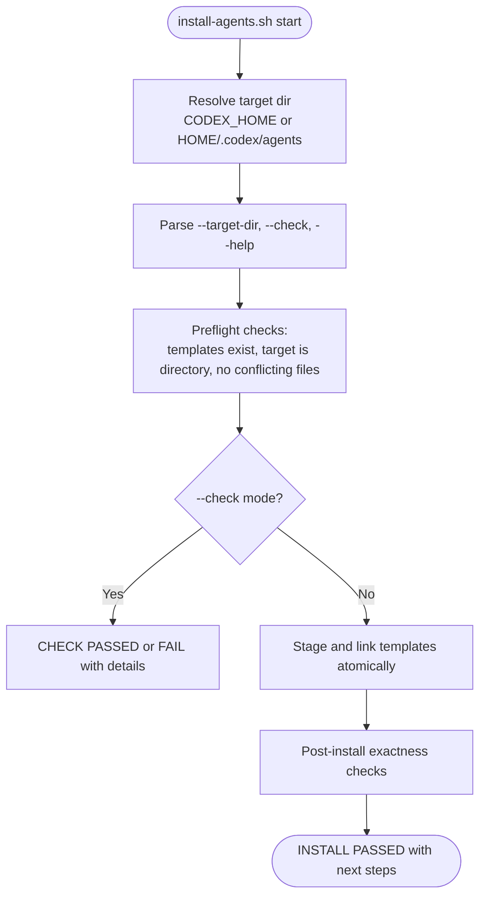
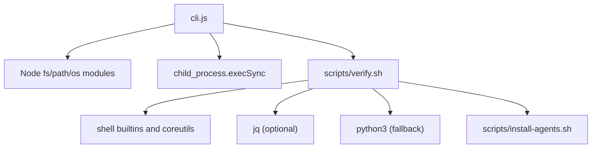

# Utility Commands

<cite>
**Referenced Files in This Document**
- [cli.js](file://fractal-agentic/bin/cli.js)
- [package.json](file://fractal-agentic/package.json)
- [verify.sh](file://fractal-agentic/scripts/verify.sh)
- [install-agents.sh](file://fractal-agentic/scripts/install-agents.sh)
- [AGENTS-SNIPPET.md](file://fractal-agentic/project-integration/AGENTS-SNIPPET.md)
- [02-install.md](file://fractal-agentic/docs/02-install.md)
- [TROUBLESHOOTING.md](file://fractal-agentic/TROUBLESHOOTING.md)
</cite>

## Table of Contents
1. [Introduction](#introduction)
2. [Project Structure](#project-structure)
3. [Core Components](#core-components)
4. [Architecture Overview](#architecture-overview)
5. [Detailed Component Analysis](#detailed-component-analysis)
6. [Dependency Analysis](#dependency-analysis)
7. [Performance Considerations](#performance-considerations)
8. [Troubleshooting Guide](#troubleshooting-guide)
9. [Conclusion](#conclusion)
10. [Appendices](#appendices)

## Introduction
This document provides comprehensive documentation for the utility CLI commands that install, verify, and help configure Fractal Agentic across multiple AI coding agent hosts (Claude Code, Codex, Google Antigravity). It covers command usage, options, environment variables, project integration, verification workflows, troubleshooting, and automation patterns suitable for CI/CD pipelines.

## Project Structure
The CLI is implemented as a Node executable exposed via npm’s bin mapping. The installer orchestrates host-specific installations and optional project integration. A shell-based verification suite validates plugin manifests, templates, contracts, and runtime behavior.



**Diagram sources**
- [cli.js:1-148](file://fractal-agentic/bin/cli.js#L1-L148)
- [package.json:1-59](file://fractal-agentic/package.json#L1-L59)
- [verify.sh:1-274](file://fractal-agentic/scripts/verify.sh#L1-L274)
- [install-agents.sh:1-180](file://fractal-agentic/scripts/install-agents.sh#L1-L180)
- [AGENTS-SNIPPET.md:1-117](file://fractal-agentic/project-integration/AGENTS-SNIPPET.md#L1-L117)

**Section sources**
- [package.json:1-59](file://fractal-agentic/package.json#L1-L59)
- [cli.js:1-148](file://fractal-agentic/bin/cli.js#L1-L148)

## Core Components
- CLI entrypoint: Parses commands and options, dispatches to host-specific installers or runs the verification suite.
- Host installers: Copy plugin assets into host-specific directories or invoke marketplace commands when available.
- Project integration: Optionally injects an AGENTS snippet into the current project to enable progressive discovery and non-blocking orchestration.
- Verification suite: Validates manifests, TOML templates, role contracts, command frontmatter, idempotency, and safe runtime inspection.

Key behaviors:
- Default command is install; explicit help and verify are supported.
- Target selection supports antigravity, claude, codex, or all.
- Project flag triggers snippet injection into the current working directory.

**Section sources**
- [cli.js:27-43](file://fractal-agentic/bin/cli.js#L27-L43)
- [cli.js:106-145](file://fractal-agentic/bin/cli.js#L106-L145)

## Architecture Overview
The CLI coordinates installation across multiple hosts and integrates with project-level configuration. The verification suite ensures correctness and safety by validating files and running checks.

```mermaid
sequenceDiagram
participant User as "User"
participant CLI as "cli.js"
participant HostA as "Antigravity Installer"
participant HostB as "Claude Installer"
participant HostC as "Codex Installer"
participant Verify as "verify.sh"
participant Agents as "install-agents.sh"
User->>CLI : npx fractal-agentic install [--target=...] [--project]
alt target includes antigravity
CLI->>HostA : copy plugin assets to ~/.gemini/config/plugins/fractal-agentic
end
alt target includes claude
CLI->>HostB : try marketplace add + install; fallback to cache dir
end
alt target includes codex
CLI->>HostC : copy plugin assets to ~/.codex/plugins/cache/fractal-agentic
end
opt --project
CLI->>CLI : inject AGENTS snippet into project AGENTS.md
end
User->>CLI : npx fractal-agentic verify
CLI->>Verify : run verification suite
Verify->>Agents : validate install behavior and templates
Verify-->>User : PASS/FAIL results
```

**Diagram sources**
- [cli.js:45-84](file://fractal-agentic/bin/cli.js#L45-L84)
- [cli.js:86-104](file://fractal-agentic/bin/cli.js#L86-L104)
- [cli.js:115-122](file://fractal-agentic/bin/cli.js#L115-L122)
- [verify.sh:1-274](file://fractal-agentic/scripts/verify.sh#L1-L274)
- [install-agents.sh:1-180](file://fractal-agentic/scripts/install-agents.sh#L1-L180)

## Detailed Component Analysis

### CLI Command Reference
Commands:
- install: Install Fractal Agentic for detected AI coding agent hosts (default).
- verify: Run verification suite on local plugin installation.
- help: Show usage information and parameter reference.

Options:
- --target=<host>: Target specific host: antigravity, claude, codex, or all (default: all).
- --project: Inject AGENTS snippet into the current project directory.

Environment variables:
- FRACTAL_AGENTIC_ROOT: Optional absolute root pointing at the plugin directory for detection and resolution.

Behavior highlights:
- If claude CLI is present, the installer attempts official marketplace registration and installation; otherwise it falls back to copying into the cache directory.
- For Antigravity and Codex, the installer copies filtered plugin assets into host-specific directories.
- When --project is provided, the installer prepends the canonical AGENTS snippet if not already present.

**Section sources**
- [cli.js:27-43](file://fractal-agentic/bin/cli.js#L27-L43)
- [cli.js:106-145](file://fractal-agentic/bin/cli.js#L106-L145)
- [AGENTS-SNIPPET.md:1-117](file://fractal-agentic/project-integration/AGENTS-SNIPPET.md#L1-L117)

### Installation Flow (Multi-Host)


**Diagram sources**
- [cli.js:45-84](file://fractal-agentic/bin/cli.js#L45-L84)
- [cli.js:86-104](file://fractal-agentic/bin/cli.js#L86-L104)
- [cli.js:124-145](file://fractal-agentic/bin/cli.js#L124-L145)

### Verification Suite
The verify command executes a comprehensive shell-based validation suite:
- Checks presence and validity of plugin manifests (JSON).
- Runs armory and non-blocking policy checks.
- Validates TOML templates and exact role pins.
- Ensures role contracts include required agent types and verdict sets.
- Validates command structure (frontmatter and description).
- Tests installer idempotency, conflict refusal, and relative targets.
- Performs safe runtime inspector tests (when jq is available), ensuring no secret leakage and correct allowlisted fields.



**Diagram sources**
- [verify.sh:1-274](file://fractal-agentic/scripts/verify.sh#L1-L274)

**Section sources**
- [verify.sh:1-274](file://fractal-agentic/scripts/verify.sh#L1-L274)

### Custom Agent Templates Installer
The install-agents script installs three custom-agent TOML templates into a target directory without modifying host configuration:
- Supports explicit target directory and check-only mode.
- Resolves default target using CODEX_HOME or HOME/.codex/agents.
- Enforces strict file matching and refuses overwriting differing files.
- Provides clear guidance about layer B (disk) vs layer C (session spawn discovery).



**Diagram sources**
- [install-agents.sh:1-180](file://fractal-agentic/scripts/install-agents.sh#L1-L180)

**Section sources**
- [install-agents.sh:1-180](file://fractal-agentic/scripts/install-agents.sh#L1-L180)

### Project Integration Snippet
The AGENTS snippet enables progressive discovery and non-blocking orchestration within any project:
- Detection logic prefers FRACTAL_AGENTIC_ROOT and searches upward for plugin indicators.
- Guides agents to read startup router, selected boss playbook, skill references, and progression docs.
- Defines capability modes and preferred use without blocking product work.
- Includes optional continuous LLM wiki integration and trivial exemption rules.

Usage:
- Paste the snippet into the project’s AGENTS.md header.
- Optionally set FRACTAL_AGENTIC_ROOT to point at the plugin directory.

**Section sources**
- [AGENTS-SNIPPET.md:1-117](file://fractal-agentic/project-integration/AGENTS-SNIPPET.md#L1-L117)

## Dependency Analysis
The CLI depends on Node.js runtime and standard libraries for filesystem operations and child process execution. The verification suite depends on shell utilities (sh, shasum, grep, mktemp, cmp) and optionally jq for JSON processing. Python3 is used as a fallback for JSON parsing and TOML validation.



**Diagram sources**
- [cli.js:1-10](file://fractal-agentic/bin/cli.js#L1-L10)
- [verify.sh:1-274](file://fractal-agentic/scripts/verify.sh#L1-L274)
- [install-agents.sh:1-180](file://fractal-agentic/scripts/install-agents.sh#L1-L180)

**Section sources**
- [cli.js:1-10](file://fractal-agentic/bin/cli.js#L1-L10)
- [verify.sh:1-274](file://fractal-agentic/scripts/verify.sh#L1-L274)

## Performance Considerations
- Installation uses synchronous filesystem operations; for large repositories, consider running in isolated environments to avoid long disk I/O.
- Marketplace installation attempts may incur network latency; fallback paths ensure offline operation.
- Verification suite performs multiple validations; caching jq availability and skipping optional checks can reduce runtime in constrained environments.

[No sources needed since this section provides general guidance]

## Troubleshooting Guide
Common issues and resolutions:
- Missing CLI or PATH issues: Ensure Node.js is installed and npx is available.
- Marketplace failures (Claude): The installer falls back to copying into the cache directory; verify permissions and restart the host.
- Permission errors during copy: Run with appropriate user privileges or adjust directory ownership.
- Verification failures:
  - Invalid JSON manifests: Validate with jq or python3 fallback.
  - TOML validation errors: Ensure Python 3.11+ with tomllib is available.
  - Conflicts with existing files: Review differences and rerun with --check to diagnose.
  - Runtime inspector tests skipped: Install jq to enable full validation.

Quick health checks:
- Resolve plugin root and run armory and non-blocking policy checks.
- Use the verification suite to confirm progressive discovery and skills integrity.

**Section sources**
- [TROUBLESHOOTING.md:1-27](file://fractal-agentic/TROUBLESHOOTING.md#L1-L27)
- [verify.sh:1-274](file://fractal-agentic/scripts/verify.sh#L1-L274)

## Conclusion
The Fractal Agentic utility CLI provides a robust, multi-host installation experience with strong verification and project integration capabilities. By leveraging targeted installation, safe verification, and non-blocking project setup, teams can adopt the plugin progressively while maintaining productivity.

[No sources needed since this section summarizes without analyzing specific files]

## Appendices

### Installation Methods Summary
- NPX one-liner for all hosts.
- Claude Code marketplace commands.
- OpenAI Codex marketplace sparse checkout.
- Google Antigravity automated or manual copy.
- Manual Git clone with environment configuration.

**Section sources**
- [02-install.md:1-198](file://fractal-agentic/docs/02-install.md#L1-L198)

### Automation Patterns and CI/CD Integration
- Use npx fractal-agentic install with --target to automate host-specific setup in CI jobs.
- Run verify.sh in CI to enforce manifest validity, template integrity, and policy compliance.
- Set FRACTAL_AGENTIC_ROOT in CI environment to resolve plugin root deterministically.
- Integrate install-agents.sh --check to assert template exactness without mutation.

**Section sources**
- [02-install.md:1-198](file://fractal-agentic/docs/02-install.md#L1-L198)
- [verify.sh:1-274](file://fractal-agentic/scripts/verify.sh#L1-L274)
- [install-agents.sh:1-180](file://fractal-agentic/scripts/install-agents.sh#L1-L180)