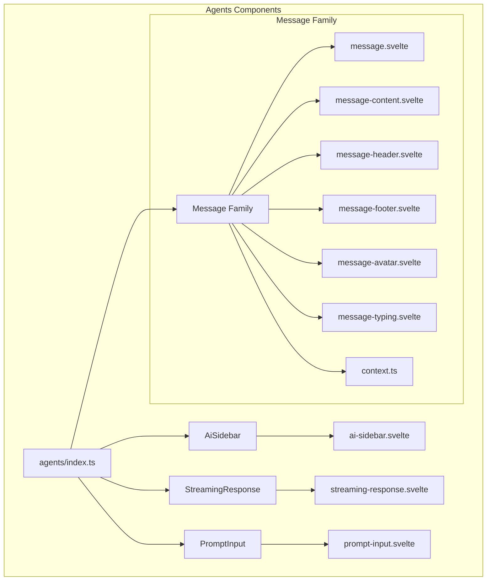
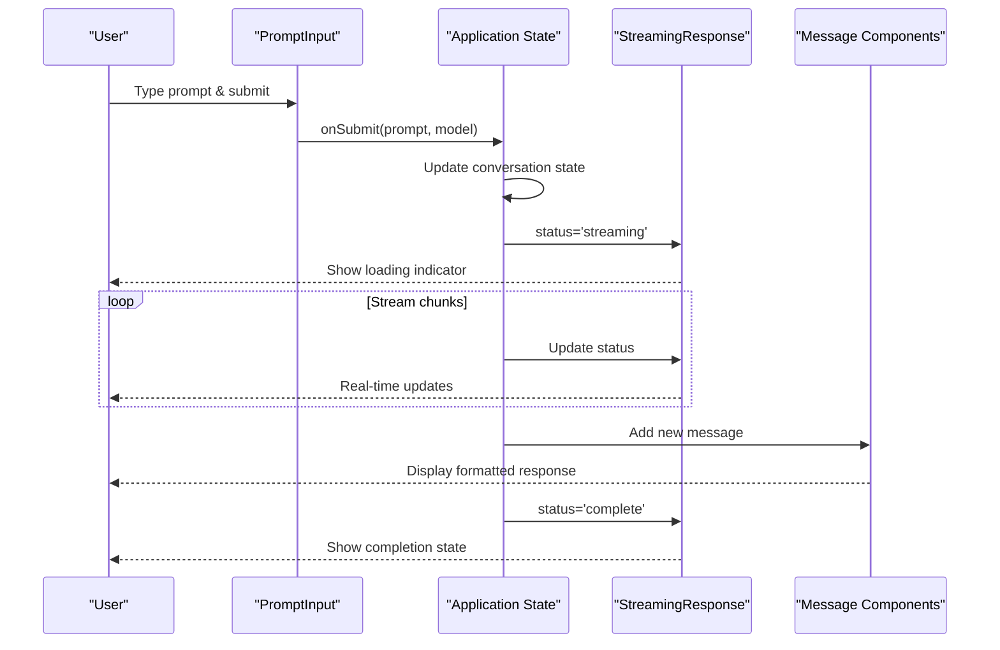
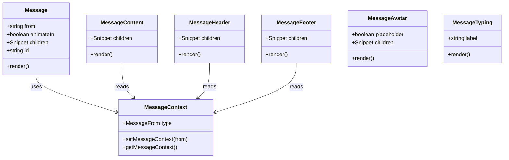
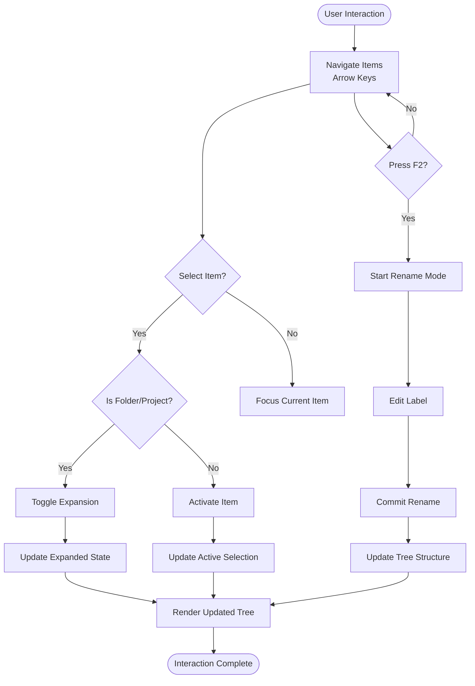
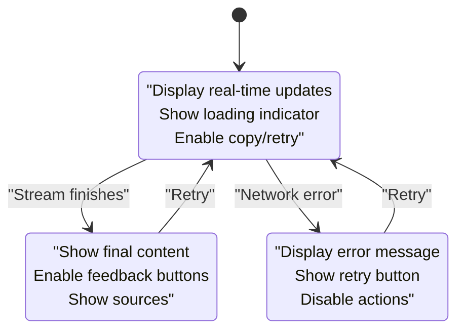
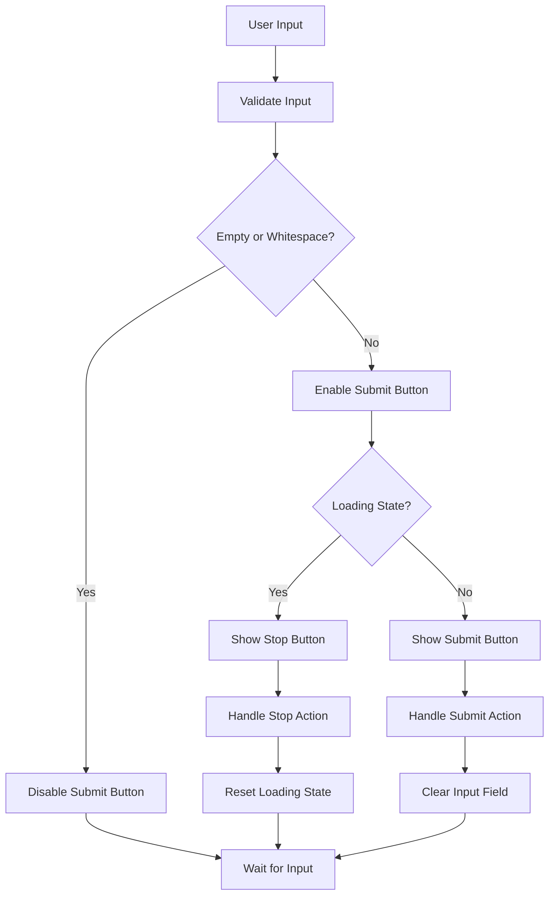
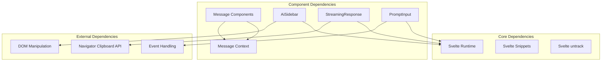

# Agent Components

<cite>
**Referenced Files in This Document**
- [message.svelte](file://src/lib/components/agents/message/message.svelte)
- [context.ts](file://src/lib/components/agents/message/context.ts)
- [message-content.svelte](file://src/lib/components/agents/message/message-content.svelte)
- [message-header.svelte](file://src/lib/components/agents/message/message-header.svelte)
- [message-footer.svelte](file://src/lib/components/agents/message/message-footer.svelte)
- [message-avatar.svelte](file://src/lib/components/agents/message/message-avatar.svelte)
- [message-typing.svelte](file://src/lib/components/agents/message/message-typing.svelte)
- [index.ts (agents)](file://src/lib/components/agents/index.ts)
- [ai-sidebar.svelte](file://src/lib/components/agents/ai-sidebar/ai-sidebar.svelte)
- [streaming-response.svelte](file://src/lib/components/agents/streaming-response/streaming-response.svelte)
- [prompt-input.svelte](file://src/lib/components/agents/prompt-input/prompt-input.svelte)
- [AISidebarExample.svelte](file://src/examples/AISidebarExample.svelte)
</cite>

## Table of Contents
1. Introduction
2. Project Structure
3. Core Components
4. Architecture Overview
5. Detailed Component Analysis
6. Dependency Analysis
7. Performance Considerations
8. Troubleshooting Guide
9. Conclusion

## Introduction
This document provides detailed API documentation for agent components designed for AI interaction patterns. It covers:
- Message component family for displaying chat conversations with context-aware rendering and typing indicators
- AiSidebar component for AI assistant interfaces with collapsible panels, conversation history, and settings management
- StreamingResponse component for real-time AI responses with progress indicators and error handling
- PromptInput component for user input with model selection, actions, validation, and submission handling

The goal is to help you integrate these components into AI-powered applications, handle real-time updates, and manage conversation state effectively.

## Project Structure
The agent components are organized under a feature-based structure within the agents directory. Each component has its own folder containing implementation files, styles, and documentation. The main index file exports all public APIs for easy consumption.

**Diagram sources**
- [index.ts (agents):1-10](file://src/lib/components/agents/index.ts#L1-L10)
- [message.svelte:1-24](file://src/lib/components/agents/message/message.svelte#L1-L24)
- [ai-sidebar.svelte:1-197](file://src/lib/components/agents/ai-sidebar/ai-sidebar.svelte#L1-L197)
- [streaming-response.svelte:1-129](file://src/lib/components/agents/streaming-response/streaming-response.svelte#L1-L129)
- [prompt-input.svelte:1-141](file://src/lib/components/agents/prompt-input/prompt-input.svelte#L1-L141)

**Section sources**
- [index.ts (agents):1-10](file://src/lib/components/agents/index.ts#L1-L10)

## Core Components

### Message Component Family
The Message component family provides a comprehensive set of components for displaying chat conversations with support for different message types, avatars, headers, footers, and typing indicators.

#### Key Features:
- Context-aware rendering based on message source (user vs assistant)
- Flexible content composition with Svelte snippets
- Typing animation for real-time feedback
- Avatar support for visual identification
- Header and footer sections for metadata

#### Props API:
- **Message**: `from`, `animateIn`, `children`, `id`
- **MessageContent**: `children`
- **MessageHeader**: `children` 
- **MessageFooter**: `children`
- **MessageAvatar**: `placeholder`, `children`
- **MessageTyping**: `label`

**Section sources**
- [message.svelte:1-24](file://src/lib/components/agents/message/message.svelte#L1-L24)
- [context.ts:1-10](file://src/lib/components/agents/message/context.ts#L1-L10)
- [message-content.svelte:1-9](file://src/lib/components/agents/message/message-content.svelte#L1-L9)
- [message-header.svelte:1-9](file://src/lib/components/agents/message/message-header.svelte#L1-L9)
- [message-footer.svelte:1-9](file://src/lib/components/agents/message/message-footer.svelte#L1-L9)
- [message-avatar.svelte:1-13](file://src/lib/components/agents/message/message-avatar.svelte#L1-L13)
- [message-typing.svelte:1-12](file://src/lib/components/agents/message/message-typing.svelte#L1-L12)

### AiSidebar Component
The AiSidebar component provides a hierarchical navigation interface for AI assistant resources, supporting folders, projects, files, and bookmarks with full keyboard accessibility.

#### Key Features:
- Hierarchical resource tree with collapsible sections
- Drag-and-drop reordering support
- Inline renaming functionality
- Keyboard navigation with arrow keys
- Accessibility-compliant tree structure
- Active item selection with visual feedback

#### Props API:
- **items/defaultItems**: Resource tree structure
- **activeId/defaultActiveId**: Currently selected item
- **defaultExpandedIds**: Initially expanded folders
- **onItemsChange**: Resource tree updates
- **onMove**: Item reordering handler
- **onRename**: Item renaming handler
- **onActiveChange**: Selection change handler

**Section sources**
- [ai-sidebar.svelte:1-197](file://src/lib/components/agents/ai-sidebar/ai-sidebar.svelte#L1-L197)

### StreamingResponse Component
The StreamingResponse component handles real-time AI responses with comprehensive status management, copy functionality, feedback collection, and source citation display.

#### Key Features:
- Real-time streaming status management
- Copy-to-clipboard functionality
- User feedback system (helpful/not helpful)
- Source citation display with expandable sections
- Error state handling with retry capability
- Progress indication during streaming

#### Props API:
- **status**: 'streaming' | 'complete' | 'error'
- **copyText/onCopy**: Copy functionality
- **sources**: Citation items array
- **feedback/defaultFeedback**: User feedback state
- **showActions**: Control action visibility
- **announce**: Screen reader announcements

**Section sources**
- [streaming-response.svelte:1-129](file://src/lib/components/agents/streaming-response/streaming-response.svelte#L1-L129)

### PromptInput Component
The PromptInput component provides a sophisticated text input interface for AI interactions with model selection, action menus, and intelligent submission handling.

#### Key Features:
- Auto-resizing textarea with row constraints
- Model selection dropdown
- Action menu with descriptions
- Intelligent Enter key submission (Shift+Enter for newlines)
- Loading state with stop functionality
- Disabled state management

#### Props API:
- **value/defaultValue**: Input value binding
- **models**: Available AI models
- **actions**: Action menu items
- **onSubmit**: Form submission handler
- **loading/onStop**: Generation control
- **minRows/maxRows**: Textarea sizing
- **leadingAction**: Custom leading content

**Section sources**
- [prompt-input.svelte:1-141](file://src/lib/components/agents/prompt-input/prompt-input.svelte#L1-L141)

## Architecture Overview

**Diagram sources**
- [prompt-input.svelte:62-75](file://src/lib/components/agents/prompt-input/prompt-input.svelte#L62-L75)
- [streaming-response.svelte:47-52](file://src/lib/components/agents/streaming-response/streaming-response.svelte#L47-L52)
- [message.svelte:15-23](file://src/lib/components/agents/message/message.svelte#L15-L23)

## Detailed Component Analysis

### Message Component System Architecture

**Diagram sources**
- [message.svelte:1-24](file://src/lib/components/agents/message/message.svelte#L1-L24)
- [context.ts:1-10](file://src/lib/components/agents/message/context.ts#L1-L10)
- [message-content.svelte:1-9](file://src/lib/components/agents/message/message-content.svelte#L1-L9)
- [message-header.svelte:1-9](file://src/lib/components/agents/message/message-header.svelte#L1-L9)
- [message-footer.svelte:1-9](file://src/lib/components/agents/message/message-footer.svelte#L1-L9)
- [message-avatar.svelte:1-13](file://src/lib/components/agents/message/message-avatar.svelte#L1-L13)
- [message-typing.svelte:1-12](file://src/lib/components/agents/message/message-typing.svelte#L1-L12)

### AiSidebar Interaction Flow

**Diagram sources**
- [ai-sidebar.svelte:105-138](file://src/lib/components/agents/ai-sidebar/ai-sidebar.svelte#L105-L138)
- [ai-sidebar.svelte:85-104](file://src/lib/components/agents/ai-sidebar/ai-sidebar.svelte#L85-L104)

### Streaming Response Processing

**Diagram sources**
- [streaming-response.svelte:47-52](file://src/lib/components/agents/streaming-response/streaming-response.svelte#L47-L52)
- [streaming-response.svelte:74-77](file://src/lib/components/agents/streaming-response/streaming-response.svelte#L74-L77)

### Prompt Input Validation Flow

**Diagram sources**
- [prompt-input.svelte:62-75](file://src/lib/components/agents/prompt-input/prompt-input.svelte#L62-L75)
- [prompt-input.svelte:132-138](file://src/lib/components/agents/prompt-input/prompt-input.svelte#L132-L138)

## Dependency Analysis

**Diagram sources**
- [message.svelte:1-5](file://src/lib/components/agents/message/message.svelte#L1-L5)
- [ai-sidebar.svelte:1-4](file://src/lib/components/agents/ai-sidebar/ai-sidebar.svelte#L1-L4)
- [streaming-response.svelte:1-5](file://src/lib/components/agents/streaming-response/streaming-response.svelte#L1-L5)
- [prompt-input.svelte:1-5](file://src/lib/components/agents/prompt-input/prompt-input.svelte#L1-L5)

**Section sources**
- [index.ts (agents):1-10](file://src/lib/components/agents/index.ts#L1-L10)

## Performance Considerations

### Memory Management
- Use Svelte's reactive state efficiently with `$state` and `$derived`
- Implement proper cleanup in effects to prevent memory leaks
- Utilize `untrack()` for expensive operations that don't need reactivity

### Rendering Optimization
- Leverage Svelte's fine-grained reactivity for minimal DOM updates
- Use keyed each blocks for list rendering in AiSidebar
- Implement virtual scrolling for large conversation histories

### Event Handling
- Debounce rapid user inputs in PromptInput
- Use event delegation for large lists in AiSidebar
- Implement proper event cleanup in streaming scenarios

## Troubleshooting Guide

### Common Issues and Solutions

#### Message Rendering Problems
- **Issue**: Messages not updating correctly
- **Solution**: Ensure proper context setup with `setMessageContext()`
- **Check**: Verify `from` prop matches expected values ('user' | 'assistant')

#### Streaming Response Errors
- **Issue**: Streaming not working properly
- **Solution**: Check network connectivity and API endpoints
- **Solution**: Implement proper error boundaries and retry logic

#### Sidebar Navigation Issues
- **Issue**: Keyboard navigation not working
- **Solution**: Verify tabindex and focus management
- **Solution**: Check event handlers for arrow key navigation

#### Input Validation Problems
- **Issue**: Submit button not enabling/disabling correctly
- **Solution**: Check input validation logic in `submit()` function
- **Solution**: Verify loading state handling

**Section sources**
- [context.ts:4-9](file://src/lib/components/agents/message/context.ts#L4-L9)
- [streaming-response.svelte:54-71](file://src/lib/components/agents/streaming-response/streaming-response.svelte#L54-L71)
- [ai-sidebar.svelte:105-138](file://src/lib/components/agents/ai-sidebar/ai-sidebar.svelte#L105-L138)
- [prompt-input.svelte:62-75](file://src/lib/components/agents/prompt-input/prompt-input.svelte#L62-L75)

## Conclusion

The agent components provide a comprehensive foundation for building AI-powered chat interfaces. The modular architecture allows for flexible composition and customization while maintaining consistent user experience patterns. Key benefits include:

- **Reactive State Management**: Built on Svelte's reactive primitives for optimal performance
- **Accessibility First**: Full keyboard navigation and screen reader support
- **Real-time Capabilities**: Native streaming support with progress indicators
- **Extensible Design**: Component composition through Svelte snippets
- **Type Safety**: Comprehensive TypeScript definitions

These components work together seamlessly to create sophisticated AI interaction patterns while maintaining code maintainability and user experience quality.