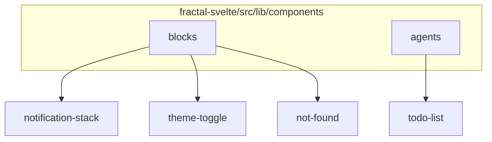
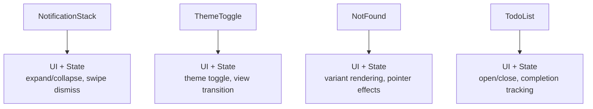
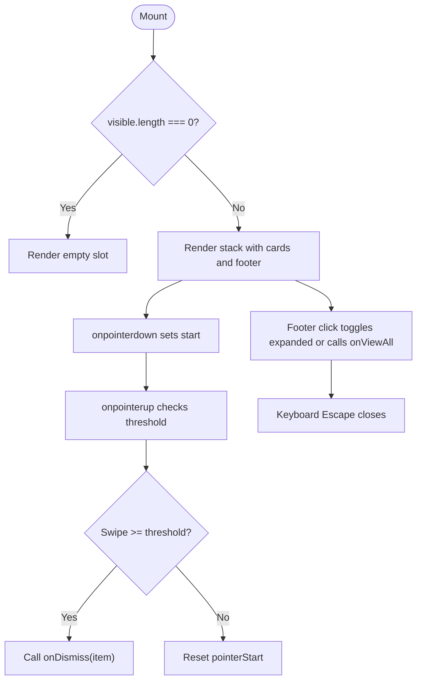
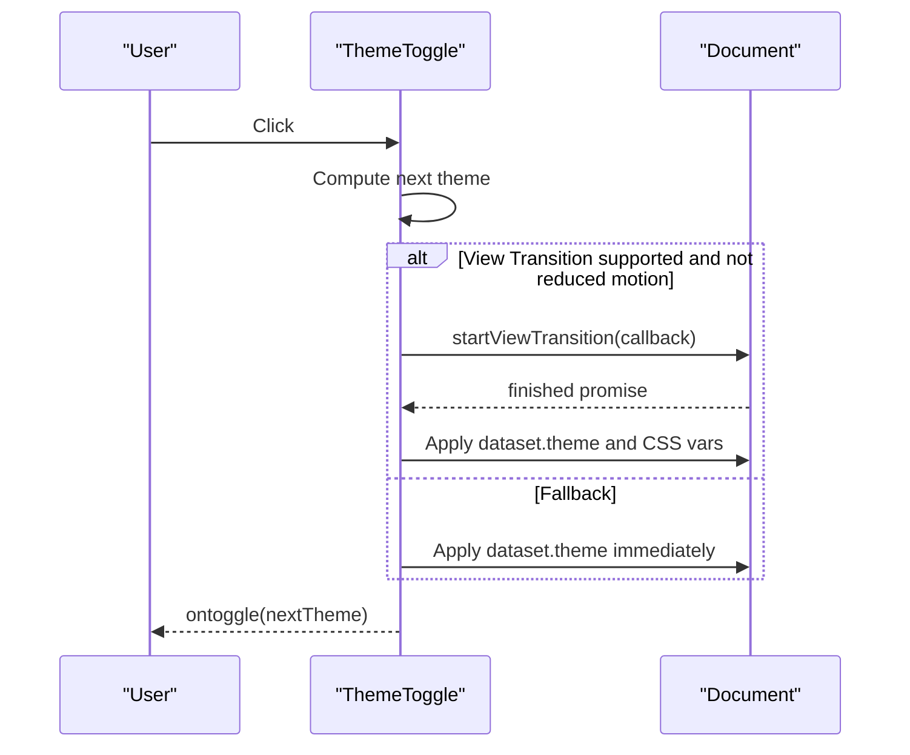
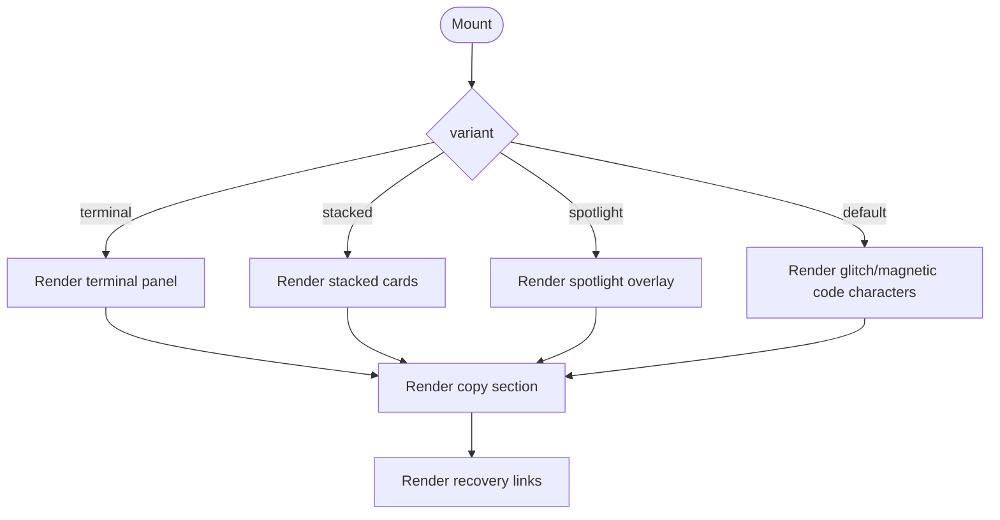
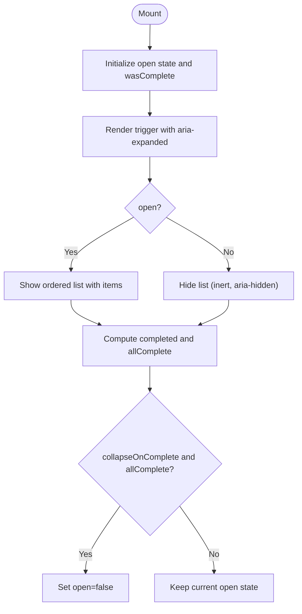
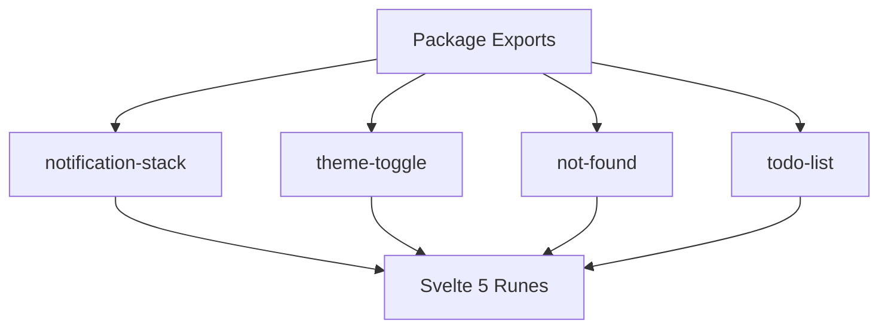

# Product Blocks

<cite>
**Referenced Files in This Document**
- [notification-stack.svelte](file://src/lib/components/blocks/notification-stack/notification-stack.svelte)
- [notification-stack.md](file://src/lib/components/blocks/notification-stack/notification-stack.md)
- [theme-toggle.svelte](file://src/lib/components/blocks/theme-toggle/theme-toggle.svelte)
- [theme-toggle.md](file://src/lib/components/blocks/theme-toggle/theme-toggle.md)
- [not-found.svelte](file://src/lib/components/blocks/not-found/not-found.svelte)
- [not-found.md](file://src/lib/components/blocks/not-found/not-found.md)
- [todo-list.svelte](file://src/lib/components/agents/todo-list/todo-list.svelte)
- [todo-list.md](file://src/lib/components/agents/todo-list/todo-list.md)
- [package.json](file://package.json)
</cite>

## Table of Contents
1. Introduction
2. Project Structure
3. Core Components
4. Architecture Overview
5. Detailed Component Analysis
6. Dependency Analysis
7. Performance Considerations
8. Troubleshooting Guide
9. Conclusion

## Introduction
This document provides comprehensive API documentation for product block components that deliver business logic and layout functionality. It covers:
- NotificationStack: a notification queue manager with auto-dismiss via swipe, expand/collapse behavior, and customizable styling.
- ThemeToggle: a theme switcher with system preference detection and persistence through CSS custom properties and document attributes.
- NotFound: an error page component with multiple visual variants and customizable content and navigation links.
- TodoList: a task list component supporting CRUD operations, filtering, and local storage patterns.

It also documents props for data binding, event handling, customization options, accessibility features, examples of data integration, state management, responsive design patterns, component composition, theming, and performance considerations.

## Project Structure
The product blocks are implemented as Svelte 5 components under the blocks directory, with each component having its own folder containing the Svelte source, styles, and documentation. The package exposes these components via module exports.

**Section sources**
- [package.json:174-193](file://package.json#L174-L193)

## Core Components
This section summarizes the four core components and their responsibilities:
- NotificationStack: manages a stack of notifications with expand/collapse, swipe-to-dismiss, and optional actions.
- ThemeToggle: toggles between light and dark themes using document-level view transitions and prefers-reduced-motion support.
- NotFound: renders a styled error page with multiple variants and customizable text and links.
- TodoList: displays a collapsible list of tasks with status indicators and completion tracking.

**Section sources**
- [notification-stack.svelte:1-46](file://src/lib/components/blocks/notification-stack/notification-stack.svelte#L1-L46)
- [theme-toggle.svelte:1-55](file://src/lib/components/blocks/theme-toggle/theme-toggle.svelte#L1-L55)
- [not-found.svelte:1-36](file://src/lib/components/blocks/not-found/not-found.svelte#L1-L36)
- [todo-list.svelte:1-84](file://src/lib/components/agents/todo-list/todo-list.svelte#L1-L84)

## Architecture Overview
At a high level, each component encapsulates its own state, UI, and interactions. They rely on Svelte 5 runes for reactive state and derived values. Styling is handled by sibling SASS files, and accessibility attributes are included directly in the markup.

[No sources needed since this diagram shows conceptual workflow, not actual code structure]

## Detailed Component Analysis

### NotificationStack
NotificationStack renders a compact stack of notifications with an expandable footer to show more items. It supports:
- Data binding for expanded state
- Swipe-to-dismiss with configurable threshold
- Optional trailing snippet and per-item action button
- Keyboard accessibility (Escape to close)
- Live region announcements for screen readers

Props
- items: array of notification objects with id, title, description, optional trailing snippet, and optional actionLabel
- expanded: bindable boolean controlling open state; falls back to internalExpanded when undefined
- defaultExpanded: initial collapsed state
- onExpandedChange: callback when expanded state changes
- onViewAll: callback when user clicks “View all” while expanded
- onAction: callback invoked when item action button is clicked
- onDismiss: callback invoked when a notification is dismissed via swipe
- maxVisible: number of visible items when collapsed (minimum 1)
- collapsedLabel, expandedLabel, emptyLabel: localized labels
- swipeThreshold: minimum pointer movement to trigger dismiss

Events
- onExpandedChange(value: boolean)
- onViewAll()
- onAction(item)
- onDismiss(item)

Accessibility
- aria-expanded on footer button
- role="group" and aria-label on container
- aria-live="polite" on cards container
- sr-only counts for completed items

Data Integration Example
- Bind expanded to parent state to control expansion from outside
- Use onDismiss to remove items from parent store
- Use onAction to perform side effects like marking read or opening details

State Management Pattern
- Internal expanded state managed via $state and untrack for default value
- Derived open state computed from props or internal state
- Visible items slice based on maxVisible

Responsive Design
- Uses min-width constraints and flexible layouts; no breakpoints declared in component

Performance Considerations
- Only first overlapped card receives pointer events while collapsed
- Avoids unnecessary re-renders by deriving visible items

**Diagram sources**
- [notification-stack.svelte:1-46](file://src/lib/components/blocks/notification-stack/notification-stack.svelte#L1-L46)

**Section sources**
- [notification-stack.svelte:1-46](file://src/lib/components/blocks/notification-stack/notification-stack.svelte#L1-L46)
- [notification-stack.md:1-57](file://src/lib/components/blocks/notification-stack/notification-stack.md#L1-L57)

### ThemeToggle
ThemeToggle toggles between light and dark themes with smooth view transitions when supported. It respects reduced motion preferences and persists theme via document attribute.

Props
- theme: bindable 'light' | 'dark'
- variant: animation style ('rectangle', 'circle', 'circle-blur', 'blinds')
- start: transition origin ('center', 'top-left', 'top-right', 'bottom-left', 'bottom-right', 'bottom-up')
- ontoggle: callback invoked after theme change

Behavior
- Applies next theme to document.documentElement.dataset.theme
- Uses View Transitions API when available and not reduced motion
- Falls back to immediate apply when API or animations are unavailable

Accessibility
- aria-label updates based on current theme
- Respects prefers-reduced-motion

Integration Example
- Persist theme across sessions by reading/writing localStorage or server-side cookie
- Subscribe to ontoggle to sync external state or analytics

**Diagram sources**
- [theme-toggle.svelte:1-55](file://src/lib/components/blocks/theme-toggle/theme-toggle.svelte#L1-L55)

**Section sources**
- [theme-toggle.svelte:1-55](file://src/lib/components/blocks/theme-toggle/theme-toggle.svelte#L1-L55)
- [theme-toggle.md:1-45](file://src/lib/components/blocks/theme-toggle/theme-toggle.md#L1-L45)

### NotFound
NotFound renders an error page with multiple visual variants and customizable content and navigation links.

Props
- variant: one of 'glitch', 'magnetic', 'spotlight', 'stacked', 'terminal'
- code: displayed error code string
- title: heading text
- description: descriptive paragraph
- homeHref: link to home
- homeLabel: label for home link
- browseHref: link to browse components
- browseLabel: label for browse link

Behavior
- Tracks pointer movement for magnetic effect
- Renders variant-specific sections
- Provides accessible labels and roles

Integration Example
- Use in route fallback pages
- Customize copy and links per application context

**Diagram sources**
- [not-found.svelte:1-36](file://src/lib/components/blocks/not-found/not-found.svelte#L1-L36)

**Section sources**
- [not-found.svelte:1-36](file://src/lib/components/blocks/not-found/not-found.svelte#L1-L36)
- [not-found.md:1-69](file://src/lib/components/blocks/not-found/not-found.md#L1-L69)

### TodoList
TodoList displays a collapsible list of tasks with status indicators and completion tracking. It supports open state control and automatic collapse when all tasks complete.

Props
- items: array of todo items with id, title, optional status, progress, and detail
- title: header text
- open: controlled open state; falls back to internal if undefined
- defaultOpen: initial open state
- onOpenChange: callback when open state changes
- collapseOnComplete: automatically collapse when all items complete
- maxHeight: maximum height for the list content

Behavior
- Tracks completion count and toggles open state based on completion
- Uses inert and aria-hidden to manage focus and visibility when closed
- Announces live region updates for screen readers

CRUD Operations
- Add: push new item into items array
- Update: modify item.status or item.detail
- Delete: filter out item by id
- Filter: derive filtered list before passing to component

Local Storage Integration
- Persist items array to localStorage and hydrate on mount
- Debounce writes to avoid excessive storage updates

Accessibility
- aria-expanded on trigger button
- aria-controls linking trigger to content region
- sr-only text for counts and statuses

**Diagram sources**
- [todo-list.svelte:1-84](file://src/lib/components/agents/todo-list/todo-list.svelte#L1-L84)

**Section sources**
- [todo-list.svelte:1-84](file://src/lib/components/agents/todo-list/todo-list.svelte#L1-L84)
- [todo-list.md:1-20](file://src/lib/components/agents/todo-list/todo-list.md#L1-L20)

## Dependency Analysis
Components depend on Svelte 5 runes and sibling styles. They do not import heavy external libraries beyond standard DOM APIs. Package exports define how consumers can import each component.

**Diagram sources**
- [package.json:174-193](file://package.json#L174-L193)

**Section sources**
- [package.json:174-193](file://package.json#L174-L193)

## Performance Considerations
- NotificationStack limits visible items and avoids pointer events on hidden cards while collapsed.
- ThemeToggle uses View Transitions API only when supported and not reduced motion, falling back to immediate updates.
- NotFound computes pointer offsets only when needed and avoids heavy animations.
- TodoList derives completion counts and toggles open state efficiently; consider debouncing localStorage writes for large lists.

[No sources needed since this section provides general guidance]

## Troubleshooting Guide
Common issues and resolutions:
- Notifications not dismissing on swipe: ensure swipeThreshold is set appropriately and pointer events are not blocked by other elements.
- Theme toggle not animating: check browser support for View Transitions API and prefers-reduced-motion settings.
- NotFound magnetic effect not working: verify pointermove events are not prevented elsewhere.
- TodoList not collapsing when complete: confirm collapseOnComplete is true and items status updates propagate correctly.

**Section sources**
- [notification-stack.svelte:1-46](file://src/lib/components/blocks/notification-stack/notification-stack.svelte#L1-L46)
- [theme-toggle.svelte:1-55](file://src/lib/components/blocks/theme-toggle/theme-toggle.svelte#L1-L55)
- [not-found.svelte:1-36](file://src/lib/components/blocks/not-found/not-found.svelte#L1-L36)
- [todo-list.svelte:1-84](file://src/lib/components/agents/todo-list/todo-list.svelte#L1-L84)

## Conclusion
These product block components provide robust, accessible, and customizable UI primitives for common application needs. They leverage modern web APIs and Svelte 5 reactivity to deliver smooth interactions and efficient rendering. By following the documented props, events, and integration patterns, developers can compose powerful interfaces with consistent theming and performance.

[No sources needed since this section summarizes without analyzing specific files]