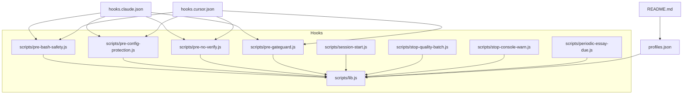
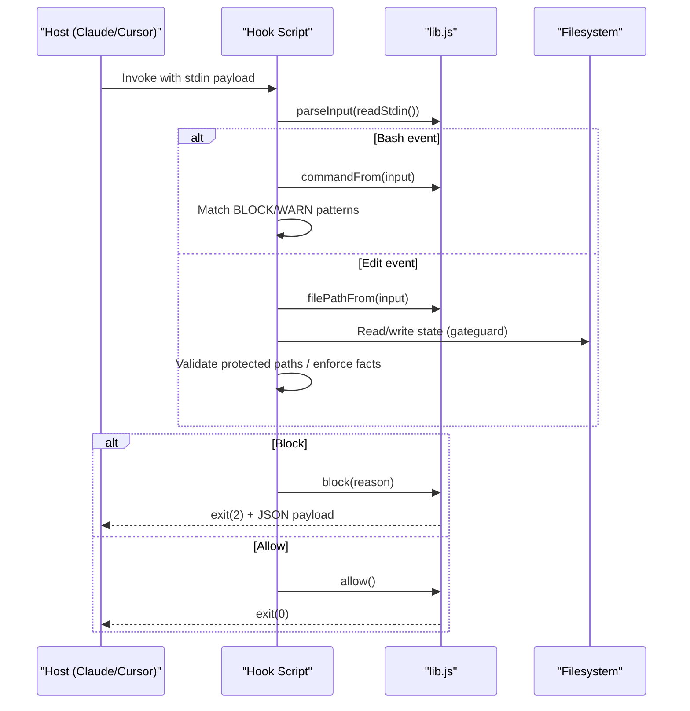
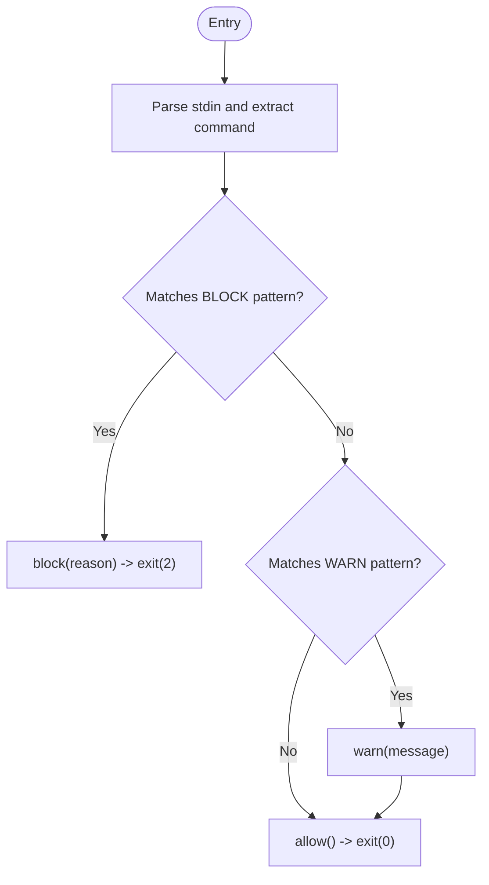
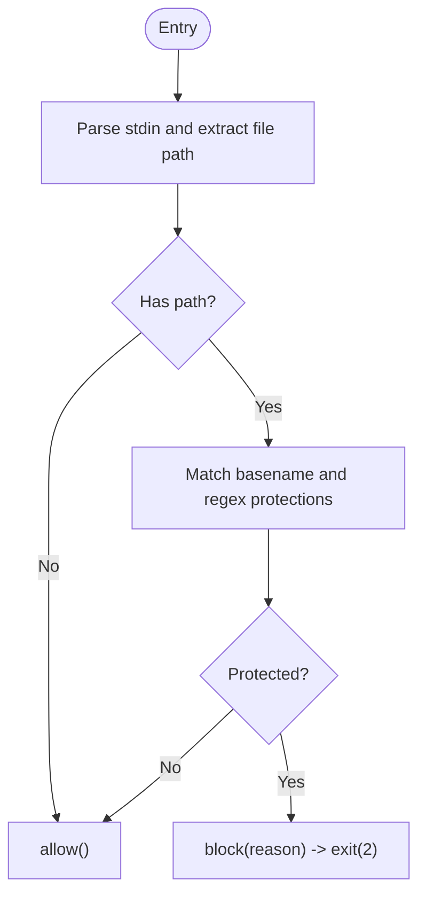
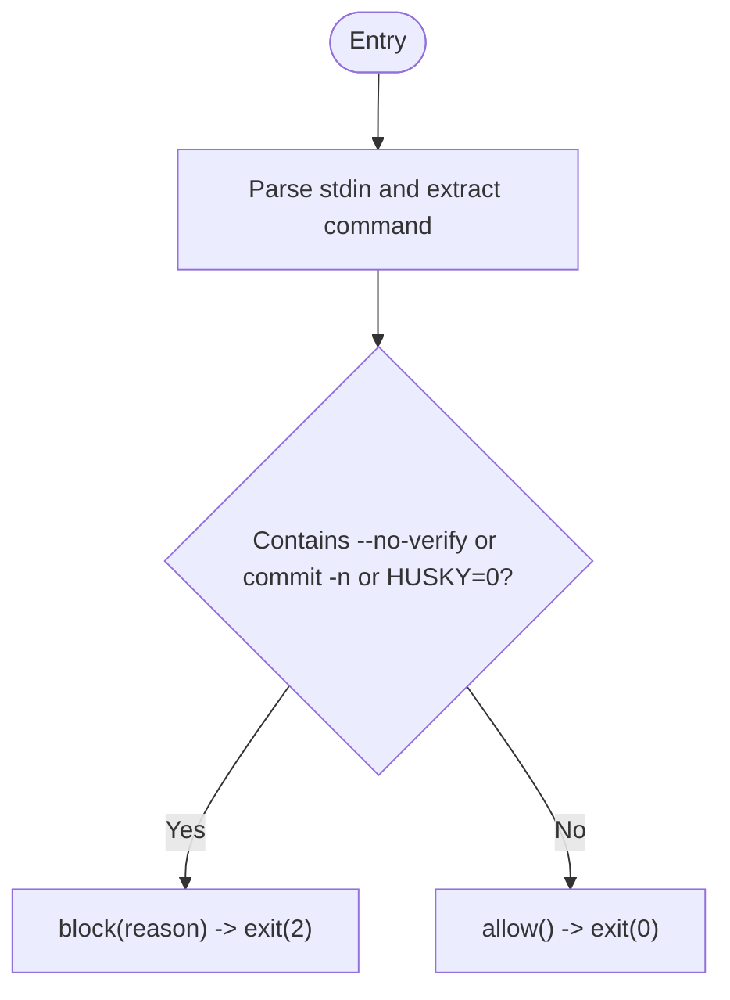
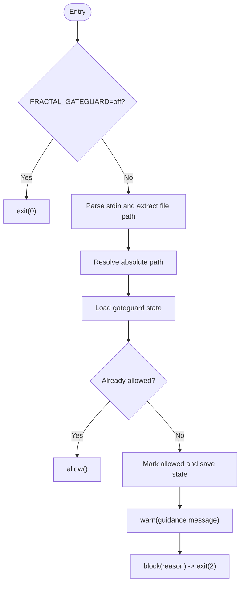
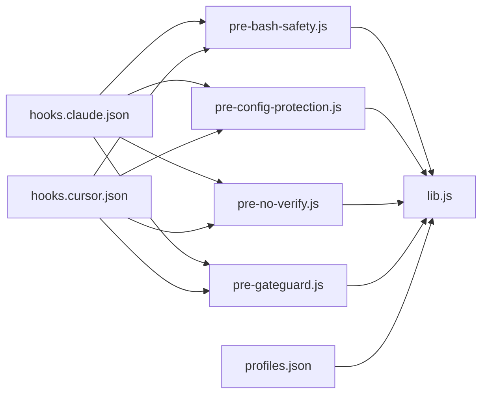
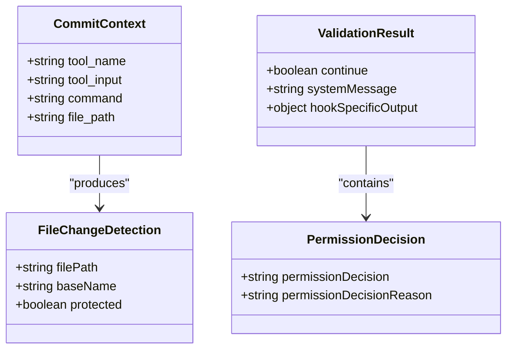

# Pre-commit Hooks

<cite>
**Referenced Files in This Document**
- [pre-bash-safety.js](file://fractal-agentic/hooks/scripts/pre-bash-safety.js)
- [pre-config-protection.js](file://fractal-agentic/hooks/scripts/pre-config-protection.js)
- [pre-no-verify.js](file://fractal-agentic/hooks/scripts/pre-no-verify.js)
- [pre-gateguard.js](file://fractal-agentic/hooks/scripts/pre-gateguard.js)
- [lib.js](file://fractal-agentic/hooks/scripts/lib.js)
- [profiles.json](file://fractal-agentic/hooks/profiles.json)
- [hooks.claude.json](file://fractal-agentic/hooks/hooks.claude.json)
- [hooks.cursor.json](file://fractal-agentic/hooks/hooks.cursor.json)
- [README.md](file://fractal-agentic/hooks/README.md)
- [session-start.js](file://fractal-agentic/hooks/scripts/session-start.js)
- [stop-quality-batch.js](file://fractal-agentic/hooks/scripts/stop-quality-batch.js)
- [stop-console-warn.js](file://fractal-agentic/hooks/scripts/stop-console-warn.js)
- [periodic-essay-due.js](file://fractal-agentic/hooks/scripts/periodic-essay-due.js)
</cite>

## Table of Contents
1. [Introduction](#introduction)
2. [Project Structure](#project-structure)
3. [Core Components](#core-components)
4. [Architecture Overview](#architecture-overview)
5. [Detailed Component Analysis](#detailed-component-analysis)
6. [Dependency Analysis](#dependency-analysis)
7. [Performance Considerations](#performance-considerations)
8. [Troubleshooting Guide](#troubleshooting-guide)
9. [Conclusion](#conclusion)
10. [Appendices](#appendices)

## Introduction
This document explains the pre-commit validation hooks that protect code quality and security within the Fractal Agentic plugin. It focuses on:
- pre:bash:safety: detecting destructive commands and secrets exfiltration patterns in shell invocations.
- pre:edit:config-protection: preventing accidental changes to linter/formatter configuration files.
- pre:no-verify: blocking git hook bypass attempts like --no-verify or HUSKY=0.
- pre:edit:gateguard: enforcing first-edit fact checks in strict profiles.

It also covers file validation patterns, security scanning implementations, quality gate mechanisms, TypeScript interfaces for commit contexts, error handling strategies, logging conventions, and performance optimization for large repositories.

## Project Structure
The hooks live under fractal-agentic/hooks with a shared library and per-hook scripts. Host integrations are defined via JSON mappings for Claude and Cursor. Profiles control which hooks run.

**Diagram sources**
- [lib.js](file://fractal-agentic/hooks/scripts/lib.js)
- [pre-bash-safety.js](file://fractal-agentic/hooks/scripts/pre-bash-safety.js)
- [pre-config-protection.js](file://fractal-agentic/hooks/scripts/pre-config-protection.js)
- [pre-no-verify.js](file://fractal-agentic/hooks/scripts/pre-no-verify.js)
- [pre-gateguard.js](file://fractal-agentic/hooks/scripts/pre-gateguard.js)
- [session-start.js](file://fractal-agentic/hooks/scripts/session-start.js)
- [stop-quality-batch.js](file://fractal-agentic/hooks/scripts/stop-quality-batch.js)
- [stop-console-warn.js](file://fractal-agentic/hooks/scripts/stop-console-warn.js)
- [periodic-essay-due.js](file://fractal-agentic/hooks/scripts/periodic-essay-due.js)
- [profiles.json](file://fractal-agentic/hooks/profiles.json)
- [hooks.claude.json](file://fractal-agentic/hooks/hooks.claude.json)
- [hooks.cursor.json](file://fractal-agentic/hooks/hooks.cursor.json)
- [README.md](file://fractal-agentic/hooks/README.md)

**Section sources**
- [README.md](file://fractal-agentic/hooks/README.md)
- [profiles.json](file://fractal-agentic/hooks/profiles.json)
- [hooks.claude.json](file://fractal-agentic/hooks/hooks.claude.json)
- [hooks.cursor.json](file://fractal-agentic/hooks/hooks.cursor.json)

## Core Components
- Shared library (lib.js): Provides stdin reading, input parsing, profile resolution, command/path extraction, allow/block/warn semantics, and environment-based toggles.
- Hook scripts: Each hook implements a focused safety or policy check using lib utilities.
- Profiles: Define which hooks are enabled by default (minimal, standard, strict).
- Host mappings: Map events to hook commands for Claude and Cursor environments.

Key behaviors:
- Exit codes: 0 to continue, 2 to block (Claude-compatible).
- Output: JSON decision payload on stdout when blocking; human-readable logs on stderr.
- Profile gating: skipIfDisabled ensures only enabled hooks run.

**Section sources**
- [lib.js](file://fractal-agentic/hooks/scripts/lib.js)
- [profiles.json](file://fractal-agentic/hooks/profiles.json)
- [hooks.claude.json](file://fractal-agentic/hooks/hooks.claude.json)
- [hooks.cursor.json](file://fractal-agentic/hooks/hooks.cursor.json)

## Architecture Overview
The hooks execute as Node processes invoked by host systems before tool use or session lifecycle events. They read structured input from stdin, apply rules, and either allow or block the operation.

**Diagram sources**
- [pre-bash-safety.js](file://fractal-agentic/hooks/scripts/pre-bash-safety.js)
- [pre-config-protection.js](file://fractal-agentic/hooks/scripts/pre-config-protection.js)
- [pre-no-verify.js](file://fractal-agentic/hooks/scripts/pre-no-verify.js)
- [pre-gateguard.js](file://fractal-agentic/hooks/scripts/pre-gateguard.js)
- [lib.js](file://fractal-agentic/hooks/scripts/lib.js)

## Detailed Component Analysis

### pre:bash:safety
Purpose:
- Block high-risk shell commands (force-push, reset --hard, clean -fd, rm /, DROP DATABASE/SCHEMA, curl|sh, wget|sh).
- Warn on risky patterns (eval, chmod 777).

Behavior:
- Reads stdin, extracts command string, applies regex-based BLOCK and WARN lists.
- Blocks immediately on dangerous patterns; warns otherwise.

Security scanning implementation:
- Regex patterns target destructive operations and common secret exfiltration vectors.

**Diagram sources**
- [pre-bash-safety.js](file://fractal-agentic/hooks/scripts/pre-bash-safety.js)
- [lib.js](file://fractal-agentic/hooks/scripts/lib.js)

**Section sources**
- [pre-bash-safety.js](file://fractal-agentic/hooks/scripts/pre-bash-safety.js)
- [lib.js](file://fractal-agentic/hooks/scripts/lib.js)

### pre:edit:config-protection
Purpose:
- Prevent accidental edits to linter/formatter/TS config files.

Behavior:
- Extracts file path from input.
- Matches against basename set and regex list of protected configs.
- Blocks if a protected file is targeted; allows otherwise.

File validation patterns:
- Basename whitelist for exact matches.
- Regex coverage for common config names and extensions.

**Diagram sources**
- [pre-config-protection.js](file://fractal-agentic/hooks/scripts/pre-config-protection.js)
- [lib.js](file://fractal-agentic/hooks/scripts/lib.js)

**Section sources**
- [pre-config-protection.js](file://fractal-agentic/hooks/scripts/pre-config-protection.js)
- [lib.js](file://fractal-agentic/hooks/scripts/lib.js)

### pre:no-verify
Purpose:
- Block attempts to bypass git hooks (--no-verify, commit -n, HUSKY=0).

Behavior:
- Parses command string and detects bypass flags.
- Blocks if any bypass pattern is found; allows otherwise.

**Diagram sources**
- [pre-no-verify.js](file://fractal-agentic/hooks/scripts/pre-no-verify.js)
- [lib.js](file://fractal-agentic/hooks/scripts/lib.js)

**Section sources**
- [pre-no-verify.js](file://fractal-agentic/hooks/scripts/pre-no-verify.js)
- [lib.js](file://fractal-agentic/hooks/scripts/lib.js)

### pre:edit:gateguard
Purpose:
- Enforce first-edit fact checks in strict profiles. Requires investigation steps before allowing changes.

Behavior:
- Persists a per-cwd state file in OS temp directory.
- On first edit of a file, denies once with guidance; subsequent retries allow after marking allowed.
- Can be disabled via environment variable.

Quality gate mechanism:
- First-touch denial with explicit checklist (importers, public API, persistence formats, user instruction).
- Stateful allowance prevents repeated denials after acknowledgment.

**Diagram sources**
- [pre-gateguard.js](file://fractal-agentic/hooks/scripts/pre-gateguard.js)
- [lib.js](file://fractal-agentic/hooks/scripts/lib.js)

**Section sources**
- [pre-gateguard.js](file://fractal-agentic/hooks/scripts/pre-gateguard.js)
- [lib.js](file://fractal-agentic/hooks/scripts/lib.js)

### Supporting Hooks
- session:start: Non-blocking bootstrap context; emits systemMessage and additionalContext.
- stop:quality-batch: Best-effort typecheck via package scripts; never blocks Stop.
- stop:console-warn: Scans diff for console.log/debugger leftovers; warns non-blockingly.
- periodic:essay-due: Marks scheduled essay work due without starting an agent.

These hooks demonstrate best practices for non-blocking quality checks and safe integration with host lifecycles.

**Section sources**
- [session-start.js](file://fractal-agentic/hooks/scripts/session-start.js)
- [stop-quality-batch.js](file://fractal-agentic/hooks/scripts/stop-quality-batch.js)
- [stop-console-warn.js](file://fractal-agentic/hooks/scripts/stop-console-warn.js)
- [periodic-essay-due.js](file://fractal-agentic/hooks/scripts/periodic-essay-due.js)

## Dependency Analysis
Hooks depend on lib.js for core utilities and profiles.json for enabling/disabling behavior. Host mappings define invocation points.

**Diagram sources**
- [lib.js](file://fractal-agentic/hooks/scripts/lib.js)
- [profiles.json](file://fractal-agentic/hooks/profiles.json)
- [hooks.claude.json](file://fractal-agentic/hooks/hooks.claude.json)
- [hooks.cursor.json](file://fractal-agentic/hooks/hooks.cursor.json)
- [pre-bash-safety.js](file://fractal-agentic/hooks/scripts/pre-bash-safety.js)
- [pre-config-protection.js](file://fractal-agentic/hooks/scripts/pre-config-protection.js)
- [pre-no-verify.js](file://fractal-agentic/hooks/scripts/pre-no-verify.js)
- [pre-gateguard.js](file://fractal-agentic/hooks/scripts/pre-gateguard.js)

**Section sources**
- [lib.js](file://fractal-agentic/hooks/scripts/lib.js)
- [profiles.json](file://fractal-agentic/hooks/profiles.json)
- [hooks.claude.json](file://fractal-agentic/hooks/hooks.claude.json)
- [hooks.cursor.json](file://fractal-agentic/hooks/hooks.cursor.json)

## Performance Considerations
- Input size cap: lib.js limits stdin reads to 1MB to avoid memory pressure.
- Fast-path exits: skipIfDisabled avoids heavy logic when hooks are disabled.
- Lightweight scans: stop:console-warn uses git diff with timeouts; stop:quality-batch prefers package scripts and skips heavy checks.
- State caching: gateguard persists minimal state to reduce repeated checks.
- Large repos: Prefer basename-only matching where possible; avoid full-tree scans in hooks.

[No sources needed since this section provides general guidance]

## Troubleshooting Guide
Common issues and resolutions:
- Hook not running: Ensure FRACTAL_HOOK_PROFILE includes the hook ID; verify profiles.json mapping.
- False positives: Adjust regex patterns in respective hook scripts; add exceptions via basename sets where applicable.
- Bypass attempts blocked: Remove --no-verify or HUSKY=0; understand the security rationale.
- Gateguard repeatedly denying: After acknowledging guidance, retry; state will allow subsequent edits.
- Logging visibility: Inspect stderr for [fractal-hooks] messages; stdout contains JSON payloads when blocking.

**Section sources**
- [lib.js](file://fractal-agentic/hooks/scripts/lib.js)
- [README.md](file://fractal-agentic/hooks/README.md)

## Conclusion
The Fractal Agentic hooks provide robust, profile-driven safeguards against destructive commands, configuration sabotage, hook bypasses, and unsafe first edits. The shared library standardizes I/O, profiling, and decision semantics across hooks. By combining regex-based security scanning, file validation patterns, and quality gates, the system enforces strong policies while remaining non-blocking where appropriate. For large repositories, the design emphasizes fast paths, bounded I/O, and lightweight checks to maintain responsiveness.

[No sources needed since this section summarizes without analyzing specific files]

## Appendices

### TypeScript Interfaces
Although the hooks are implemented in JavaScript, the following TypeScript interfaces describe the expected commit context, file change detection, and validation results used by the hooks and their consumers.

Notes:
- CommitContext mirrors parsed stdin fields: tool_name, tool_input, command, file_path.
- ValidationResult aligns with session:start and handoff outputs (continue, systemMessage, hookSpecificOutput).
- PermissionDecision reflects block payloads (permissionDecision, permissionDecisionReason).
- FileChangeDetection abstracts basename and protection status for config-protection.

[No sources needed since this diagram shows conceptual types, not actual code structure]