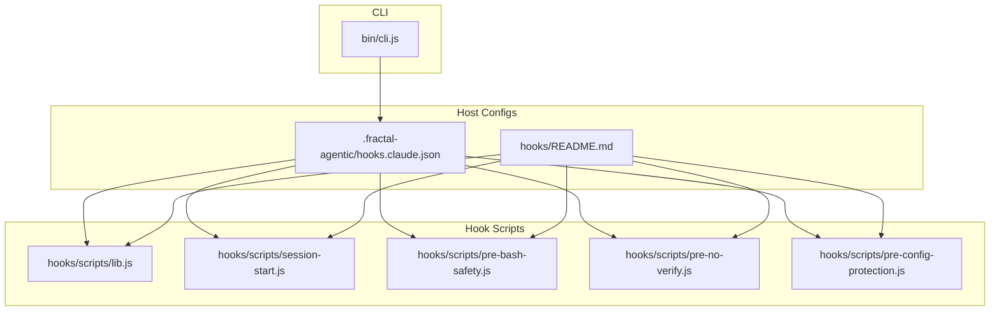
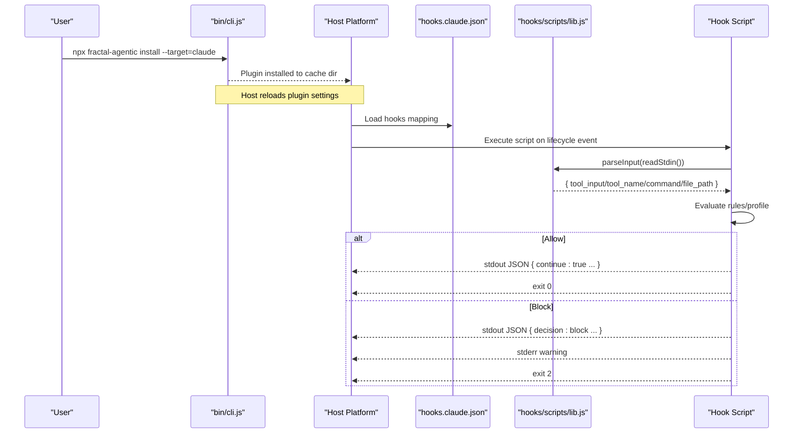
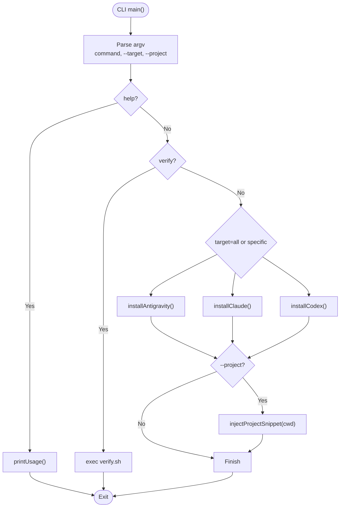
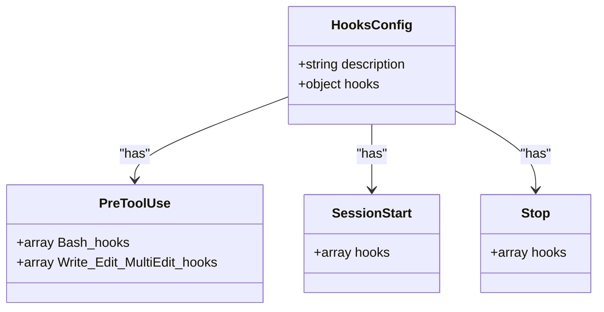
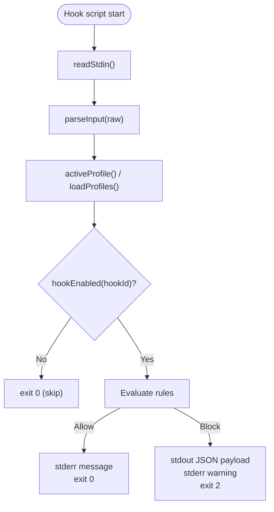
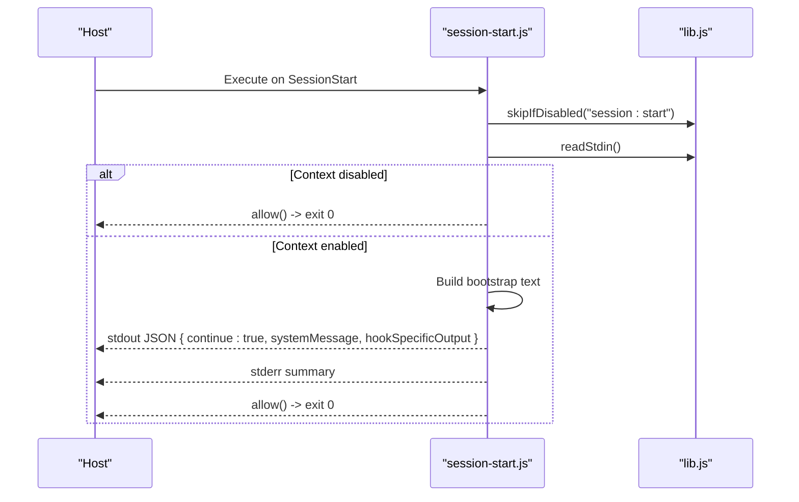
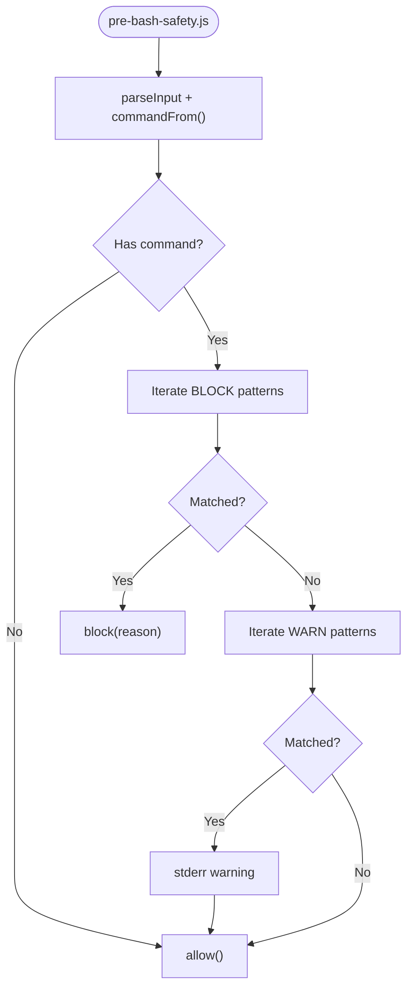
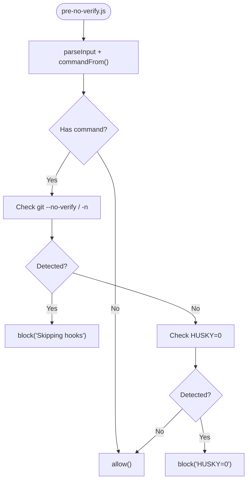
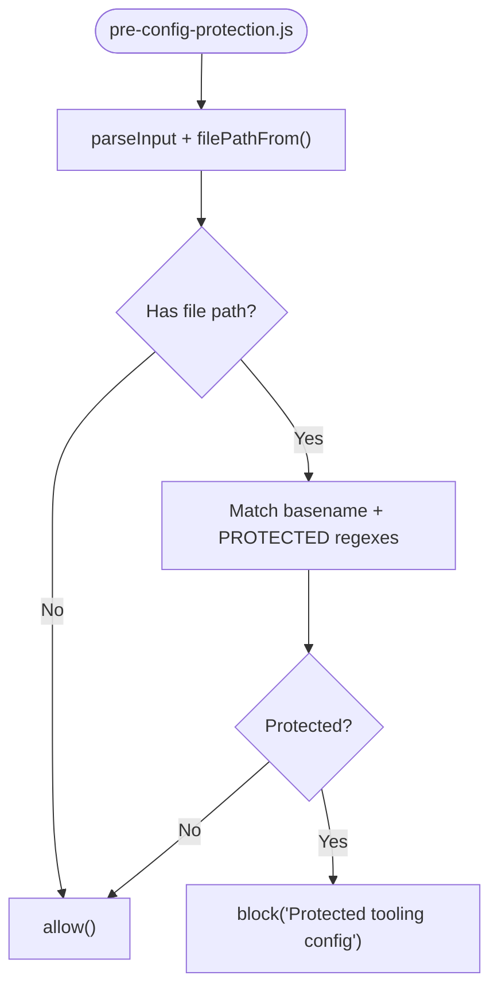
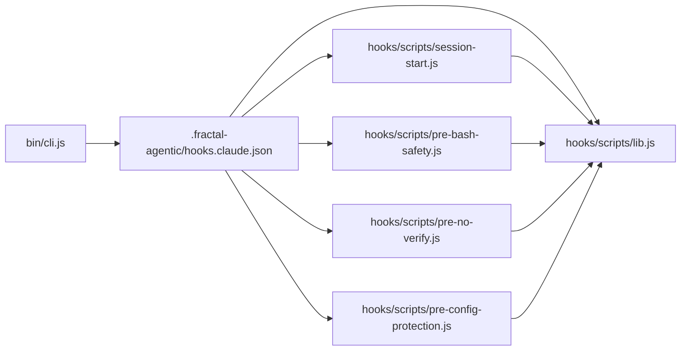

# Communication Protocols

<cite>
**Referenced Files in This Document**
- [cli.js](file://fractal-agentic/bin/cli.js)
- [hooks.claude.json](file://fractal-agentic/.fractal-agentic/hooks.claude.json)
- [README.md](file://fractal-agentic/hooks/README.md)
- [lib.js](file://fractal-agentic/hooks/scripts/lib.js)
- [session-start.js](file://fractal-agentic/hooks/scripts/session-start.js)
- [pre-bash-safety.js](file://fractal-agentic/hooks/scripts/pre-bash-safety.js)
- [pre-no-verify.js](file://fractal-agentic/hooks/scripts/pre-no-verify.js)
- [pre-config-protection.js](file://fractal-agentic/hooks/scripts/pre-config-protection.js)
- [hooks.md](file://fractal-agentic/docs/hooks.md)
</cite>

## Table of Contents
1. [Introduction](#introduction)
2. [Project Structure](#project-structure)
3. [Core Components](#core-components)
4. [Architecture Overview](#architecture-overview)
5. [Detailed Component Analysis](#detailed-component-analysis)
6. [Dependency Analysis](#dependency-analysis)
7. [Performance Considerations](#performance-considerations)
8. [Troubleshooting Guide](#troubleshooting-guide)
9. [Conclusion](#conclusion)

## Introduction
This document describes the communication protocols between the fractal-agentic system and host platforms (Claude, Codex, Antigravity). It covers CLI command routing, message formats, data exchange patterns, hook integration with git lifecycle events, authentication and session management, state synchronization strategies, error propagation, logging standards, debugging approaches, and inter-process communication patterns across host boundaries.

## Project Structure
The relevant parts for communication are:
- CLI entrypoint that installs and configures plugins for multiple hosts
- Hook configuration files mapping host lifecycle events to Node scripts
- Hook scripts implementing safety, quality, and session bootstrap behaviors
- Documentation describing profiles, installation targets, and behavior

**Diagram sources**
- [cli.js:1-148](file://fractal-agentic/bin/cli.js#L1-L148)
- [hooks.claude.json:1-77](file://fractal-agentic/.fractal-agentic/hooks.claude.json#L1-L77)
- [README.md:1-124](file://fractal-agentic/hooks/README.md#L1-L124)
- [lib.js:1-137](file://fractal-agentic/hooks/scripts/lib.js#L1-L137)
- [session-start.js:1-65](file://fractal-agentic/hooks/scripts/session-start.js#L1-L65)
- [pre-bash-safety.js:1-42](file://fractal-agentic/hooks/scripts/pre-bash-safety.js#L1-L42)
- [pre-no-verify.js:1-30](file://fractal-agentic/hooks/scripts/pre-no-verify.js#L1-L30)
- [pre-config-protection.js:1-66](file://fractal-agentic/hooks/scripts/pre-config-protection.js#L1-L66)

**Section sources**
- [cli.js:1-148](file://fractal-agentic/bin/cli.js#L1-L148)
- [hooks.claude.json:1-77](file://fractal-agentic/.fractal-agentic/hooks.claude.json#L1-L77)
- [README.md:1-124](file://fractal-agentic/hooks/README.md#L1-L124)

## Core Components
- CLI installer: parses arguments, selects target hosts, copies plugin assets, injects project snippets, and invokes verification scripts.
- Hook configuration: maps host lifecycle events (PreToolUse, SessionStart, Stop) to Node scripts with timeouts.
- Hook runtime library: standardizes input parsing, profile resolution, allow/block semantics, and safe I/O.
- Hook scripts: implement safety checks, configuration protection, session bootstrap, and optional quality routines.

Key responsibilities:
- Command routing and host selection live in the CLI.
- Host event-to-script binding lives in JSON configs.
- Cross-cutting concerns (profiles, stdin/stdout protocol, exit codes) live in the shared library.

**Section sources**
- [cli.js:1-148](file://fractal-agentic/bin/cli.js#L1-L148)
- [hooks.claude.json:1-77](file://fractal-agentic/.fractal-agentic/hooks.claude.json#L1-L77)
- [lib.js:1-137](file://fractal-agentic/hooks/scripts/lib.js#L1-L137)
- [README.md:1-124](file://fractal-agentic/hooks/README.md#L1-L124)

## Architecture Overview
The system uses a lightweight IPC pattern over stdin/stdout with structured JSON payloads and deterministic exit codes. Hosts invoke Node scripts as hooks; scripts read inputs, decide allow/block/warn, and return results via stdout and process exit codes.

**Diagram sources**
- [cli.js:1-148](file://fractal-agentic/bin/cli.js#L1-L148)
- [hooks.claude.json:1-77](file://fractal-agentic/.fractal-agentic/hooks.claude.json#L1-L77)
- [lib.js:1-137](file://fractal-agentic/hooks/scripts/lib.js#L1-L137)
- [session-start.js:1-65](file://fractal-agentic/hooks/scripts/session-start.js#L1-L65)
- [pre-bash-safety.js:1-42](file://fractal-agentic/hooks/scripts/pre-bash-safety.js#L1-L42)
- [pre-no-verify.js:1-30](file://fractal-agentic/hooks/scripts/pre-no-verify.js#L1-L30)
- [pre-config-protection.js:1-66](file://fractal-agentic/hooks/scripts/pre-config-protection.js#L1-L66)

## Detailed Component Analysis

### CLI Command Routing and Host Integration
- Entry point parses argv, supports help, verify, and install flows.
- Target selection supports antigravity, claude, codex, or all.
- Installation strategy:
  - Antigravity: copy plugin into ~/.gemini/config/plugins/fractal-agentic
  - Claude: attempt marketplace add/install, fallback to cache directory
  - Codex: copy plugin into ~/.codex/plugins/cache/fractal-agentic
- Optional project snippet injection into AGENTS.md.

**Diagram sources**
- [cli.js:1-148](file://fractal-agentic/bin/cli.js#L1-L148)

**Section sources**
- [cli.js:1-148](file://fractal-agentic/bin/cli.js#L1-L148)

### Hook Configuration and Event Mapping
- The Claude-compatible configuration defines three event groups:
  - PreToolUse: Bash and Write/Edit/MultiEdit matchers
  - SessionStart: wildcard matcher
  - Stop: wildcard matcher
- Each event maps to one or more commands (Node scripts) with timeouts.
- Absolute paths are used for robustness across environments.

**Diagram sources**
- [hooks.claude.json:1-77](file://fractal-agentic/.fractal-agentic/hooks.claude.json#L1-L77)

**Section sources**
- [hooks.claude.json:1-77](file://fractal-agentic/.fractal-agentic/hooks.claude.json#L1-L77)
- [README.md:1-124](file://fractal-agentic/hooks/README.md#L1-L124)

### Hook Runtime Library: Input Parsing, Profiles, and Exit Semantics
- Standardized stdin reader with size cap to prevent memory issues.
- Flexible input parser supporting multiple field names for tool inputs and metadata.
- Profile resolution from environment and profiles.json; disabled hooks via comma-separated list.
- Allow/block semantics:
  - Allow: write optional message to stderr, exit 0
  - Block: write structured JSON to stdout, warn to stderr, exit 2
- Utility helpers for extracting command and file path from varied input shapes.

**Diagram sources**
- [lib.js:1-137](file://fractal-agentic/hooks/scripts/lib.js#L1-L137)

**Section sources**
- [lib.js:1-137](file://fractal-agentic/hooks/scripts/lib.js#L1-L137)

### Session Bootstrap Hook
- Consumes stdin, optionally skips context injection via environment flag.
- Emits a structured message with continue flag and additionalContext/systemMessage fields.
- Always writes a human-readable summary to stderr for visibility.
- Exits successfully to avoid blocking sessions.

**Diagram sources**
- [session-start.js:1-65](file://fractal-agentic/hooks/scripts/session-start.js#L1-L65)
- [lib.js:1-137](file://fractal-agentic/hooks/scripts/lib.js#L1-L137)

**Section sources**
- [session-start.js:1-65](file://fractal-agentic/hooks/scripts/session-start.js#L1-L65)

### Bash Safety Hook
- Parses command from flexible input fields.
- Applies blocklist regexes for destructive operations (force-push, reset --hard, root deletion, dangerous pipes).
- Applies warnlist for risky constructs (eval, chmod 777).
- Returns allow or block according to policy.

**Diagram sources**
- [pre-bash-safety.js:1-42](file://fractal-agentic/hooks/scripts/pre-bash-safety.js#L1-L42)
- [lib.js:1-137](file://fractal-agentic/hooks/scripts/lib.js#L1-L137)

**Section sources**
- [pre-bash-safety.js:1-42](file://fractal-agentic/hooks/scripts/pre-bash-safety.js#L1-L42)

### No-Verify Guard Hook
- Blocks attempts to bypass git hooks (--no-verify, commit -n) and Husky disabling (HUSKY=0).
- Uses precise regex matching to avoid false positives.

**Diagram sources**
- [pre-no-verify.js:1-30](file://fractal-agentic/hooks/scripts/pre-no-verify.js#L1-L30)
- [lib.js:1-137](file://fractal-agentic/hooks/scripts/lib.js#L1-L137)

**Section sources**
- [pre-no-verify.js:1-30](file://fractal-agentic/hooks/scripts/pre-no-verify.js#L1-L30)

### Config Protection Hook
- Protects common lint/format/typecheck configuration files by basename and path patterns.
- Blocks edits that weaken tooling configurations unless explicitly disabled.

**Diagram sources**
- [pre-config-protection.js:1-66](file://fractal-agentic/hooks/scripts/pre-config-protection.js#L1-L66)
- [lib.js:1-137](file://fractal-agentic/hooks/scripts/lib.js#L1-L137)

**Section sources**
- [pre-config-protection.js:1-66](file://fractal-agentic/hooks/scripts/pre-config-protection.js#L1-L66)

### Message Formats and Data Exchange Patterns
- Input format:
  - Supports multiple field names for tool inputs and metadata (tool_input/toolName/command/file_path etc.).
  - Gracefully falls back to raw string when JSON parsing fails.
- Output format:
  - Allow: optional stderr message, exit code 0.
  - Block: stdout JSON with decision, reason, and hook-specific output; stderr warning; exit code 2.
  - Session bootstrap: stdout JSON with continue flag and systemMessage/hookSpecificOutput; stderr summary; exit code 0.

**Section sources**
- [lib.js:1-137](file://fractal-agentic/hooks/scripts/lib.js#L1-L137)
- [session-start.js:1-65](file://fractal-agentic/hooks/scripts/session-start.js#L1-L65)

### Authentication Methods and Session Management
- Authentication is delegated to host platforms; the CLI installs plugins into host-managed directories.
- Session bootstrap provides non-blocking identity and startup guidance without requiring credentials.
- Environment variables control behavior:
  - FRACTAL_AGENTIC_ROOT: resolves plugin root
  - FRACTAL_HOOK_PROFILE: selects profile
  - FRACTAL_DISABLED_HOOKS: disables specific hooks
  - FRACTAL_SESSION_START_MAX_CHARS and FRACTAL_SESSION_START_CONTEXT: control session bootstrap content

**Section sources**
- [cli.js:1-148](file://fractal-agentic/bin/cli.js#L1-L148)
- [README.md:1-124](file://fractal-agentic/hooks/README.md#L1-L124)
- [hooks.md:1-128](file://fractal-agentic/docs/hooks.md#L1-L128)

### State Synchronization Strategies
- Hooks are stateless per invocation; they rely on filesystem artifacts and environment variables.
- Installation writes configuration files to host-specific locations; users must restart hosts to reload settings.
- Profiles and disabled hooks are resolved at runtime from environment and profiles.json.

**Section sources**
- [hooks.claude.json:1-77](file://fractal-agentic/.fractal-agentic/hooks.claude.json#L1-L77)
- [README.md:1-124](file://fractal-agentic/hooks/README.md#L1-L124)
- [hooks.md:1-128](file://fractal-agentic/docs/hooks.md#L1-L128)

### Error Propagation, Logging Standards, and Debugging
- Error propagation:
  - Block decisions use structured stdout JSON plus stderr warnings and exit code 2.
  - Non-fatal errors in hooks are caught and ignored to avoid blocking sessions.
- Logging standards:
  - All warnings prefixed with [fractal-hooks] to stderr.
  - Human-readable summaries for session bootstrap.
- Debugging approaches:
  - Use /hooks-status or install-hooks.sh --check to validate configuration.
  - Inspect stderr logs for [fractal-hooks] messages.
  - Temporarily disable hooks via FRACTAL_DISABLED_HOOKS to isolate issues.

**Section sources**
- [lib.js:1-137](file://fractal-agentic/hooks/scripts/lib.js#L1-L137)
- [hooks.md:1-128](file://fractal-agentic/docs/hooks.md#L1-L128)
- [README.md:1-124](file://fractal-agentic/hooks/README.md#L1-L124)

## Dependency Analysis
Hook scripts depend on the shared library for consistent behavior. Configuration binds host events to scripts. CLI orchestrates installation and project integration.

**Diagram sources**
- [cli.js:1-148](file://fractal-agentic/bin/cli.js#L1-L148)
- [hooks.claude.json:1-77](file://fractal-agentic/.fractal-agentic/hooks.claude.json#L1-L77)
- [lib.js:1-137](file://fractal-agentic/hooks/scripts/lib.js#L1-L137)
- [session-start.js:1-65](file://fractal-agentic/hooks/scripts/session-start.js#L1-L65)
- [pre-bash-safety.js:1-42](file://fractal-agentic/hooks/scripts/pre-bash-safety.js#L1-L42)
- [pre-no-verify.js:1-30](file://fractal-agentic/hooks/scripts/pre-no-verify.js#L1-L30)
- [pre-config-protection.js:1-66](file://fractal-agentic/hooks/scripts/pre-config-protection.js#L1-L66)

**Section sources**
- [cli.js:1-148](file://fractal-agentic/bin/cli.js#L1-L148)
- [hooks.claude.json:1-77](file://fractal-agentic/.fractal-agentic/hooks.claude.json#L1-L77)
- [lib.js:1-137](file://fractal-agentic/hooks/scripts/lib.js#L1-L137)

## Performance Considerations
- Stdin reading is capped to prevent excessive memory usage.
- Hooks have explicit timeouts defined in configuration to bound execution time.
- Non-blocking doctrine ensures hooks do not stall product work; failures are logged but not fatal.
- Profile-based activation reduces unnecessary checks.

[No sources needed since this section provides general guidance]

## Troubleshooting Guide
- Validate hook setup using status commands or shell checks.
- Inspect stderr logs for [fractal-hooks] messages.
- Disable problematic hooks temporarily via environment variables.
- Ensure hosts are restarted after installing or modifying hook configurations.
- Confirm FRACTAL_AGENTIC_ROOT points to the correct plugin root.

**Section sources**
- [hooks.md:1-128](file://fractal-agentic/docs/hooks.md#L1-L128)
- [README.md:1-124](file://fractal-agentic/hooks/README.md#L1-L124)

## Conclusion
The fractal-agentic system integrates with host platforms through a robust, minimal IPC model based on stdin/stdout and structured JSON. The CLI handles installation and project integration, while hooks enforce safety, protect configuration, and provide session bootstrap. Profiles and environment variables enable fine-grained control. Clear logging and exit codes facilitate debugging and reliable operation across diverse host environments.